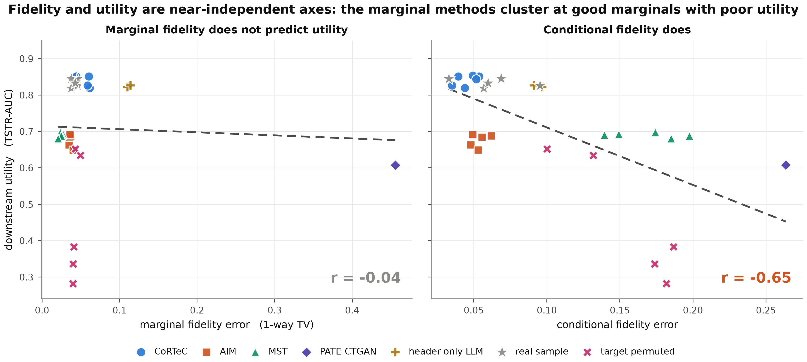
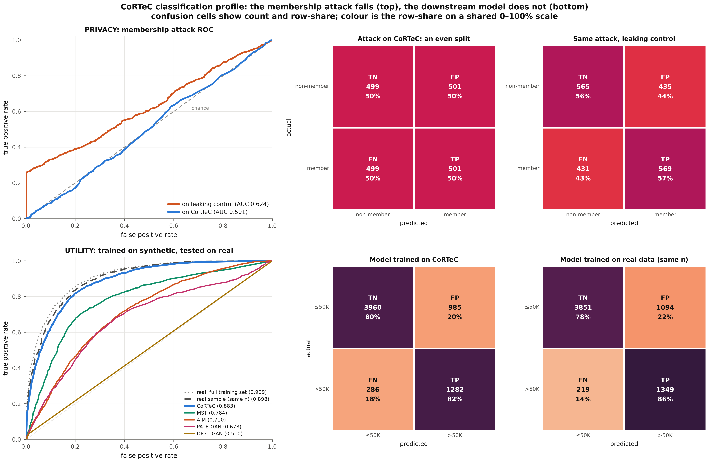

<!-- paper-style: report -->
# CoRTeC: Cohort-Conditioned Differentially Private Synthetic Tabular Data from a Frozen Language Model

**Calister Nnona** (calisternnona@gmail.com)

Code and papers: [Calyie/cortec](https://github.com/Calyie/cortec) (research harness, papers, figures) and [Calyie/cortec-framework](https://github.com/Calyie/cortec-framework) (the reference implementations).

**2026-09-23**

> **Scope note.** CoRTeC is proposed for deployment on the enterprise-hosted, tenant-isolated model surfaces that regulated institutions already operate: Claude on AWS Bedrock, GPT on Azure OpenAI and Gemini on Google Vertex AI. Those surfaces run inside the institution's own cloud account, with private networking, data-residency commitments, a contractual exclusion of training on inputs, and a business associate agreement (BAA) where HIPAA applies. We do not recommend the vendors' public developer APIs for regulated data. The model weights are the same on both surfaces. What differs is the contractual and network envelope, and that envelope is what a compliance review assesses.
>
> Most of our own measurements were run against the public developer APIs, because those were the surfaces available to us. The arms of the shipped configuration (§7.12) ran through Vertex AI. §6.2 states this and measures what the surface changes. The same release generated through Vertex AI and through the public API gives the same fidelity and the same downstream utility (the accuracy of a model trained on the synthetic data and tested on real data), to within draw-to-draw noise, on the primary clinical dataset. Every model figure in this paper is a measurement of the model, not an endorsement of the endpoint we used.
>
> Open-weight models appear only as *scientific controls*, to show that the mechanism is not a property of one vendor's model. They are not part of the deployment proposal, and §H.15 reports the measurement that explains why.

> **How to read this report.** This is the companion technical report to the CoRTeC paper. It holds every measurement made along the way, and it is long by design.
>
> - §3 is the mechanism and §4 its privacy analysis.
> - §7 is the results, with §7.12 the shipped configuration that the paper reports.
> - §9 and Appendix I are the measurement artefacts and the defect catalogue.
> - Appendix F is the per-dataset walkthrough.
> - Appendix H holds the supplementary experiments.
> - Appendix J is what building the reference implementations changed.
>
> A reader who wants the final method and its evidence should read the paper. A reader who wants to know why a decision was taken, or what was tried and rejected, should start from the section of the paper that made the claim and follow its reference here.
---

## Abstract

Differentially private (DP) synthetic tabular data lets an institution train models on, and share, records it cannot release. Its value depends on how much accuracy a model loses when it is trained on the synthetic data instead of the real data. The mechanisms in deployment today, MST and AIM, are selected on marginal fidelity, meaning how closely the marginals (the distributions of single columns and of small groups of columns) match the real data, because that is the metric their papers report. Neither reports downstream predictive utility. We show that this choice matters. On UCI Adult at ε = 2.0 (the privacy budget; smaller is stronger) these mechanisms train models 0.14 to 0.17 AUC below a real sample of the same size, and 0.09 to 0.18 below it across the three datasets of §7.12 (AUC is the area under the ROC curve, the utility measure used throughout). Real data with its target column permuted passes a 90% marginal-similarity bar.

We present CoRTeC, a DP synthesis mechanism that spends its budget once, on a release designed for a downstream model, and trains nothing. A single release stage publishes, per publicly stratified cohort (a group of records defined by attribute bands fixed before the data is seen), one DP histogram per attribute and per outcome class, the DP class balance (the share of each outcome), and a DP table of target rates over a disjoint cell partition (nested subgroups defined by one, two or three attributes; each subgroup is a cell). By parallel composition, under which statistics on non-overlapping groups each spend the full budget rather than sharing it, the table costs one query per level regardless of cell count, and the release carries 6.7× more budget per released statistic than a natural implementation. A frozen, un-finetuned language model then generates records from that release alone. Each batch is told the exact number of rows it must produce per bin, per category and per outcome, and the pipeline generates three times the rows it needs and keeps the rows whose cell counts match the release. Because the generator never sees a private record, generation is post-processing: a computation on the release alone, which adds no privacy cost. Unlimited records cost no further budget, and the model may run on a tenant-isolated enterprise endpoint or an air-gapped host under the same guarantee. An auto-configurator derives the release from the schema and the budget.

The headline result is bounded. On UCI Adult at n = 300 and matched ε, models trained on CoRTeC's output are statistically indistinguishable from models trained on a real sample of the same size (AUC differences of +0.007, −0.003 and +0.012; all p > 0.18). AIM and MST are 0.14 to 0.17 AUC lower after Holm–Bonferroni correction for multiple testing. The result replicates on a finance dataset, where an earlier release design had fallen short, once the release carries one histogram per outcome class. Under the shipped configuration CoRTeC's 1-way marginal error (the error in each single column's distribution) is within 0.005 of MST's, the most accurate marginal method we ran (0.029 against 0.024 on Adult, 0.029 against 0.028 on finance, 0.015 against 0.024 on NHANES). It is below a real sample of the same size on all three datasets, and below AIM's, on finance on the reduced 12-column schema that is the only one AIM completes on. Its 2-way error (over pairs of columns) equals the real sample's on Adult. The remaining error is the release's own distance from the private data.

We further show three things. Whether a forced private relationship survives synthesis, that is, reappears in the synthetic output, depends on the mechanism family (MST slope 0.998, PATE-CTGAN 0.054). Enabling reasoning in the generator, the model's option to think through a request before answering, changes conditional error (the error in the outcome rate within each subgroup) by 3.8×, from 0.173 to 0.045, while downstream AUC does not detect the change. Four membership-inference attacks, which try to tell whether a record was in the private data and are validated on a positive control of real records passed off as synthetic, reach a strongest advantage (true-positive rate minus false-positive rate) of 0.048 against a permitted 0.762, with zero exact matches. We catalogue twenty-seven measurement artefacts that each produced a plausible but wrong conclusion, and release two Apache-2.0 implementations that enforce every guarantee in code.

---

## 1. Introduction

### 1.1 The problem

An institution that holds sensitive tabular data usually wants three things its obligations forbid. It wants to train a model outside its own perimeter; to give a realistic sample to a partner or a vendor; and to let researchers work on the problem without working on the people. Synthetic data with a differential privacy guarantee is the accepted way to do all three. Whether it is worth doing depends on one question. If I train on the synthetic data instead of the real data, how much accuracy do I lose?

The mechanisms an institution can deploy today do not answer that question in their own papers. The marginal-based synthesisers MST and AIM are evaluated on marginal workload error, and they attain low error on that measure. They were built for published tables and contingency reports rather than for training models.

The generative models trained under differential privacy are evaluated on downstream utility. At the budgets and schema sizes we test, they do not preserve the target's base rate.

The methods that do reach real-data utility fine-tune a language model on the records. They either carry no privacy guarantee or train on the private data under DP-SGD [1], gradient descent with clipped and noised updates. DP-SGD is expensive, and it places the private data on the training hardware. Private Aggregation of Teacher Ensembles (PATE), an ensemble of teachers trained on disjoint shards of the private data whose noised votes label a public dataset, would avoid that. But it requires a public transfer set drawn from approximately the same distribution as the private data. Where privacy protection matters most, in a hospital's encounter records or a bank's default history, that set does not exist. Institution-specific coding, local case mix and proprietary product structure mean there is no public analogue to transfer from.

A practitioner therefore chooses between two options. One is a mechanism that optimises low-order marginals rather than the structure a downstream model needs. The other is a large language model asked to invent plausible records. That is fast and needs no privacy accounting, but the model knows nothing about the institution's data.

### 1.2 What CoRTeC does

CoRTeC separates the two things every other method does together: spending the privacy budget and producing records. First it spends the budget, once, on a statistics release. The release contains:

- cohorts formed by a public stratification rule, meaning bands of one or two attributes fixed before the data is seen;
- one DP histogram per attribute and per outcome class inside each cohort;
- a DP class balance and a DP cohort size; and
- a DP table of target rates over the cells of a conditional hierarchy, meaning nested subgroups defined by one, two or three attributes.

Then a frozen, un-finetuned language model reads that release, and nothing else, and writes records that match it. Each batch is told the exact number of rows it must produce per bin, per category and per outcome. From a pool of generated rows, the pipeline keeps the rows whose cell counts match the release. Wherever the release describes the class shape at bin resolution, the kept values are redrawn inside their released bins.

This design has four consequences, and they are the reasons to use it.

*The privacy argument is small.* The generator never sees a private record, so its work is post-processing of a DP release. The privacy analysis therefore reduces entirely to the release, which is a composition of counting queries.

*Generation costs no privacy and can run anywhere.* Any number of datasets can be drawn from one release at no further cost, and the model can be a tenant-isolated enterprise endpoint or an air-gapped local model with the same guarantee.

*The budget goes to the structure a classifier needs, and it goes there cheaply.* A downstream model needs the conditional structure and the per-class shape of each attribute. Histograms have sensitivity 1 regardless of resolution, and disjoint cohorts and cells compose in parallel, so the release carries that structure at 6.7× more budget per statistic than a natural implementation.

*No statistician is needed.* An auto-configurator chooses the cohorts and the hierarchy from the schema and the budget. A set of guardrails refuses the configurations we found to fail silently.

### 1.3 What we found, including what we did not

**The result the paper is built on, and the size of the claim.** At matched ε and matched sample size on UCI Adult at n = 300, models trained on CoRTeC's synthetic records are statistically indistinguishable from models trained on a real sample of the same size. The differences are +0.007, −0.003 and +0.012 AUC across three students (the classifiers trained on the synthetic data), with the gap bounded inside ±0.027 and every p > 0.18.

The equivalence is claimed at that dataset and that size only. Under the earlier release design it narrowed to 94% of real-sample utility on finance (§F.3). Adding a histogram per outcome to the release removes the gap on two of three students (§7.11). The shipped configuration, which adds exact-count batches and selection from a pool of generated rows, brings every student within 0.015 AUC of the floor on finance and within 0.010 on Adult (§7.12). The point estimates separate at n = 1,000 (§H.2). The result reproduces when the arm is regenerated from a fresh release under the corrected pure-ε rate mechanism (§7.2, Result 1′).

Over the same data AIM and MST train models 0.14 to 0.17 AUC lower, a margin that survives Holm–Bonferroni correction (adjusted p ≤ 0.0024). The ordering against MST replicates on a finance dataset. Against AIM, which converges there only on a reduced 12-column schema, the conditional-fidelity difference survives correction under either release, and the utility difference survives once the release carries a histogram per outcome (§F.3, §7.11). On the two clinical datasets the conditional-fidelity advantage replicates and widens, by a factor of 7.6 on hospital encounter data, while the aggregate-utility advantage narrows.

**What CoRTeC does not do.** For most of this project it was not the most accurate method on the marginal benchmarks. MST recorded lower 1-way total variation (half the summed absolute difference between two histograms) on every dataset we ran. The shipped configuration (§7.12) is within 0.005 of MST on that measure on Adult and finance and below it on NHANES. It is below AIM on all three, and its 2-way error equals a real sample's on Adult. The remaining error is the release's own distance from the data.

AIM still records the lowest error on all three of its own 3-way workloads (sets of three-column marginals) at adequate `n`. That is structural rather than a shortfall. AIM's adaptive measurement selection optimises exactly that workload under the budget, so retaining the lowest error there is what its design predicts. We did not set out to match it. A 1-way error below a real sample's describes an output smoother than a sample of that size, not one more faithful to it (§H.14).

CoRTeC also pays per generated record, three times over under the shipped configuration. The marginal methods pay once at fit time and then sample freely, which is decisive at the scale of millions of records.

**A finding that corrected our own framing.** We built an experiment that forces a conditional relationship into the private data and measures whether it survives each mechanism. We expected it to separate CoRTeC from the marginal methods. It does not. MST reproduces such a relationship essentially perfectly (slope 0.998, MAE 0.001), marginally more accurately than CoRTeC (0.995, 0.009). The manipulated quantity is a two-way marginal, and MST is built to measure two-way marginals.

What the experiment does separate is mechanism families. PATE-CTGAN, at the same ε on the same data, records slope 0.054 with MAE 0.376. Its raw output spans only 0.079 (0.324 to 0.402) across a target range of 1.0, reporting roughly a third of the group as positive whether the truth is 0%, 50% or 100%.

Ruling out "the marginal methods cannot carry conditional structure" leaves the harder question of what they do lose. Measuring it (§7.3.1) gives the answer. They inflate pairwise feature dependence by 2.2 to 2.8× against real data of the same size; CoRTeC inflates it by 1.24×. A downstream model trained on over-coupled records learns dependencies that do not hold on real test data. AIM is the instructive case. It retains the feature-to-target association almost exactly (0.98) and still trains models 0.17 AUC lower, so the loss cannot be attributed to the target relationship alone.

### 1.4 Contributions

For the research community:

1. **A privacy-budget allocation that makes conditional structure cheap.** Public stratification at
   no cost, DP histograms in place of moment queries (sensitivity 1 regardless of bin count), one
   histogram block per outcome class at the same cost as one pooled block, and parallel composition
   across disjoint cohorts and disjoint conditional cells. At an unchanged ε = 2.0 this yields 6.7×
   more budget per released statistic than the natural implementation (§4.5).
2. **A decoding stage that reaches the release's own fidelity without spending budget.** Batches are given the exact counts they must produce rather than shares, updated as rows are accepted. The output is selected from a threefold pool by raking and refinement over every released cell.
   On Adult and finance the output's 1-way error falls to within 0.005 of the most accurate
   marginal method and below a real sample of the same size, with downstream utility unchanged at the real-sample floor (the accuracy of a model trained on a real sample of the same size). The steps are separated and each is measured (§3.3, §7.12).
3. **A head-to-head against the deployed mechanisms with the statistics stated properly**: bootstrap
   confidence intervals, Holm–Bonferroni correction across the full family of tests, effect sizes with
   intervals, and the attainable floor of every rank test reported beside its p-value (§7.2).
4. **Evidence that both standard acceptance criteria are saturated**, with a concrete replacement and
   a floor/ceiling protocol that detects the condition (§7.1, §6.4).
5. **A decomposition of what differs between the mechanisms' outputs**, separating loss of the
   feature-to-target association from over-coupling of features. It distinguishes two failure modes
   among the baselines and explains how excellent 1-way fidelity coexists with poor downstream utility
   (§7.3.1).
6. **Isolation of generator configuration as a first-order variable.** A controlled single-flag
   comparison changes conditional fidelity (how closely the outcome rate within each subgroup matches the private data) by 3.8× within one model, and configuration does not override
   capability in either direction (§7.5).
7. **A utility transmission bound on transmitted conditional structure** (a DP bound on the gap between private and synthetic subgroup rates), standards-aligned, computed
   under DP, and refusing to report a verdict when it cannot discriminate. It bounds utility, never
   privacy (§7.9).
8. **A reproducibility account of the measurement artefacts encountered**, each of which produced a
   plausible but wrong conclusion before it was caught (§9, Appendix I).

For practitioners:

9. **A reference deployment architecture** for regulated institutions, with the trust boundary located
   precisely and the controls mapped to NIST SP 800-226, ISO/IEC 27559 and HIPAA Expert Determination
   (§5, Appendix G).
10. **Auto-configuration**, removing the per-dataset engineering every prior result required: parity
   with expert hand-tuning where a comparator exists, and a safe configuration on all eleven datasets
   tested (§7.7).
11. **A selection rule stated by deliverable rather than by method**, and a cost model (§8.1, §H.8).
12. **Two Apache-2.0 reference implementations** in which every guarantee the research established is
    enforced in code, and every regression test is named after the defect it prevents (§11).

The main body carries every claim and the evidence for it. The appendices carry the per-dataset
walkthroughs (F), the deployment controls (G), the supplementary experiments and diagnostics (H), the
defect catalogue (I), and what building the reference implementations changed (J). Nothing in an
appendix is needed to follow a claim in the body.

---

## 2. Background and Related Work

**Marginal and graphical-model methods.** PrivBayes [54], MST [29] (winner of the 2018 NIST
differential privacy synthetic data challenge [38]), PrivMRF [7] and AIM [30] select low-order
marginals under DP and fit a graphical model via Private-PGM [28]. AIM is workload-adaptive and is the
strongest of these. Both MST and AIM are evaluated on marginal workload error. MST uses the NIST score (3-way marginals over 100 random triples, high-order conjunctions, income inequality) at ε ∈ {0.3, 1.0, 8.0}. AIM uses normalised L1 workload error over `all-3way`, `target` and `skewed` workloads at ε ∈ [0.01, 100].

Neither paper reports a downstream predictive-utility experiment. We state this as a scope observation rather than a criticism. These mechanisms target a different objective and attain it, and §7.3 shows them doing so. The benchmark of Tao et al. [46], which does include a classification task, found the marginal methods ahead of the generative ones, and §7.12 reproduces that result for the baselines they share. A later benchmark by Chen et al. [10] reaches the same conclusion with a machine-learning utility score. It excludes language-model-based methods on the ground that their pretraining corpora would bias the evaluation, an objection the contamination control of §7.1.3 is designed to answer.

**Deep generative models with DP training.** DP-GAN [50], PATE-GAN [25], DP-CTGAN and PATE-CTGAN [39]
apply DP-SGD or the PATE framework [36, 37] to a generative model, the last two over the CTGAN
architecture [52]. Rosenblatt et al. [39], who introduced PATE-CTGAN, do evaluate downstream utility. They use train-on-synthetic/test-on-real against train-on-real together with the pMSE ratio [42] for
distributional similarity, which is the protocol we adopt.

**Language models for tabular generation.** GReaT [5] fine-tunes an LLM to emit rows, achieving high
fidelity but no privacy guarantee, since the model memorises records. DP-LLMTGen [47] adds DP-SGD
fine-tuning, which is private but expensive and still trains on private data. Curated LLM [40] uses a
language model to augment small tabular datasets without a privacy guarantee. It conditions on the private data directly rather than on a release. DP-2Stage [3] reduces the cost of DP-SGD
fine-tuning by first training on public pseudo-data, but still trains on the private records.

**Private synthesis through model APIs.** The closest line of work to ours also keeps the foundation
model frozen and reaches it only through an inference API. Private Evolution [27, 51] generates candidate records from the model, privately votes on which candidates lie nearest to the private records, and iterates. It spends privacy budget on every round of votes. Swanberg et al. [45] adapt it to tabular data with a workload-based distance and find that API access to a strong model does not by itself improve on the marginal baselines. Tran et al. [48] extend it with evolutionary operators and private scoring. Their one-shot variants treat the model's schema-only output as public data and spend the budget reweighting it to privately measured marginals. That is the nearest analogue to our selection step. The difference is that our release, not a later measurement, is what the model decodes, and the selection reads only that release.

CoRTeC differs in where the budget goes and how often it is spent. It spends the budget once, on a statistics release that names the conditional structure a downstream model needs, and then treats the model as a decoder of that release. The model is therefore never in the privacy loop, and the privacy analysis is a composition argument over counting queries rather than over rounds of private selection.

### 2.1 Positioning

| method family | generator sees raw data? | where noise enters | utility reported in its own paper? | conditional structure |
|---|---|---|---|---|
| PrivBayes [54], MST [29], AIM [30], PrivMRF [7] | yes (to fit) | selected marginals | **no** | only what the chosen marginals imply |
| DP-GAN [50], DP-CTGAN [39] | yes (DP-SGD) | gradients | partially | learned, degraded by clipping + noise |
| PATE-GAN [25], PATE-CTGAN [39] | yes (PATE on discriminator) | teacher votes | **yes** (TSTR/TRTR, pMSE) | learned |
| GReaT [5] | yes (fine-tuning) | **none; not DP** | yes | learned, memorised |
| DP-LLMTGen [47] | yes (DP-SGD fine-tuning) | gradients | yes | learned |
| **CoRTeC (this work)** | **no** | released statistics only | yes | **released explicitly: a DP conditional table and one histogram block per outcome class** |

Every method above lets the generator see private data, and privacy depends on the training mechanism.
CoRTeC trains nothing. It releases DP statistics once and lets a frozen model decode them, so the
privacy argument is a post-processing argument over the release. The trade-off is explicit. Any structure not implied by the released statistics comes from the model's prior rather than from the data. That is the failure mode §7.4 is designed to detect and §7.6.1 bounds.

---

## 3. Method

### 3.1 Notation

A dataset `D` is a multiset of `n` records over a schema with attributes `A = A_num ∪ A_cat` and a
binary target `y`. Each attribute `a` has a public domain: an interval `[lo_a, hi_a]` for numerical
attributes and a finite value set for categorical ones. `Π` denotes a partition of the record space
induced by a rule over public attribute domains; `Π(x)` is the part containing record `x`. We write
`M_a(D)` for the histogram of attribute `a` over public bin edges `E_a`, and
`ρ_c(D) = P(y = 1 | x ∈ c)` for the target rate in cell `c`.

Two properties of the schema are assumed public throughout, as in all marginal-based DP synthesisers:
the attribute list and each attribute's domain bounds. No quantity derived from the private values is
used to choose bins, bands or cells. The one exception is the auto-configurator's column ranking, which is charged to the budget and analysed in §3.4.

### 3.2 The mechanism


**Figure 1.** CoRTeC. The privacy budget is spent once, in Stage A. Everything to the right of the
dashed line, the generator and every post-processing step, sees only released statistics, so it
contributes nothing to the privacy cost and may be repeated without limit.

---

```algorithm
Algorithm 1: CoRTeC
Input: private D; public schema (domains, bin edges E, stratification rule Π, conditional levels L_0 ⊂ L_1 ⊂ … ⊂ L_k); budget ε_total; split α; n_min; frozen model G
Output: synthetic dataset D̂ of any requested size m
**Stage A: the only access to D**
(1) ε_count ← 0.02·ε_total  (the published cohort-size query (the reference implementation uses 0.05))
(1′) ε_marg ← (1−α)·(ε_total − ε_count) ; ε_cond ← α·(ε_total − ε_count)  (the count share is taken out first, then the rest is split)
(2) q ← |A_num| + |A_cat| + 1  (queries per cohort)
(3) ε_q ← ε_marg / q  (q queries SEQUENTIAL within a cohort; cohorts are disjoint, so PARALLEL across Π)
(4) ε_L ← ε_cond / |L_viable|  (levels overlap → sequential)
(5) for each cohort P ∈ Π with |P| ≥ n_min:
(5′)     release ñ_P ← |P| + Lap(1/ε_count)  (published cohort size; cohorts disjoint → PARALLEL across Π, sequential with lines 6–7)
(6)     release the 2-bin COUNT histogram of y on P (positives, negatives), each + Lap(1/ε_q)  (this is the "+1" in line 2; the class balance is their normalised ratio, post-processing)
(7)     if |P ∩ {y=1}| ≥ n_min and |P ∩ {y=0}| ≥ n_min:  (CLASS-CONDITIONAL blocks)
(7a)         for c ∈ {0,1}, for a ∈ A_num ∪ A_cat: release M̃_a(P, y=c) ← M_a(P ∩ {y=c}) + Lap(1/ε_q)  (P∩{y=0}, P∩{y=1} are disjoint → PARALLEL; each record is touched by line 6 and by ONE block)
(7b)         M̃_a(P) ← mixture of M̃_a(P, y=c) under the released class balance  (post-processing)
(7′)     else: for a ∈ A_num ∪ A_cat: release M̃_a(P) ← M_a(P) + Lap(1/ε_q)  (pooled block)
(8)     derive mean, std of each a from the released histograms  (free post-processing)
(9) for each level ℓ ∈ L, for each cell c ∈ ℓ with |c| ≥ n_min:
(10)     release k̃_c ← k_c(D) + Lap(2/ε_L) ; ñ_c ← |c| + Lap(2/ε_L)  (two COUNTS, sensitivity 1 each, sequential on one cell; cells disjoint within ℓ)
(10′)     ρ̃_c ← clip( k̃_c / max(ñ_c, n_min), 0, 1 )  (the rate is post-processing of two DP counts)
(11) R ← all released quantities  (D is not touched again)
**Stage B: post-processing only**
(12) for each cohort P: m_P ← k·m · ñ_P / Σñ  (k×m rows, allocated by released size)
(13)     T_P ← Apportion(m_P; class balance, M̃_a(P, y=c) ∀a,c)  (exact per-bin counts the cohort owes)
(14)     while rows owed: b ← min(B, rows owed)  (batches of B (25) rows)
(14′)         D̂ ← D̂ ∪ G( prompt(R, P, b, Apportion(b; T_P − emitted)) )  (each batch asks for the counts still owed; G frozen, never sees D)
(15) D̂* ← Select_R(D̂, m)  (the m rows of the pool whose cell counts match R: rake, then swap-refine)
(15′) for each cohort P with class blocks (line 7), each a ∈ A_num, each row of D̂* in P:
(16) return D̂*  (repeat 12–16 for further draws at no ε cost)
```

Lines 12–16 read only `R` and the generated rows. Apportioning counts from released histograms, prompting with them, choosing among generated rows and redrawing values inside released bins are all functions of the release and of independent randomness. Stage B therefore remains post-processing whatever `k` and `B` are. The cell-wise path of §7.10, which generates per released conditional cell with an exact positive count, remains available where the release covers the conditioning columns. The default path is the one above.

---

### 3.3 Eight decisions that matter, and why

**Public stratification (line 5).** Cohorts come from a rule fixed over public domains, so `Π(x)` is a
deterministic function of `x`'s own record and forming cohorts consumes no budget. This replaces DP
k-means, which spends budget and, in our measurements, produced degenerate cohorts of 3 and 8
records.

**Histograms, not moments (line 6).** A histogram has L1 sensitivity 1 regardless of bin count, since one individual moves exactly one bin. An entire distributional shape therefore costs the same budget as a single mean, and half what a mean-and-standard-deviation pair costs. Moments are then recovered from the released histogram for free. Under the moment formulation the standard-deviation query has sensitivity `(hi−lo)/(2√n)`. At realistic budgets that produced released values larger than the attribute's entire range at every cohort size we tested: at a cohort size of 20, a released standard
deviation of 693.80 against a true value near 13 (Appendix I, defect 1).

**Class-conditional histograms (line 7).** A pooled cohort histogram says what the cohort looks like
and nothing about how any feature relates to the target outside the conditional hierarchy. The
generator fills that in from its prior, and on finance the filled-in columns measurably degraded the
downstream model (§F.3.1). Partitioning each cohort by the target and releasing one histogram block
per (cohort, class) gives the generator the class-conditional marginals a classifier needs, for every
column. The two class blocks are disjoint, so they compose in parallel. Each spends the same `ε_q` per column the pooled block did. The pooled histogram is their mixture under the released class balance, which is post-processing. Where a class falls below `n_min` the cohort keeps the pooled block. §7.11 measures the change three ways: with no model at all, decoding each release by independent sampling; through one generator on the same dataset, pooled against class-conditional; and through the headline generator on two datasets.

**A conditional table over a disjoint partition (line 10).** Because the cells of one level partition
`D`, they satisfy parallel composition: each receives the full `ε_L` however many cells the level
contains. A cell's rate is the ratio of two counts each carrying `Lap(2/ε_L)`. Its noise is therefore of order `2/(|c|·ε_L)`, and accuracy is governed by cell support, not by the number of cells. Conditional
structure is therefore cheap to release, and that observation is the basis of the method. The same
argument makes histogram resolution free.

**Exact counts, not shares (lines 13–14′).** Asked to reproduce a histogram, a frozen model reproduces it approximately. The rows it emits carry that approximation plus the sampling noise of any batch. Asked instead for exact counts, it can satisfy them. A 25-row batch given the number of rows it must produce per bin and per category reproduces every count line exactly on the frontier models we measured. The same batch given shares matches about two thirds of them. The counts are apportioned from the released histograms for the cohort as a whole (line 13), so they carry no more information than the release does. Each batch asks for what the cohort still owes after the rows already accepted (line 14′). A batch that returns more or fewer valid rows than asked therefore cannot leave the cohort's totals short. The same move made conditional rates exact on the cell-wise path. A cell receiving a couple of rows cannot emit a rate, and asked for "exactly k of n" it need not.

**Selection from a pool (line 15).** Exact-count batches match the release closely but not exactly. A batch's rounding is the release's error at every cohort boundary. Generation is free in ε, so the pipeline asks for `k` times the rows it needs and keeps the `m` whose cell counts match the release. The selection has three steps: inclusion weights from iterative proportional fitting [11] over every released cell (cohort size, class balance, and one histogram per cohort, class and column); systematic sampling on those weights; then a greedy exchange of rows that lowers the weighted distance to the released counts. The pooled marginals the 1-way measure reads are weighted above the per-cell counts, and any category the release suppressed is given zero mass. A cohort whose release carries only a pooled
block is constrained at cohort level, not per class, because imposing a pooled histogram on each
class would erase the feature-to-target structure the release spent budget on. The cost is `k` times the
generation spend, and `k = 3` is the shipped default. §7.12 measures what each of these two steps
contributes and where the ceiling is: the release's own distance from the truth.

**Values below bin resolution (line 15′).** A released histogram fixes how many rows fall in each
public bin and nothing finer, so where a value lies inside its bin is never released information.
In a cohort that carries class-conditional blocks the class shape is the release's at bin
resolution, and whatever the generator does below it comes from its prior. On NHANES that prior separated the
outcome classes about twice as far as the data does inside each bin (a BMI gap of 6.2 between diabetic and non-diabetic rows against 3.1 in the training data). It cost the linear student 0.044 AUC, while the release decoded with no model at all reached the floor (§H.17). In those cohorts every numeric value is therefore redrawn uniformly inside its released bin, intersected with the row's stratification band so that no row changes cohort. Every bin count, and with it
every binned measure under the release's bins, is unchanged by construction (the evaluator's
right-closed bins read edge integers differently, §6.4). In a cohort with only a pooled block the generator's placement is the only carrier of the class signal, and it is kept. On the two pooled arms we measured, replacing it cost the tree students up to 0.03 AUC. The rule reads the release
and the rows, has no parameter, and is post-processing.

**The conditional share of the budget.** With one histogram block per outcome class, the release already carries most of what a classifier needs. The conditional table's share of the budget can then fall from a half to a fifth without measurable loss (§H.9). The histograms receive that budget, and the release's own marginal error falls by a third on Adult and a quarter on finance
(§7.12). One fifth is the shipped default.

### 3.4 Auto-configuration: removing the statistician from the loop

Every result in the published DP-synthesis literature, and every earlier result in this project,
depends on a hand-chosen configuration: which columns the conditional table conditions on, how many
levels it carries, how cohorts are formed. That is a problem twice over. Scientifically, choosing
those columns after inspecting mutual information in the private data is an uncharged data-dependent
decision. Operationally, it means the method is not deployable without a statistician.

`autoconfigure()` derives the whole configuration from the declared schema, the target, ε and the
number of records requested.

**Column ranking is the only private step, and it is charged.** Each candidate column is scored from
one noised contingency table of its bands against the target. A record occupies exactly one cell of
such a table, so its L1 sensitivity is 1 however many cells it has, the same argument that makes
histogram bin count free. Those tables are not disjoint across candidates (every record appears in
all of them), so they compose sequentially: `m` candidates at `ε_sel/m` each. Everything after the
noised counts, the mutual-information computation, the coarsening and the ranking, is
post-processing.

**Ranking is by marginal mutual information.** Greedy forward selection by conditional mutual information was implemented and removed. It made auto-configuration clearly worse on one dataset (diabetes, 0.535 against 0.613) and no better than a rounding difference on the other two. The cause is a cardinality bias in the conditional-MI estimator, which rewards a high-cardinality candidate for having more cells (§H.10).

Marginal MI has its own redundancy problem. `marital_status` and `relationship` encode nearly the same fact, giving a ceiling of 0.770 against the hand-tuned 0.825. What resolves it is explicit coarsening. Wide columns are grouped into at most four bands by their noisy positive rate, computed from the table already released for the ranking,
so it costs nothing further. That reproduces what hand-tuned band objects did (education, 16 levels
to 4) and lets the configurator afford more columns.

**Richness needs no private input at all.** A conditional table's usable resolution is set by how many records land in each cell. Cell counts are a function of public schema cardinalities, and the
number of records requested is a public choice. The rule adds columns while each cell still expects
at least 8 records, preferring the depth closest to 20 records per cell, and divides by the cohort
count because cohorts partition the data.

**The selection budget is adaptive, and that matters most on small data.** Selection is meaningful
only while a column's expected cell count exceeds the Laplace noise on it. Requiring
`n / (L · |Y|) ≥ M · (m / ε_sel)` and solving gives

> `ε_sel ≥ M · m · L · |Y| / n`

with `m` the candidate count, `L` a representative level count, `|Y|` the number of target classes
(all from the declared schema) and `n` the dataset size, clipped to [5%, 30%]. Small datasets therefore spend more on selection, which is correct. A smaller release needs less budget to describe. Under a fixed 5% with a strict noise guard, three of six untouched datasets declined to configure at all. One produced a configuration scoring 0.419 against 0.486 with no conditioning at all, worse than not conditioning and silently so. §7.7 reports the outcome on all eleven datasets.

---

## 4. Privacy Analysis

### 4.1 Threat model

We assume the standard central model: a trusted curator holds `D` and releases only the output of
Algorithm 1. The adversary observes the released statistics `R`, every synthetic record ever
generated from them, the full algorithm including all public choices (bins, bands, cells), and the
weights of the generator `G`. The adversary may hold arbitrary auxiliary information about any
individual. Protection is record-level ε-differential privacy under add/remove-one adjacency for Algorithm 1 as stated. §4.3 records the weaker `(ε_L, δ)` guarantee that all but one of this paper's
CoRTeC arms actually carry.

We do not claim protection against an adversary who can query the curator adaptively, and we do not
address the provenance of `G`'s pretraining data. If a private record was in that corpus it was
compromised before CoRTeC ran, a limitation shared by every LLM-based generator (§10). That
exclusion has an interaction effect which "it was already compromised" does not fully dispose of.
The sharper concern is not that pretraining leaked a record but that our prompt could elicit one that would otherwise have stayed latent. Conditioning a model on true marginals for a narrow stratum is structurally similar to a prompt-based extraction attack, since it tells the model which region of its distribution to sample from. DP does not exclude this, because a memorised record is not a function of our release. Post-processing immunity says nothing about what the post-processor already knew.

We treat it as an empirical question, and we measure it three ways.

- §7.8's membership-inference battery (nearest-neighbour, exact-match, shadow-model and a per-record likelihood-ratio test, each validated on a positive control) attacks the published output, where a memorised record would have to surface. It finds zero exact matches on any dataset and no advantage above chance.
- The inversion test of §7.4 shows the model following the release away from its prior rather than towards it. Told that advanced degrees earn `>50K` at 0.2% against a real-world 61.9%, the release-conditioned model emits 0.000 while the same model without the arrays emits **0.931** (§7.1.2).
- Every dataset here is a public benchmark, the most favourable possible setting for memorisation to appear, and it does not.

None of that is a proof. A genuinely private dataset, which is the deployment case, could behave differently. What we can say is that the mechanism's output was attacked by four methods with
demonstrated power and yielded nothing.

### 4.2 Where the trust boundary sits

The adversary model already includes the generator: `G` sees only `R`, and `R` is a differentially
private release. No private record is ever transmitted to the generator. The prompt is composed of
released statistics, noisy histograms, class balances and a conditional table, which are exactly the
artefacts DP exists to make safe to publish. By post-processing immunity, whoever computes `G` gains
nothing beyond what `R` already discloses, and the ε guarantee is indifferent to where that
computation happens. The trust boundary is crossed before the model call, not inside it.

For DP-SGD and PATE methods the boundary lies in the opposite place: the private data must reach the
training hardware, because that is where the gradients or the teacher ensemble are computed. Those
methods therefore constrain where they can run. CoRTeC does not, and that is what makes it compatible with the deployment pattern regulated institutions use. That pattern is frontier models consumed through tenant-isolated managed services (Claude on AWS Bedrock inside the institution's own account and VPC, Gemini on Google Vertex AI, GPT through Azure OpenAI). It comes with data residency commitments, contractual exclusion of training on inputs, private networking, and a business associate agreement where HIPAA applies. Since the prompt carries a DP release rather than patient records, the
compliance question about sending it to such an endpoint is materially weaker than for a system that
must ship raw data. §5 develops this into a reference architecture.

The reflexive objection to any LLM-based method is "you are sending data to a third party", and
here it does not apply: not because the endpoint is trustworthy, but because there is no private data
in the request. The decoder is interchangeable, and the argument does not rest on trusting it. It may be a
tenant-isolated enterprise endpoint under a BAA or an air-gapped model on the institution's own
hardware; the argument is identical in both cases. What §7.5 establishes separately is a capability
constraint rather than a trust one. Not every model produces usable conditional structure, and the
open-weight models we measured do not (§H.15), which is why the deployment recommendation names
enterprise platforms even though the privacy argument would permit local weights.

### 4.3 Privacy guarantee

**Proposition 1.** *Algorithm 1 satisfies ε_total-differential privacy.*

*Proof.* Consider adjacent `D, D'` differing in one record `x`.

**(i) Stratification is free.** `Π` is a function of public attribute domains only, so the assignment
`Π(x)` is computed from `x`'s own attributes without reference to any other record. Releasing which
part a record belongs to is not a query on `D`; the partition structure itself is data-independent.
Cost: 0.

**(ii) Within a cohort, sequential composition.** Fix a cohort `P`. Each released histogram is a counting query of L1 sensitivity 1. `x` contributes to exactly one bin of one attribute, so removing it changes that histogram's L1 norm by 1 and every other histogram not at all. The Laplace mechanism
[13] at scale `1/ε_q` therefore gives `ε_q`-DP per query. Under the pooled block (line 7′) the `q`
queries on `P` compose sequentially to `q · ε_q = ε_marg`. Under the class-conditional blocks (line 7a) `P` is partitioned by `y`. `x` lies in exactly one of `P ∩ {y=0}`, `P ∩ {y=1}`, so it is touched by the class-balance query of line 6 and by the `q − 1` histograms of its own block, and by nothing in the other block. That is a chain of `q` queries and the same `q · ε_q`. The two blocks are disjoint and compose in parallel [31]. The derived pooled histogram of line 7b is a function of released
quantities only.

**(iii) Across cohorts, parallel composition [31].** The cohorts are disjoint. Record `x` lies in exactly one, so it can influence only that cohort's queries. The others are identical on `D` and `D'`. By parallel composition the cost across cohorts is the maximum, not the sum: `ε_marg` total,
independent of `|Π|`.

**(iv) Within a conditional level, parallel composition.** The cells of level `ℓ` partition `D`, so
the same argument applies: level `ℓ` costs `ε_L`, independent of its cell count. Within a cell `c` we release two counting queries, the positive count `k_c` and the cell size `|c|`. Each has L1 sensitivity exactly 1 under add/remove-one adjacency, and each is noised at `Lap(2/ε_L)`, a scale that depends on nothing private. They touch the same records, so they compose sequentially to `ε_L` per
cell. The published rate `ρ̃_c = k̃_c / max(ñ_c, n_min)` is a function of two released quantities and
the public floor `n_min`, so it is post-processing, as is clipping to `[0,1]`. We do not noise the rate directly as a bounded mean. That mechanism's scale, `1/(|c|·ε_L)`, depends on `|c|`, which under add/remove adjacency is itself private and differs between neighbouring datasets. Two Laplace densities with different scales have an unbounded ratio in one tail, so it is not pure ε-DP. Its
sensitivity is also `1/(|c|−1)` rather than `1/|c|`.

**(v) Across levels, sequential composition.** Levels of differing granularity describe the same
individuals, so they are not disjoint and must compose sequentially: `|L_viable| · ε_L = ε_cond`,
where `L_viable` is the set of levels that release at least one cell. Splitting across declared
levels instead leaves the share of any level whose cells all fall below `n_min` unspent. The release is then quieter than the caller paid for rather than noisier than declared, which is safe for the
guarantee and a defect against the caller (defect 11, §7.7).

**(vi) Stage B is free.** `G`'s input is a deterministic function of `R`. The row allocation uses released marginal masses. The positive count per cell is a stochastically rounded function of a released rate. Deriving moments from released histograms, clipping, and any relabelling are functions
of `R` and independently drawn randomness. By post-processing immunity [15] none increases the
privacy loss, and this holds for arbitrarily many draws.

**(vii) Stage B's counts, selection and sub-bin values.** The per-bin counts a batch is asked for are apportioned from released histograms (line 13). The counts still owed are a difference of released targets and generated rows (line 14′). The selection (line 15) chooses among generated rows by their distance to released counts. The redraw inside released bins (line 15′) reads public edges, the release's cohort rule and the rows. Each is a function of `R`, of rows `G`
produced from `R`, and of independent randomness, so all four are post-processing under [15] and
add nothing to the privacy loss, at any pool factor.

**(viii) The published cohort size (line 5′).** `|P|` is a counting query of sensitivity 1 under
add/remove, noised at `Lap(1/ε_count)`. Cohorts are disjoint, so the cost across `Π` is `ε_count` by parallel composition. It composes sequentially with the `q` queries on the same cohort. It is
charged out of the marginal share (line 1′), so it adds nothing to the total. Summing the three
dependent components: `ε_count + ε_marg + ε_cond = ε_total`. ∎

When auto-configuration is used, the column-ranking step of §3.4 reads private data and is charged
first: `ε_total = ε_sel + ε_release`, with the `m` contingency tables composing sequentially at
`ε_sel/m` each and everything downstream of the noised counts being post-processing.

**What the proposition does not cover, and what the reported tables carry.** `n_min` suppression
(lines 5, 9) and the level split it determines are data-dependent decisions. Whether a cohort appears in the output, and how many levels share `ε_cond`, depend on `D`. The experiments reported here treat cohort and cell sizes as released quantities and charge them no budget. That follows common practice in the marginal-synthesis literature, so that our ε = 2.0 tables are directly comparable to MST's and AIM's. Both reference implementations charge them, and a recent audit of those implementations finds their empirical privacy close to the stated guarantee [18].

Two further facts about the reported CoRTeC rows are recorded in full in §J.3 and summarised here. First, the research pipeline published the per-cohort counts exact rather than noised for most of this project (defect 18). We measured the effect on every reported number by rebuilding each draw under noised counts, and the largest change on any metric is 0.0005, below draw-to-draw variation. Second, every release path noised each conditional cell's rate at a scale set from the true cell size, which is the mechanism step (iv) above rejects. It is `(ε_L, δ)`-DP per level rather than `ε_L`-DP, with `δ` computed exactly at `1.5 × 10⁻⁷` for the `n_min = 150` floor every reported release used. Every release path now implements the corrected two-count mechanism, whose noise is of the same order. The headline Adult arm was regenerated under it (§7.2, Result 1′): the equivalence with a real sample reproduces
and no metric separates the two arms at p < 0.05. Every other CoRTeC arm carries the `(ε_L, δ)`
guarantee stated above, and re-running them is listed in §10.

### 4.4 The privacy unit, and a scope limit of the architecture

**CoRTeC as specified is a mechanism for one-row-per-person data**, a scope limit of the
architecture rather than a checklist item. ε protects one row, not one person. Under group privacy an individual contributing `k` rows receives `k · ε`. Diabetes 130 comprises 101,766 encounters from 71,518 patients (101,763 encounters after the loader drops three records with missing values). That is a mean of 1.42 rows per patient and a maximum of 40. At a row-level ε of 2.0 the worst-case per-person guarantee on that dataset is therefore ε_person = 80, outside any range normally considered meaningful.

Every other dataset in this paper (NHANES, UCI Adult,
Taiwan credit, the six untouched regulated benchmarks and the constructed registry) is one row per
person, so for those `ε_person = ε_row` exactly. Ten of the eleven datasets here are natively one
row per person, so the method's core claims rest on data whose privacy unit is mathematically
bounded. Appendix F.2's results should be read as a demonstration that the pipeline handles
encounter-level scale and clinical complexity under a row-level guarantee, not as a claim of ε = 2.0 per patient. Every clinical claim made on encounter-level data is labelled so where it appears (§8.1, §12). [`certify.py`](https://github.com/Calyie/cortec/blob/main/certify.py) **requires** `--max-rows-per-person` and prints `EPSILON PER
PERSON` on every bound report.

The magnitude is not specific to CoRTeC. Group privacy degrades any mechanism whose privacy unit is one row by the factor `k`. MST, run at row-level ε = 2.0 on this same dataset throughout §F.2, inherits exactly the same ε_person = 80 for that 40-encounter patient, as would AIM, had it completed there. Nothing in the comparison is affected, because every method in it is measured under the same privacy unit. The number is not defensible for any of them as a per-patient guarantee.

What is specific to CoRTeC is the selection step. The auto-configurator ranks conditioning columns by
mutual information with the target and has no concept of a person. On Diabetes 130 it selected `number_inpatient`, the count of a patient's own prior admissions, which correlates 0.733 with how many rows that patient contributes. The released conditional table is therefore stratified by contribution count. The per-cell consequence is measurable and smaller than that framing suggests. Across the nineteen released cells the largest number of rows any one patient contributes to a cell is 7 and the
largest share is 3.2%, so no released statistic is dominated by one individual. That is a property of
this dataset rather than of the mechanism (§H.11).

The mitigation is a pre-processing step taken before Stage A, and it is exact. Reducing `k` reduces
`ε_person = k · ε_row` by construction. On unaggregated longitudinal data it is a prerequisite for
running CoRTeC. Capping each person's contribution to their first `C` rows discards data and does not change the quantity being estimated. Aggregating to one row per person keeps every person but changes the estimand.
On Diabetes 130, at a matched ε_person of 2.0, capping is 6.3× more accurate than aggregating (conditional error 0.0123 against 0.0780). A cap of 3 reaches 0.0030 at ε_person = 6.0, within a factor of 2.3 of the unmitigated release at a guarantee 13× stronger. The full table is in §H.11.

The privacy unit is enforced in code. `release_statistics` takes `max_rows_per_person` and refuses to
run where the declared `k` gives an ε_person above 10, unless the caller passes
`acknowledge_vacuous_privacy_unit=True`, which is recorded in the audit trail that travels with the
release. An undeclared unit is handled differently. `k` cannot be computed without spending budget, and defaulting it to 1 would manufacture the per-person claim the gate exists to prevent. The release therefore carries `privacy_unit_declared: false` and reports the vacuity verdict as `"UNKNOWN"`.

### 4.5 Verified accounting, and what the allocation achieves

The budget is verified by instrumentation rather than by re-deriving a model of it.
`TestActualEpsilonSpend` patches the Laplace mechanism inside `release_statistics` and tallies what is spent. It asserts exactly 2.0 on the auto-configured Adult, NHANES and diabetes specs, and exactly
ε_total at ε = 0.5, 2.0 and 8.0, with per-cohort query counts adapting correctly to 15-, 10- and
19-column schemas. This replaced an earlier verifier that re-derived the budget from hardcoded
parameters and so would have passed even if the pipeline diverged from that model.

Against a natural implementation (DP k-means cohorting, basic composition across cohorts, separate
mean and standard-deviation queries) the same ε_total yields ε per statistic of 0.0667 versus 0.0100,
a 6.7× improvement. The realised per-query budget on the 15-column Adult schema is 0.0653, because the published cohort-size query of Algorithm 1, line 5′, takes `COUNT_FRAC = 2%` of the total out of the marginal share first. The release's own `_eps` block records `per_query = 0.0653` and `cohort_count_query = 0.04`. On the same footing the improvement is 6.5×.

Two further questions about the accounting are answered in Appendix K. The first is whether a tighter accountant would help. It would not: advanced composition loosens the bound by 16 to 31% at the chain lengths this method reaches, and only crosses over past 27 queries. The second is how long the sequential chain can grow under the richness rule. It reaches 15 marginal queries per cohort on Adult, or 18 once the three conditional levels are counted (Appendix K). No schema among the fourteen exceeds a conditional depth of 3, and none exceeds 2 at the shipped `n_min`.

---

## 5. Enterprise Deployment Architecture

This section is written for the team that has to build, review and operate the system. It states
where the trust boundary lies, what crosses it, and what the alternatives require. The controls mapped to standards, the operational failure modes with the guardrail for each, a deployment checklist and the two deployment patterns are in Appendix G. A deployment should read them as part of this section.

### 5.1 The reference architecture

{: .wide}

**Figure 2.** The reference architecture. Only one arrow crosses the trust boundary, and it carries `R`. Trust zone 1 is the institution's regulated environment, where Stage A runs and the release artefact is produced. Trust zone 2, the tenant-isolated model platform, runs Stage B on the release alone. Trust zone 3 holds the synthetic data, the Stage C bound and the release package.


The property that matters in this diagram is that only one arrow crosses the trust boundary, and
it carries `R`. `R` is a differentially private release. Publishing it is what DP was designed to make safe. Everything below the boundary is post-processing, so it can be repeated without limit, run
by a different team, or re-run a year later, at no additional privacy cost.

Trust Zone 2 is the enterprise surface, not a public API endpoint. The three platforms named in the diagram are the recommended deployment. The vendors' direct developer APIs are deliberately absent from it. The distinction is contractual rather than mechanical. The weights are the same either way,
and CoRTeC's privacy argument holds against a hostile endpoint by construction, since the request carries
only `R`. What does not hold is the compliance argument, which rests on tenant isolation, private
networking, data residency and a BAA. Our own experiments ran against the public APIs. §6.2 says so and separates the results that transfer from the properties that were never exercised.

### 5.2 What this provides, contrasted with the alternatives

| | CoRTeC | DP-SGD (DP-CTGAN) | PATE (PATE-GAN) | MST / AIM |
|---|---|---|---|---|
| What crosses to the compute | **DP release only** | raw private data | raw private data | raw private data |
| Where compute may run | **anywhere**; the boundary is already crossed | training hardware inside the regulated zone | training hardware inside the regulated zone | inside the regulated zone |
| Cost of a second dataset | **zero ε, API cost only** | zero ε, re-sample | zero ε, re-sample | zero ε, re-sample |
| Cost of a changed configuration | re-release (ε) or reuse (free) | full refit | full refit | full refit |
| Fit/setup time | **seconds** (the release) | 2.2 h (Adult, ε = 2.0) | 42–65 min | 23–135 s (MST) · 23–44 min (AIM), **> 3 h and no convergence** on healthcare and on the full finance schema (16–29 min on its 12-column reduction, §F.3) |
| Marginal cost per 1,000 records | $1.03–$9.36 | free after fit | free after fit | free after fit |

The asymmetry runs both ways. The marginal methods pay once and then sample freely, which is decisive
at the scale of millions of records. CoRTeC's release takes seconds, its generation is trivially
parallel and resumable, and it does not constrain where the compute runs.

---

## 6. Experimental Setup

### 6.1 Datasets

| dataset | domain | records | dims | positive rate | rows/person | role |
|---|---|---|---|---|---|---|
| **NHANES 2017–2018** [9] | **healthcare (examination + lab)** | 3,749 | 10 | 14.2% | 1 | **primary clinical dataset** |
| **Diabetes 130-US Hospitals** [44] | **healthcare (administrative)** | 101,763 | 19 | 11.2% | **mean 1.42, max 40** | second clinical modality; scale and ε studies |
| **UCI Adult** [12, 26] | census | 32,561 | 15 | 24.1% | 1 | comparability anchor; AIM's own primary dataset |
| **Default of Credit Card Clients** [53] | finance | 30,000 | 15 | 22.1% | 1 | second regulated domain |
| renal registry (constructed) | synthetic clinical | 20,000 | 10 | 14.9% | 1 | contamination control (§7.1.3) |
| MIMIC-III Demo v1.4 [24] | healthcare (ICU) | 129 admissions / 100 patients | 9 | 31.0% | — | structural check only |
| six untouched benchmarks | 3 health, 3 finance | 303–45,211 | 8–20 | 6.0–53.1% | 1 | auto-configuration generalisation (§7.7) |

Each dataset carries a different part of the argument. NHANES 2017–2018 is the primary clinical
dataset: a CDC/NCHS national health examination survey of physical measurements and laboratory
assays, obtainable with no application. We join the demographic, glycohaemoglobin, body-measures and blood-pressure files on the respondent identifier and restrict to adults 18–80. The target is HbA1c ≥ 6.5%, the ADA diagnostic threshold [4]. This makes it an undiagnosed-diabetes screening task on laboratory values rather than on billing codes. Bin edges are public clinical
knowledge (WHO BMI categories, ACC/AHA blood-pressure stages), not quantiles of the file.

NHANES replaces MIMIC-III, whose credentialing we could not complete. Diabetes 130 is hospital administrative data (encounters, billing categories, discharge codes) and NHANES is examination and laboratory data, two clinical modalities rather than one repeated. The MIMIC-III open-access demo is included only so we can say that the pipeline was exercised against the real MIMIC-III schema. At about 92 training records it is far too small to synthesise under DP and supports no result.

Adult is the head-to-head anchor, the only schema on which every mechanism we compare completes, so
the method-versus-method comparison of §7.2–7.3 is made there and the statistical tests are powered
there. Diabetes 130 carries the ε sweep, the scale study and the transmission sweep, and is where the
largest conditional advantage is measured. Credit default carries the second regulated domain. Where
a claim rests on one dataset, the text says which.

One power caveat applies throughout. Real data alone reaches AUC 0.655 on Diabetes 130 and 0.546 on cervical cancer, because 30-day readmission is intrinsically weakly separable. Utility comparisons on those datasets therefore have little room and are reported with both endpoints printed rather than as rankings.

### 6.2 Configuration reported, and model labelling

The shipped configuration, what the reference implementation runs by default, is:

- public stratified cohorts (ε = 0);
- DP histograms released once per outcome class, with a fifth of the budget on the conditional table and the full released categorical distributions shown to the generator;
- an auto-configured conditional hierarchy (§3.4);
- cohort-wise generation in batches that are given the exact per-column counts they must produce; and
- selection from a 3× pool of generated rows (§3.3).

§7.12 reports that configuration. The earlier sections report the arms the method was developed on. Not every arm in this paper is that configuration, and the table below says which is which. Four of the differences changed conclusions materially: truncating categorical distributions to the top four categories, releasing pooled rather than
class-conditional histograms, rate-based rather than count-based prompts, and keeping every
returned row rather than selecting the output from a pool.

| arm | conditional hierarchy | histograms | generation path | categoricals shown |
|---|---|---|---|---|
| §7.2 Adult headline (6 draws), the Holm family, the ε-sweep, the generator ladder | hand-tuned | pooled | cohort-wise, rate-based | top four per column |
| §7.2 Adult full-categorical arm (4 draws) and Result 1′ (5 draws, corrected mechanism) | hand-tuned | pooled | cohort-wise, rate-based | full |
| §F.2 healthcare and §F.3 finance head-to-heads (pooled-release rows) | hand-tuned | pooled | cohort-wise, rate-based | full |
| §7.11 and §F.3 class-conditional arms | hand-tuned | class-conditional | cohort-wise, rate-based | full |
| **§7.12 CoRTeC, the shipped configuration: Adult, finance, NHANES** | hand-tuned (Adult, finance), auto-configured (NHANES) | class-conditional, conditional share 0.2 | cohort-wise, exact-count batches, selection from a 3× pool | full |
| §3.3 registry, §7.10, §F.1 (A, B), §H.7 | auto-configured (§F.1, §H.7) or hand-tuned | pooled | **cell-wise, exact counts** | full |
| §F.1 configuration C, §6.2's surface comparison | auto-configured | pooled | cohort-wise, rate-based | full |
| §7.7, §F.4 | auto-configured | pooled | release ceilings and generation as stated there | full |

The head-to-head arms therefore compare the established mechanisms against a conservative version of
CoRTeC: the cohort-wise path on hand-tuned hierarchies from pooled releases, and on Adult the
truncated prompt. §7.2 reports the full-categorical arm's four-draw numbers beside the headline. On every student they are at or above it, so the equivalence claim is made on the weaker configuration. Result 1′ remakes it from a fresh release under the corrected rate mechanism of §4.3. §7.11
reports what the class-conditional release adds on top.

Every results row names its generator. CoRTeC is an architecture, not a single system. §7.5 shows output quality spanning a magnitude error of 0.009 to 0.406 across nine models. Unqualified "CoRTeC" in prose refers to the architecture. Every numeric claim traces to a labelled row.

**The endpoint we measured is not the endpoint we recommend.** Every run reported in this paper was
made against the vendors' direct public developer APIs, because those were the surfaces available to
us, with two exceptions: the surface comparison below, whose Vertex AI arm ran inside a Google Cloud
project, and the arms of §7.12, which ran through Vertex AI in the same project. The deployment proposal in §5 is for enterprise-hosted, tenant-isolated surfaces. Every
capability result (fidelity, utility, conditional error, the inversion test, the model ladder) is a property of the model weights and the prompt, and the same weights are served on both surfaces. Every contractual and network property (BAA coverage, data residency, private networking, tenant isolation, the commitment not to train on inputs) was never exercised by our runs.

The first half is testable, and we tested it on the primary clinical dataset. We used one NHANES release, the same model (Gemini 3.5 Flash), the same prompts and n = 600, with three draws through the public developer API and three through Vertex AI. No metric separates the two surfaces. The largest gap is 0.006 on 2-way total variation
(p = 0.12), every downstream gap is at most 0.009 AUC (p ≥ 0.44), and both arms are at the same
distance from the real-sample floor on every column. The table is in §H.12. An institution
reproducing our numbers on a public API will reproduce the numbers. An institution deploying on one has not met the bar §5 sets.

### 6.3 Baselines

We compare against the three families an institution would realistically choose between. All run via smartnoise-synth [35] at matched ε. Numerical columns are pre-binned using the same public bounds CoRTeC assumes, so no method gains an advantage from a different discretisation:

| family | methods run | how privacy is obtained |
|---|---|---|
| marginal / graphical | **MST** [29], **AIM** [30] | DP measurement of selected low-order marginals, then graphical-model inference |
| DP-SGD generative | **DP-CTGAN** [39] | gradient clipping + noise during training |
| PATE generative | **PATE-CTGAN** [39], **PATE-GAN** [25] | a DP teacher ensemble supervises the discriminator |

An unconditioned "header-only" prompt, the same frozen model given nothing but the column names,
appears as a control, not a competitor. It carries no privacy guarantee and would not pass review in
any regulated setting. Its role is to establish that CoRTeC's output depends on the released
statistics rather than on the model's prior, which is a claim about our own mechanism that needs its
own control.

### 6.4 Metrics, and the floor/ceiling discipline

We report:

- marginal fidelity: 1-way and 2-way TV, the latter over all column pairs;
- conditional fidelity: error in P(target | group), on groups the method is told about and on strictly held-out group families sharing no column with the conditioning;
- pMSE ratio [42];
- 3-way workload error (AIM's own metric, on their three workloads); and
- utility: TSTR under logistic regression, random forest and gradient boosting.

Two references accompany every table, and both are necessary. The real-sample floor is a genuine draw of `n` real records. No synthetic method can be expected to exceed it at that `n`, and it is the only sensible target. The shuffled-target floor is real data with the target permuted. It has identical marginals and zero predictive content, and is therefore the score of data that carries no usable information. Any metric
that fails to separate these two has no power, and we check that before drawing conclusions.

Evaluating a DP mechanism against explicit reference points rather than a bare threshold is the discipline DPBench [19] argues for. The floors are our instance of it. The discipline caught the founding defect of this project. The original primary metric scored the real-data ceiling and the unconditioned baseline identically, so there was nothing for any method to improve. A verdict had been drawn from it before the floors were checked (Appendix I, defect 5).

The real-sample reference is drawn afresh for each table, at that table's `n` and draw count, so its
value varies across the paper by design. A reader will meet a real 300-record Adult sample at
TSTR-LR 0.834 (§7.2, five draws), 0.830 (§7.5's ladder, three draws), 0.839 (§7.1.2's matched
control, two draws) and 0.841 (§7.7, at n = 400). A floor is only comparable to the arm it accompanies if it was drawn under the same protocol, so each table carries its own. Sample size is part of the comparison. Fidelity metrics are `n`-sensitive (on Diabetes 130 a real sample records 1-way TV 0.0181 at n = 1,000 and 0.0128 at n = 2,000). Comparisons are therefore made at matched `n` against the floor at that `n`, and the evaluator warns when conditions differ in size by more than 10%.

Every metric is computed by a single implementation that bins numerical columns with the spec's
public bin edges, the edges every method is fed. One convention must be declared. The evaluator's intervals are right-closed (`pd.cut`), while the release, the selection step and the baselines' discretisation are left-closed. An integer that lies exactly on an edge therefore counts in different bins under the two. The effect is systematic and small, and it falls on every method. On Adult, 1-way error under the release's own convention is 0.020 for the shipped configuration (exactly the
release's floor), 0.015 for MST, 0.030 for AIM and 0.043 for a real sample, against 0.029, 0.024,
0.037 and 0.043 under the evaluator's. Every number in this paper is the evaluator's. The ordering is the same under either (Appendix I, defect 27). The train-on-real ceiling's utility columns are a correct ceiling. Its fidelity columns compare a sample of the training set against the
training set and are printed as "—".

---

## 7. Results

### What CoRTeC does, and where each capability is established

| capability | measured result | where |
|---|---|---|
| Train a downstream model on synthetic records | On Adult at n = 300, statistically indistinguishable from a real sample of the same size (gap within ±0.027 AUC, all p > 0.18). On finance the pooled release gave 94% of real-sample utility, a significant shortfall (p = 0.0034) traced to the release. A class-conditional release takes the tree students to the floor under two generators (§7.11), and the shipped configuration puts all three students within 0.015 AUC of the floor on both datasets. On the auto-configured clinical dataset the tree students reach the floor and logistic regression stays 0.021 short | §7.2, §F.3, §7.11, §7.12 |
| Match the marginal methods on their own statistic | Under the shipped configuration, 1-way error is within 0.005 of MST's (0.029 against 0.024 on Adult, 0.029 against 0.028 on finance) and below it on NHANES (0.015 against 0.024). It is below a same-size real sample on all three datasets and below AIM's. 2-way error equals the real sample's on Adult and is below AIM's and MST's on all three, but above the sample's on finance and NHANES. The earlier arms trailed MST on 1-way error by 0.02 to 0.04 on every dataset | §7.12, §7.3 |
| Release conditional structure accurately | Conditional error 0.009 on hospital data and 0.030 on finance, at or below a same-size real sample in both; 0.017 and 0.014 under the shipped configuration on Adult and finance | §F.2, §F.3, §7.12 |
| Carry a relationship that contradicts the model's prior | Slope 0.995, magnitude error 0.009 on forced clinical rates; replicated across three domains and five model families | §7.4 |
| Operate at a tight privacy budget | Output quality essentially unchanged over ε ∈ [0.3, 8] on Diabetes 130 (81,410 records). On NHANES (2,999) the shipped configuration loses a fifth of its utility between ε = 2 and ε = 0.3, and the release's own noise-to-signal ratio predicts this before generation | §7.6, §H.2 |
| Configure itself | Parity with expert hand-tuning on three studied datasets; a safe configuration on all eleven | §7.7 |
| Withstand membership inference | Strongest advantage 0.048 across four datasets against a permitted 0.762; zero exact matches; TPR within one record of chance at 0.1% FPR | §7.8 |
| Bound what it transmitted | One-sided simultaneous bound, standards-aligned, verdict withheld when the test cannot discriminate | §7.9 |

Two properties are structural and hold by construction. Generation is post-processing, so any number of datasets may be drawn from one release at no further privacy cost. Every released statistic is an aggregate over a cell of at least `n_min` records, so no individual record is ever released, at any ε. §4.3 records the qualification on the second property. The research pipeline's earlier releases carried exact per-cohort counts, which is not a record but was a leak. Every CoRTeC row of this paper except §7.2's Result 1′ and §7.11's Fable 5 arms was generated under it.

### 7.1 Both standard acceptance criteria are saturated

#### 7.1.1 Marginal fidelity

A common statement of the fidelity goal is "synthetic data at least 90% statistically similar to the
private data", operationalised as 1 − TV. We tested whether that criterion can distinguish good data
from useless data, using the shuffled-target control on Adult:

| metric | real sample (known good) | shuffled target (known bad) | separates? |
|---|---|---|---|
| 1-way TV | 0.042 | 0.043 | **no; saturated** |
| 2-way TV | 0.106 | 0.112 | **no; saturated** |
| conditional TV (seen) | 0.063 | 0.155 | yes |
| conditional TV (held out) | 0.036 | 0.102 | yes |
| TSTR-LR | 0.834 | 0.458 | yes |

The shuffled control has no usable feature-to-target relationship (TSTR 0.458, near chance) and yet
records 95.7% 1-way similarity, passing a 90% bar. Permuting one column of fifteen leaves every
marginal intact. Two-way similarity is scored over all 105 column pairs, and there the two values are 0.106 and 0.112. A 90% two-way bar therefore rejects both, including real data drawn from the private distribution itself. A marginal criterion cannot separate good from useless data, and tightening it far enough to exclude the
useless case also excludes a genuine sample. A criterion that fails real data is not a usable
acceptance test.

A marginal-only fidelity criterion is therefore satisfied by data that is useless for its purpose.
We propose that any fidelity criterion for DP synthesis carry a conditional term. A concrete instance
that real data and CoRTeC pass while AIM, MST, PATE-CTGAN, DP-CTGAN, PATE-GAN and the shuffled floor
all fail: 1-way TV ≤ 0.06 and 2-way TV ≤ 0.135 and mean conditional TV ≤ 0.07. The separating work is done by the conditional term. AIM fails it at 0.077, MST at 0.110 and the shuffled floor at 0.129, while every method that passes is near 0.05. The marginal thresholds exclude the deep-generative
baselines, which miss by an order of magnitude, and MST, whose 2-way TV of 0.144 is above the bar.

The 2-way threshold depends on how pairs are counted: it was 0.12 under a 20-pair sample and is 0.135 over all 105 pairs, for the same data. The conditional term's scale did not move, which is one more reason to let it carry the criterion.


**Figure 3.** Real data versus the same data with its target column permuted. Marginal metrics cannot
separate them; conditional metrics and utility can.

#### 7.1.2 Aggregate utility

It does not follow that aggregate utility is safe. The header-only control gives the same frozen
model nothing but the column names. On Adult it reaches TSTR-LR 0.824, against CoRTeC's 0.841 and a
real 300-record sample's 0.834, while AIM reaches 0.675 and MST 0.690. On finance it records 0.670
against the pooled-release CoRTeC arm's 0.652, which is higher. An ungrounded language model, given no access
to the private data at all, matches or exceeds every differentially private mechanism in this paper
on the metric the field uses to argue for downstream usefulness.

That is a result about the metric and about the datasets. On public benchmarks a pretrained model already encodes most of the aggregate
structure, so aggregate utility cannot distinguish a method that reads the private release from one
that recites a prior.

We can separate them by making the prior wrong. In the inversion condition of §7.4 the released
statistics state that advanced-degree holders (`education_num ≥ 14`) earn `>50K` at 0.2%, against a
real-world rate of 61.9%. The control is matched. It takes CoRTeC's own prompt and strips exactly the released blocks (class balance, histograms, categorical proportions, conditional table, cohort size), leaving every other line byte-identical. It runs through the same generation routine with only the prompt builder swapped, so row allocation, batching, parsing and repair are shared by construction.
One release, Claude Fable 5, Adult, n = 300 per condition:

| matched condition (identical but for the arrays) | emits `>50K` for advanced degrees |
|---|---|
| **CoRTeC** | **0.000**, tracking the release |
| matched header-only | **0.931**, more extreme than the real-world prior |
| *real data, uninverted* | *0.619* |

The matched control is told to match a table and to ignore world knowledge; it has no table, and
answers from its prior. Since every other element of the two conditions is identical, the 0.93
separation is attributable to the released statistics alone. We report it as one draw per arm, because the measure spans the full [0, 1] range. Draw-to-draw variation on conditional quantities in this paper is 0.004 and release-to-release variation is 0.037, two orders of magnitude below the effect.

Evaluated on a held-out test set carrying the same inverted relationship, the model trained on header-only output is wrong for 72% of the inverted subgroup. Its aggregate AUC still exceeds CoRTeC's (0.730 against 0.670), because the subgroup is 7.9% of rows and the aggregate
is dominated by the 92% where the prior is correct (§H.13).

On the uninverted release the same control separates too, at two draws, each an independent
replication of the whole pipeline with a fresh DP release:

| condition (2 draws) | 1-way TV ↓ | cond. seen ↓ | TSTR-LR ↑ | TSTR-RF ↑ | TSTR-GBM ↑ |
|---|---|---|---|---|---|
| matched header-only | 0.102 ± 0.001 | 0.160 ± 0.049 | 0.792 ± 0.001 | 0.848 ± 0.009 | 0.845 ± 0.001 |
| **CoRTeC** | **0.042 ± 0.001** | **0.043 ± 0.004** | **0.849 ± 0.001** | **0.876 ± 0.004** | **0.860 ± 0.007** |
| *real sample, n = 300* | *0.041 ± 0.000* | *0.069 ± 0.008* | *0.839 ± 0.003* | *0.866 ± 0.003* | *0.840 ± 0.009* |

CoRTeC's TSTR-LR is 0.057 higher than the matched control's, against a pooled draw-to-draw spread of 0.001,
and its conditional error is 3.7× lower. Two things in that table matter more than the margin. The matched control reaches 0.845 TSTR-GBM where a real 300-row sample reaches 0.840. An ungrounded model with no access to the private data exceeds real data of the same size on that student. That is the saturation this section exists to demonstrate, and it survives the prompts being matched. And the matched control scores 0.792 where the looser unconditioned prompt scores 0.824, far outside the draw spread. The task instruction therefore carries measurable weight, and the original control was generous to header-only rather than handicapping it.

Both standard acceptance criteria are therefore saturated. Marginal fidelity is passed by data with no feature-to-target relationship at all. Aggregate downstream utility is passed, and sometimes exceeded,
by a model with no access to the private data at all. Only conditional and subgroup measures separate
a mechanism that transmits an institution's conditional structure from one that reproduces what was
already public.

#### 7.1.3 A contamination control on data with no public presence

Every dataset above is a public benchmark the frozen generator has very likely seen in pretraining,
which is the threat most likely to inflate our results. The controls so far bear on it (header-only
isolates what the prior alone supplies, and the inversion shows the generator emitting 0.000 where
its prior says 0.619), but neither rules out recall of the marginals. So we constructed a dataset
with no public presence: a renal-replacement-therapy registry of 20,000 records whose joint distribution is defined by a generative process in our own code. It has a plausible clinical schema, realistic marginals, and one deliberately counterintuitive driver: mode of transport to dialysis outranks every clinical variable as a predictor of hospitalisation. The auto-configurator, given
only the schema, independently selected `patient_age` and `transport_mode`.

Generating CoRTeC and both header-only controls from the same DP release (Gemini 3.5 Flash,
n = 1,000, 2 draws each):

| condition | 1-way TV ↓ | TSTR-LR ↑ | values emitted for the counterintuitive column |
|---|---|---|---|
| **CoRTeC** | **0.080** | **0.685** | the four declared levels, correct ordering |
| *header-only (unmatched)* | *0.506* | *0.603* | 24 invented categories |
| *header-only, matched* | *0.541* | *0.630* | 33 invented levels across the four categorical columns; 99.2% of its categorical values absent from the real data |
| *real sample, n = 1,000* | *0.019* | *0.693* | — |

Header-only could not reproduce the schema at all. Given only column names for a registry it has
never seen, it invented `Ambulance/Medical Transport`, `NEMT`, `Medical Taxi` and twenty more in
place of four declared levels, and all 4,000 of its categorical values are absent from the real data.

The diagnostic this control specifies is whether the CoRTeC-to-header-only gap changes on data with
no public presence. Against the matched control it does not: 0.057 on Adult (0.849 against 0.792)
and 0.054 here (0.685 against 0.630), a ratio of 0.95 (`paper/audit/regen_renal_matched.py`,
`results/renal_matched_eval.json`). Measured on like controls, CoRTeC's advantage over an ungrounded
model is about 0.055 AUC on both datasets, whether the model holds a strong prior about the data or
none: CoRTeC's margin over a matched ungrounded model does not shrink when the prior is removed.
The prior's contribution on Adult is visible in the controls' fidelity, not in CoRTeC's margin:
the matched control's 1-way error is 0.102 on Adult and 0.541 here.

This also answers the natural objection that the architecture leans on the model's semantic prior
and would be a liability on idiosyncratic enterprise data. The dependence is real, but the inference
that CoRTeC would degrade where the prior is weak is the opposite of what we measure. The prior
supplies fluency in the schema (plausible values, correct types, sane formatting), and CoRTeC relies on that fluency; the release supplies the structure. When the prior is strong, an ungrounded model
can reach a similar aggregate score by reciting it, which compresses the apparent margin. When the prior is weak, only the release can supply the structure. CoRTeC's advantage over an ungrounded
model is therefore at its smallest on the public benchmarks that dominate this paper, and the
deployment setting, an institution's own non-public data, is the favourable case.

A constructed
dataset is not a real private extract, its generative process is simpler than real clinical data, and
an institutional extract remains the experiment we have not run.

### 7.2 Downstream utility: how close does CoRTeC get to real data?

The question this section answers is about CoRTeC in absolute terms: if you train a model on
CoRTeC's synthetic records instead of on real records, how much do you lose? The established DP
synthesisers appear alongside it to locate the answer in the landscape, not because the point is to
rank them. Every method receives the same private training data, the same ε = 2.0, the same public
binning, and produces the same number of records. Every synthetic set is evaluated by the same three students on the same held-out real test set. UCI Adult, n = 300; 6 CoRTeC draws against 5 each for
MST and AIM, 3 for PATE-GAN and DP-CTGAN, and 1 for PATE-CTGAN.

The CoRTeC row below, the Holm family after it, the ε-sweep of §7.6 and the generator ladder of §7.5
were all generated with the prompt that showed the generator only the four most common values of
each categorical attribute, on the cohort-wise path from a pooled release (§6.2). The full-categorical
prompt, which the shipped configuration builds on,
shows the full released categorical distributions. On the same release it was run for four draws and reaches TSTR-LR 0.851, TSTR-RF 0.874, TSTR-GBM 0.852, at or above every figure in this table. We keep
the six-draw arm as the headline because it has the draw count the Mann–Whitney floor needs and is
the one every downstream comparison was run against. The equivalence claim below is therefore made
on the weaker of the two prompts.

| condition | draws | TSTR-LR ↑ | TSTR-RF ↑ | TSTR-GBM ↑ |
|---|---|---|---|---|
| *train on all 26,048 real rows (ceiling)* | *1* | *0.860* | *0.907* | *0.914* |
| *real sample, n = 300 (floor at n)* | *5* | *0.834 [0.825, 0.843]* | *0.872 [0.860, 0.876]* | *0.843 [0.827, 0.856]* |
| **CoRTeC (Fable 5)** | **6** | **0.841 [0.830, 0.851]** | **0.870 [0.861, 0.876]** | **0.856 [0.850, 0.858]** |
| MST | 5 | 0.690 [0.685, 0.695] | 0.728 [0.716, 0.731] | 0.681 [0.664, 0.702] |
| AIM | 5 | 0.675 [0.659, 0.688] | 0.700 [0.665, 0.733] | 0.691 [0.677, 0.705] |
| PATE-CTGAN | 1 | 0.608 | 0.639 | 0.578 |
| PATE-GAN | 3 | 0.562 | 0.575 | 0.507 |
| DP-CTGAN | 3 | *undefined; see below* | | |
| *permuted target (no-information floor)* | *5* | *0.458 [0.324, 0.591]* | *0.500 [0.411, 0.587]* | *0.494 [0.419, 0.569]* |

Brackets are 95% bootstrap confidence intervals over draws (10,000 resamples).


**Figure 4.** The central comparison, on three datasets. Points are means over draws, bars are 95%
bootstrap confidence intervals, and the shaded band spans the no-information floor to a real sample of
the same size. The healthcare panel is NHANES, the primary clinical dataset, under the shipped
configuration at n = 300 beside MST, AIM and PATE-CTGAN fitted on NHANES (§7.12). The Adult and finance panels also carry the earlier configuration's arms. The Diabetes 130 head-to-head, which
AIM did not complete, is tabulated in §F.2.

**Result 1: CoRTeC reaches the real-data reference for its sample size.**

| student | CoRTeC (Fable 5) | real sample, n = 300 | difference | 95% CI on the difference | Welch p |
|---|---|---|---|---|---|
| LR | 0.841 | 0.834 | +0.007 | [−0.007, +0.021] | 0.372 |
| RF | 0.870 | 0.872 | −0.003 | [−0.015, +0.010] | 0.739 |
| GBM | 0.856 | 0.843 | +0.012 | [−0.000, +0.027] | 0.180 |

A non-significant difference is not by itself evidence of equivalence. What makes this an
equivalence claim is that the confidence interval on the gap is tight: the data exclude any
advantage or deficit larger than about 0.027 AUC on all three students. Within that resolution, a
model trained on CoRTeC's synthetic records performs as one trained on real records of the same
quantity. Both arms are drawn from `results/adult_unified_eval.json`, and
`paper/audit/regen_equivalence_table.py` recomputes every cell.

The claim is bounded, and the boundary is stated here beside it. It is established on one dataset at one
sample size. It does not hold on finance, where the pooled-release arm reaches TSTR-LR 0.652
against a matched real sample's 0.695, a significant shortfall at 94% of real-sample utility (§F.3). §7.11 traces that shortfall to the release and removes it on two of three students. At n = 1,000 on Adult the point estimates favour the real sample (§H.2). We claim equivalence at Adult, n = 300, and
nowhere else.

**Result 1′: the same claim, remade with the full-categorical prompt under the corrected mechanism.** The arm above was generated before the rate-mechanism correction of §4.3, step (iv),
and so carries `(ε_L, δ)`-DP on its conditional levels. After the correction we regenerated the
headline from a fresh release under the corrected two-count mechanism, with the full-categorical
prompt on the cohort-wise path, five draws, same model, same ε, same evaluator and split
(`paper/audit/regen_adult_corrected_arm.py`, `results/adult_corrected_arm_eval.json`):

| student | CoRTeC, corrected release (5 draws) | real sample, n = 300 | difference | 95% CI on the difference | Welch p |
|---|---|---|---|---|---|
| LR | 0.848 | 0.834 | +0.014 | [+0.004, +0.025] | 0.050 |
| RF | 0.871 | 0.872 | −0.001 | [−0.010, +0.010] | 0.880 |
| GBM | 0.852 | 0.843 | +0.009 | [−0.006, +0.026] | 0.373 |

The result reproduces, and the one student that moves, moves in CoRTeC's favour. Against the original arm nothing separates at p < 0.05. The three students differ by +0.007, +0.002 and −0.003
(p ≥ 0.33), 1-way TV by −0.003, and conditional-seen error by +0.008 (p = 0.056), inside the 0.037
release-to-release variation §7.1.2 reports. This arm is the one whose guarantee is pure ε = 2.0. The Holm family below, the ε-sweep and the generator ladder were not regenerated and keep the
`(ε_L, δ)` label (§10).

**Result 2: where that places CoRTeC in the landscape.** Running every utility and fidelity
comparison as one family of 14 tests and applying Holm–Bonferroni [20]:

| baseline | metric | CoRTeC | baseline | difference | Welch p | **Holm-adjusted p** | Hedges' g [95% CI] |
|---|---|---|---|---|---|---|---|
| MST | TSTR-RF | 0.870 | 0.728 | **+0.142** | 5.9 × 10⁻⁹ | **8.2 × 10⁻⁸** | 12.5 [6.6, 18.4] |
| MST | TSTR-LR | 0.841 | 0.690 | **+0.151** | 6.1 × 10⁻⁸ | **8.0 × 10⁻⁷** | 12.0 [6.3, 17.7] |
| AIM | TSTR-LR | 0.841 | 0.675 | **+0.166** | 3.2 × 10⁻⁷ | **3.9 × 10⁻⁶** | 9.4 [4.9, 13.8] |
| AIM | TSTR-GBM | 0.856 | 0.691 | **+0.164** | 1.5 × 10⁻⁵ | **1.6 × 10⁻⁴** | 11.2 [5.9, 16.6] |
| MST | TSTR-GBM | 0.856 | 0.681 | **+0.174** | 4.4 × 10⁻⁵ | **4.4 × 10⁻⁴** | 9.7 [5.1, 14.3] |
| AIM | TSTR-RF | 0.870 | 0.700 | **+0.170** | 3.2 × 10⁻⁴ | **2.4 × 10⁻³** | 5.7 [2.8, 8.6] |

Every cell is recomputed from the per-draw records in `results/adult_unified_eval.json` by
`paper/audit/regen_holm_family.py`, so the two tables cannot disagree. Adjusted p-values are Holm's
step-down values, which take a running maximum down the ranked list. AIM / TSTR-RF is rank 8 of 14 by raw p and inherits its adjusted value from rank 7. A reader recomputing it from the six
utility rows alone will get 2.9 × 10⁻³ and should not. The rank-based Mann–Whitney statistic also
reaches p = 0.0043 on all six, its smallest attainable value at 6 versus 5 draws. We report that attainable floor beside every rank p-value throughout, because at small group sizes it is the design
and not the data that limits the statistic.

**Are AIM and MST simply under-tuned?** They are run at smartnoise-synth defaults, at matched ε and matched discretisation (§6.3). Three pieces of evidence bear on the question, none of them a tuning sweep.

- First, AIM is not malfunctioning on its own terms. At adequate `n` it records the lowest error on all three of its own 3-way workloads, below CoRTeC's (§7.3).
- Second, §8.2 supplies the missing ingredient and measures what it recovers. Giving AIM and MST a DP conditional target table, the quantity neither mechanism releases, and relabelling their output moves AIM from TSTR-LR 0.675 to 0.777 and MST from 0.690 to 0.773. That recovers most of the distance to CoRTeC without altering either synthesiser's configuration. It is the strongest available answer to the tuning objection, and it does not favour us. The gap is largely attributable to what each mechanism releases, and a practitioner who wants the conditional structure can obtain much of it by augmenting the marginal method.
- Third, the residual is not the language model's prior. §7.1.2 and §7.1.3 show an ungrounded model within 0.06 of CoRTeC on Adult and, against a matched control, by the same margin on a dataset with no public presence.

We claim only that the gap survives the one
intervention we tested, and that the intervention which removes most of it is a change in what is
released rather than in hyperparameters.

**The generative DP families, and why their numbers need care.** All three fail on Adult at ε = 2.0,
and they fail by not preserving the target's base rate, in opposite directions:

| method | positive rate per draw (real: 0.241) | TSTR-LR |
|---|---|---|
| DP-CTGAN | 0.003, **0.000**, **0.000** | **undefined on two draws** |
| PATE-GAN | 0.597, 0.580, 0.540 | 0.562 |
| PATE-CTGAN | 0.447 | 0.608 |

DP-CTGAN collapses towards the negative class. Two of its three draws contain no positive records at all, so no classifier can be fitted and TSTR is not defined rather than merely poor. The fit took 2.2 hours. PATE-GAN and PATE-CTGAN fail the other way, emitting 54–60% and 45% positives against a real 24.1%. PATE-GAN's conditional error over seen groups (0.525) is worse than the permuted-target floor (0.155).

These are library defaults at ε = 2.0 on a 15-attribute schema with n = 300 outputs. We make no claim that these mechanisms cannot be made to work with tuning, at looser budgets, or at larger output sizes. What we can say is three things. A practitioner adopting the defaults at this budget on data of this shape gets output close to unusable for training. The failure is invisible in a marginal-fidelity summary unless the base rate is inspected. And it is expensive to discover (2.2 hours, 65 minutes and 45 minutes per fit, against 32–135 seconds for MST).

### 7.3 Fidelity: each method is most accurate on the statistic it targets

Same family of tests, fidelity metrics, Adult n = 300. The CoRTeC rows are the earlier
configuration, generated from shares and keeping every returned row. §7.12 reports the shipped configuration, which removes the 1-way gap this section measures:

| condition | draws | 1-way TV ↓ | 2-way TV ↓ | cond. TV seen ↓ | cond. TV held-out ↓ |
|---|---|---|---|---|---|
| *real sample, n = 300* | *5* | *0.042* | *0.106* | *0.063* | *0.036* |
| **CoRTeC (Fable 5), full categoricals: the full-categorical prompt, cohort-wise path** | **4** | **0.045** | **0.123** | **0.045** | **0.045** |
| CoRTeC (Fable 5), as used in §7.2 | 6 | 0.052 | 0.131 | **0.045** | **0.054** |
| MST | 5 | **0.024** | 0.144 | 0.169 | 0.050 |
| AIM | 5 | 0.037 | 0.119 | 0.054 | 0.101 |
| PATE-CTGAN | 1 | 0.456 | 0.678 | 0.264 | 0.310 |
| PATE-GAN | 3 | 0.546 | 0.743 | 0.525 | 0.396 |
| DP-CTGAN | 3 | 0.390 | 0.604 | 0.241 | 0.240 |
| *permuted target* | *5* | *0.043* | *0.112* | *0.155* | *0.102* |

Both marginal methods record lower 1-way TV: MST at 0.024 against CoRTeC's 0.052 (adjusted p = 0.0024,
g = 3.8) and AIM at 0.037 (adjusted p = 0.033, g = 2.1). That is the statistic they select marginals
to optimise, and they attain it. CoRTeC's conditional TV over seen groups is 3.8× lower than MST's (adjusted p = 0.0016), and its conditional held-out error is 1.9× lower than AIM's
(adjusted p = 0.0024). On 2-way TV nothing separates after correction. CoRTeC's 0.131 lies between
AIM's 0.119 and MST's 0.144, and neither difference survives Holm (adjusted p = 0.17 for both). Ten
of the fourteen comparisons are significant after correction, and all six utility comparisons are
among them.

The full-categorical configuration removes the 1-way gap. The headline prompt showed the generator
only the four most common values of each categorical attribute, while Stage A had released an
average of 10.1 occupation categories. Showing the generator the distribution it had already paid
for moves 1-way TV to 0.045, against a real 300-record sample's 0.042, at zero additional privacy cost. Per column, 105% of CoRTeC's excess 1-way TV over AIM was attributable to the truncated
columns.

The truncation also explains this dataset's one weak conditional result. Adult's held-out
conditional families (`workclass × race`, `relationship`, `native_country`) are all categorical. Across those columns the truncated prompt showed the generator 16 of 62 declared values. Under it CoRTeC records held-out conditional error 0.054 against MST's 0.050, the only conditional measure in
this paper on which a marginal method records the lower error. Under the full-categorical prompt it records 0.045 ± 0.006
against MST's 0.050 ± 0.003, indistinguishable at four draws against five (Welch p = 0.21). The
truncation is not in the shipped code.

At adequate `n`, AIM records the lowest error on its own workloads. Adult, n = 1,950 per method:

| method | 1-way TV ↓ | 2-way TV ↓ | target-3way ↓ | all-3way ↓ | skewed-3way ↓ |
|---|---|---|---|---|---|
| *real sample (floor at n)* | *0.017* | *0.042* | *0.120* | *0.179* | *0.166* |
| **AIM** | **0.024** | **0.076** | **0.278** | **0.279** | **0.252** |
| MST | **0.024** | 0.130 | 0.444 | 0.543 | 0.491 |
| CoRTeC (Fable 5) | 0.054 | 0.116 | 0.305 | 0.389 | 0.357 |
| PATE-CTGAN | 0.357 | 0.538 | 1.190 | 1.363 | 1.336 |

Every value is regenerated from the stored synthetic sets and written to
`results/workload_table_n1950.json`, three draws per method averaged per draw. The `skewed` workload's 256 sampled triples, seed and column order are stored with it, and the auditor re-derives the workload from those parameters and requires an exact match. On the metric AIM is built for and evaluated on, AIM records the lowest error on all three of its own workloads. CoRTeC records the second-lowest, below MST's and PATE-CTGAN's. At n = 300 the same comparison gives CoRTeC lower error than AIM on the `target` workload. That ordering inverts at adequate `n` because the small-sample floor masks AIM's advantage. High-order marginal comparisons at small `n` are therefore not trustworthy.



**Figure 5.** Each of the 29 points is one synthetic draw, coloured by method: seven conditions,
every draw with a defined TSTR. Marginal fidelity carries almost no information about downstream
utility; conditional fidelity carries most of it.

Across all 29 draws of seven conditions, TSTR correlates with conditional fidelity at r = −0.64 to
−0.70 and with marginal fidelity at |r| ≤ 0.16. A synthesiser optimising low-order marginals is
optimising a quantity that carries little information about the structure a downstream model needs,
which is a statement about the objective, not about the quality of these implementations.

#### 7.3.1 What differs: the marginal methods over-couple the features

Saying that different objectives produce different utility is only useful if we can say what
concretely differs in the data. We decompose each synthetic set's departure from real data into two
measurable quantities, on the same public binning, for every method. Mutual information is not comparable across sample sizes, because the plug-in estimator is upward-biased and the bias grows as `n` shrinks. The reference is therefore the mean over 25 real samples at the same `n`. Against it the real-sample control scores 1.02 and 0.97, as it must.

| method | I(X;Y) retention | I(X;X) retention | rule cosine | positive rate |
|---|---|---|---|---|
| *real sample, n = 300 (control)* | *1.02* | *0.97* | *0.46* | *0.241* |
| **CoRTeC (Fable 5)** | 1.74 | **1.24** | **0.35** | 0.249 |
| AIM | **0.98** | 2.15 | 0.35 | 0.243 |
| MST | 2.12 | 2.83 | 0.31 | 0.237 |
| PATE-CTGAN | 0.37 | 2.01 | 0.04 | 0.447 |

Two distinct failure modes appear. The graphical methods over-couple the features. MST and AIM inflate pairwise feature dependence by factors of 2.8 and 2.2 against a real sample of the same size, where CoRTeC inflates it by 1.24. A graphical model fitted to a set of privately measured marginals imposes exactly the dependence structure those marginals imply. At ε = 2 on a 15-attribute schema that structure is coarser and more strongly coupled than the data's own. A downstream model trained on over-coupled records learns dependencies that do not hold on real test data.

AIM is the instructive case. It retains the feature-to-target association almost exactly (0.98) while training models 0.17 AUC lower, so the loss cannot be attributed to the target relationship alone. On finance the effect is far larger (MST inflates the association 8.3× and
pairwise dependence 7.2×, against CoRTeC's 1.37 and 1.64), consistent with its wider utility gap
there. PATE-CTGAN does not retain the target relationship at all. It keeps 37% of the feature-to-target association, a positive rate of 0.447 against a real 0.241, and a learned decision rule essentially
orthogonal to the real one (cosine 0.04).

CoRTeC over-couples the features to the target. Its I(X;Y) retention is 1.74 against a real-sample control of 1.02. The generator is given `P(y | cell)` and an exact positive count for every released cell, so it reproduces the conditional dependence at least as sharply as the release states it. It fills the within-cell variation from its prior, which is sharper than the data's. Two things keep this from being the same failure as MST's. The dependence being inflated is the one the release asked for. A model trained on CoRTeC's output therefore learns the released feature-to-target structure too confidently, a calibration error a downstream user can see and correct. Over-coupled features, by contrast, are learned as dependencies that do not exist and cannot be corrected without the private data. And the utility columns bound its cost: TSTR reaches the real-sample reference at n = 300. It is still a real distortion, and it is why CoRTeC's rule cosine (0.35) is below the control's (0.46). A deployment that consumes calibrated probabilities rather than rankings should recalibrate on real held-out data before use.

We report no TRTS. Its purpose is to expose synthetic data carrying spurious structure that inflates TSTR. The `I(X;X)` column measures that quantity directly and more informatively. It is the inflation of pairwise feature dependence relative to a real sample at matched `n`, and it separates over-coupling (MST 2.83, AIM 2.15, CoRTeC 1.24) from loss of the target relationship (PATE-CTGAN 0.37). A single TRTS number would collapse those into one score. One justification we deliberately
do not offer is that generation is post-processing and therefore cannot manufacture structure.
Post-processing bounds the privacy cost of generation, not its fidelity. CoRTeC's own pairwise-dependence retention is 1.24, not 1.00, because anything the released statistics leave unconstrained is filled in from the model's prior. That is why the column is measured rather than
argued. Where CoRTeC's remaining marginal error comes from, and why a reweighting correction that
improves it was built, measured and not adopted, is in §H.14.

### 7.4 A mechanism check: does CoRTeC's output depend on the private data?

A generator built on a language model invites one specific doubt no aggregate metric can settle:
perhaps its output is good because the model's prior about census or clinical data happens to be
right, not because it read the released statistics. This section rules that out. It is a check on our own mechanism, not the comparison that positions CoRTeC among DP methods. The measurement turns out not to discriminate between methods at all.

**Definition 1 (transmission of a private relationship).** Fix a group `g` and a schedule of target
rates `r_1 … r_T`. For each `r_t`: construct `D^(t)` by resampling `y` within `g` at rate `r_t`, run
the mechanism on `D^(t)`, and let `ĝ^(t)` be the realised rate of `y = 1` within `g` in the synthetic
output. Transmission is the pair

> **slope** `β` from regressing `ĝ` on the rate the mechanism was given, and
> **magnitude error** `MAE = (1/T) Σ_t |ĝ^(t) − r_t|`
>
> where `r_t` is the rate the mechanism was given: for a mechanism that reads a release, the DP rate
> in that release; for one fitted directly on the private data, the realised rate in the forced data.

`β = 1, MAE = 0` is faithful transmission; `β = 0` means the output is independent of the private
data. Both must be reported. A generator exact at the endpoints and badly wrong in between records `β ≈ 1` with a large MAE, and §H.15 shows that is not hypothetical.

CoRTeC transmits, across three domains. Forcing the target rate for a chosen group across the full
range and re-releasing Stage A from the modified data:

| domain | relationship forced | slope | MAE | unconditioned control | true rate | control error |
|---|---|---|---|---|---|---|
| census (Adult) | education → income | 1.063 [0.973, 1.168] · 3 seeds, 14 points | 0.055 | 88.3% | 61.9% | **+26 pp** |
| **healthcare (Diabetes 130)** | prior admissions → 30-day readmission | **0.995** | **0.009** | **98.5%** | **21.4%** | **+77 pp** |
| finance (credit) | repayment status → default | **0.962** / **1.010**, 2 seeds | 0.019 / 0.023 | 100.0% | 69.6% | **+30 pp** |
| **healthcare (NHANES)**, auto-configured | race/ethnicity → diabetes | **1.041** | **0.020** | 63.9% | 15.4% | **+48 pp** |

On Diabetes 130 the released rates were 0.004 / 0.506 / 0.996 and CoRTeC produced 0.0% / 52.0% /
98.6%. The NHANES row is the primary clinical dataset under an auto-configured release, and it shows where the relationship travels. The auto-configurator coarsens race/ethnicity into three groups and pools the forced group with white_nh in the conditional table, so the table carries no rate for it. The class-conditional histogram blocks do: the released race histogram of each outcome class within the cohort, from which P(diabetes | black_nh) follows by Bayes' rule. That is the rate the row is scored against. The released rates were 0.008 / 0.469 / 0.970 and CoRTeC produced
0.0% / 44.6% / 100.0% over 60 to 65 rows per point (Gemini 3.5 Flash, n = 300, one sweep).

The unconditioned control on NHANES needs one extra step. A model given only column names writes "Non-Hispanic Black" rather than the dataset's code, so its labels were mapped onto the codes by meaning before the rate was read (`paper/audit/nhanes_header_control.py`). Over 36 such rows it reports a diabetes rate of 63.9% against a true 15.4%, the same flat, wrong number the control gives everywhere else. The finance sweep is replicated at a second, independently drawn seed whose slope falls on the other side of unity, so the deviation is sampling noise rather than systematic bias.

The unconditioned control is the comparison that matters in this table. It emits the same number at every target, 98.5% on healthcare against a true rate of 21.4%. That establishes that CoRTeC's output tracks the released statistics rather than the model's prior. The control's error is always in the same direction and is
largest on the clinical data, the domain furthest from a web-trained model's experience. No amount of downstream AUC reveals this, because AUC is rank-based and the direction is right. That is a concrete reason a readmission probability or a default rate must be validated on a conditional measure.


**Figure 6.** The mechanism check. For each dataset the target rate for a chosen group is forced across the full range in the private data. The x-axis is the DP rate CoRTeC was given, the y-axis the rate it produced. The dashed diagonal is perfect transmission. The horizontal line is the unconditioned control, which is flat. The healthcare panel is NHANES, whose control's labels were mapped onto the dataset's codes by meaning. The Diabetes 130 sweep is the second row of the table above.

#### 7.4.1 The same test applied to the deployed mechanisms

We ran the identical protocol on the DP baselines: force the rate in the private data, fit the
method at ε = 2.0 on the modified data, sample, and measure. The group is defined by public bin
membership rather than by raw values, so every mechanism can represent it.

| method | family | slope | MAE | output at 0% / 50% / 100% | fit time per point |
|---|---|---|---|---|---|
| **MST** | marginal / graphical | **0.998** | **0.001** | 0.002 / 0.506 / 1.000 | 32–135 s |
| **CoRTeC (Fable 5)** | released statistics + frozen LLM | **0.995** | **0.009** | 0.000 / 0.520 / 0.986 | seconds (release) |
| **PATE-CTGAN** | PATE-trained generative | **0.054** | **0.376** | 0.348 / 0.324 / 0.402 | 2,499–3,915 s |
| *NHANES, the same protocol:* MST | marginal / graphical | 0.946 | 0.021 | 0.054 / 0.500 / 1.000 | seconds |
| *NHANES:* CoRTeC (Gemini 3.5 Flash) | released statistics + frozen LLM | 1.041 | 0.020 | 0.000 / 0.446 / 1.000 | seconds (release) |
| *NHANES:* PATE-CTGAN | PATE-trained generative | 0.095 | 0.388 | 0.241 / 0.232 / 0.336 | minutes |

Per Definition 1 each is scored against the rate it was given: CoRTeC against the DP rate in its release, MST and PATE-CTGAN against the realised rate in the forced data. Scoring all three against the schedule instead gives 0.003 / 0.011 / 0.374. The ordering and every conclusion below are unchanged.


**Figure 7.** One forced relationship on NHANES (race/ethnicity → diabetes), three mechanisms,
identical private data and identical ε = 2.0. MST and CoRTeC track the diagonal; PATE-CTGAN's
output is very nearly flat. The Diabetes 130 rows of the table show the same separation.

The result is a separation by mechanism family, and it is not the separation we expected. MST transmits this relationship marginally more accurately than CoRTeC does, and the reason is structural. The manipulated quantity is a two-way marginal between `number_inpatient` and the target. MST selects and privately measures two-way marginals, and forcing the rate to an extreme makes that marginal more salient to its selection step. A mechanism built to measure low-order marginals carries a low-order relationship faithfully. Any framing in which CoRTeC transmits private structure while the marginal methods do not is therefore wrong as a general statement.

PATE-CTGAN does not transmit it at all. Its fitted slope is 0.054 and its raw output spans only 0.079 across a target range of 1.0, the same qualitative behaviour as an unconditioned generator, reached by a different route. DP-SGD and PATE inject noise into the training signal, and at ε = 2 on a 19-attribute schema the conditional structure does not survive it. DP-CTGAN's mode collapse on Adult (§7.2) is the same family of failure.

Three conclusions follow.

- Whether a private conditional relationship survives depends on the mechanism family, not on whether a method carries a DP guarantee. Two methods here are equally and correctly ε = 2 differentially private, and one reproduces the relationship to within 0.001 while the other is effectively blind to it. A practitioner selecting on published fidelity numbers or on the presence of a guarantee has no way to see the distinction.
- This measurement does not position CoRTeC against the marginal methods. It establishes the narrower thing it was designed for, that CoRTeC's output is driven by the released statistics. It places CoRTeC and MST together and both apart from the generative-model family.
- The utility gap of §7.2 therefore cannot be explained by an inability to carry a conditional relationship. MST carries this one essentially perfectly and still trains models 0.15 AUC lower, which is what motivated the decomposition in §7.3.1.

A single strong relationship survives a marginal mechanism. The joint structure a downstream model consumes does not.

### 7.5 Generator selection: capability and reasoning both decide, and neither alone predicts

The architecture is defined by what it releases, but its output quality depends on the frozen model
placed in Stage B. That dependence is large and we measure it directly. Adult, full-dataset
generation from the same DP release, so the only variable is the generator (a fifth model, Gemini
3.5 Flash, drives §7.7, §7.10 and Appendix F and is not in the ladder):

| generator | vendor | reasoning | draws | 1-way TV ↓ | 2-way TV ↓ | cond. TV seen ↓ | TSTR-LR ↑ |
|---|---|---|---|---|---|---|---|
| *train on all 26,048 real rows (ceiling)* | — | — | *1* | *0.011* | *0.028* | *0.020* | *0.860* |
| **CoRTeC (Gemini 3.1 Pro)** | Google | on | **3** | 0.046 | **0.120** | **0.041** | 0.833 |
| **CoRTeC (GPT-5)** | OpenAI | on | **3** | **0.040** | 0.124 | **0.045** | 0.802 |
| **CoRTeC (Claude Opus 5)** | Anthropic | *verified off* | **3** | 0.045 | **0.121** | **0.046** | 0.844 |
| **CoRTeC (Claude Fable 5)** | Anthropic | on | **6** | 0.052 | 0.131 | **0.045** | **0.841** |
| *real sample, n = 300* | — | — | *3* | *0.043* | *0.107* | *0.062* | *0.830* |
| CoRTeC (Claude Sonnet 5) | Anthropic | on | 2 | 0.058 | 0.142 | 0.128 | 0.803 |
| CoRTeC (Claude Sonnet 5) | Anthropic | *suppressed* | 3 | 0.083 | 0.183 | 0.154 | 0.813 |
| CoRTeC (Claude Haiku 4.5) | Anthropic | *none* | 2 | 0.115 | 0.213 | 0.170 | 0.771 |
| CoRTeC (GPT-5) | OpenAI | *minimal* | 3 | 0.109 | 0.219 | 0.173 | 0.786 |
| *permuted target (no-information floor)* | — | — | *3* | *0.041* | *0.110* | ***0.152*** | *0.423* |

Every arm reuses the same DP release. The Sonnet 5 reasoning-on row is a fully matched run (seed 42, the same release as the two suppressed rows, differing only in effort). Reasoning was verified to have fired on 34 of 34 calls by reasoning-block presence, the evidence that survives the transport (§H.1). Two-way TV is computed over all 105 column pairs.

Gemini 3.1 Pro, GPT-5, Opus 5 and Fable 5 fall in a band of 0.041–0.046 on conditional error. Every one of them is below what a real 300-record sample achieves (0.062): three with reasoning enabled, and Opus 5, as §H.1's corrected instrumentation shows, with reasoning off. Welch tests between the two Anthropic frontier models return no significant difference on any of the seven metrics (smallest p = 0.076). The §7.2 result is therefore a property of the architecture given a reasoning-capable frontier generator, not of one vendor's model. It holds across three independent pretraining corpora. That is also the strongest available cross-corpus evidence on contamination. Three separately trained models cannot have memorised Adult identically, and all track an inversion that contradicts it.

**Within a single model, reasoning decides the outcome.** The lower block spans two vendors and three
size tiers, and its common feature is that reasoning was suppressed or absent. The controlled
demonstration is GPT-5 against itself, same release, same prompts, one flag changed:

| GPT-5 configuration | draws | 1-way TV ↓ | cond. TV seen ↓ | TSTR-LR ↑ | thinking tokens | cost / draw |
|---|---|---|---|---|---|---|
| `reasoning_effort = minimal` | **3** | 0.109 ± 0.003 | **0.173 ± 0.032** | 0.786 ± 0.050 | 0 | **$0.19** |
| **default** | **3** | **0.040 ± 0.001** | **0.045 ± 0.007** | 0.802 ± 0.025 | 261k (94% of output) | $2.81 |

Both arms are three draws on one shared release, byte-identical by checksum, with identical token limits, so output headroom cannot explain the difference. Enabling reasoning improves conditional fidelity 3.8×. The separation is far larger than the spread: the two arms are 0.128 apart on conditional TV against standard deviations of 0.032 and 0.007. The same holds on both marginal measures.

Downstream utility, by contrast, does not resolve the difference at any feasible draw count. The direction is consistent across all three students, but resolving even the most favourable of the gaps at 80% power would take 18 draws per arm and the least favourable 112 (§H.15). The finding is that this measure cannot detect the difference. A practitioner choosing between these configurations on downstream utility would see two indistinguishable options and deploy the one that is 14.5× cheaper. They would have chosen output whose conditional structure is worse than a no-information control while it still records 95% of a real sample's downstream AUC.

Headroom is the obvious confound and contributes nothing. Tripling Sonnet 5's output budget at fixed effort changes output per call not at all. Raising effort at fixed budget is the only step that moves the fidelity measures (§H.15). The cost and token columns rest on the one default draw of three that was metered
alone; the fidelity columns use all three (§H.15).

**Reasoning does not substitute for model capability.** Sonnet 5 with reasoning verifiably firing (34/34 calls) reaches conditional error 0.128. That is a real improvement on its suppressed 0.154, but nearly three times the frontier band, worse than a real 300-record sample (0.062), and only modestly clear of the no-information floor (0.152). In the other direction, Opus 5 reaches 0.046, inside the band,
with reasoning verifiably off. Reasoning therefore neither lifts a mid-tier model into the band nor
is required by the strongest one. What the band has in common is frontier-class capability. Reasoning produces a large within-model gain that a weaker model cannot convert into frontier output.

**Practical guidance.**

- Select a frontier-class model and enable reasoning, and treat neither as evidence for the other. The vendor does not predict the outcome, the flag does not predict it, and model tier does not predict it on its own.
- Budget for reasoning, because that is where the cost is.
- Verify with the conditional criterion of §7.1 rather than aggregate utility.
- Verify reasoning from evidence that survives the transport rather than from a setting (§H.1).
- Re-verify after any change to the generator or its configuration.

Open-weight models measured as scientific controls transmit a forced relationship at every family we tested above 20B parameters. But on full-dataset generation a self-hosted 70B model's output is close to indistinguishable from an unconditioned prompt on the metrics this method exists to improve (§H.15). That is why the deployment proposal names enterprise platforms.


**Figure 8.** Enterprise-platform generators on one DP release, showing that transmission and
generation are different axes. **Left:** transmission magnitude error, does a released rate reach the output? This panel is the Adult matched-release sweep, not the Diabetes sweep of §H.15.3's table. Claude Fable 5 reads 0.017 here and 0.009 there. Every platform model is within 0.079 and the best four within 0.017, so on this axis they are near-interchangeable. **Right:** conditional fidelity on full-dataset generation, against the real-sample reference (0.062) and the no-information floor (0.152). The ordering changes completely. Opus 5 is mid-pack on transmission (0.047) and inside the frontier band on generation (0.046), while Haiku 4.5 is last on both. Bars are coloured by whether reasoning was enabled, suppressed, or unavailable. The three suppressed/absent arms are the ones at or past the no-information floor. The
Sonnet 5 reasoning-on bar is the matched arm of §7.5 (0.128), not the unmatched run.

### 7.6 Privacy budget, and the release as an information ceiling

#### 7.6.1 The privacy–utility curve is flat on a large dataset, and is not on a small one

Diabetes 130 (81,410 training records), ε ∈ {0.3, 1, 2, 8}, MST's published grid, inside AIM's
practical range. We report the sweep in full rather than the subset that flatters any one method.

| metric | method | ε = 0.3 | ε = 1 | ε = 2 | ε = 8 |
|---|---|---|---|---|---|
| 1-way TV ↓ | CoRTeC (Fable 5) | 0.052 | 0.052 | 0.052 | 0.050 |
| | **MST** | **0.019** | **0.020** | **0.019** | **0.019** |
| | PATE-CTGAN | 0.355 | 0.334 | 0.261 | — |
| 2-way TV ↓ | **CoRTeC** | **0.143** | **0.147** | **0.141** | **0.136** |
| | MST | 0.163 | 0.183 | 0.182 | 0.182 |
| cond. TV (seen) ↓ | **CoRTeC** | **0.019** | **0.011** | **0.009** | **0.008** |
| | MST | 0.042 | 0.051 | 0.068 | 0.052 |
| cond. TV (held out) ↓ | **CoRTeC** | **0.032** | 0.045 | **0.033** | **0.039** |
| | MST | 0.066 | 0.063 | 0.062 | 0.061 |
| TSTR-LR ↑ | CoRTeC | 0.544 | 0.562 | 0.565 | 0.555 |
| | MST | 0.549 | 0.558 | 0.545 | 0.565 |

References at the same `n`: real-sample floor 1-way TV 0.034, conditional-seen 0.031, TSTR-LR
0.557; shuffled-target floor 0.037 / 0.048 / 0.496; train-on-real ceiling 0.008 / 0.013 / 0.640.
PATE-CTGAN did not complete at ε = 8. The release itself degrades gracefully, which is structural:

| ε_total | ε per query | histogram TV vs truth | conditional cells | max conditional error | impossible std values |
|---|---|---|---|---|---|
| 0.3 | 0.0079 | 0.0492 | 18 | 0.0152 | **0 / 72** |
| 1.0 | 0.0263 | 0.0185 | 18 | 0.0062 | **0 / 72** |
| 2.0 | 0.0526 | 0.0086 | 18 | 0.0078 | **0 / 72** |

A DP histogram has L1 sensitivity 1 regardless of ε and of bin count. The mean-and-std formulation has std sensitivity `(hi−lo)/(2√n)`, which can place a released standard deviation outside its feature's range. There are zero impossible values at any budget. At ε = 0.3 the released conditional table is still accurate to 1.5 percentage points.

Four things follow, including the one not in CoRTeC's favour.

- CoRTeC at ε = 0.3 is as good as at ε = 8 on every metric except conditional-seen. There it degrades from 0.009 to 0.019, still better than a real 300-record sample (0.031).
- MST records lower 1-way TV at every budget, by roughly 2.7×. That is the axis MST selects marginals to optimise.
- CoRTeC records lower 2-way TV at every budget, lower conditional-seen error by a factor of 2.2 to 7.6, and lower conditional held-out error by a narrower 1.4 to 2.1.
- On this dataset TSTR does not separate CoRTeC from MST at any ε. Both are in the range 0.54–0.57 against a real-sample floor of 0.557 and a ceiling of 0.640, so the Adult utility advantage does not reproduce here under aggregate TSTR.

The last point is consistent with §7.1.2. 30-day readmission is weakly separable, so an aggregate rank metric has little room, while the conditional measures, which do have room, separate them cleanly.

The practical claim is strong and the caveat is symmetric. A regulator insisting on ε = 0.3 rather
than ε = 8 costs almost nothing. Equally, spending more budget gains nothing. CoRTeC's error is generator-limited rather than noise-limited, so its ceiling is set by the generator, which is also where its remaining headroom lies. If the release is the binding constraint, drawing more records from it should also stop helping. §H.2 bounds this without a generator in the loop and shows that the ceiling is measurable before any generation is run.

**The same sweep on NHANES, under the shipped configuration, is not flat.** NHANES has 2,999 training records against Diabetes 130's 81,410, and its auto-configured release spends each cohort's budget over ten queries and two outcome classes. At ε = 0.3 the per-query budget is therefore 0.024, and the Laplace scale on a histogram bin is 42 records inside cohorts of 314 to 1,900. One
draw at each of ε = 0.3, 1 and 8 (n = 300, pool 2×) beside the three draws of §7.12 at ε = 2, and
MST refitted at each budget (`paper/audit/regen_nhanes_eps.py`, `results/nhanes_eps_shipped/`):

| NHANES, n = 300 | method | ε = 0.3 | ε = 1 | ε = 2 | ε = 8 |
|---|---|---|---|---|---|
| 1-way TV ↓ | CoRTeC | 0.063 | 0.034 | 0.015 | 0.013 |
| | MST | 0.046 | 0.029 | 0.024 | 0.021 |
| cond. TV (seen) ↓ | CoRTeC | 0.034 | 0.024 | 0.006 | 0.005 |
| | MST | 0.056 | 0.023 | 0.004 | 0.004 |
| cond. TV (held out) ↓ | CoRTeC | 0.045 | 0.027 | 0.036 | 0.035 |
| | MST | 0.116 | 0.143 | 0.128 | 0.137 |
| TSTR-LR ↑ | CoRTeC | 0.570 | 0.731 | 0.752 | 0.770 |
| | MST | 0.587 | 0.632 | 0.687 | 0.692 |
| TSTR-RF ↑ | CoRTeC | 0.606 | 0.729 | 0.732 | 0.699 |
| | MST | 0.575 | 0.628 | 0.646 | 0.668 |
| TSTR-GBM ↑ | CoRTeC | 0.600 | 0.712 | 0.711 | 0.677 |
| | MST | 0.503 | 0.633 | 0.664 | 0.679 |

References at n = 300: real-sample floor 1-way 0.034, conditional-seen 0.015, TSTR-LR 0.773;
shuffled-target floor 0.043 / 0.047 / 0.493. Here the budget matters. CoRTeC's utility falls from 0.752 at ε = 2 to 0.731 at ε = 1 and 0.570 at ε = 0.3. Its 1-way error rises from 0.015 to 0.063. MST degrades in the same way (0.687 to 0.587 on TSTR-LR). Between ε = 2 and ε = 8 nothing moves outside single-draw spread, and the ε = 8 tree students are below the ε = 2 means for the same reason.

This is the reading §H.2 gives before any generator is run. On a small dataset the release, not the generator, is the binding constraint at tight budgets, and its noise-to-signal ratio is computable from the release alone. A regulator's ε = 0.3 costs almost nothing on a dataset of 80,000 records and costs a fifth of the utility on one of 3,000. The single draws per budget make the NHANES numbers a signal, and the direction is not in doubt.


**Figure 9.** Privacy–utility curve on NHANES under the shipped configuration (one draw per budget
except ε = 2; MST refitted at each budget). Error panels are anchored at zero and the utility panel
spans the shuffled-target floor to the train-on-real ceiling, so the axes cannot exaggerate
variation. The Diabetes 130 sweep, which is flat, is the table above.

### 7.7 Auto-configuration: CoRTeC without a statistician

§3.4 describes the mechanism. This section reports what it achieves. Release-ceiling comparison at
n = 2,000 (real features, target redrawn from each cell's true rate, so this isolates the
configuration, not the generator):

| dataset | no conditioning | hand-tuned | **auto-configured** | real target | delta |
|---|---|---|---|---|---|
| adult | 0.655 | 0.825 | **0.812** | 0.858 | −0.013 |
| diabetes | 0.488 | 0.595 | **0.607** | 0.624 | **+0.012** |
| credit | 0.502 | 0.682 | **0.677** | 0.702 | −0.005 |

Within ±0.013 everywhere, and better on one. On credit it selects `PAY_0, PAY_3, PAY_2`, the
payment-history columns hand-tuning missed and which we independently diagnosed as a cause of that
dataset's utility gap (§F.3.1).

It generalises to datasets it has never seen. Six additional regulated benchmarks, three health and
three finance, each declaring only what a deploying institution would know without looking at its
own data: column list, public bounds, target. The shipped adaptive rule captures 19–89% of the achievable range across all six and configures every one of them. On NHANES it captures 87%, within two points of the best share on any dataset we tested. The columns it selected there (age, diastolic blood pressure, race/ethnicity) are genuine diabetes risk factors chosen without being told the domain. The per-dataset table, the failure modes, and the comparison against a fixed 5%
selection budget that declines to configure three of the six are in Appendix F.4.

And it holds through to generation. Diabetes 130, Gemini 3.5 Flash, auto-derived release against
the hand-tuned one:

| condition | 1-way TV ↓ | TSTR-LR ↑ | TSTR-RF ↑ | TSTR-GBM ↑ |
|---|---|---|---|---|
| **CoRTeC (auto-configured, n = 1000, 2 draws)** | **0.037** | **0.609** | **0.597** | **0.591** |
| CoRTeC (hand-tuned, n = 1525, 1 draw) | 0.041 | 0.578 | 0.583 | 0.563 |
| MST (n = 2000, 3 seeds) | **0.012** | 0.564 | 0.564 | 0.553 |
| *real sample, n = 1000* | *0.017* | *0.607* | *0.587* | *0.567* |
| *train on all 81,410 real rows (ceiling)* | *0.008* | *0.640* | *0.609* | *0.589* |

The auto-configured release scores above the hand-tuned one on all three students (+0.031, +0.014, +0.028)
while using fewer records, and reaches or exceeds the real-sample floor on all three. The healthcare
equivalence therefore holds under a configuration no human chose. The arms differ in `n` (1,000
against 1,525) and draws (2 against 1), both of which cut against auto-configuration.
Conditional-seen is not comparable between the arms, because the two configurations condition on
different columns, and is omitted.

A second point on the auto-configured path is Adult at n = 400 with Gemini 3.5 Flash at a single draw. It records 1-way TV 0.0347 against a real-sample floor of 0.0357, and conditional-seen 0.0022 against the floor's 0.0231. TSTR-RF is 0.875 and TSTR-GBM 0.870 against the floor's 0.870 and 0.852, with TSTR-LR at 0.817 against 0.841. The auto-configurator's conditional budget was for some time split across declared rather than viable levels (defect 11, Appendix I). §H.3 reports the defect, the fix, and the privacy argument that makes the fix sound.

### 7.8 Membership inference: the measured advantage beside the permitted one

Proposition 1 already bounds any membership adversary: at ε = 2.0 no attack, however constructed,
can exceed an advantage of (e^ε − 1)/(e^ε + 1) = 0.762. An empirical attack cannot improve on that
and cannot validate it. We run one for three reasons the proof does not cover.

- It tests the implementation rather than the mechanism. A suppression threshold not applied, a cohort of one, or a released histogram that is a delta on a single individual would each leave the proposition true and the released data leaky.
- A measured number is what security reviewers ask for.
- For an LLM-based method it is the one available answer to the objection that the pretraining corpus is proprietary and a private record might be memorised and reproduced, as language models are known to reproduce training data even under benign prompting [2]. We cannot audit weights we did not train, but we can attack the artefact the method publishes, which is where such a record would have to surface to cause harm.

**Setup.** The standard membership game [41], in the form Stadler et al. [43] apply to
synthetic data. The adversary sees the synthetic dataset and decides whether a candidate record was in the private training set. The game runs over 1,000 members from the training split and 1,000 non-members from the held-out split, disjoint and identically distributed, so the attack cannot succeed merely by recognising the data distribution. We run four attacks of increasing strength:

- nearest-neighbour distance;
- exact/near-duplicate matching;
- a discriminative shadow model trained to recognise the synthetic distribution; and
- a per-record likelihood-ratio test in the style of Carlini et al. [8]: sixteen bootstrap density models over a projection, each candidate scored by its mean log-density across shadows divided by its standard deviation, so a record the synthetic data encodes unusually consistently scores high.

**Adult**, 1,800 CoRTeC records across six draws from one ε = 2.0 release:

| attack | AUC | 95% CI | advantage | verdict |
|---|---|---|---|---|
| nearest neighbour | 0.483 | [0.459, 0.508] | 0.034 | CI contains chance |
| shadow model | 0.498 | [0.473, 0.524] | 0.005 | CI contains chance |
| exact match | 0.500 | [0.500, 0.500] | 0.000 | **0 exact matches** |

The positive control is what makes this meaningful, because a null from a blind attack is worthless.
Re-running all three against real training records passed off as synthetic, the strongest possible
leak:

| attack | AUC on the leaking control | advantage |
|---|---|---|
| nearest neighbour | 0.613 | 0.226 |
| shadow model | 0.616 | 0.233 |
| exact match | 0.625 | 0.249 (249 member matches, 0 non-member) |

All three attacks work, and all three find nothing against CoRTeC. The per-record attack, on the
clinical data, reaches AUC 0.497 against CoRTeC (advantage 0.006) and 0.595 against the leaking
control (advantage 0.191). Run identically on every dataset, with a positive control on each:

| dataset | strongest advantage | exact matches | attack AUC | Youden's J | TPR @ FPR 0.1% |
|---|---|---|---|---|---|
| Census — Adult | 0.034 | **0** | 0.501 | +0.000 | 0.001 |
| **Healthcare — Diabetes 130** | **0.017** | **0** | 0.493 | −0.007 | 0.001 |
| **Healthcare — NHANES** | 0.048 | **0** | 0.524 | +0.040 | 0.000 |
| Finance — Credit default | 0.046 | **0** | 0.504 | +0.016 | 0.002 |
| *chance* | *0* | — | *0.500* | *0.000* | *0.001* |
| *bound permitted at ε = 2.0* | *0.762* | — | — | — | — |
| *positive control (leaking)* | *0.191–0.250* | — | *0.595–0.761* | *+0.134–0.390* | *0.037–0.249* |

The largest advantage anywhere is 0.048, against a bound of 0.762. No synthetic record in any dataset exactly matches any private record. The positive control separates on every dataset, so the
nulls are properties of the output rather than of blind attacks. Whether the measured leakage grows
with ε as the bound does (§H.4) and what the attacks achieve in the low false-positive regime (§H.5)
are answered in Appendix H.


**Figure 10.** Left: the advantage the ε guarantee permits against the advantage actually measured,
across budgets. Right: the attacks against CoRTeC beside the same attacks against a positive control.

### 7.9 A utility transmission bound on what was transmitted

We measure whether released conditional structure reaches the output. Stage C bounds it, as a budgeted, auditable artefact a third party can inspect without access to the private data. It is a bound on utility, computed under DP, and it says nothing about re-identification risk. The report is headed `UTILITY TRANSMISSION BOUND`. Its saved JSON opens with a `_what_this_is` block stating that it is not a privacy audit. A result clearing the tolerance is recorded in a field called `within_bound`, never `certified` (§H.6).

For each released cell `c` the private data has a true positive rate `p_c` and the synthetic data has
a rate `q_c`. `q_c` is a function of the synthetic output alone, so it is public and free. `p_c` is
private. We release a Laplace estimate and turn the noise into a one-sided confidence bound:

> with probability at least 1 − α, simultaneously over all k released cells,
> `|p_c − q_c| ≤ |p̂_c − q_c| + b_c · ln(k / α)`

where `b_c = 1/(n_min · ε_cell)`. The sensitivity of a released cell's rate is bounded by `1/n_min`, the public floor, never by the private cell size, so the scale depends on nothing private. The bound is conservative by a factor `n_c/n_min` on each cell, which is the cost of using the public floor. The union bound over cells makes the guarantee simultaneous rather than per-cell. Cells partition the data, so the k rate queries compose in parallel and each may spend the full `ε_cell`. Bounding at `ε_cert` means the deployment spent `ε_release + ε_cert`.

Floors and a ceiling are built into the procedure. `certify_with_controls` runs three conditions: the synthetic data, a real hold-out sample (which should clear the tolerance tightly), and the same real sample with its target permuted (which must not). It refuses to report a verdict unless the ceiling clears and the floor does not.

| dataset | ε_cert | synthetic bound | real-sample ceiling | permuted floor | discriminating? | verdict |
|---|---|---|---|---|---|---|
| **NHANES (auto-configured), 4 cells, cell-wise output** | 1.0 | **0.092** | 0.067 (clears) | 0.208 (does not) | **yes** | **WITHIN BOUND** |
| NHANES, same release, cohort-wise output | 1.0 | 0.332 | 0.075 (clears) | 0.219 (does not) | **yes** | **outside tolerance** |
| Diabetes 130 (auto-configured), 13 cells | 1.0 | 0.467 | 0.362 (does not) | 0.336 (does not) | **no** | **withheld** |

The two NHANES rows are the same release and the same model, generated per released cell and per cohort. The bound distinguishes them where the aggregate metrics of §F.1.1 do not. The cell-wise output that clears it is the one §7.10's coverage guard refuses. A bound and a representativeness check answer different questions.

The budget the bound is computed at must be large enough for its own control to pass, and that is measurable. At `ε_cert` = 0.5 and tolerance 0.15 the NHANES ceiling cleared in only 21 of 40 repetitions, so a verdict issued there would have held in only about half of the runs. At `ε_cert` = 1.0 the ceiling clears in 25 of 25 runs and the floor never does. Loosening the tolerance instead lets the floor through too. The table is therefore reported at `ε_cert` = 1.0.

On diabetes the tool prints "this test did not discriminate" and issues no verdict. Its worst-case bound there is driven by cells holding 2 synthetic rows, which are counted and reported as thin rather than silently trusted. Six defects in our own Stage C, the Monte Carlo check on the bound,
the repetition tables and the fields the report emits per NIST SP 800-226 [34] are in §H.6.

### 7.10 Cohort-wise or cell-wise: the default must be conditional on coverage

§3.3 introduced cell-wise generation and measured it on a constructed registry, where it reduced
conditional rate error 77×. That was a single dataset, and we shipped it as the default on that basis. Here we test it on two real datasets. It fails in a way that matters more than the metric it was chosen to improve.

Both paths are run with each dataset's two arms reusing one DP release, at matched draw counts per arm. The release files are byte-identical, asserted by checksum, because release-to-release variation on conditional error is 0.037, larger than the effect being measured here:

| dataset | metric | cohort-wise | cell-wise | Δ |
|---|---|---|---|---|
| Adult (2 draws) | 1-way TV ↓ | 0.037 | 0.037 | −0.000 |
| Adult | 2-way TV ↓ | 0.109 | **0.108** | −0.002 |
| Adult | cond. seen ↓ | 0.009 | **0.003** | **−0.006** |
| Adult | TSTR-GBM ↑ | 0.847 | **0.877** | +0.030 |
| **NHANES (1 draw)** | **1-way TV ↓** | **0.029** | **0.123** | **+0.094** |
| **NHANES** | **2-way TV ↓** | **0.131** | **0.260** | **+0.128** |
| **NHANES** | cond. seen ↓ | **0.004** | 0.040 | +0.036 |

On Adult the §3.3 result replicates: cell-wise is mildly better and never worse. On NHANES it is catastrophic, and the catastrophe is invisible to every aggregate number a practitioner checks. TSTR-LR reads 0.752 against a cohort-wise 0.768 here. In a three-draw replication with a second vendor's model, cell-wise reads higher, 0.734 against 0.723, while Δ 1-way is +0.086 and Δ 2-way +0.137, agreeing with the first vendor inside the draw-to-draw spread. Per-column total variation localises it to three columns. The values agree to three decimals across the two model families, 0.412 and 0.412 on race/ethnicity, which is the signature of a structural cause.

The cause is that cell-wise generation emits rows only for released cells, so population the
release does not cover is generated at rate zero. NHANES released four conditional cells, all inside
a single diastolic-blood-pressure band and a single group, covering 25.4% of the population. Adult's release covered 99.9%.

| race / ethnicity | real | cohort-wise | cell-wise |
|---|---|---|---|
| White (NH) | 0.370 | 0.370 | 0.580 |
| Black (NH) | 0.224 | 0.220 | 0.420 |
| Asian (NH) | 0.142 | 0.142 | **0.000** |
| Mexican-American | 0.127 | 0.125 | **0.000** |
| Other Hispanic | 0.084 | 0.075 | **0.000** |
| Other / multiracial | 0.052 | 0.068 | **0.000** |

Four of six groups, 40% of the population, are absent from the output entirely, along with every
record in the 50–60 age band (0.000 against a real 0.179). The cohort-wise 1-way error in the table above (0.029) is one draw at n = 600 on this release. The three-draw replication of §H.16 on the same release reads 0.0535 at n = 300 under a second vendor's model. The shipped configuration of §7.12, a different release at n = 300, reads 0.015. Each figure is compared with the real-sample
floor drawn for its own arm (§6.4), and the three are not interchangeable. Cohort-wise reproduces all six to within
0.016 on the same release (five of the six within 0.01).

A deployment that shipped this would hold a synthetic cohort containing no
Asian, Mexican-American, other-Hispanic or multiracial records at all, while its fidelity and
utility dashboards stayed green. That is a representativeness failure with direct consequences under the equity obligations §5 catalogues. It is a different route to the disparate impact on minority subgroups that Ganev et al. [17] measured for differential privacy itself. The conditional criterion does not catch it either, because conditional error is computed over released cells and those are precisely the cells that are present. The model is not distorting shape within bands (within-band position is 0.42–0.49 on both paths against a real 0.448). It is simply never asked for the missing cells.

**The fix is a per-column coverage guard, and it is free.** A conditioning column is damaged precisely when the released cells fail to span it, and is otherwise untouched. Coarsening the NHANES conditional level so the cells span every age band and drop the race dimension returns all six groups at near-real shares. Diastolic blood pressure, still pinned to a single band, does not recover. Coverage is computable from marginals already in the release, so checking it is post-processing. The floor is 90% of each conditioning column's own released mass, placed between a highest failing measurement of 0.858 and a lowest passing one of 0.911 across eleven per-column measurements on two datasets.

An aggregate release-level rule was tried first and fails in both directions. Two releases 34 points apart in aggregate coverage do identical damage when both release one blood-pressure band, and a release at 87% aggregate coverage that the aggregate rule refuses scores better than cohort-wise on three of four measures (§H.16). Below the floor the research pipeline falls back to cohort-wise and says so. The shipped tool refuses outright, names the safe alternative and the knob (`n_min`, conditional level) that changes coverage, requires an explicit `allow_low_coverage=True` to proceed, and names the columns the released cells fail to span.

We present this guard as a heuristic mitigation, not a solved architectural component, and §H.7 is why. The guard answers one question, which bands of a conditioning column the released cells span, and answers it soundly and for free. It does not answer the related question of what the distribution is inside a band the cells did span. On a coarsened high-cardinality categorical those are different questions. The second one is where a column scored 100% and was destroyed anyway (defect 15, Appendix I). We supply a fix for that specific mechanism (within-group shares, §H.7), replicated on two vendors' models.

The general problem is open, and it is a structural one rather
than a tuning one. A DP release is a set of marginals and conditional tables over a chosen binning;
an LLM prompt is a bounded context that must convey that structure in natural language. Every lossy step between the two (coarsening a categorical into opaque classes, binning a continuous column, dropping a conditioning dimension to fit the budget, naming a band `g0`) is a place where information present in the release fails to reach the generator. Neither the DP accounting nor any aggregate fidelity metric can see it happen. Both failures in this section were found by inspecting
per-column output against the release, not by any dashboard. Establishing when a DP conditional table can be conveyed to a language model without silent loss is, in our view, an open problem for this line of work. The 90% floor is a partial answer, not a solution.
Computational and monetary cost is tabulated in §H.8.

### 7.11 Class-conditional histograms: the release, not the generator, set the finance ceiling

§F.3.1 diagnosed the finance shortfall to the release rather than the model. The generator carried the one conditioned variable exactly and *fabricated* the relationship of every other column to the target. The fabricated columns lowered downstream AUC where the same columns raise it on real data. A pooled cohort histogram cannot carry that relationship. It says what a cohort looks like, not how its defaulters differ from its non-defaulters. §3.3's line 7 replaces it with one histogram block per (cohort, outcome) wherever both outcomes clear `n_min`, at the same ε per query, the two blocks composing in parallel. Here we test whether that release change moves the result, in three steps that separate the information in the release from what the generator does with it.

**Step 1: the release alone, decoded with no model.** Each release, pooled as before and class-conditional, is decoded by independent sampling. A cohort is drawn by its released size. Under the pooled release the outcome comes from the released conditional table and every other column from the cohort's histogram. Under the class-conditional release the outcome comes from the cohort's class balance and every other column from that outcome's block. No language model, no prior, nothing a histogram does not contain. Five decodes each, at the pipeline's ε and `n_min`, on finance and on Adult, scored under the protocol of §6 (`paper/audit/release_sufficiency.py`). 10 of 12 cohorts clear `n_min` for both outcomes on each dataset.

| release, decoded naively | 1-way TV ↓ | 2-way TV ↓ | cond. seen ↓ | cond. held-out ↓ | TSTR-LR ↑ | TSTR-RF ↑ | TSTR-GBM ↑ |
|---|---|---|---|---|---|---|---|
| **finance**, pooled | 0.053 | 0.157 | 0.053 | 0.042 | 0.666 | 0.701 | 0.664 |
| **finance**, class-conditional | 0.054 | 0.161 | 0.061 | **0.029** | **0.687** | **0.733** | **0.706** |
| *finance, real sample n = 300* | *0.041* | *0.099* | *0.059* | *0.045* | *0.695* | *0.727* | *0.717* |
| *finance, permuted target* | *0.040* | *0.100* | *0.137* | *0.059* | *0.514* | *0.482* | *0.481* |
| **Adult**, pooled | 0.052 | 0.144 | 0.069 | 0.094 | 0.752 | 0.814 | 0.792 |
| **Adult**, class-conditional | 0.058 | 0.150 | 0.070 | **0.057** | **0.811** | **0.861** | **0.842** |
| *Adult, real sample n = 300* | *0.043* | *0.107* | *0.062* | *0.036* | *0.830* | *0.870* | *0.840* |
| *Adult, permuted target* | *0.041* | *0.110* | *0.152* | *0.102* | *0.423* | *0.485* | *0.482* |

Decoded without any model, the class-conditional release trains better models than the pooled one on every student and both datasets. The gain is 0.02–0.04 AUC on finance (Welch p = 0.089, 0.048, 0.013 for LR, RF, GBM) and 0.05–0.06 on Adult (p ≤ 0.005 on all three). The class-conditional release is within 0.011 AUC of the real-sample floor on every finance student and within 0.019 on every Adult student, and above the floor on finance RF and Adult GBM. Held-out conditional error falls by 31–39%. Marginal fidelity does not move on finance (1-way and 2-way p = 0.75 and 0.20). On Adult 1-way error rises by 0.006 (p = 0.049), the one fidelity cost we measured, and 2-way does not (p = 0.12).

The pooled release, decoded the same way, gives the same utility as the generated finance arm of §F.3: **the information a classifier needs was not in the release the generator was given.** The naive decode is not a competitor to the generator, since its 2-way error is 1.6× the real sample's. It is a lower bound on the information the release contains.

**Step 2: the same generator on both releases.** One finance release of each kind at ε = 2.0,
`n_min` = 150, the hand-tuned hierarchy of §F.3, levels (0, 3); Gemini 3.5 Flash, cohort-wise, the
same prompts, n = 300, three draws per release, scored under the same protocol
(`paper/audit/regen_class_conditional.py`, `results/class_conditional_eval.json`). The pooled arm was generated through Vertex AI and the class-conditional arm through the public developer API (two draws) and Vertex AI (one draw). §6.2 measured the two surfaces at parity, and the arm's Vertex draw is within 0.004 AUC of its public draws on every student.

| condition, finance n = 300 | draws | 1-way TV ↓ | 2-way TV ↓ | cond. seen ↓ | cond. held-out ↓ | TSTR-LR ↑ | TSTR-RF ↑ | TSTR-GBM ↑ |
|---|---|---|---|---|---|---|---|---|
| *train on all 24,000 real rows (ceiling)* | *1* | — | — | — | — | *0.699* | *0.748* | *0.747* |
| *real sample, n = 300* | *3* | *0.041* | *0.099* | *0.059* | *0.045* | *0.695* | *0.727* | *0.717* |
| **CoRTeC, class-conditional release** (Gemini 3.5 Flash) | **3** | 0.051 | **0.126** | 0.040 | **0.037** | **0.680** | **0.712** | **0.704** |
| CoRTeC, pooled release (Gemini 3.5 Flash) | 3 | 0.055 | 0.133 | **0.039** | 0.039 | 0.651 | 0.662 | 0.662 |
| CoRTeC, pooled release (Fable 5, §F.3's arm) | 5 | 0.067 | 0.141 | 0.030 | 0.048 | 0.652 | 0.674 | 0.664 |
| *permuted target (no-information floor)* | *3* | *0.040* | *0.100* | *0.137* | *0.059* | *0.514* | *0.482* | *0.481* |
| gap, class-conditional − pooled (Gemini) | | −0.004 | −0.007 | +0.000 | −0.002 | **+0.029** | **+0.050** | **+0.042** |
| Welch p | | 0.38 | 0.20 | 0.97 | 0.79 | **0.007** | **0.017** | **0.029** |
| Hedges' g | | −0.65 | −1.01 | +0.03 | −0.20 | +3.45 | +4.01 | +2.44 |

**Three findings.** First, the pooled Gemini arm reproduces the pooled Fable 5 arm: 0.651 / 0.662 / 0.662 against 0.652 / 0.674 / 0.664 across vendors. That is the direct confirmation of §F.3.1's reading: the ceiling was the release's.

Second, the class-conditional release raises every student, by +0.029, +0.050 and +0.042 AUC, with effect sizes of 2.4 to 4.0 pooled standard deviations. The hypothesis came from Step 1 and concerned the three utility students. Holm over that family gives adjusted p = 0.021, 0.034, 0.034, all three surviving. Holm over all seven metrics, the family this paper uses where a comparison was not pre-specified, leaves only TSTR-LR (adjusted p = 0.048), and we report both. Fidelity is unchanged under this generator. The four fidelity gaps are within draw-to-draw spread (p ≥ 0.20).

Third, the finance shortfall narrows from 0.044 to 0.015 AUC on LR and from 0.065 / 0.055 to 0.015 / 0.012 on RF / GBM. At three draws against three the residual is
still resolvable on LR and RF (Welch p = 0.043 and 0.008) and not on GBM (p = 0.30).

**Step 3: the headline generator.** The same release design through Claude Fable 5, three draws from
one class-conditional finance release, beside the five-draw pooled-release arm of §F.3 that every
finance comparison in this paper was first run against
(`paper/audit/regen_class_conditional_fable.py`, `results/credit_cc_fable_eval.json`):

| condition, finance n = 300 | draws | 1-way TV ↓ | 2-way TV ↓ | cond. seen ↓ | cond. held-out ↓ | TSTR-LR ↑ | TSTR-RF ↑ | TSTR-GBM ↑ |
|---|---|---|---|---|---|---|---|---|
| *real sample, n = 300* | *3* | *0.041* | *0.099* | *0.059* | *0.045* | *0.695* | *0.727* | *0.717* |
| **CoRTeC, class-conditional release** (Fable 5) | **3** | 0.068 | 0.152 | 0.035 | 0.057 | **0.670** | **0.723** | **0.716** |
| CoRTeC, pooled release (Fable 5) | 5 | 0.067 | 0.157 | **0.030** | **0.048** | 0.652 | 0.673 | 0.664 |
| MST | 3 | **0.028** | 0.230 | 0.090 | 0.150 | 0.580 | 0.610 | 0.604 |
| gap, class-conditional − pooled | | +0.001 | −0.004 | +0.005 | **+0.008** | +0.018 | **+0.049** | **+0.052** |
| Welch p | | 0.59 | 0.19 | 0.23 | **0.007** | 0.089 | **0.0004** | **0.002** |
| Hedges' g | | +0.44 | −1.15 | +0.68 | +2.15 | +1.05 | +4.42 | +2.82 |

The tree students replicate the Gemini result and reach the real-sample floor: RF 0.723 against 0.727 and GBM 0.716 against 0.717, Welch p = 0.25 and 0.93 against the floor. The gains over the pooled arm survive Holm over all seven metrics (adjusted p = 0.001 and 0.011). Logistic regression gains +0.018, which does not separate at three draws against five (p = 0.089). Its residual against the floor, 0.025, is still significant (p = 0.007).

One measure moves against the change under this generator. Held-out conditional error rises from 0.048 to 0.057 (p = 0.007, adjusted 0.036), 0.012 above the real-sample floor, where under Gemini it did not move. The per-outcome blocks give the generator more to honour per cohort, and the cost on this generator appears on the conditional families the release does not name. We report it as a cost of the design, not as noise. On the 12-column schema, where AIM completes, the same arm's three students score above AIM's after correction, which the pooled arm's did not (§F.3).

**The Adult check.** The class-conditional release changes the histograms every Adult arm was
generated from, so we generated two Fable 5 draws from one class-conditional Adult release, through the same pipeline as the finance arms (`results/adult_cc_fable_eval.json`), against the same floors as §7.5's ladder. TSTR is 0.846 / 0.885 / 0.873 against a real sample's 0.830 / 0.870 / 0.840. 1-way TV is 0.053 and conditional error on seen groups 0.039, against the floor's 0.043 and 0.062. Two draws is a check rather than a result, and it is stated as one. The release change does not cost Adult its equivalence, and both draws are at or above every figure §7.2 reports for the pooled arms.

**Scope, stated.** Two datasets, two generators, three and two draws per arm. The direction and the size of the utility gain replicate across generators on finance. The cost on held-out conditional error appears under one generator and not the other. Adult is a two-draw check. §H.9 sweeps the ε split and `n_min` around the shipped values with the naive decoder and finds nothing that improves on the defaults outside draw-to-draw spread. The change therefore ships with the release parameters every other arm used.

The change is a release change, so it is post-processing-neutral (any number of tables from one release) and ε-neutral (§4.3 (ii)). It costs the cohorts that do not clear `n_min` for both outcomes nothing, since they keep the pooled block. Both implementations ship it as the default. `class_conditional=False` restores the pooled release for comparison.

### 7.12 The shipped configuration: fidelity at the release's own level, utility at the floor

Every CoRTeC arm above was generated from a prompt that stated the released distributions as
shares and kept every row the generator returned. §3.3 describes the two Stage-B changes the reference implementations now ship by default. Each batch is told the exact number of rows it must produce per bin, per category and per outcome, updated after every accepted batch. The pipeline generates three times the rows it needs and keeps the `n` whose cell counts match the release. Both are post-processing of the release, so neither costs privacy budget. Both are built on the class-conditional release of §7.11 with the conditional table's share of the budget at one fifth.

This section measures the whole configuration under the protocol of §6 against the same floors,
ceiling and baselines as §7.2 and §7.3, with Gemini 3.5 Flash through Vertex AI as the generator
(`paper/audit/regen_cortec_v2.py`, `results/cortec_v2_eval.json`). The question is no longer how CoRTeC compares with the marginal methods on their own statistic; §7.3 answered that for the earlier arms. It is where the output now lies relative to the one bound that no decoder can move: the release's own distance from the private data.

**That bound first.** A release at ε = 2.0 with a fifth of the budget on the conditional table has 1-way total variation 0.020 against the training data on Adult and 0.013 on finance, under the public bins. The same releases with half the budget on the table record 0.029 and 0.017 (`paper/audit/pool_rake_selection.py`, `results/cortec_v2_ablation.json`). No output decoded from the release can be expected to do better than that against real data. A 300-record real sample records 0.043 and 0.041 on the same measure, so the release carries less marginal error than a sample of the size we generate.

**Adult.** Three draws from one class-conditional release, hand-tuned hierarchy, `n_min` = 150,
n = 300, beside the arms of §7.2 and §7.3:

| condition, Adult n = 300 | draws | 1-way TV ↓ | 2-way TV ↓ | cond. seen ↓ | cond. held-out ↓ | TSTR-LR ↑ | TSTR-RF ↑ | TSTR-GBM ↑ |
|---|---|---|---|---|---|---|---|---|
| *train on all 26,048 real rows (ceiling)* | *1* | *0.011* | *0.028* | *0.020* | *0.008* | *0.860* | *0.907* | *0.914* |
| *real sample, n = 300* | *3* | *0.043* | *0.107* | *0.062* | *0.036* | *0.830* | *0.870* | *0.840* |
| **CoRTeC, shipped configuration** (Gemini 3.5 Flash) | **3** | **0.029** | **0.110** | **0.017** | **0.039** | **0.842** | **0.876** | **0.849** |
| CoRTeC, shipped configuration (Claude Opus 5) | 1 | 0.030 | 0.110 | 0.013 | 0.042 | 0.838 | 0.870 | 0.825 |
| CoRTeC, earlier configuration (Fable 5, §7.3's full-categorical arm) | 4 | 0.045 | 0.123 | 0.045 | 0.045 | 0.851 | 0.874 | 0.852 |
| MST | 5 | 0.024 | 0.144 | 0.169 | 0.050 | 0.690 | 0.728 | 0.681 |
| AIM | 5 | 0.037 | 0.119 | 0.054 | 0.101 | 0.675 | 0.700 | 0.691 |
| *permuted target (no-information floor)* | *3* | *0.041* | *0.110* | *0.152* | *0.102* | *0.423* | *0.485* | *0.482* |

1-way error falls from 0.045 to 0.029, below the real sample's 0.043 and within 0.005 of MST's 0.024. That difference survives correction (adjusted p = 0.007) and is the one comparison in this section that separates in a baseline's favour. 2-way error, 0.110, equals the real sample's 0.107 within noise and is below AIM's 0.119 and MST's 0.144. Conditional error over seen groups, 0.017, is a quarter of the real sample's. That is because the class-conditional blocks are estimated from all 26,048 training records and a 300-record sample is not. Over held-out groups it is 0.039 against the sample's 0.036.

The three students train at 0.842, 0.876 and 0.849 against the sample's 0.830, 0.870 and 0.840, the equivalence of §7.2 remade from a different generator. The margin over AIM and MST on every student remains what it was, 0.14 to 0.17 AUC. Of the two fidelity measures on which the marginal methods recorded lower error in §7.3, AIM's advantage on both is gone and MST's on 1-way error has shrunk from 0.021 to 0.005. The statistics are in the family table below.

**Finance.** Three draws from one class-conditional release, the hand-tuned hierarchy of §F.3,
levels (0, 3), beside MST and PATE-CTGAN on the full 15-column schema, and beside AIM on the reduced 12-column schema that is the only one AIM completes on within three hours (§F.3, §H.8). CoRTeC, MST and the floors are re-scored on those 12 columns for that comparison:

| condition, finance n = 300 | draws | 1-way TV ↓ | 2-way TV ↓ | cond. seen ↓ | cond. held-out ↓ | TSTR-LR ↑ | TSTR-RF ↑ | TSTR-GBM ↑ |
|---|---|---|---|---|---|---|---|---|
| *train on all 24,000 real rows (ceiling)* | *1* | *0.009* | *0.024* | *0.013* | *0.008* | *0.699* | *0.748* | *0.747* |
| *real sample, n = 300* | *3* | *0.041* | *0.099* | *0.059* | *0.045* | *0.695* | *0.727* | *0.717* |
| **CoRTeC, shipped configuration** (Gemini 3.5 Flash) | **3** | **0.029** | **0.125** | **0.014** | **0.022** | **0.680** | **0.731** | **0.712** |
| CoRTeC, class-conditional release, plain prompt (Gemini 3.5 Flash, §7.11) | 3 | 0.051 | 0.126 | 0.040 | 0.037 | 0.680 | 0.712 | 0.704 |
| MST | 3 | 0.028 | 0.230 | 0.090 | 0.150 | 0.580 | 0.610 | 0.604 |
| PATE-CTGAN | 3 | 0.209 | 0.397 | 0.192 | 0.138 | 0.548 | 0.501 | 0.515 |
| *permuted target (no-information floor)* | *3* | *0.040* | *0.100* | *0.137* | *0.059* | *0.514* | *0.482* | *0.481* |
| **12-column schema:** CoRTeC, shipped configuration | 3 | 0.026 | 0.107 | 0.014 | 0.022 | 0.678 | 0.729 | 0.704 |
| 12-column schema: AIM | 5 | 0.054 | 0.136 | 0.083 | 0.036 | 0.578 | 0.652 | 0.623 |
| 12-column schema: MST | 3 | 0.023 | 0.216 | 0.090 | 0.150 | 0.591 | 0.644 | 0.636 |
| *12-column schema: real sample, n = 300* | *3* | *0.038* | *0.090* | *0.059* | *0.045* | *0.682* | *0.722* | *0.709* |

The finance result has the same shape as the Adult result. 1-way error, 0.029, is within 0.001 of MST's 0.028 (the two do not separate) and below the real sample's. 2-way error, 0.125, is below MST's 0.230 and above the sample's 0.099. On the 12-column schema it is 0.107 against AIM's 0.136. Conditional error on seen and held-out groups is below the sample's on both. The tree students match the real-sample floor (0.731 against 0.727, 0.712 against 0.717). Logistic regression is 0.015 short (0.680 against 0.695, p = 0.033 at three draws against three), which is where §7.11's Fable arm also left it. On the 12-column schema CoRTeC's 1-way error is 2.1× lower than AIM's, and its students score higher on all three. It does not separate from MST on 1-way error, the measure MST is built for.

**The family statistics.** Welch t-tests on the per-draw values, Holm-corrected over each
seven-metric family of one baseline on one dataset, in the direction that favours CoRTeC (lower error, higher AUC). Cells are the difference CoRTeC − baseline with the adjusted p in brackets:

| family | 1-way | 2-way | cond. seen | cond. held-out | TSTR-LR | TSTR-RF | TSTR-GBM |
|---|---|---|---|---|---|---|---|
| Adult, against AIM | −0.007 (0.0029) | −0.009 (0.0029) | −0.037 (0.0003) | −0.061 (0.0016) | +0.167 (<0.0001) | +0.176 (0.0020) | +0.157 (0.0002) |
| Adult, against MST | +0.005 (0.0074) | −0.034 (0.0001) | −0.152 (0.0008) | −0.011 (0.0015) | +0.152 (0.0008) | +0.148 (<0.0001) | +0.167 (0.0004) |
| finance, against MST | +0.001 (0.14) | −0.105 (0.0074) | −0.076 (0.063) | −0.128 (0.0005) | +0.100 (0.0024) | +0.122 (0.0074) | +0.108 (0.051) |
| finance, 12 columns, against AIM | −0.028 (0.0023) | −0.029 (0.022) | −0.068 (0.0023) | −0.014 (0.17) | +0.100 (0.022) | +0.077 (0.010) | +0.082 (0.010) |
| finance, 12 columns, against MST | +0.003 (0.082) | −0.109 (0.010) | −0.076 (0.082) | −0.128 (0.0009) | +0.087 (0.0009) | +0.085 (0.010) | +0.069 (0.026) |
| NHANES, against MST | −0.009 (0.045) | −0.056 (0.0053) | +0.002 (0.41) | −0.092 (0.045) | +0.064 (0.090) | +0.086 (0.033) | +0.046 (0.41) |
| NHANES, against AIM | −0.009 (0.41) | −0.023 (0.078) | −0.003 (0.41) | −0.037 (0.0083) | +0.155 (0.14) | +0.083 (0.027) | +0.060 (0.24) |
| NHANES, against PATE-CTGAN | −0.080 (0.043) | −0.068 (0.0083) | −0.143 (0.078) | −0.114 (0.078) | +0.154 (0.41) | +0.181 (0.17) | +0.171 (0.065) |

On Adult and finance, 28 of the 35 comparisons survive correction in CoRTeC's favour and one
separates in a baseline's favour: MST's 0.005 advantage on 1-way error on Adult. The six that do not separate are:

- the two 1-way comparisons against MST on finance, where the two methods are within 0.003;
- conditional error over seen groups against MST on finance, on both schemas;
- TSTR-GBM against MST on the full finance schema; and
- held-out conditional error against AIM on the 12-column schema.

In §7.3 the marginal methods recorded lower 1-way error than the earlier arms by 0.02 to 0.03 after correction. AIM's advantage is gone, MST's has shrunk to 0.005 on one dataset, and every conditional and utility difference in the earlier arms' favour is kept. On NHANES, 8 of the 21 comparisons survive. Six of them are fidelity measures and two are the random-forest student against MST and AIM. The other utility differences are consistent in direction and do not survive at three draws.

**NHANES, auto-configured.** The turn-key case: a release the auto-configurator derived with no
hand-tuned hierarchy (three age cohorts, two conditional levels over `age_years`, `diastolic_bp`
and `race_ethnicity`, as in §F.1), generated cohort-wise from a 2× pool at n = 300, three draws,
against the floors at the same size (`results/cortec_v2_nhanes_auto_eval.json`):

| condition, NHANES n = 300 | draws | 1-way TV ↓ | 2-way TV ↓ | cond. seen ↓ | cond. held-out ↓ | TSTR-LR ↑ | TSTR-RF ↑ | TSTR-GBM ↑ |
|---|---|---|---|---|---|---|---|---|
| *train on all 2,999 real rows (ceiling)* | *1* | | | | | *0.797* | *0.763* | *0.747* |
| *real sample, n = 300* | *3* | *0.034* | *0.081* | *0.015* | *0.036* | *0.773* | *0.728* | *0.716* |
| **CoRTeC, shipped configuration** (Gemini 3.5 Flash, auto-configured) | **3** | **0.015** | **0.119** | 0.006 | **0.036** | **0.752** | **0.732** | **0.711** |
| MST | 3 | 0.024 | 0.175 | **0.004** | 0.128 | 0.687 | 0.646 | 0.664 |
| AIM | 3 | 0.024 | 0.142 | 0.009 | 0.073 | 0.596 | 0.650 | 0.650 |
| PATE-CTGAN | 3 | 0.095 | 0.187 | 0.149 | 0.150 | 0.598 | 0.552 | 0.539 |
| *permuted target (no-information floor)* | *3* | *0.043* | *0.093* | *0.047* | *0.060* | *0.493* | *0.514* | *0.515* |

The release's 1-way error against the training data is 0.009, and the selected draws' 1-way error against the release is 0.002. The marginal result therefore carries over to a release nobody tuned: 1-way error
0.015 against the sample's 0.034, conditional error over seen groups 0.006 against 0.015, held-out
0.036 against 0.036.

Two things do not carry over, and both are stated. 2-way error is 0.119 against the sample's 0.081 (Welch p = 0.001). With three cohorts and a four-cell table the
release names little pairwise structure, and what the selection does not constrain the generator
supplies. And logistic regression trains at 0.752 against 0.773 (p = 0.047) while the tree
students match the floor (0.732 against 0.728, 0.711 against 0.716).

The remaining linear gap is not in the release. Decoded with no model at all, this release trains logistic regression at 0.767 (§H.17). The gap was in the generator's values below bin resolution. Before the sub-bin step of §3.3 was part of the pipeline, the generated rows separated the outcome classes inside each released bin about twice as far as the data does: a BMI gap of 6.2 between diabetic and non-diabetic rows against 3.1 in the training data, and a positive diastolic effect the data does not have. A bin-level selection cannot see this, and the linear student read 0.729. Making the values inside released bins the release's own in the cohorts that carry class blocks, the shipped rule, raises it to 0.752. The youngest cohort, whose diabetic class does not clear `n_min`, keeps a pooled block and the generator's values, and carries the remainder. §H.17 reports that
decision on every stored arm.

NHANES is also the one clinical dataset on which AIM completes (3,749 rows, ten columns: 58 s to fit). It therefore carries the healthcare head-to-head of Figure 4, with MST, AIM and PATE-CTGAN fitted on NHANES at the same ε and binning and sampled at the same n. CoRTeC records the better value against all three on every measure except conditional error over seen groups, where MST's 0.004 and CoRTeC's 0.006 do not separate. At three draws against three, the differences that survive Holm over the seven-metric family are: held-out conditional error against MST and AIM; 1-way and 2-way error against MST and PATE-CTGAN; and the random-forest student against MST and AIM (+0.086 and +0.082). The other utility differences do not survive, although most are at or below p = 0.05 before correction (+0.05 to +0.09 AUC over MST, +0.06 to +0.16 over AIM). The family table has the numbers. The utility ordering on this dataset is a signal at this draw count on two students and a corrected result on one.

**What each step contributes, on one release.** The two Stage-B steps were separated on the Adult
release by scoring the same generated rows before and after selection
(`paper/audit/regen_v2_ablation.py`):

| Adult, one class-conditional release, three pools, Gemini 3.5 Flash | 1-way TV ↓ | 2-way TV ↓ | cond. seen ↓ | cond. held-out ↓ | TSTR-LR ↑ | TSTR-RF ↑ | TSTR-GBM ↑ |
|---|---|---|---|---|---|---|---|
| exact-count batches, a random 300 of each pool | 0.050 | 0.050 | 0.131 | 0.057 | 0.052 | 0.826 | 0.851 | 0.821 |
| the same pools, the 300 rows selected to the release | **0.026** | **0.029** | **0.109** | **0.015** | **0.037** | 0.835 | 0.872 | 0.848 |
| *real sample, n = 300* | *0.043* | *0.107* | *0.062* | *0.036* | *0.830* | *0.870* | *0.840* |
| *the release itself against the training data* | *0.020* | | | | | | |

Exact counts act on the pool. The three generated pools (879, 900 and 900 rows) match the released histograms to 0.009–0.011, below the release's own distance from the truth. The 600 rows of §7.11's plain-prompt Adult arm have an error of 0.052 against theirs, and each selected 300 has an error of 0.008–0.009. But any 300 rows drawn at random from a faithful pool carry the sampling error every 300-record sample carries. A random 300 rows from that pool have a 1-way error of 0.050, close to the real sample's 0.043.

Selection removes that sampling error. 1-way error falls from 0.050 to 0.029, 2-way error equals the real sample's, and conditional error falls by almost three quarters, with the three students moving up by 0.009 to 0.027 AUC. The two steps are therefore a pair. Counts without selection give a pool the selection can trust. Selection without counts chooses from rows that were never asked to match, and §H.14 reports what that produced on the earlier arms: no gain that survived a significance test.

**Reading the numbers below the real-sample floor.** CoRTeC's 1-way and conditional errors are now
below what a 300-record real sample achieves. §H.14 makes the same observation about MST and its reading applies here without change. An output selected to match statistics estimated from the whole training set is smoother than a random sample of the same size, not more faithful to one. The comparison that settles whether that smoothness costs anything is the downstream one. It does not: the three students match the real-sample floor on both datasets. Where the deliverable is a dataset meant to stand in for a random sample of a given size, the sampling variability a real sample carries is part of what is being imitated. The earlier configuration reproduces it more closely.

**A second vendor, and a caveat that became a guard.** The same Adult release was generated
through Claude Opus 5 as a cross-vendor check: one complete threefold pool (900 rows, 41 calls),
selected to the release exactly as the Gemini pools were. The pool's 1-way error against the released histograms is 0.007, lower than the Gemini pools' 0.009 to 0.011. The selected draw reproduces the result: 1-way error 0.030, 2-way 0.110, conditional error 0.013 and 0.042, students 0.838, 0.870 and 0.825. Each is within 0.024 of the Gemini means, and the three students match the real-sample floor. One draw is a check rather than a replication, and it is stated as one.

An earlier attempt at this check is the reason both implementations now guard the pool. That run reached its spend cap twice before the pool was complete. The merged 691-row pool was unbalanced, with 63% of its rows in the two lowest-education cohorts against a released share of 40% and two cohorts holding seven rows each. Selection can only choose among rows that exist, so that draw carried the pool's imbalance (1-way error 0.049, students 0.808, 0.871 and 0.855) while every per-row check passed. Both implementations now check, before selecting, that every released
cohort is covered by at least 1.1× the rows it owes, and the tool refuses a pool that is not
(§J.2).

**Scope.** One generator family carries the full result (Gemini 3.5 Flash, three draws per dataset, through Vertex AI), on two datasets with hand-tuned hierarchies and one auto-configured clinical dataset. On the clinical dataset the marginal and conditional results hold, and the linear student and 2-way error do not reach the floor. A second vendor reproduces the Adult result at one draw. The Holm families are the seven
metrics per baseline per dataset, as in §7.3. The cost is three times the generation spend of the
earlier configuration and roughly twice the reasoning tokens per call on a model that plans the
counts (§H.8). §H.9 is the free sweep of the release parameters around the shipped values. The change of the conditional share from a half to a fifth is taken from it.

---

## 8. Discussion

### 8.1 Choosing among the mechanisms

The evidence supports a selection rule stated by deliverable rather than by method.

**If the deliverable is a model trained on the synthetic data**, CoRTeC has the largest measured advantage on this deliverable among the mechanisms we ran. On Adult it reaches parity with a real sample of the same size, and its students score 0.14–0.17 AUC above AIM's and MST's after correction. On finance the class-conditional release scores 0.070–0.091 above AIM and 0.078–0.079 above MST after correction on the schema where AIM completes (§F.3), and the shipped configuration brings all three students within 0.015 AUC of the real sample (§7.12). On NHANES its deployable cohort-wise configuration reaches or exceeds a matched real sample on two of three students (§F.1). The margin over the marginal methods is large enough that it is unlikely to be reversed by tuning. §8.2 shows that most of it is attributable to what is released.

**If the deliverable is a marginal report, a contingency table, or a published set of
cross-tabulations**, the answer depends on scale. At n = 300 the shipped configuration's 1-way error is within 0.005 of MST's and below AIM's on every dataset where they were compared (§7.12). At adequate `n` AIM records the lowest error on its own 3-way workloads (§7.3), and both marginal methods sample any
number of records at no cost once fitted. For a marginal report at scale, use them.

**If the deliverable is a calibrated conditional rate**, a readmission probability for a patient
group or a default rate for a credit segment, CoRTeC records the lowest conditional error over seen
groups on all three datasets, by 1.2× against AIM on Adult, 3.0× against MST on finance and 7.6×
against MST on hospital data. On held-out groups the difference is real but narrower: 3.1× on finance and 1.9× on hospital data. On Adult the two are indistinguishable (0.045 against MST's 0.050, Welch p = 0.21). It is the conditional measures rather than the marginal ones that track downstream utility (r = −0.64 to −0.70 against |r| ≤ 0.16). On this axis the marginal methods' error is furthest from the real sample's, while their 1-way error is closest to it. A procurement decision made on 1-way TV alone will therefore systematically select against this deliverable.

**If the constraint is scale**, the marginal methods pay their cost once and then sample freely,
where CoRTeC pays per record. At millions of records that favours them regardless of the utility
gap.

**If the constraint is that no private data may leave the institution**, note what actually leaves
under each mechanism. CoRTeC transmits a DP release and never a record, so that constraint is
satisfied by construction even when the generator is a frontier model reached through the
institution's own tenant-isolated endpoint (§4.2, §5). DP-SGD and PATE methods place the private data
on the training hardware and so constrain where they run.

**If the data is small**, check the release before generating. §H.2's noise-to-signal ratio and the
cell count are computable from the release at no cost, and they say whether conditioning can
contribute at all.

### 8.2 A hybrid for institutions that will not run a language model

Relabelling a marginal method's output using a DP conditional table is pure post-processing of two
already-DP artefacts, so it costs nothing beyond the table. It is the right option for an
institution already running AIM or MST that will not put a model in the data path. It is measured on Adult, with five base draws per method crossed with three DP table draws for AIM and two for MST. The draws are scored under the unified evaluator on the same AIM and MST draws that §7.2–7.3 report, under the assignment rule the tool ships (an exact per-cell count with stochastic rounding, assigned over a random permutation of the cell):

| condition | 1-way TV ↓ | cond. seen ↓ | TSTR-LR ↑ | TSTR-RF ↑ | TSTR-GBM ↑ |
|---|---|---|---|---|---|
| AIM alone | 0.037 | 0.054 | 0.675 | 0.700 | 0.691 |
| AIM + DP conditional table, level 2 | 0.037 | **0.014** | 0.700 | 0.726 | 0.680 |
| **AIM + DP conditional table, level 4** | 0.038 | 0.054 | **0.777** | **0.840** | **0.810** |
| AIM + level 4, **non-private oracle table** | 0.039 | 0.053 | 0.786 | 0.841 | 0.810 |
| AIM + level 6 | 0.038 | 0.071 | 0.742 | 0.778 | 0.735 |
| MST alone | 0.024 | 0.169 | 0.690 | 0.728 | 0.681 |
| MST + level 2 | 0.025 | **0.053** | 0.727 | 0.737 | 0.695 |
| **MST + level 4** | 0.025 | 0.094 | **0.773** | **0.838** | **0.807** |
| MST + level 4, **non-private oracle table** | 0.025 | 0.096 | 0.780 | 0.843 | 0.815 |
| MST + level 6 | 0.025 | 0.118 | 0.717 | 0.757 | 0.716 |

Three things follow.

- Richness is necessary. Level 2 fixes calibration (conditional error 0.054 to 0.014 on AIM, 0.169 to 0.053 on MST) and adds only a little utility (+0.025 on AIM, +0.037 on MST). The large gain arrives only with a richer table, at no extra ε.
- Richer is not monotonically better. Level 6 is worse than level 4 on every student for both base methods.
- At level 4 the DP table matches a non-private oracle to within 0.009, with the DP arm ahead on some cells and behind on others. The residual is therefore draw-to-draw noise rather than a cost paid for privacy.

Two design decisions in the shipped hybrid were settled by measurement rather than by argument.
Rank-preserving assignment, which was the original default, was measured to be wrong on three datasets at three seeds each (i.i.d. assignment within a cell scored higher in 9 of 9 runs). The guard that was supposed to enable ranking measured self-consistency rather than validity, and selected for the failure mode it was built to prevent. The correction improves conditional calibration on essentially every dataset while moving downstream AUC in both directions, with only three datasets holding their sign across two runs. The measurements are in §J.4. The tool therefore reports whether the correction helped and tells the user to keep their budget when it did
not.

### 8.3 Boundaries of the claim, collected

**Marginal fidelity.** The earlier arms trailed MST on 1-way total variation on every dataset we
ran. The shipped configuration comes within 0.005 of MST on Adult and finance, is below it on NHANES and below AIM everywhere (§7.12). But that is a result at n = 300 under one generator family with a one-draw check under a second. AIM records the lowest error on all three of its own 3-way workloads at adequate `n`, as its design predicts. Its adaptive measurement selection optimises that workload directly, and no mechanism that does not optimise it should be expected to match it there. An output selected to the released statistics is smoother than a random sample of its size. Where the deliverable is a stand-in for such a sample, that is a difference, not an improvement (§H.14).

**Equivalence to real data is an Adult and finance result at n = 300.** On finance the pooled release falls short (0.652 against 0.695). The class-conditional release reaches the floor on RF and GBM while logistic regression stays 0.025 short (§7.11), and the shipped configuration removes the rest (§7.12). At n = 1,000 on Adult the point estimates favour the real sample, though not significantly at two draws. We state the claim at the size where it was demonstrated with adequate
power.

**Utility on hospital administrative data.** Against MST only TSTR-GBM survives correction. 30-day
readmission is weakly separable, so an aggregate rank metric has little room. The
conditional-fidelity advantage does hold there, by the largest margin we measure anywhere. That dataset is encounter level, so every figure from it holds under a row-level guarantee and none of them is a per-patient claim (§4.4). The equivalent clinical claims on NHANES, which is one row per person, carry ε_person = ε_row exactly.

**Generator dependence.** Quality is bounded by the generator and by its configuration. A single flag changed conditional error by 3.8×. It must be verified from the vendor's reported reasoning
evidence rather than from a setting, bearing in mind that the evidence itself can be missing without
being zero (§7.5, §H.1).

**Per-record cost.** Decisive against CoRTeC at the scale of millions of records, and the shipped
configuration generates three rows for every one it keeps.

**The privacy unit.** ε protects a row. On encounter-level data with repeated individuals the
per-person guarantee is weaker by the maximum contribution count, 40× on Diabetes 130.

---

## 9. Threats to Validity: Measurement Artefacts

Defects arose throughout this work, and every one of them produced a plausible but wrong scientific
conclusion before being caught. We report them because we believe the field under-reports them, and
because each is a trap for any group building a comparable pipeline. Appendix I tabulates the
twenty-seven that bear on measurement and privacy accounting, each with the wrong conclusion it
produced. Purely infrastructural faults (library version drift, transport behaviour, serialisation formats, build caches) are omitted. Their operational consequences are in §G.2 and Appendix A.

**Defects 16–18 are the ones a reader should weigh most heavily, because they are about the
instruments rather than the results.** A released quantity that carries no noise is invisible to a budget audit built by instrumenting the noise mechanism. That blind spot persisted for most of the project. The tool was fixed after defect 8 and the research path was not, while the audit reported a clean ε throughout. The corrected check is behavioural rather than structural: re-release the same data repeatedly and require that every published quantity moves. It found defect 18 immediately, together with a category-deletion rule (defect 17) that had been removing protected attributes from releases. Neither changes a reported fidelity or utility number, because the deleted categories were rare and the counts were accurate. Both change what the release is entitled to claim about itself, which is the more serious kind of error.

**Defect 13 is the most consequential for a deployment, and the only one with a named victim.**
Every other entry in the catalogue corrupts a number. This one removes people. The synthetic dataset is internally consistent, passes its fidelity checks and trains models to within one point of the alternative. It contains no Asian, Mexican-American, other-Hispanic or multiracial records at all. Nothing in our own evaluation suite flagged it, not the marginal metrics, not the utility metrics, and not the conditional criterion this paper advances. The lesson we take is that a representativeness check over the declared schema's categories, against the release rather than against the output alone, belongs in the standard battery. A default chosen on one dataset is a defect that has not yet been found.

**Defect 6 corrupts the privacy claim rather than a measurement.** The mechanism's headline property is that generation is post-processing, so any number of datasets may be drawn from one release at no further cost. A tool that re-releases whenever its output directory is new quietly violates exactly that property while producing output indistinguishable from correct. We now verify the release artefact by hash before every generation run, and the implementation refuses to release silently.

**Defect 8 indicts a verifier.** The tool published `cohort_size` and per-cell `support` as exact integers beside correctly noised rates. Because the ledger sums only what it is told about, the privacy audit reported a clean ε = 2.0 while the release leaked exact private counts. A verifier that sums declared queries cannot detect an undeclared one. The fix is a property test on the output: release at five seeds, flatten every release to `{path: scalar}`, and require every numeric leaf to move unless it is an explicitly allowlisted public quantity. That check does not depend on a query being declared, and it covers any new release field automatically.

Four practices caught these and we recommend all four.

- Check every metric's floor against its ceiling before trusting it. This caught defects 1 and 5 and produced §7.1.
- Report several student models. This caught a hybrid result that reversed sign between linear and tree students.
- Inspect raw responses before concluding a backend is incapable. A truncated prompt, an output budget consumed by hidden reasoning and a mis-set effort parameter are all indistinguishable from a negative scientific result at the level of summary statistics.
- Verify that a fix changed the behaviour it claims to change, on every shape it claims to serve. Defect 9 was validated on the one dataset shape where its own bug does not appear.

One pattern recurred often enough to name. A fix applied at one site was repeatedly absent at its sibling. When fixing a defect, search for every other site with the same shape, including code written after the fix. And check that a check can fail. Three separate verifications in this project gave false assurance: a privacy ledger that sums only declared queries, an acceptance check whose name promised far more than its assertion delivered, and a tool test module that had never run because of an import error.

---

## 10. Limitations

1. **AIM is absent from the hospital-data head-to-head, and enters the finance one only on a reduced
   schema.** Five attempts on Diabetes 130 and three on the full finance schema each exceeded 2–3 hours without completing, against AIM's own paper's 24-hour allowance. On NHANES, with 3,749 rows and ten columns, AIM fits in under a minute and §7.12 reports it there. §F.2.2 reports controlled fits that explain this. Row count and attribute count each bind, and on finance the cause is localised to the six high-cardinality amount columns. Dropping three of them lets AIM fit. §F.3 reports that comparison at five seeds with every arm scored on the same 12 columns: the conditional-fidelity difference in CoRTeC's favour survives correction under both releases, and the utility difference survives under the class-conditional release. The Diabetes 130 tables therefore establish CoRTeC against MST and the generative families, not a claim about AIM. The NHANES head-to-head of §7.12 is the clinical comparison that includes it.

2. **Draw counts are uneven, and most CoRTeC rows were generated under a rate mechanism that is not
   pure ε-DP.** Adult rests on six CoRTeC draws against five per baseline and is adequately powered. NHANES has two and three draws in Appendix F, healthcare five, finance five and three, and several scale and configuration arms have one or two. All draws within a condition come from a single DP release and a single generator, so they replicate the generation step rather than the whole pipeline. A full replication would re-run Stage A under fresh noise, which we have done only for the transmission sweeps. Draws from different generators are never pooled, because the generator
   is the variable under study in §7.5. Every release path noised each conditional cell's rate at a
   scale set from the true cell size (§4.3, step (iv)), so those tables carry `(ε_L, δ)`-DP per
   conditional level with `δ = 1.5 × 10⁻⁷` at the `n_min = 150` floor. Every release path now implements the corrected two-count mechanism. The headline Adult arm and §7.11's Fable 5 arms were generated under it, and re-running the remaining arms is the first item on the replication list.

3. **The transmission sweeps are single-seed on healthcare.** Each perturbs one relationship at three interior points, so the curve shape between endpoints rests on one measurement per model.

4. **Two accounting choices are conservative in the implementation but not in the reported
   numbers.** The reference implementation noises and charges the cohort counts, the per-cell supports and the `n_min` suppression decision. The experiments reported here charge none of the three, for the comparability reason set out in §4.3. The exception is the corrected-mechanism arms, whose releases noise and charge the cohort counts and the joint-cell counts. The tool is therefore more
   conservative than this paper's tables.

5. **The membership-inference result is bounded by the attacks we ran.** Four attacks, all validated
   on a positive control, found nothing on any of four datasets. An absence of detectable leakage under four attacks is still not an absence of leakage. Adversaries stronger than these are excluded by the ε guarantee rather than by our measurement.

6. **The cohort-versus-cell default is resolved in direction and only partly in calibration**
   (§7.10). The per-column floor of 90% lies in a five-point gap between the highest failing measurement (0.858) and the lowest passing one (0.911). The 0.858 case is ambiguous (a band erased, the column's total variation improved on net), so the exact position is a judgement. At three draws per arm the NHANES marginal effects are 21× and 35× the measured spread. Held-out conditional error and TSTR-LR do not separate (p = 0.12 and 0.26) and we do not claim them. And the guard answers which bands were released, not what is inside one. The within-group-shares fix for the coarsened-categorical case (§H.7) is validated on two vendors' models against one shared release. A third dataset with a coarsened high-cardinality categorical is the test that would settle it.

7. **The capability ladder of §H.15 was measured on the rate-based path**, which the cell-wise path
   replaced. Three rungs re-run on both paths reproduce the ordering, so it is a property of the models. One discrepancy is unresolved. The 14B model measured 0.013 in the re-run against 0.105 published, on a coarser conditional table (9 cells against 54). That is very likely a release-granularity effect and is not quoted as a correction.

8. **CoRTeC as specified is a mechanism for one-row-per-person data.** Diabetes 130's heaviest
   patient contributes 40 encounters, so at ε_row = 2.0 that patient's ε_person is 80 (§4.4). Ten of
   the eleven datasets here are natively one row per person, where ε_person = ε_row = 2.0 exactly,
   and every clinical claim on encounter-level data is labelled as holding under a row-level
   guarantee where it is made. MST, compared against us at row-level ε = 2.0 on that same dataset,
   inherits exactly the same ε_person = 80, as would AIM, had it completed there. What is ours is that the auto-configurator has no concept of a person. On this dataset it selected `number_inpatient`, a proxy for how many rows a patient contributes, so the release is stratified by contribution count. Making auto-configuration privacy-unit-aware requires the schema to carry a person identifier, which it does not. That is unfinished work. The available mitigation is a
   schema decision taken before Stage A, and the tools refuse a declared vacuous privacy unit.

9. **Every real dataset we use is a public benchmark the frozen generator has very likely seen.**
   This is the threat most likely to inflate our results, and unlike the others it would not
   transfer to an institution's own non-public data. §7.1.3 reports the control we built, a
   constructed registry with no public presence, on which the CoRTeC-to-unconditioned gap is
   unchanged against a matched control (0.054 against Adult's 0.057). That rules out gross recitation and shows that the prior's measurable contribution on Adult is in the control's fidelity rather than in CoRTeC's margin. It does not rule out recall of the marginal distributions. A constructed dataset is not a real private extract. An institutional extract, or a model of known training
   provenance, remains the experiment we have not run.

10. **MIMIC-III is exercised structurally, not scientifically.** The open-access demo has about 92
    training records, far too small to synthesise under DP. NHANES is our answer to the
    clinical-validation requirement, a second modality rather than a repetition, but a credentialed
    MIMIC-III study would strengthen these claims.

11. **The auto-configurator's weakest case is 19%** of the achievable range (german credit), where
    the informative columns are wide categoricals that coarsening flattens. Redistributing unspent budget across viable levels is sound (§7.7) only because the suppression decision is already charged. A deployment that does not charge it must not make that change.

12. **The utility transmission bound covers transmitted conditional structure, not the whole
    release.** It bounds `|p_c − q_c|` over released cells. It says nothing about the marginals or
    about the generator's pretraining data, and it is not a privacy audit.

13. **The class-conditional release is measured on two datasets with two generators, at three and
    two draws per arm** (§7.11). The utility gain replicates across generators on finance. The cost on held-out conditional error appears under one generator and not the other. Adult is a two-draw check. The §7.2 Adult headline arms, the ε-sweep and the generator ladder were generated
    from pooled releases and stand as reported.
14. **The shipped configuration is measured under one generator family** (Gemini 3.5 Flash, three
    draws per dataset, §7.12). The cross-vendor check through Claude Opus 5 is one complete pool on Adult, which reproduces the Gemini result to within 0.010 on every measure. Three draws under that vendor, and a second vendor on finance and NHANES, are the replications this result still needs. The configuration also costs three times the generation spend of the earlier arms.
15. **Below bin resolution the output follows the release only where the release has class
    blocks.** Where a cohort has a pooled block the generator's placement inside bins is kept, because it is the only carrier of the class signal there, and it comes from the generator's prior. On NHANES the one such cohort carries the remaining linear-student gap (§7.12, §H.17). Finer public bins where cohort sizes support them would leave the generator less room. Sizing them is an auto-configuration rule we have not built, and at selection alone they cost marginal fidelity.
16. **The evaluator's numeric bins are right-closed and the release's are left-closed** (§6.4,
    defect 27). Every published fidelity number is the evaluator's, and the ordering of methods is the same under either convention. The release's own convention is the stricter reading of "the discretisation every method is fed". Re-deriving every fidelity table under it is deferred.

---

## 11. Reference Implementations

We release two Apache-2.0 packages rather than one configurable tool, because the audiences differ
and so does the strength of the evidence behind each.

`cortec` implements the mechanism of §3 end to end. Its design is shaped by the finding that this method fails silently. A generator below the capability floor emits well-formed, plausible records that carry none of the released structure, and no output check reveals it. The tool therefore
enforces in code what a paper can only recommend. Model capability is gated rather than documented,
so a model measured as insufficient is refused and an unmeasured model requires an explicit override.
Prompts are SHA-256 hash-locked and checked for their essential elements before every call,
because removing the conditional table or the counterintuitive instruction collapses the mechanism
while leaving the pipeline apparently healthy. Privacy accounting runs through a ledger whose `spend()` is the only function that returns a noise scale, so nothing can be released without an audit entry. The ledger seals after release. The release is checked by an output property test that does not depend on a query being declared (§9, defect 8).

The defaults, reached through one call, `generate_selected(release, n_rows)`, are: auto-configuration (§3.4); the class-conditional release with a fifth of the budget on the conditional table; exact-count batches; selection from a threefold pool; and the release's own values below bin resolution (§3.3, §7.12). Stage C ships as `cortec.bound`. Its `bound_with_controls` spends `ε_cert` once through the ledger, scores the synthetic data beside a real ceiling and a permuted floor against that one draw, and writes the report of §7.9. Selection refuses a pool that does not cover every released cohort. The parser refuses a category the schema does not declare. A vendor's rate limit is waited out rather than counted as a failed call (§J.2).

`cortec-hybrid` targets the practitioner who will not run a language model. It releases a
conditional target table and relabels a marginal synthesiser's output to match it, with no model
server in the dependency tree. Its claim is deliberately narrower than §8.2's. It corrects one axis, it reports whether the correction helped, and it tells the user to keep their budget when it did not.

**Test suites**: 200 passed / 7 skipped / 1 xfailed in the research harness, 136 in `cortec`, 26 in
`cortec-hybrid`. Every regression test is named after the defect it prevents, and each was verified
to fail against the pre-fix code. What building them changed in this paper, and what the tools
enforce and still do not, are in Appendix J.

---

## 12. Conclusion

The question a practitioner asks of synthetic data is simple: if I train on this instead of on the
real data, how much accuracy do I lose? This paper answers that for CoRTeC in absolute terms.

At matched ε and matched sample size on UCI Adult at n = 300, models trained on CoRTeC's output are statistically indistinguishable from models trained on real data of the same size, with the gap bounded inside ±0.027 AUC across three students. The same result holds when the arm is regenerated from a fresh release under the corrected pure-ε mechanism (§7.2, Result 1′). That is a claim about one dataset at one size, and we do not generalise it. On finance the same comparison from the pooled release is a significant shortfall (0.652 against 0.695, p = 0.0034). Releasing one histogram per outcome at the same ε removes it on two of three students under two generators (§7.11). The shipped configuration, which tells each batch the exact counts it must produce and selects the output from a pool of generated rows, removes it on the two tree students and brings logistic regression within 0.015 of the floor (§7.12). On Adult at n = 1,000 the point estimates favour the
real sample.

On the primary clinical dataset, NHANES, the auto-configured release generated cohort-wise, the configuration the shipped tool produces, reaches F1 0.361 and AUC 0.728 against a matched real sample's 0.367 and 0.757, with every race/ethnicity group and age band present (§F.1). The same release generated cell-wise clears a simultaneous transmission bound of 0.092 where the cohort-wise output does not (0.332). But that cell-wise output is the one the shipped coverage guard refuses, because its records contain two of six race/ethnicity groups. On hospital administrative data CoRTeC's conditional error is 0.009, below what a same-size real sample achieves, because the conditional table is estimated from all 81,410 training records rather than from a 300-record draw. That dataset is encounter level, and its figures hold under a row-level guarantee only (§4.4).

The established mechanisms place the result in context. AIM and MST train models 0.14–0.17 AUC lower over the same Adult data, a margin surviving correction across the full family of comparisons. On finance the class-conditional release scores above both after correction on the schema where AIM completes. The boundaries are stated with the result. For most of this project MST attained lower 1-way total variation on every dataset we ran. The shipped configuration comes within 0.005 of it on Adult and finance, is below it on NHANES and below AIM everywhere. The remaining error on that measure is the release's own distance from the data (§7.12). AIM records the lowest error on all three of its own 3-way workloads at adequate `n`, which is structural. It optimises that workload directly, and we did not set out to match it there. Both
marginal methods pay their cost once and then sample freely, where CoRTeC pays per record. On
hospital readmission, where the prediction problem is weakly separable, only one student out of
three separates CoRTeC from MST. And a 1-way error lower than a real sample of the same size
achieves, MST's throughout and now CoRTeC's, describes a smoother output rather than a more faithful
one.

Two results changed our own understanding while we were producing them. The marginal methods do carry a conditional relationship faithfully when it lives in a marginal they measure. The utility gap therefore has nothing to do with an inability to transmit conditional structure. Measuring what actually differs gives a sharper answer: they inflate pairwise feature dependence by 2.2–2.8× against real data of the same size, where CoRTeC inflates it by 1.24×. And what decides CoRTeC's own conditional fidelity is not the vendor and not the model's scale but whether reasoning is enabled. That single flag changes conditional error by a factor of 3.8. The cheap setting produces output worse than no information at all while still recording 95% of a real sample's downstream AUC.

That last finding is where the paper's methodological argument meets a purchasing decision. Both
criteria the field selects DP synthesisers on are saturated. Real data with its target permuted
passes a 90% marginal-similarity bar. An ungrounded language model with no access to the private data matches or exceeds every DP mechanism here on aggregate downstream utility. Yet it is wrong about 72% of the subgroup where the institution's data departs from public knowledge, and it reports a 98.5% readmission rate for a group whose true rate is 21.4%. Neither number reveals the difference. Only conditional and subgroup measures do, reported against a real-sample floor and a no-information floor.

Where CoRTeC belongs is narrow and, we think, useful. It is the mechanism to reach for when a downstream model or a calibrated conditional rate is the product, and not the mechanism to reach for when a marginal report at scale is. Because the prompt carries a DP release and never a record, the trust boundary is crossed before the model call. That choice can therefore be made on quality rather than on compliance, against the tenant-isolated frontier endpoints regulated institutions already operate.

---

## References

[1] Martín Abadi, Andy Chu, Ian Goodfellow, H. Brendan McMahan, Ilya Mironov, Kunal Talwar, and Li Zhang. Deep learning with differential privacy. In *ACM SIGSAC Conference on Computer and Communications Security (CCS)*, pp. 308–318, 2016.

[2] Michael Aerni, Javier Rando, Edoardo Debenedetti, Nicholas Carlini, Daphne Ippolito, and Florian Tramèr. Measuring non-adversarial reproduction of training data in large language models. In *International Conference on Learning Representations (ICLR)*, 2025.

[3] Tejumade Afonja, Hui-Po Wang, Raouf Kerkouche, and Mario Fritz. DP-2Stage: Adapting language models as differentially private tabular data generators. *Transactions on Machine Learning Research*, 2025.

[4] American Diabetes Association. Classification and diagnosis of diabetes: Standards of medical care in diabetes, 2017. *Diabetes Care*, 40(Supplement 1):S11–S24, 2017.

[5] Vadim Borisov, Kathrin Seßler, Tobias Leemann, Martin Pawelczyk, and Gjergji Kasneci. Language models are realistic tabular data generators. In *International Conference on Learning Representations (ICLR)*, 2023.

[6] Mark Bun and Thomas Steinke. Concentrated differential privacy: Simplifications, extensions, and lower bounds. In *Theory of Cryptography Conference (TCC)*, pp. 635–658, 2016.

[7] Kuntai Cai, Xiaoyu Lei, Jianxin Wei, and Xiaokui Xiao. Data synthesis via differentially private Markov random fields. *Proceedings of the VLDB Endowment*, 14(11):2190–2202, 2021.

[8] Nicholas Carlini, Steve Chien, Milad Nasr, Shuang Song, Andreas Terzis, and Florian Tramèr. Membership inference attacks from first principles. In *IEEE Symposium on Security and Privacy*, pp. 1897–1914, 2022.

[9] CDC/NCHS. National Health and Nutrition Examination Survey (NHANES) 2017–2018 data files. Centers for Disease Control and Prevention, National Center for Health Statistics, 2020.

[10] Kai Chen, Xiaochen Li, Chen Gong, Ryan McKenna, and Tianhao Wang. Benchmarking differentially private tabular data synthesis. *arXiv preprint arXiv:2504.14061*, 2025.

[11] W. Edwards Deming and Frederick F. Stephan. On a least squares adjustment of a sampled frequency table when the expected marginal totals are known. *Annals of Mathematical Statistics*, 11(4):427–444, 1940.

[12] Dheeru Dua and Casey Graff. UCI machine learning repository. University of California, Irvine, School of Information and Computer Sciences, 2019.

[13] Cynthia Dwork, Frank McSherry, Kobbi Nissim, and Adam Smith. Calibrating noise to sensitivity in private data analysis. In *Theory of Cryptography Conference (TCC)*, pp. 265–284, 2006.

[14] Cynthia Dwork, Guy N. Rothblum, and Salil Vadhan. Boosting and differential privacy. In *IEEE Symposium on Foundations of Computer Science (FOCS)*, pp. 51–60, 2010.

[15] Cynthia Dwork and Aaron Roth. The algorithmic foundations of differential privacy. *Foundations and Trends in Theoretical Computer Science*, 9(3–4):211–407, 2014.

[16] European Union. Regulation (EU) 2016/679 of the European Parliament and of the Council (General Data Protection Regulation), Article 25 and Recital 26. *Official Journal of the European Union*, 2016.

[17] Georgi Ganev, Bristena Oprisanu, and Emiliano De Cristofaro. Robin Hood and Matthew effects: Differential privacy has disparate impact on synthetic data. In *International Conference on Machine Learning (ICML)*, pp. 6944–6959, 2022.

[18] Georgi Ganev, Meenatchi Sundaram Muthu Selva Annamalai, and Bogdan Kulynych. Tight auditing of differential privacy in MST and AIM. In *Theory and Practice of Differential Privacy (TPDP)*, 2026. arXiv:2604.18352.

[19] Michael Hay, Ashwin Machanavajjhala, Gerome Miklau, Yan Chen, and Dan Zhang. Principled evaluation of differentially private algorithms using DPBench. In *ACM SIGMOD International Conference on Management of Data*, pp. 139–154, 2016.

[20] Sture Holm. A simple sequentially rejective multiple test procedure. *Scandinavian Journal of Statistics*, 6(2):65–70, 1979.

[21] Naoise Holohan, Stefano Braghin, Pól Mac Aonghusa, and Killian Levacher. Diffprivlib: The IBM differential privacy library. *arXiv preprint arXiv:1907.02444*, 2019.

[22] ISO. ISO/IEC 20889:2018, Privacy enhancing data de-identification terminology and classification of techniques. International Organization for Standardization, 2018.

[23] ISO. ISO/IEC 27559:2022, Information security, cybersecurity and privacy protection: Privacy enhancing data de-identification framework. International Organization for Standardization, 2022.

[24] Alistair E. W. Johnson, Tom J. Pollard, Lu Shen, Li-wei H. Lehman, Mengling Feng, Mohammad Ghassemi, Benjamin Moody, Peter Szolovits, Leo Anthony Celi, and Roger G. Mark. MIMIC-III, a freely accessible critical care database. *Scientific Data*, 3:160035, 2016.

[25] James Jordon, Jinsung Yoon, and Mihaela van der Schaar. PATE-GAN: Generating synthetic data with differential privacy guarantees. In *International Conference on Learning Representations (ICLR)*, 2019.

[26] Ron Kohavi. Scaling up the accuracy of naive-Bayes classifiers: A decision-tree hybrid. In *International Conference on Knowledge Discovery and Data Mining (KDD)*, pp. 202–207, 1996.

[27] Zinan Lin, Sivakanth Gopi, Janardhan Kulkarni, Harsha Nori, and Sergey Yekhanin. Differentially private synthetic data via foundation model APIs 1: Images. In *International Conference on Learning Representations (ICLR)*, 2024.

[28] Ryan McKenna, Daniel Sheldon, and Gerome Miklau. Graphical-model based estimation and inference for differential privacy. In *International Conference on Machine Learning (ICML)*, pp. 4435–4444, 2019.

[29] Ryan McKenna, Gerome Miklau, and Daniel Sheldon. Winning the NIST contest: A scalable and general approach to differentially private synthetic data. *Journal of Privacy and Confidentiality*, 11(3), 2021.

[30] Ryan McKenna, Brett Mullins, Daniel Sheldon, and Gerome Miklau. AIM: An adaptive and iterative mechanism for differentially private synthetic data. *Proceedings of the VLDB Endowment*, 15(11):2599–2612, 2022.

[31] Frank McSherry. Privacy integrated queries: An extensible platform for privacy-preserving data analysis. In *ACM SIGMOD International Conference on Management of Data*, pp. 19–30, 2009.

[32] Ilya Mironov. On significance of the least significant bits for differential privacy. In *ACM Conference on Computer and Communications Security (CCS)*, pp. 650–661, 2012.

[33] NIST. De-identifying government datasets: Techniques and governance. *NIST Special Publication 800-188*, Simson L. Garfinkel, Joseph Near, Aref N. Dajani, Phyllis Singer, and Barbara Guttman, National Institute of Standards and Technology, 2023.

[34] NIST. Guidelines for evaluating differential privacy guarantees. *NIST Special Publication 800-226*, Joseph P. Near, David Darais, Naomi Lefkovitz, and Gary S. Howarth, National Institute of Standards and Technology, 2025.

[35] OpenDP. SmartNoise Synth, version 1.0.8. https://github.com/opendp/smartnoise-sdk, 2024.

[36] Nicolas Papernot, Martín Abadi, Úlfar Erlingsson, Ian Goodfellow, and Kunal Talwar. Semi-supervised knowledge transfer for deep learning from private training data. In *International Conference on Learning Representations (ICLR)*, 2017.

[37] Nicolas Papernot, Shuang Song, Ilya Mironov, Ananth Raghunathan, Kunal Talwar, and Úlfar Erlingsson. Scalable private learning with PATE. In *International Conference on Learning Representations (ICLR)*, 2018.

[38] Diane Ridgeway, Mary F. Theofanos, Terese W. Manley, and Christine Task. Challenge design and lessons learned from the 2018 differential privacy challenges. *NIST Technical Note 2151*, 2021.

[39] Lucas Rosenblatt, Xiaoyan Liu, Samira Pouyanfar, Eduardo de Leon, Anuj Desai, and Joshua Allen. Differentially private synthetic data: Applied evaluations and enhancements. *arXiv preprint arXiv:2011.05537*, 2020.

[40] Nabeel Seedat, Nicolas Huynh, Boris van Breugel, and Mihaela van der Schaar. Curated LLM: Synergy of LLMs and data curation for tabular augmentation in low-data regimes. In *International Conference on Machine Learning (ICML)*, 2024.

[41] Reza Shokri, Marco Stronati, Congzheng Song, and Vitaly Shmatikov. Membership inference attacks against machine learning models. In *IEEE Symposium on Security and Privacy*, pp. 3–18, 2017.

[42] Joshua Snoke, Gillian M. Raab, Beata Nowok, Chris Dibben, and Aleksandra Slavković. General and specific utility measures for synthetic data. *Journal of the Royal Statistical Society: Series A*, 181(3):663–688, 2018.

[43] Theresa Stadler, Bristena Oprisanu, and Carmela Troncoso. Synthetic data: Anonymisation groundhog day. In *USENIX Security Symposium*, pp. 1451–1468, 2022.

[44] Beata Strack, Jonathan P. DeShazo, Chris Gennings, Juan L. Olmo, Sebastian Ventura, Krzysztof J. Cios, and John N. Clore. Impact of HbA1c measurement on hospital readmission rates: Analysis of 70,000 clinical database patient records. *BioMed Research International*, 2014:781670, 2014.

[45] Marika Swanberg, Ryan McKenna, Edo Roth, Albert Cheu, and Peter Kairouz. Is API access to LLMs useful for generating private synthetic tabular data? *arXiv preprint arXiv:2502.06555*, 2025.

[46] Yuchao Tao, Ryan McKenna, Michael Hay, Ashwin Machanavajjhala, and Gerome Miklau. Benchmarking differentially private synthetic data generation algorithms. *arXiv preprint arXiv:2112.09238*, 2021.

[47] Toan V. Tran and Li Xiong. Differentially private tabular data synthesis using large language models. *arXiv preprint arXiv:2406.01457*, 2024.

[48] Toan Tran, Arturs Backurs, Zinan Lin, Victor Reis, Li Xiong, and Sergey Yekhanin. Differentially private synthetic data via APIs 4: Tabular data. In *International Conference on Machine Learning (ICML)*, 2026. arXiv:2606.08259.

[49] U.S. Department of Health and Human Services. Guidance regarding methods for de-identification of protected health information in accordance with the HIPAA Privacy Rule. Office for Civil Rights, 2012.

[50] Liyang Xie, Kaixiang Lin, Shu Wang, Fei Wang, and Jiayu Zhou. Differentially private generative adversarial network. *arXiv preprint arXiv:1802.06739*, 2018.

[51] Chulin Xie, Zinan Lin, Arturs Backurs, Sivakanth Gopi, Da Yu, Huseyin A. Inan, Harsha Nori, Haotian Jiang, Huishuai Zhang, Yin Tat Lee, Bo Li, and Sergey Yekhanin. Differentially private synthetic data via foundation model APIs 2: Text. In *International Conference on Machine Learning (ICML)*, pp. 54531–54560, 2024.

[52] Lei Xu, Maria Skoularidou, Alfredo Cuesta-Infante, and Kalyan Veeramachaneni. Modeling tabular data using conditional GAN. In *Advances in Neural Information Processing Systems (NeurIPS)*, 2019.

[53] I-Cheng Yeh and Che-hui Lien. The comparisons of data mining techniques for the predictive accuracy of probability of default of credit card clients. *Expert Systems with Applications*, 36(2):2473–2480, 2009.

[54] Jun Zhang, Graham Cormode, Cecilia M. Procopiuc, Divesh Srivastava, and Xiaokui Xiao. PrivBayes: Private data release via Bayesian networks. *ACM Transactions on Database Systems*, 42(4):25:1–25:41, 2017.

---

## Appendix A — Reproducibility

All code, dataset specifications, released statistics and per-draw results accompany this submission.

**What is published.** The public research repository carries the pipeline, the drivers, the figure and
build scripts and both papers. The per-draw result records under `results/`, the audit scripts under
`paper/audit/` and the research test suite named throughout this report are retained in the project's
internal tree and are available from the authors on request.

**Environment.** Every table is produced under pandas ≥ 2.3 with the loader fix in
[`src/datasets_extra.py`](https://github.com/Calyie/cortec/blob/main/src/datasets_extra.py). Both pandas 2.3.3 / scikit-learn 1.6.1 and pandas 3.0.3 / scikit-learn 1.9.0 agree to within 0.002 on every cell. The residual is a scikit-learn tree-seeding difference, not a data defect. scikit-learn is pinned below 1.9 for `diffprivlib` [21] compatibility. We state the pin rather than leave
it implicit because a later pandas silently changed how a missing value renders, which moved a
published baseline from 0.019 to 0.110 with no test failing.

**Privacy accounting** is verified by instrumentation. `TestActualEpsilonSpend` patches the Laplace mechanism inside the release path and tallies what is genuinely spent, asserting exactly ε_total on three auto-configured specs and at three budgets. This replaced an earlier verifier that re-derived the budget
from hardcoded parameters and would have passed even if the pipeline diverged from that model.

**Datasets** are fetched from public sources and cached with row-count validation. NHANES is fetched from
`wwwn.cdc.gov/Nchs/Data/Nhanes/Public/2017/DataFiles`. MIMIC-III's demo subset is open-access and
requires no credentialing.

**Regenerating a CoRTeC arm.** Every generic-pipeline arm in this paper is one invocation of [`run_dataset.py`](https://github.com/Calyie/cortec/blob/main/run_dataset.py). The class-conditional finance arm of §7.11, for instance, is

```
python3 run_dataset.py --dataset credit --stage generate --backend anthropic --model claude-fable-5 \
    --n-synthetic 300 --n-out 300 --draws 3 --rows-per-call 25 --epsilon-total 2.0 \
    --cond-frac 0.5 --n-min 150 --cond-levels 0 3 --seed 42 --skip-header-only --no-by-cell \
    --outdir results/credit_cc_fable
```

and `--no-class-conditional` produces the pooled release the earlier arms used. A release already
present in `--outdir` is reused rather than redrawn, so further draws cost no privacy budget. Every
table is scored by `evaluate_generic.py --dataset <name> --spec-json <arms> --seed 42`, and the
`regen_*.py` scripts under `paper/audit/` hold the exact arm specifications behind each table.

**Total commercial spend** for every experiment reported here was approximately $220 as metered. We report it as an estimate rather than a balance for the reasons in §H.8. The shipped-configuration arms, the second-vendor pool and the NHANES sweeps of this revision account for about $68 of it.

---

## Appendix B — Artefact and code map

| Component | File | Role |
|---|---|---|
| Dataset abstraction | [`src/dataset_spec.py`](https://github.com/Calyie/cortec/blob/main/src/dataset_spec.py) | `DatasetSpec` + `Band`; every dataset-specific assumption (columns, public bounds, public bin edges, public stratification rule, held-out group families) |
| Clinical datasets | [`src/datasets_clinical.py`](https://github.com/Calyie/cortec/blob/main/src/datasets_clinical.py) | **NHANES** and the MIMIC-III demo, with public clinical bin edges |
| Other datasets | [`src/datasets_extra.py`](https://github.com/Calyie/cortec/blob/main/src/datasets_extra.py), [`src/datasets_regulated.py`](https://github.com/Calyie/cortec/blob/main/src/datasets_regulated.py) | healthcare, finance, Titanic; the six untouched regulated benchmarks |
| Contamination control | [`src/datasets_synthetic.py`](https://github.com/Calyie/cortec/blob/main/src/datasets_synthetic.py) | the constructed renal registry of §7.1.3; the entire joint distribution is defined in this file |
| Auto-configuration | [`src/autoconfig.py`](https://github.com/Calyie/cortec/blob/main/src/autoconfig.py) | DP column ranking, coarsening, richness rule, adaptive selection budget (§3.4) |
| Auto-configured specs | [`src/datasets_auto.py`](https://github.com/Calyie/cortec/blob/main/src/datasets_auto.py) | registers `<name>_auto` variants so the pipeline runs on a derived configuration unchanged |
| Stage A + prompts | [`src/generic_pipeline.py`](https://github.com/Calyie/cortec/blob/main/src/generic_pipeline.py) | DP release and prompt construction, including the cell prompt of §3.3 |
| Generation | [`src/llm_generator.py`](https://github.com/Calyie/cortec/blob/main/src/llm_generator.py) | frozen-model backends, cell-wise generation, stochastic rounding, mass-proportional allocation, spend and yield guards, partial-output preservation |
| **Stage C** | [`certify.py`](https://github.com/Calyie/cortec/blob/main/certify.py) | the utility transmission bound of §7.9, with floors, ceiling, standards fields and the Monte-Carlo coverage test |
| Pipeline driver | [`run_dataset.py`](https://github.com/Calyie/cortec/blob/main/run_dataset.py) | `--stage release / generate / baselines` for any registered dataset |
| Baselines | [`run_baselines_v2.py`](https://github.com/Calyie/cortec/blob/main/run_baselines_v2.py) | MST / AIM / DP-CTGAN / PATE-CTGAN / PATE-GAN at matched ε and matched n |
| Evaluation | [`evaluate_generic.py`](https://github.com/Calyie/cortec/blob/main/evaluate_generic.py) | marginal, conditional (seen and held-out) and utility metrics with automatic floor/ceiling rows and an unmatched-n warning |
| AIM's metric | [`workload_error.py`](https://github.com/Calyie/cortec/blob/main/workload_error.py) | 3-way workload error over `all-3way`, `target`, `skewed` |
| pMSE | `pmse.py` | pMSE ratio with a permutation null (internal; not in the public repository)|
| Transmission | [`run_misalignment_generic.py`](https://github.com/Calyie/cortec/blob/main/run_misalignment_generic.py) | Definition 1 on any dataset and backend |
| Baseline transmission | [`run_baseline_transmission.py`](https://github.com/Calyie/cortec/blob/main/run_baseline_transmission.py) | the family-separation experiment of §7.4.1 |
| Model grid | `run_model_grid.py` | the capability and family sweep of §H.15.3 (internal; not in the public repository)|
| Privacy sweep | [`run_epsilon_sweep.py`](https://github.com/Calyie/cortec/blob/main/run_epsilon_sweep.py), [`report_epsilon_sweep.py`](https://github.com/Calyie/cortec/blob/main/report_epsilon_sweep.py) | release → generate → baselines → evaluate per ε |
| Statistics | [`head_to_head.py`](https://github.com/Calyie/cortec/blob/main/head_to_head.py), [`significance_test.py`](https://github.com/Calyie/cortec/blob/main/significance_test.py) | bootstrap CIs, Welch and Mann–Whitney with the attainable floor, Hedges' g with CI, Holm–Bonferroni over the family |
| Mechanism decomposition | [`explain_utility_gap.py`](https://github.com/Calyie/cortec/blob/main/explain_utility_gap.py) | the I(X;Y) / I(X;X) / rule-cosine decomposition of §7.3.1 |
| Membership inference | [`membership_inference.py`](https://github.com/Calyie/cortec/blob/main/membership_inference.py) | four attacks with a validated positive control, plus the ε sweep |
| Classification profile | [`classification_report.py`](https://github.com/Calyie/cortec/blob/main/classification_report.py) | accuracy/precision/recall/F1/AUC/AP, confusion matrices, TPR at fixed FPR, out-of-sample thresholding |
| Rejected remediation | `calibrate_generation.py` | kept as the record of §H.14's negative result (internal; not in the public repository)|
| Figures | [`paper/make_figures.py`](https://github.com/Calyie/cortec/blob/main/paper/make_figures.py), [`paper/make_fig07_enterprise_ladder.py`](https://github.com/Calyie/cortec/blob/main/paper/make_fig07_enterprise_ladder.py) | regenerate every figure from the result JSON; no figure number is typed by hand. Figure 8 has its own script because it is the one figure scoped to enterprise platforms only (§H.15.3) |
| Reference tool | `tools/cortec/`, **in the companion [`cortec-framework`](https://github.com/Calyie/cortec-framework) repository**, as `cortec/` | the mechanism as an installable package: hash-locked prompts, capability gating, auditable ledger, output property test |
| Reference tool | `tools/cortec-hybrid/`, **in `cortec-tools`**, as `cortec-hybrid/` | the model-free conditional correction of §8.2. The two repositories reference each other; the parity audit below reads both and refuses to run if it cannot find the tools (`CORTEC_TOOLS`, or a side-by-side clone) |
| **Number audit** | `paper/audit/audit_paper_numbers.py` | re-derives every headline number in this paper from the result files and fails on any drift |
| Regeneration scripts | `paper/audit/regen_*.py`, `paper/audit/coverage_census.py`, `paper/audit/within_group_replication.py`, `paper/audit/leak_ratio_check.py`, `paper/audit/noised_count_impact.py` | rebuild the tables they name, so each is reproducible rather than transcribed |
| Paper/tool parity | `paper/audit/verify_paper_tool_parity.py` | asserts each review item is fixed in the paper *and* in the shipped tools |
| Pre-correction rate mechanism | `paper/audit/rate_scale_dp_gap.py`, `results/rate_scale_dp_gap.json` | computes, by direct integration, the (ε, δ) guarantee the reported tables carry under the pre-A1 data-dependent-scale rate mechanism (§4.3); δ = 1.5 × 10⁻⁷ at the n_min = 150 floor. `paper/audit/regen_hybrid_table_unified.py` and `paper/audit/regen_adult_transmission_pooled.py` (covered by the `regen_*` row) rebuild §8.2 under the §6.4 evaluator and pool the Adult transmission sweep for §7.4 and Figure 6 |
| Corrected-mechanism headline arm (§7.2, Result 1′) | `paper/audit/regen_adult_corrected_arm.py`, `results/adult_corrected_arm_eval.json`, `results/v5_corrected/`, `results/v5_corrected_d2/` | scores the five draws generated from a fresh release under the corrected two-count mechanism with `evaluate_generic.score` on the §7.2 split, after first re-scoring the shipped arm and refusing to proceed unless the stored records reproduce to 4 decimals; writes the paired comparison against the real sample and the original headline arm |
| Appendix F.1, regenerated | `paper/audit/regen_f1_nhanes.py`, `results/f1_nhanes_eval.json`, `results/classification_report_nhanes.json`, `results/cert_nhanes_cohortwise.json`, `results/nh_nmin0_cohortwise/`, `results/nh_nmin0_cohortwise_d2/` | one command regenerates every F.1.1 and F.1.2 number for configurations A, B and C from the stored draws against the corrected NHANES reference; the cohort-wise arm C (two draws on A's release) and its Stage C bound are new |
| §7.1.3 matched control on the registry | `paper/audit/regen_renal_matched.py`, `results/renal_matched_eval.json`, `results/_renal_matched_spec.json`, `results/l12_renal_matched/`, `results/l12_renal_matched_d2/` | scores the matched header-only control (two draws, Gemini 3.5 Flash, n = 1,000) on the `l12_renal` release beside the CoRTeC arm and the unmatched control, and computes the matched and unmatched CoRTeC-to-control gaps on both datasets; the arm that retired the 4.8× factor |
| §6.2 surface parity (public API vs Vertex AI) | `paper/audit/regen_surface_parity.py`, `results/surface_parity_eval.json`, `results/_surface_parity_spec.json`, `results/nh_nmin0_cohortwise_d3/`, `results/nh_vertex_d0/`, `results/nh_vertex_d1/` | scores the same NHANES release, model, prompts and n generated through the vendor's public developer API and through Vertex AI, three draws each, under the paper's protocol; asserts by md5 that all six draws share one release; reports the surface gap beside the draw-to-draw spread with Welch's p and Hedges' g per metric |
| §7.11 release sufficiency (no model) | `paper/audit/release_sufficiency.py`, `results/release_sufficiency_credit.json`, `results/release_sufficiency_adult.json` | builds the pooled and the class-conditional release of finance and Adult at the pipeline's ε from the same training split, decodes each by independent sampling with no language model (cohort by released size; under the pooled release the outcome from the released conditional table and every other column from the cohort's histogram, under the class-conditional release the outcome from the cohort's class balance and every other column from that outcome's block), five decodes each, and scores them under the paper's protocol beside the floors |
| §7.12 NHANES head-to-head baselines | `run_dataset.py --dataset nhanes_auto --stage baselines`, `results/nhanes_baselines/` | MST, AIM and PATE-CTGAN fitted on NHANES at ε = 2, public binning, n = 300, three draws each; scored by `paper/audit/regen_cortec_v2.py` beside the shipped configuration |
| §7.6 NHANES ε sweep, shipped configuration | `paper/audit/regen_nhanes_eps.py`, `results/nhanes_eps_shipped/eps{0.3,1,8}/`, `results/nhanes_eps_shipped/eps{0.3,1,8}_baselines/`, `results/nhanes_eps_shipped/eval_eps{0p3,1,2,8}.json` | one shipped-configuration draw per budget from an auto-configured release at that ε (pool 2×), MST refitted at each budget, scored with the floors; Figure 9 reads the four evaluation files |
| §7.4 NHANES inversion sweep | `run_misalignment_generic.py --dataset nhanes_auto --group-col race_ethnicity --group-values black_nh --cohort-filter age_years_c1`, `paper/audit/nhanes_misalign_summary.py`, `results/nhanes_misalign/` | the forced-rate sweep on NHANES; the summariser computes the released rate from the class-conditional blocks, because the auto-configured table pools black_nh with white_nh |
| §H.17 sub-bin values | `paper/audit/regen_within_bin.py`, `results/within_bin_redraw.json`, `src/generic_pipeline.py::release_subbin_values`, `paper/audit/reselect_all.py` | every stored CoRTeC arm scored with the generator's sub-bin values and with the shipped rule applied; the rule is the default of `select_to_release` in both implementations (`sub_bin="generator"` disables it), and `paper/audit/reselect_all.py` re-selects every stored pool through the shipped path |
| §7.4.1 NHANES transmission by mechanism family | `run_baseline_transmission.py --dataset nhanes_auto`, `results/nhanes_baseline_transmission/transmission.json` | MST and PATE-CTGAN on the same forced relationship at the same ε; Figure 7 reads it |
| §7.12 the shipped configuration, arms and statistics | `paper/audit/regen_cortec_v2.py`, `results/cortec_v2_eval.json`, `results/cortec_v2_{adult,credit,credit_aim12,nhanes_auto}_eval.json`, `results/adult_v2_gemini/`, `results/adult_v2_gemini_d2/`, `results/adult_v2_opus/`, `results/credit_v2_gemini/`, `results/credit_v2_gemini_d2/`, `results/nhanes_v2_gemini/` (each holds the release, the generated pools and the selected draws) | scores the shipped-configuration arms (class-conditional release at a 0.2 share, exact-count batches, selection from a 3× pool) under the paper's protocol beside AIM, MST and the floors, with Welch p, Hedges' g and Holm per dataset family; `run_dataset.py --quota --pool-factor 3 --cond-frac 0.2` reproduces a draw |
| §7.11 class-conditional release through Fable 5, and the Adult check | `paper/audit/regen_class_conditional_fable.py`, `results/credit_cc_fable_eval.json`, `results/credit_cc_fable/`, `results/credit_cc_fable_d2/`, `results/adult_cc_fable_eval.json`, `results/adult_cc_fable/`, `results/adult_cc_fable_d2/` | scores three Claude Fable 5 draws from one class-conditional finance release against §F.3's pooled-release arm, MST, PATE-CTGAN and the floors, with Welch p, Hedges' g and Holm per metric; the Adult file holds two Fable 5 draws from one class-conditional Adult release beside the same floors |
| §H.9 release-parameter sweep (no model) | `paper/audit/release_sweep.py`, `results/release_sweep_credit.json`, `results/release_sweep_adult.json` | builds both release kinds at every point of a `cond_frac` × `n_min` grid, decodes each by independent sampling five times and scores under the paper's protocol |
| §7.11 class-conditional release, matched generator test | `paper/audit/regen_class_conditional.py`, `results/class_conditional_eval.json`, `results/credit_cc/`, `results/credit_cc_d2/`, `results/credit_cc_d3/`, `results/credit_pooled/`, `results/credit_pooled_d2/` | scores three Gemini 3.5 Flash draws from the class-conditional finance release against three from the pooled one, same hierarchy, ε, n and prompts, under the paper's protocol; Welch p and Hedges' g per metric |
| §F.3 AIM on the 12-column finance schema | `paper/audit/regen_credit_aim12.py`, `results/credit_aim12_eval.json`, `results/credit_aim12/` (five AIM fits, their wall times and the dropped columns), [`src/datasets_extra.py`](https://github.com/Calyie/cortec/blob/main/src/datasets_extra.py) (`credit_aim12`) | scores AIM's five fits beside CoRTeC's five draws, MST's and PATE-CTGAN's three and the real floors, every arm on the same 12 columns; Holm over the fourteen CoRTeC-vs-AIM and CoRTeC-vs-MST comparisons; refuses to write unless the stored 2026-09-11 evaluation reproduces on every metric the evaluator has not since changed |
| §7.1.2 matched control | [`src/generic_pipeline.py`](https://github.com/Calyie/cortec/blob/main/src/generic_pipeline.py), [`src/prompts.py`](https://github.com/Calyie/cortec/blob/main/src/prompts.py) (`build_matched_header_only_prompt`), `results/matched_header_only_ablation/` | CoRTeC's prompt with the released arrays deleted, built by stripping CoRTeC's own output and refusing to return if any released quantity survives |
| Tests | `test_cortec.py`, `tools/*/tests/` | 208 + 136 + 26, each named after the defect it prevents |

---

## Appendix C — On not pooling across generators

Additional draws on some datasets were generated on a different backend from the one used for the
headline tables. We report those as their own condition and never pool them, because the generator is the variable under study in §7.5. Averaging two generators' output produces a number describing neither.

The rule is "never pool across generators", not "never pool". Draws of the *same* model at the
*same* configuration against the *same* release do pool, and must, or replication is impossible.
§H.15.2's GPT-5 default-reasoning arm is the case in point. Its three draws were produced in two batches at identical model, backend, effort setting and release, and are pooled into one n = 3 arm.

Keeping them separate turned out to matter for more than bookkeeping. Pooling would have hidden §H.15.3 entirely. A combined mean would have shown mildly degraded conditional fidelity attributable to nothing in particular, instead of a specific, actionable finding about self-hosted deployment. The two conditions differ by a factor of 4.4 on conditional-seen error while differing by only 0.043 on 1-way TV. A pooled table reporting marginal fidelity prominently would therefore have looked essentially unaffected.

Every draw reported in this paper was generated against a release verified by hash, so that each
is genuine post-processing of a single ε = 2.0 release rather than a second spend of the budget.

---

## Appendix D — Adult classification profile

The §F.1.2 metric set, on the comparability anchor, for readers who want the two clinical tables placed
against a dataset with a strong signal. Model trained on each synthetic dataset, evaluated on real
held-out records. This is not the §7.2 comparison and should not be read against it. It is one tuned classifier reported at an operating point on the classification split of §F.1.2's protocol. §7.2 reports three untuned TSTR students on the evaluation split with bootstrap intervals. The AUC gap here (0.883 against a real sample's 0.898) is a single-model, single-split number. §7.2's equivalence claim is made where it has power. This table is the operating-point profile, not a second test of it:

| trained on | precision | recall | F1 | AUC | avg. precision |
|---|---|---|---|---|---|
| *real, full training set (26,048)* | *0.568* | *0.866* | *0.686* | *0.909* | *0.775* |
| *real sample, same n* | *0.552* | *0.860* | *0.673* | *0.898* | *0.742* |
| **CoRTeC (Claude Fable 5)** | **0.566** | 0.818 | **0.669** | **0.883** | **0.701** |
| **CoRTeC (Claude Opus 5)** | 0.537 | 0.813 | 0.647 | 0.877 | 0.695 |
| **CoRTeC (Gemini 3.1 Pro)** | 0.511 | **0.857** | 0.641 | **0.879** | 0.694 |
| **CoRTeC (GPT-5, reasoning on)** | 0.494 | 0.782 | 0.605 | 0.846 | 0.646 |
| MST | 0.495 | 0.710 | 0.584 | 0.784 | 0.512 |
| AIM | 0.370 | 0.704 | 0.485 | 0.710 | 0.399 |
| PATE-GAN | 0.373 | 0.675 | 0.480 | 0.678 | 0.394 |
| DP-CTGAN | 0.455 | 0.033 | 0.061 | 0.510 | 0.247 |
| ***chance at base rate 0.241*** | *0.241* | *0.500* | *0.325* | *0.500* | *0.241* |

CoRTeC (Fable 5) records F1 0.669 against a same-size real sample's 0.673, within 0.004, and the gap
to a model trained on all 26,048 real records is 0.017 F1. The four frontier models of §7.5's ladder, from three vendors,
all score between 0.605 and 0.669 F1, above every DP baseline, including Opus 5, which reaches that
band with reasoning verifiably not firing (§7.5, verified by the instrumentation of §H.1; §H.15.3 is the open-weight control).

**The same profile on the shipped configuration.** Re-run on the three shipped Adult draws of
§7.12 (Gemini 3.5 Flash, pooled to 900 records, with the real-sample reference drawn at the same
size; [`classification_report.py`](https://github.com/Calyie/cortec/blob/main/classification_report.py), `results/classification_report_shipped.json`, drawn as
`paper/figures/fig12_classification_shipped.png`, the classification figure of the arXiv paper):

| trained on | precision | recall | F1 | AUC | avg. precision |
|---|---|---|---|---|---|
| *real, full training set (26,048)* | *0.572* | *0.861* | *0.688* | *0.909* | *0.775* |
| *real sample, same n* | *0.549* | *0.866* | *0.672* | *0.893* | *0.722* |
| **CoRTeC, shipped configuration (Gemini 3.5 Flash)** | **0.561** | 0.814 | **0.664** | **0.885** | **0.719** |
| MST | 0.514 | 0.720 | 0.600 | 0.784 | 0.512 |
| AIM | 0.392 | 0.612 | 0.478 | 0.710 | 0.399 |
| *chance at base rate 0.246* | *0.246* | *0.500* | *0.330* | *0.500* | *0.246* |

F1 is 0.664 against the same-size real sample's 0.672, within 0.008, and average precision 0.719 against 0.722. The CoRTeC-trained model recovers 652 of 801 positives against the real-sample model's 694, at 511 false positives against 569. MST and AIM are 0.07 and 0.19 lower on F1.

The shadow-model attack on the same 900 records records accuracy 0.507, precision 0.507, recall 0.509, F1 0.508, AUC 0.511, Youden's J 0.014 and TPR 0.000 at FPR 0.1%, with confusion 505 / 495 / 491 / 509 over 1,000 members and 1,000 non-members. On the leaking control it records AUC 0.605, accuracy 0.581, Youden's J 0.161 and TPR 0.037 at FPR 0.1%. Every arm's accuracy is between 0.67 and 0.81 against 0.754 for a
constant majority-class predictor, which is why accuracy is excluded from the table.

**The trap is milder here but still present, and DP-CTGAN shows why.** Adult has a strong signal and a base rate of 0.241, so accuracy is less degenerate than on the three regulated datasets. Yet DP-CTGAN's accuracy of 0.758 still looks respectable and is *below* the 0.759 a classifier gets by predicting the majority class for every record. (Accuracy is excluded from the table above for the
reason given in §F.1.2; these two figures are quoted as the diagnostic, not as a metric.)
Its recall of 0.033 and F1 of 0.061 are what actually describe it. Having collapsed to a near-constant target, the model it trains predicts almost nothing as positive. An accuracy-only comparison would rank it above AIM and PATE-GAN, both of which are genuinely more useful. This is the same failure as in §7.1. A metric that cannot distinguish a degenerate predictor from a working one should not be reported alone.



**Figure 11.** Top row, the privacy question: the attack's ROC, and its confusion matrix against CoRTeC
beside the same attack against a leaking control. CoRTeC's four cells are near-identical, no
discrimination, while the control separates visibly. Bottom row, the utility question: ROC curves for
models trained on each synthetic dataset, and the CoRTeC-trained model's confusion matrix beside one
trained on real data of the same size. Cells show count and row-share on a shared scale, so panels are
directly comparable.

---

## Appendix E — Ablation: what each design decision changed


**Figure 12.** What each design decision changed: the before → after of the table below, each on the
axis that decision targets. Bars are the values the table quotes; the multiplier is after ÷ before.

| decision | before → after | measured on |
|---|---|---|
| Parallel composition + ε-free stratification | ε per statistic **0.0100 → 0.0667** (6.7×) | accounting, verified by instrumentation |
| DP histograms instead of mean + std | released-statistic error **0.78 → 0.045** TV | released vs true, 12 cohorts × 6 attributes |
| Row allocation ∝ released mass | a 2%-of-population cohort **12.1× → 1.0×** over-represented | Adult, 4 cohorts |
| Full categorical release instead of top-4 | 1-way TV **0.052 → 0.045**; TSTR-LR **0.841 → 0.851** | Adult, n = 300, public bins |
| One histogram block per outcome class instead of a pooled block | finance TSTR-RF **0.673 → 0.723**, TSTR-GBM 0.664 → 0.716, at the same ε (§7.11) | finance, n = 300, Fable 5, 5 and 3 draws |
| A fifth of the budget on the conditional table instead of a half | the release's own 1-way error against the data **0.029 → 0.020** (Adult), 0.017 → 0.013 (finance), utility unchanged (§H.9) | the releases of §7.11 and §7.12, no model |
| Exact-count batches instead of shares | generated rows' 1-way error against their own release **0.052 → 0.010** (600 plain-prompt rows against three exact-count pools of 879–900 rows); a random 300 of the pool is unchanged against real data (0.053 → 0.050) because sampling error dominates at that size (§7.12) | Adult, class-conditional releases, Fable 5 and Gemini 3.5 Flash |
| Values below bin resolution from the release instead of the generator, in class-block cohorts | NHANES TSTR-LR **0.729 → 0.752**, tree students unchanged; every bin count unchanged; Adult and finance students within ±0.01; pooled cohorts untouched (§H.17) | every stored arm, no model |
| Selection from a 3× pool instead of the raw draw | 1-way TV **0.050 → 0.029**, conditional seen 0.057 → 0.015, students +0.009 to +0.027 AUC (§7.12) | Adult, the same pools |
| Cell-wise exact counts instead of rates | conditional magnitude error **0.155 → 0.002** (77×) | renal registry, matched n = 1,000 |
| Mass-weighted cell allocation instead of uniform | conditioning-column marginal error **0.100 → 0.001** (100×) | renal registry, offline |
| Rich conditional table instead of 12 cells | hybrid TSTR-RF **0.726 → 0.840** (AIM + 12-cell level-2 table → AIM + level-4 table) | Adult, relabelling AIM, unified evaluator (§8.2) |
| Adaptive selection budget | 3 of 6 untouched datasets **decline → all 6 produce positive value** | six regulated benchmarks |
| Viable-level budget split | ε accounted **1.63–1.79 → 2.0000** on 6 of 11 datasets (§7.7) | all eleven releases |

Three deserve comment because they were not anticipated.

**The categorical truncation accounted for all of the remaining fidelity gap.** The prompt originally showed the
generator only the four most common values of each categorical attribute, while Stage A had *released* an
average of 10.1 occupation categories. Measured per column, 105% of CoRTeC's excess 1-way TV over AIM was attributable to the truncated columns. Showing the generator more of a distribution it had already paid for removed essentially all of it, at zero additional privacy cost.

**Releasing more cells is nearly free; using a coarse table is not.** The 12-cell row reproduces the
obvious implementation and yields +0.002 AUC. Richness matters, and by the argument in §3.3 it costs
nothing in budget, only cell support.

**The two cell-wise fixes are post-processing of quantities already in the release**, so a 77× and a 100×
improvement in the mechanism's most important property cost no privacy budget at all.


### E.1 The cell-wise path on the constructed registry

The measurement behind §3.3's cell-wise decision. Constructed registry, same release, same model,
matched n = 1,000, single draw. The rate path asks the generator to honour a cohort's released
rates; the cell-wise path asks per released cell for exactly k of n records.

| transport_mode | real | rate path | cell-wise path |
|---|---|---|---|
| ambulance | 0.340 | 0.748 | 0.339 |
| community_van | 0.227 | 0.293 | 0.225 |
| self | 0.111 | 0.029 | 0.110 |
| family | 0.075 | 0.011 | 0.071 |

Mean absolute rate error is 0.155 against 0.002 (77×). The spread is 0.265 on real data, 0.737 on the rate path (2.8× overstated) and 0.268 cell-wise. Aggregate fidelity improved with it rather than trading against it: 1-way TV 0.078 to 0.065, 2-way 0.235 to 0.206, conditional-seen 0.016 to 0.003. Three cautions apply.

- Conditional-seen error of 0.003 is below the real-sample floor (0.013) and at the train-on-real ceiling (0.004). That is not evidence of exceeding real data. Cell-wise generation imposes exact counts derived from the whole training set, while a 1,000-row real sample carries binomial noise.
- TSTR-RF and TSTR-GBM regressed in the same comparison (0.691 to 0.643, 0.669 to 0.634) while TSTR-LR was level, at a single draw.
- The registry's release covers every band of its conditioning column. §7.10 measures the same path where the release does not.

## Appendix F — Per-dataset results, end to end

The three walkthroughs below demonstrate that the method survives contact with three regulated
schemas at very different scales and base rates. Two of their numbers are quoted in §7 as load-bearing: the finance shortfall of F.3 and the 7.6× conditional widening of F.2. Everything else here is the supporting detail behind the headline figure each establishes.

### F.1 NHANES, end to end: the primary clinical dataset

NHANES 2017–2018 is the dataset a clinical reader should read first: real physical measurements and
laboratory assays on 3,749 adults, target HbA1c ≥ 6.5%, base rate 14.2%, one row per person. This
section consolidates every measurement we have on it, including the ones that do not favour the method.

Configuration is **auto-derived** (§7.7): conditioning on `age_years`, `diastolic_bp` and
`race_ethnicity`, chosen by a DP-charged selection step from the declared schema alone. Generation is
Gemini 3.5 Flash at ε_total = 2.0, n = 600, 2 draws from one release.

#### F.1.1 The richness/coverage trade-off, reported as a trade-off

The auto-configurator's richness rule sizes the conditional table against the number of records
requested. An alternative rule additionally requires each cell to clear the release's `n_min` threshold,
which produces a coarser table with full coverage. Both were built and both were run, because the first rule looks wrong on its face: NHANES releases only 4 of 27 cells.

**What configuration A is, stated precisely, because §7.10 refuses it.** A is the level-3
auto-configured release at `n_min = 150` (`results/nh_nmin0`, Gemini 3.5 Flash, 600 rows, two
draws), the same release §7.10 reports as catastrophic. Its four surviving cells hold 780 of 3,749 records (20.8%). All four lie in a single diastolic-blood-pressure band and a single race/ethnicity group, spanning four of six age bands. That is the 25.4% per-column band coverage §7.10 computes, and the per-column 90% guard the shipped tool applies refuses this release.

We checked its output directly rather than infer it. Across both draws the synthetic race/ethnicity column contains only two of the six groups (non-Hispanic white 0.55, non-Hispanic black 0.45) and no record at all in the 50–60 age band. Every number attributed to A in this appendix (the table below, the classification report of F.1.2, the Stage C bound of F.1.4 and the summary of F.1.5) was therefore computed on a synthetic cohort with no Asian, Mexican-American, other-Hispanic or multiracial records. An earlier version of this appendix stated that A's cells covered "~77% of records" and concluded "we therefore ship A". The coverage figure was not reproducible from any stored artefact and is withdrawn. The recommendation is reversed below.

**Three arms, one release.** Configurations A and B are the two cell-wise releases. C is the cohort-wise path run on A's own release: the same four-cell conditional table shown to the same model, but with rows generated per cohort rather than per released cell, so no band of any conditioning column can be silent. The generator is Gemini 3.5 Flash at n = 600, with two draws for A and B and three for C (the same three draws §6.2's surface comparison scores, so the two sections agree to the draw). Every number in this appendix is regenerated from the stored draws by `paper/audit/regen_f1_nhanes.py` (`results/f1_nhanes_eval.json`, `results/classification_report_nhanes.json`), against the corrected 3,749-row reference of defect 20:

| condition | draws | 1-way TV ↓ | 2-way TV ↓ | cond. seen ↓ | cond. held-out ↓ | TSTR-LR ↑ | TSTR-RF ↑ | TSTR-GBM ↑ |
|---|---|---|---|---|---|---|---|---|
| A: richer table, partial coverage, *refused by the guard* | 2 | 0.126 | 0.256 | 0.024 | **0.030** | 0.747 | 0.725 | 0.700 |
| B: coarser table, full coverage | 2 | 0.030 | 0.129 | 0.024 | 0.055 | 0.720 | 0.681 | 0.665 |
| **C: cohort-wise on A's release, full coverage** | **3** | **0.025** | **0.108** | **0.021** | 0.049 | **0.752** | **0.738** | **0.735** |
| *real sample, n = 600 (floor at n)* | *3* | *0.021* | *0.052* | *0.012* | *0.019* | *0.778* | *0.735* | *0.725* |
| *permuted target (no-information floor)* | *3* | *0.029* | *0.064* | *0.051* | *0.053* | *0.405* | *0.477* | *0.493* |
| *train on all real rows (ceiling)* | *1* | — | — | — | — | *0.797* | *0.763* | *0.747* |

**Between the two cell-wise releases, the n_min-aware rule gains fidelity and loses utility.** B's 1-way error is a quarter of A's, and B trails A on every student. Configuration B is worse than the shuffled-target floor on held-out conditional structure (0.055 against 0.053). Outside its own release it transmits no more than permuted data. And under the corrected reference A no longer reaches the real-sample floor on any student (0.747, 0.725, 0.700 against 0.778, 0.735, 0.725). An earlier draft, computed against the pre-correction reference, had it above the floor on two.

**The cohort-wise arm avoids the trade-off.** C matches B's marginal fidelity (0.025 against a real sample's 0.021). It transmits the released conditional structure at least as accurately as either cell-wise arm (0.021 seen, against 0.024 for both). It trains the best downstream models of the three, at or above the real-sample floor on two students (RF 0.738 against 0.735, GBM 0.735 against 0.725) and 0.026 below it on the third. It does so with every race/ethnicity group present and the 50–60 age band at 18% of its rows in every draw. Its cost is measured in F.1.4. It does not clear the level-3 transmission bound that A clears, because generating per cohort does not pin the rate inside each fine cell.

This is the §6.4 discipline applied to our own design decision, and it points the other way from our first reading. Reporting utility alone would have recommended A. Reporting marginal fidelity alone would have recommended B. Neither metric reports the fact that decides it: that A's output contains two of six race/ethnicity groups and no one aged 50–60. A transmits sharper conditioning inside the four cells it names and nothing outside them. That is not a fidelity–utility trade-off. It is a representativeness failure with a utility score attached, exactly the silent defect §7.10 documents and the shipped tool refuses.

We do not ship A. The deployable NHANES configurations are C, the cohort-wise path on the auto-configured release, which is what the shipped tool falls back to when the guard refuses, and B, the coarser cell-wise table the guard passes. A's numbers are kept in this appendix as a record of what the auto-configured cell-wise path produces on this schema before the guard, not as a recommendation. Every figure below that comes from A is labelled as such.

**A note on how the held-out families were chosen, because the first choice had no power.** Held-out
conditional families must carry actual conditional variation, or the real-sample floor and the
shuffled-target floor coincide and the diagnostic is powerless. Our first NHANES choice, `sex` and `income_bracket`, has measured conditional spread of 0.017 and 0.028, the two weakest columns in the schema. It gave floors of 0.023 and 0.029: a separation of 0.006, which is no separation. Re-choosing on
measured spread (`waist_cm` 0.208, `bmi` 0.165, `education` 0.163) gives floors of 0.020 and 0.053, a
separation of 0.033.

#### F.1.2 Classification report: the clinical deliverable

A hospital does not consume AUC. It consumes a decision at an operating point, and it needs to know what
that decision would cost. Model trained on each synthetic set, evaluated on real held-out NHANES
respondents, 2 draws pooled:

| trained on | precision | recall | F1 | AUC | avg. precision |
|---|---|---|---|---|---|
| *real sample, n = 1,200 (the reference for A and B)* | *0.250* | *0.491* | *0.331* | *0.743* | *0.296* |
| *real sample, n = 1,800 (the reference for C)* | *0.239* | *0.792* | *0.367* | *0.757* | *0.318* |
| *real, full training set* | *0.238* | *0.585* | *0.339* | *0.756* | *0.293* |
| CoRTeC (Gemini 3.5 Flash), configuration A, *refused by the coverage guard; two of six race groups present (§F.1.1)* | 0.222 | 0.679 | 0.335 | 0.724 | 0.296 |
| CoRTeC (Gemini 3.5 Flash), configuration B, coarser table | 0.215 | **0.698** | 0.329 | 0.702 | 0.279 |
| **CoRTeC (Gemini 3.5 Flash), configuration C, cohort-wise, the deployable one** (3 draws pooled) | **0.254** | 0.623 | **0.361** | **0.728** | **0.303** |
| ***chance at base rate 0.141*** | *0.141* | *0.500* | *0.220* | *0.500* | *0.141* |

> **Accuracy is excluded from this table, and from every classification table in this paper.** We
> report it once, here, as a diagnostic rather than a metric: majority-class predictor **0.859**,
> configuration A 0.619, configuration B 0.597, configuration C 0.688, the real samples 0.720 and
> 0.613, model trained on all the real data 0.677. Predicting "no diabetes" for every respondent outscores
> every method here, *including the model trained on all the real data*. A vendor reporting accuracy
> on this problem would be reporting the class balance. The usable metrics are AUC, F1 and average
> precision, and those are what the table carries.

On those, the deployable configuration C records F1 0.361 against 0.367 for a matched real sample
and 0.339 for a model trained on the full real training set, and AUC 0.728 against 0.757 and 0.756.
The clinical reading is that a screening model trained on CoRTeC's synthetic NHANES records recovers
most of the achievable discrimination, at a higher precision than its matched real sample (0.254
against 0.239) and a more conservative recall (0.623 against 0.792). Configuration A, the refused one, scores similarly (F1 0.335, AUC 0.724) on a cohort with four of six race/ethnicity groups missing. That is the point of §F.1.1: the clinical table cannot see the absence.

**Thresholds are chosen out of sample.** Selecting the operating point by maximising Youden's J on the same data it then scores is optimistically biased. Every thresholded figure above uses a threshold selected on a held-out half of the test set. AUC and average precision, being threshold-free, use the full test set. This correction mattered. An earlier draft, thresholded in sample, had configuration A numerically equal to the full-real-data model on F1. The equality did not survive the out-of-sample threshold. Only the thresholded metrics moved, which is the expected signature of an in-sample threshold.

#### F.1.3 Membership inference on NHANES

Same protocol as §7.8, 1,000 members against 1,000 non-members drawn from the held-out split, with a
positive control of real training records passed off as synthetic:

| target of the attack | attack AUC | Youden's J | TPR @ FPR 0.1% | TPR @ FPR 1% | TPR @ FPR 10% |
|---|---|---|---|---|---|
| CoRTeC, configuration A (2 draws, 1,200 rows) | 0.503 | −0.013 | 0.005 | **0.008** | 0.120 |
| CoRTeC, configuration B (2 draws, 1,200 rows) | 0.521 | +0.027 | 0.003 | 0.021 | 0.119 |
| **CoRTeC, configuration C, the deployable one** (3 draws, 1,800 rows) | **0.507** | +0.023 | **0.000** | 0.013 | **0.107** |
| *positive control, 1,200 real records leaked (A and B's reference)* | *0.787* | *+0.431* | *0.053* | *0.135* | *0.631* |
| *positive control, 1,800 real records leaked (C's reference)* | *0.871* | *+0.587* | *0.736* | *0.737* | *0.763* |
| *chance* | *0.500* | *0.000* | *0.001* | *0.010* | *0.100* |

Every row is regenerated from the stored draws by `paper/audit/regen_f1_nhanes.py`
(`results/classification_report_nhanes.json`, attack block), against the corrected reference of
defect 20. The NHANES positive controls are the strongest of any dataset in this paper (attack AUC 0.787 and 0.871 against roughly 0.62 elsewhere), which makes the nulls correspondingly better evidenced. The attack has ample power on this schema and finds nothing at the aggregate level against any configuration. Every AUC is within 0.021 of chance.

The low-false-positive operating points are where the arms differ, and we report each rather than average them. At 0.1% every arm is within four records of chance (C at exactly 0.000, A at 0.005, B at 0.003, against 0.001). At 1% A is below chance (0.008 against 0.010) while C and B are above it, 0.013 and 0.021, three and eleven records in a thousand. B's excess is the largest here. It is the same configuration that §F.1.1 shows transmitting no more conditional structure than permuted data outside its own release. Both are limits on B, and both are stated. C, the deployable configuration, is at chance on two of the three operating points and three records above it on the third. Its control, with 1,800 leaked records, separates at 0.736 on the same point. The regime matters because an attack that is
confidently right about a few individuals is the one that harms someone.

#### F.1.4 A bounded release

Stage C (§7.9) on the auto-configured NHANES release, at α = 0.05 and **ε_cert = 1.0** over 4 released
cells, all covered:

| condition | worst-case simultaneous bound on the conditional gap | within tolerance 0.15? |
|---|---|---|
| **CoRTeC synthetic, configuration A** (cell-wise; *refused by the guard*) | **0.0920** | **yes** |
| CoRTeC synthetic, configuration C (cohort-wise on the same release) | 0.3318 | **no** |
| *real-sample ceiling (held-out draw)* | *0.0671* (A's run) · *0.0745* (C's run) | *yes* |
| *permuted-target floor* | *0.2076* (A's run) · *0.2194* (C's run) | **no** |

The ceiling passes and the floor does not in both runs, so the test discriminates and a verdict is issued each time. The two verdicts differ. The cell-wise arm clears the bound; the cohort-wise arm does not. The reason is visible in its cells (`results/cert_nhanes_cohortwise.json`). In the 50–60-year cell, 24 of its 48 synthetic rows are positive against a private rate of 0.197, so the bound on that cell is 0.33. Cohort-wise generation pins each cohort's marginals and shows the model the conditional table, but nothing forces the rate *inside* a fine cell to match it. Cell-wise generation does exactly that, which is why it reduced conditional rate error 77× in §3.3 and why it clears here.

This is the trade-off §F.1.1 named. C is representative and trains the better model. A transmits the fine-cell rates and is not representative. A deployment that needs the bound needs
a cell-wise release the guard passes, B on this schema, or the coverage the guard demands.

Each run is one unseeded draw at tolerance 0.15. §H.6's 40-draw sweep on the same release, at
ε_cert = 0.5, puts the permuted floor at 0.196 ± 0.011; the two runs above, at ε_cert = 1.0, put it
at 0.208 and 0.219. The floor bound varies from draw to draw and must fail for a verdict to be issued, which it does in every run reported here. The variation is the reason the operating point was chosen by repetition rather than from a single run.

The resulting claim is auditable and quantified. *With probability at least 95%, simultaneously over all released cells, the difference between the private conditional rate and the synthetic conditional rate is no larger than 0.092. That is established at a Stage C cost of ε = 1.0, on top of ε = 2.0 for the release, for ε = 3.0 total per row and, on this 1-row-per-person dataset, ε = 3.0 per person.*

#### F.1.5 Summary for a clinical deployment

On real national health-examination data, with a configuration no human chose, the auto-configured
release generated cohort-wise, configuration C, the one the shipped tool produces when its
coverage guard refuses the cell-wise path, yields synthetic records that:

- contain every race/ethnicity group and every age band;
- train a screening model to F1 0.361 and AUC 0.728 against a matched real sample's 0.367 and 0.757;
- reach the real-sample floor on two of three downstream students; and
- carry 1-way error of 0.025 against a real sample's 0.021.

What it does not do is clear the level-3 transmission bound (0.332 at tolerance 0.15). The fine-cell rates that cell-wise generation pins are only approximately transmitted per cohort. Configuration A, which the guard refuses, is the mirror image. It clears the bound at 0.092 and shows no membership signal any of our attacks can find, on a cohort that contains two of six race/ethnicity groups and no one aged 50–60. None of its figures is therefore a deployment claim.

The boundaries are three. This rests on two draws for A and B and three for C, all from one release. The membership attacks of F.1.3 find C at chance on two of three low-false-positive operating points and three records in a thousand above it on the third. And accuracy on this task is uninterpretable at a 14.1% base rate.

### F.2 Diabetes 130, end to end: hospital administrative data at scale

The second clinical modality: 101,763 real inpatient encounters from 130 US hospitals, target 30-day
readmission, base rate 11.2%. This dataset is where the largest conditional advantage in the paper is
measured, and also where the utility claim is weakest. Both are reported.

**Fidelity and utility**, n = 300, ε = 2.0, 5 CoRTeC draws against 3 per baseline:

| condition | draws | 1-way TV ↓ | 2-way TV ↓ | cond. seen ↓ | cond. held-out ↓ | TSTR-LR ↑ | TSTR-RF ↑ | TSTR-GBM ↑ |
|---|---|---|---|---|---|---|---|---|
| *train on all 81,410 real rows (ceiling)* | *1* | *0.008* | *0.022* | *0.013* | *0.007* | *0.640* | *0.608* | *0.589* |
| *real sample, n = 300 (floor at n)* | *3* | *0.034* | *0.085* | *0.031* | *0.028* | *0.557* | *0.556* | *0.543* |
| **CoRTeC (Fable 5)** | **5** | 0.052 | **0.141** | **0.009** | **0.033** | **0.565** | **0.566** | **0.558** |
| MST | 3 | **0.019** | 0.182 | 0.068 | 0.062 | 0.545 | 0.557 | 0.535 |
| DP-CTGAN | 3 | 0.152 | 0.245 | 0.095 | 0.068 | 0.450 | 0.476 | 0.479 |
| PATE-CTGAN | 3 | 0.261 | 0.385 | 0.153 | 0.150 | 0.495 | 0.494 | 0.487 |
| PATE-GAN | 3 | 0.430 | 0.598 | 0.490 | 0.415 | 0.545 | 0.510 | 0.494 |
| *permuted target (no-information floor)* | *3* | *0.037* | *0.087* | *0.048* | *0.041* | *0.496* | *0.502* | *0.496* |
| *unconditioned control* | *1* | *0.151* | *0.245* | *0.180* | *0.202* | *0.642* | *0.640* | — |

All four non-AIM families complete on this dataset, so the family ordering of §7.2 is not an
Adult-only claim.

CoRTeC's conditional error on seen groups is 0.009, lower than a real 300-record sample's 0.031 and
than the train-on-real ceiling's 0.013. That is not a paradox and not evidence of exceeding real data. The conditional table is released from all 81,410 training records, so it carries less sampling noise than any 300-record draw. It is the clearest instance in this paper of the architecture's purpose.
Against MST the ratio is 7.6×, the largest conditional advantage we measure anywhere.

**One reading of this table requires the floor.** PATE-GAN records TSTR-LR 0.545, superficially equal to MST's 0.545 and not far from CoRTeC's 0.565. Its conditional error is 0.490, the worst in the table by a factor of five. Read without a floor that looks like poor fidelity but usable utility. Read with one, 0.545 is 0.049 above the permuted-target floor of 0.496 and 0.012 *below* a real 300-record sample. The whole utility column on this target spans roughly 0.50 to 0.64. Differences of 0.02 are
not interpretable without both endpoints printed beside them. And the unconditioned control records the
highest TSTR in the table (0.642) while carrying conditional error of 0.180, §7.1.2, again, on clinical
data.

**Statistical treatment.** Against MST, only TSTR-GBM survives Holm–Bonferroni (+0.024, adjusted p = 0.012). The LR and RF differences (+0.020, +0.009) do not (adjusted p = 0.43, 0.49). Against PATE-CTGAN no utility difference survives despite raw gaps near 0.07, because
PATE-CTGAN's variance across draws is large. What does survive is 1-way TV in MST's favour (adjusted p = 3.2 × 10⁻⁷, g = 20.4), and 2-way TV and held-out conditional TV in CoRTeC's (adjusted p = 0.0027 and 0.0096). The utility advantage demonstrated on Adult is one student out of
three here.

#### F.2.1 Sample size, not the mechanism, sets the healthcare result

The numbers above are at n = 300, the worst point on this dataset's curve. With an 11.2% positive rate a
300-record sample contains roughly 29 positive examples, and *real data itself* reaches only 0.557
TSTR-LR there against 0.654 with all 81,410 records:

| real n | positives | TSTR-LR | TSTR-RF |
|---|---|---|---|
| **300** | **29** | **0.557** | 0.556 |
| 1,000 | 108 | 0.607 | 0.581 |
| 2,000 | 225 | 0.616 | 0.598 |
| 5,000 | 555 | 0.641 | 0.622 |
| 81,410 | 9,086 | 0.654 | 0.656 |

Almost all of the apparent weakness on this dataset is sample size, not the synthesiser. Because generation is post-processing, CoRTeC can draw more records from the **same** release at no additional privacy cost. Regenerating at n ≈ 1,600 from the release already reported:

| condition (n ≈ 1,600) | 1-way TV ↓ | 2-way TV ↓ | cond. seen ↓ | cond. held ↓ | TSTR-LR ↑ | TSTR-RF ↑ |
|---|---|---|---|---|---|---|
| **CoRTeC (Fable 5)** | 0.050 | 0.130 | **0.009** | 0.027 | **0.578** | 0.565 |
| **CoRTeC (Gemini 3.1 Pro)** | 0.041 | **0.096** | 0.027 | **0.019** | **0.578** | **0.583** |
| **CoRTeC (Gemini 3.5 Flash)** | **0.035** | 0.101 | **0.010** | 0.051 | 0.568 | 0.565 |
| MST | **0.012** | 0.178 | 0.042 | 0.057 | 0.564 | 0.564 |
| *real sample, same n* | *0.014* | *0.035* | *0.015* | *0.012* | *0.619* | *0.600* |
| *permuted target (floor)* | *0.014* | *0.037* | *0.044* | *0.013* | *0.486* | *0.492* |

CoRTeC improves from 0.565 to 0.578 and records the better value on five of the six measures against MST: all three students and both conditional measures. MST keeps the lower 1-way total variation, as it does everywhere. Held-out
conditional error is roughly three times lower (0.019–0.027 against 0.057). Two independent frontier
models from different vendors reach TSTR-LR 0.578 exactly, from the same release, the
generator-independence of §7.5 holding at scale.

Two boundaries. The real-sample reference improves faster than CoRTeC does (0.557 → 0.619 against 0.565 → 0.578), consistent with the release-ceiling mechanism of §H.2. 0.578 is close to the 0.595 ceiling that release supports, so CoRTeC extracts most of the utility the release permits. That is the right success criterion for a release-limited method. And each scale arm is a single draw, so this is a scale *trend* with matched baselines, not a powered comparison.

**A separate, larger repeat confirms the ordering does not invert.** At n = 1,950 against MST at n = 2,000, CoRTeC records 1-way 0.052 / 2-way 0.136 / cond-seen 0.020 / cond-held 0.020 / TSTR 0.603, 0.579, 0.573. MST records 0.012 / 0.177 / 0.047 / 0.057 / 0.562, 0.555, 0.554. The real-sample floor at that n is 0.012 / 0.031 / 0.015 / 0.011 / 0.614, 0.599, 0.578. CoRTeC's utility reaches 94% of the
train-on-real ceiling. On Adult the equivalent n = 300 → n = 1,950 repeat *did* invert a 3-way ordering
(§7.3); here it does not.

#### F.2.2 Downstream classification, and why AIM is absent

| trained on | precision | recall | F1 | AUC | avg. precision | share of real-sample signal |
|---|---|---|---|---|---|---|
| *real, full training set* | *0.164* | *0.619* | *0.259* | *0.655* | *0.212* | *144%* |
| *real sample, same n* | *0.149* | *0.551* | *0.235* | *0.607* | *0.171* | *100%* |
| **CoRTeC (Fable 5)** | 0.131 | **0.611** | **0.216** | **0.573** | **0.150** | **68%** |
| MST | **0.148** | 0.338 | 0.206 | 0.561 | 0.136 | 57% |
| PATE-CTGAN | 0.118 | 0.163 | 0.137 | 0.498 | 0.112 | −2% |
| ***chance at base rate 0.112*** | *0.112* | *0.500* | *0.182* | *0.500* | *0.112* | — |

**The accuracy trap recurs, at a second base rate, and here it also inverts the ranking.** Predicting
"no readmission" for everyone records 88.8% accuracy, above every method including the model trained on
all 81,410 real records. Worse, accuracy ranks PATE-CTGAN (0.770) and MST (0.709) *above* CoRTeC (0.506),
exactly reversing the ordering every usable metric gives. This is why the column is not in the table.
PATE-CTGAN's F1 (0.137) is *below* chance (0.182). On the usable metrics the ordering is CoRTeC > MST >
PATE-CTGAN, and CoRTeC captures 68% of the signal a same-size real sample achieves.

**The margins are small and the problem is hard.** Training on *all* 81,410 real encounters reaches only AUC 0.655 under this appendix's classification-report model. §7.7's TSTR-LR ceiling on the same rows is 0.640; the two are different student configurations, and each table names its own. No synthetic method can therefore be far from another on aggregate utility. What holds on this dataset is the conditional-fidelity advantage.

**AIM is absent because it did not converge**, and we ran controlled fits to find out why rather than
recording it as a mystery. Holding the harness and ε fixed and varying one factor at a time:

| dataset | attributes | rows | domain | AIM result |
|---|---|---|---|---|
| Adult | 15 | 26,048 | 4.4 × 10¹³ | **fits, 2,626 s** |
| diabetes (first 10 cols) | 10 | 26,048 | 6.8 × 10⁶ | **fits, 1,579 s** |
| diabetes (first 10 cols) | 10 | 81,410 | 6.8 × 10⁶ | timeout (3,600 s) |
| **diabetes (full)** | **19** | 26,048 | 3.5 × 10¹³ | timeout (3,600 s) |
| credit | 15 | 24,000 | 1.5 × 10¹² | timeout (3,600 s) |

Domain size is refuted outright. Adult's domain is 6.5 *million* times larger than the healthcare
prefix's, and Adult is the one that fits. Row count and attribute count each matter, demonstrated by a controlled flip. The same 10-attribute schema at the same domain moves from timeout to a 26-minute fit purely by reducing 81,410 rows to 26,048. The full 19-attribute schema still times out *at Adult's row count*.

**Finance is not explained by that account**, and we ran a five-arm ablation on it, the one that
finally localised the cause. Credit default, 40-minute cap per arm:

| arm | cols | result | wall | realised domain |
|---|---|---|---|---|
| A: full schema | 15 | TIMEOUT | > 2,400 s | — |
| B: drop BILL_AMT1–3 | 12 | **FIT** | 1,598 s | 2.86 × 10⁹ |
| C: drop PAY_AMT1–3 | 12 | **FIT** | 1,173 s | 4.27 × 10⁹ |
| **D: drop 3 demographics [width control]** | **12** | **TIMEOUT** | **> 2,400 s** | — |
| E: drop all 6 amount columns | 9 | **FIT** | 414 s | 8.35 × 10⁶ |

Three candidates, two eliminated by the design. Not attribute count: B, C and D are all 12 columns. B and C fit and D times out, so dropping *any* three columns does not rescue AIM. Only dropping **amount** columns does, which is exactly what arm D was built to test. Not domain volume: C's domain is 1.5× *larger* than B's and C fit 425 s faster. It is the six high-cardinality amount columns specifically.

The practical consequences are two. AIM enters the finance comparison on the reduced 12-column schema, at five seeds, in §F.3, reported as such, with every arm scored on the same columns. And an institution evaluating AIM should budget for the possibility that it does not converge on their schema. Wide schemas, large row counts and strongly correlated heavy-tailed numerical columns are the conditions to watch. Scope: one dataset, one implementation, one 40-minute cap. Arm A's timeout is a lower bound, not a measurement.

### F.3 Finance, end to end

Default of Credit Card Clients: 30,000 accounts, target default in the following month, base rate 22.1%.
n = 300, ε = 2.0, 5 CoRTeC draws against 3 per baseline.

| condition | draws | 1-way TV ↓ | 2-way TV ↓ | cond. seen ↓ | cond. held-out ↓ | TSTR-LR ↑ | TSTR-RF ↑ |
|---|---|---|---|---|---|---|---|
| *train on all 24,000 real rows (ceiling)* | *1* | *0.009* | *0.024* | *0.013* | *0.008* | *0.699* | *0.750* |
| *real sample, n = 300* | *3* | *0.041* | *0.100* | *0.059* | *0.045* | *0.695* | *0.729* |
| **CoRTeC (Fable 5), class-conditional release (§7.11)** | **3** | 0.068 | 0.152 | 0.035 | 0.057 | **0.670** | **0.723** |
| **CoRTeC (Fable 5), pooled release** | **5** | 0.067 | **0.141** | **0.030** | **0.048** | 0.652 | 0.674 |
| MST | 3 | **0.028** | 0.209 | 0.090 | 0.150 | 0.580 | 0.609 |
| DP-CTGAN | 3 | 0.494 | 0.693 | 0.257 | 0.130 | 0.442 | 0.484 |
| PATE-CTGAN | 3 | 0.209 | 0.461 | 0.192 | 0.138 | 0.548 | 0.514 |
| PATE-GAN | 3 | 0.477 | 0.708 | 0.355 | 0.296 | 0.527 | 0.554 |
| *permuted target (no-information floor)* | *3* | *0.040* | *0.097* | *0.137* | *0.059* | *0.514* | *0.482* |

The pooled-release arm is the one every finance comparison below was first run against, and its Holm family stands as computed. Over the 14 comparisons on this dataset its TSTR-LR exceeds MST's (+0.073, adjusted p = 0.0029, g = 4.2) and its TSTR-RF (+0.065, adjusted p = 0.014, g = 4.3). On TSTR-GBM the raw difference of +0.053 does not survive (adjusted p = 0.159). MST records the lower 1-way TV (adjusted p = 1.3 × 10⁻⁶, g = 19.0). CoRTeC records the lower 2-way TV (adjusted p = 2.0 × 10⁻⁶) and held-out conditional TV (adjusted p = 0.0082).

The class-conditional row is the same generator on the release §7.11 introduces. Against the pooled arm it gains +0.049 on RF and +0.052 on GBM (Welch p = 0.0004 and 0.002, Holm over seven 0.001 and 0.011), and +0.018 on LR (p = 0.089, not significant). Its held-out conditional error rises by +0.008 (p = 0.007, Holm 0.036), the one fidelity measure it moves
(`paper/audit/regen_class_conditional_fable.py`, `results/credit_cc_fable_eval.json`).

**AIM, on the schema it converges on.** AIM does not complete on the full 15-column credit schema. §F.2.2's ablation localised the cause to the six high-cardinality amount columns, and dropping three of them (`PAY_AMT1–3`) lets it fit in 16–29 minutes. We therefore ran AIM at five seeds on that 12-column schema and scored every arm on the same 12 columns: CoRTeC's five draws, MST's and PATE-CTGAN's three, and the real floors. The comparison is therefore like-for-like. Dropping columns from a generated table is post-processing and costs no budget (`paper/audit/regen_credit_aim12.py`,
`results/credit_aim12_eval.json`):

| condition (12-column schema) | draws | 1-way TV ↓ | 2-way TV ↓ | cond. seen ↓ | cond. held-out ↓ | TSTR-LR ↑ | TSTR-RF ↑ | TSTR-GBM ↑ |
|---|---|---|---|---|---|---|---|---|
| *train on all real rows (ceiling)* | *1* | — | — | — | — | *0.692* | *0.741* | *0.740* |
| *real sample, n = 300* | *3* | *0.038* | *0.090* | *0.059* | *0.045* | *0.682* | *0.722* | *0.709* |
| **CoRTeC (Fable 5), class-conditional release** | **3** | 0.055 | **0.127** | 0.035 | 0.057 | **0.670** | **0.722** | **0.714** |
| CoRTeC (Fable 5), pooled release | 5 | 0.057 | 0.132 | **0.030** | 0.048 | 0.658 | 0.672 | 0.665 |
| **AIM** | **5** | 0.054 | 0.136 | 0.083 | **0.036** | 0.578 | 0.652 | 0.623 |
| MST | 3 | **0.023** | 0.216 | 0.090 | 0.150 | 0.591 | 0.644 | 0.636 |
| PATE-CTGAN | 3 | 0.215 | 0.407 | 0.192 | 0.138 | 0.557 | 0.507 | 0.517 |
| *permuted target (no-information floor)* | *3* | *0.038* | *0.091* | *0.137* | *0.059* | *0.510* | *0.486* | *0.497* |

**Against AIM, the conditional-fidelity difference survives correction under either release, and the utility difference survives under the class-conditional one.** Each CoRTeC arm is tested as its own Holm family of
fourteen (two baselines, seven metrics). Under the pooled release CoRTeC's conditional error on seen groups is 2.8× lower than AIM's (0.030 against 0.083, adjusted p = 0.0014, Hedges' g (a standardised effect size) = −4.7). But its downstream margins, +0.080 TSTR-LR, +0.042 GBM and +0.020 RF, do not survive (adjusted p = 0.058, 0.16, 0.67), even at five draws against five. Under the class-conditional release they do: +0.091 on LR, +0.070 on RF and +0.091 on GBM, adjusted p = 0.040, 0.025 and 0.010, g = 2.5 to 3.6, at three draws against five. The conditional difference on seen groups holds (0.035 against 0.083, adjusted p = 0.0076, g = −4.1). AIM keeps the lower held-out conditional error (0.036 against 0.057, adjusted p = 0.18, not significant).

Against MST on the same columns the class-conditional arm records the better value on 2-way, held-out conditional and all three students after correction (adjusted p ≤ 0.040), and MST the better 1-way. So the ordering against MST replicates on finance in full. The ordering against AIM replicates on conditional structure and, once the release carries a histogram per outcome, on downstream utility as well. The one measure AIM keeps is held-out conditional error.

**One difference from Adult.** On finance the pooled-release arm does *not* reach the real-sample floor. It records 0.652 ± 0.018 against 0.695 ± 0.007 on LR, a shortfall of 0.043 that is statistically significant (Welch p = 0.0034, Hedges' g = −2.5 over five draws against three). On Adult the equivalent comparison was not. §7.11 traces that shortfall to the pooled release rather than the generator. The class-conditional arm above shows what the release change recovers under the same generator. RF and GBM reach the floor (0.723 against 0.727 and 0.716 against 0.717, Welch p = 0.25 and 0.93). LR narrows to 0.670 against 0.695, a residual of 0.025 that is still significant (p = 0.007).

The equivalence-to-real-data result is an Adult result, and on finance it now holds for two of the three students. What replicates across both regulated domains is the ordering against MST and the shape of the fidelity trade-off. MST records the lower 1-way marginal error. CoRTeC records the lower error on every conditional measure over seen groups and, under the class-conditional release, the higher AUC on every utility measure after correction.

**Classification**, real held-out accounts:

| trained on | precision | recall | F1 | AUC | share of real-sample signal |
|---|---|---|---|---|---|
| *real, full training set* | *0.451* | *0.602* | *0.516* | *0.756* | *111%* |
| *real sample, same n* | *0.449* | *0.552* | *0.495* | *0.730* | *100%* |
| **CoRTeC (Fable 5)** | **0.480** | 0.426 | **0.451** | **0.677** | **77%** |
| MST | 0.339 | 0.469 | 0.394 | 0.636 | 59% |
| PATE-CTGAN | 0.276 | 0.073 | 0.116 | 0.486 | −6% |
| ***chance at base rate 0.221*** | *0.221* | *0.500* | *0.307* | *0.500* | — |

**The accuracy trap recurs a third time, at a third base rate.** Predicting "no default" for every account records 77.9%, above CoRTeC's 77.1% and above every other method. Three regulated datasets, three different base rates, and in all three accuracy ranks a degenerate predictor first. That is why it appears in none of these tables.

#### F.3.1 Why finance does not reach the real-sample floor: a diagnosis, with a retraction

CoRTeC matches a same-size real sample on Adult and exceeds one on healthcare, but is 0.043 AUC below one
here, so we looked for the cause.

**The first hypothesis was wrong and the elimination is informative.** CoRTeC retains the association of the strong predictors (PAY_0 at 1.05× the real value) and loses the weak ones: PAY_AMT2 at 0.48, MARRIAGE at 0.00, SEX at 0.16. Those are exactly the columns absent from the released conditional table. But removing all six from a *real* 300-record sample costs only 0.013 AUC against the 0.043 to be explained. At most a third.

**The measurement that does explain it.** Training on CoRTeC's output using only `PAY_0`, the variable
the conditional table conditions on, against models given more features:

| features used to train | on CoRTeC's output | on a real sample |
|---|---|---|
| all 14 | 0.679 | **0.736** |
| **`PAY_0` alone** | **0.701** | 0.701 |
| `PAY_0`, `PAY_2`, `PAY_3` | 0.671 | 0.718 |
| everything except `PAY_2`, `PAY_3` | 0.663 | 0.730 |

CoRTeC transmits the conditioned variable essentially exactly. `PAY_0` alone gives 0.701 on synthetic and 0.701 on real, indistinguishable. And the unconditioned features actively degrade the model. Adding the other thirteen columns *lowers* AUC on CoRTeC's output from 0.701 to 0.679. On real data the same columns *raise* it from 0.701 to 0.736. The mechanism faithfully carried the structure
it was given and fabricated the rest.

**This is a property of what was released, not of the generator.** Ranked by mutual information with the
target, the hand-tuned hierarchy is `PAY_0` (0.086), `LIMIT_BAL` (0.030), `AGE` (0.015), `EDUCATION`
(0.009), `MARRIAGE` (0.004), while `PAY_2` (0.057) and `PAY_3` (0.042), the second and third strongest
predictors, are conditioned on at no level.

**We tested the fix, and we retract the improvement claim while keeping the diagnosis.** Substituting `PAY_2` for `MARRIAGE` costs no additional ε (levels compose sequentially; the count is identical). It is not selection on private data, since repayment history predicting default is public credit-risk knowledge. The diagnostic signature inverts exactly as predicted. Adding the thirteen non-`PAY_0` columns moved AUC 0.701 → 0.679 under the original hierarchy and 0.676 → 0.701 under payment-history, the direction real data shows.

But re-evaluating the same draws under this paper's standard protocol, n = 300, three students, the same floors, gives 0.635 / 0.691 / 0.676 against the original's 0.652 / 0.674 / 0.664. The direction reverses on the linear student, and averaged over the three the difference is +0.004, a wash. An earlier version of this work reported "43% of the gap recovered" from an n = 600 single-student measurement. That figure is withdrawn as a utility result. The fabricated-structure defect is genuinely repaired and the feature-effect signature reproduces. Repairing it does not deliver a measurable downstream gain at the sample size and metric set reported everywhere else here.

**The design rule this supports**, order conditional levels by expected predictive strength from domain knowledge rather than by demographic convention, should therefore be read as a hypothesis supported by a mechanism and a feature-effect measurement, not by a utility result. It is also now moot in practice. §7.7's auto-configurator selects `PAY_0, PAY_3, PAY_2` on this dataset without being told any of it.

**What the gap decomposes into.** A third reference separates the cost of *discretisation* from the cost of *synthesis*. It is real data pushed through the same public binning every method is fed, with no DP and no generation.

| step | finance | healthcare |
|---|---|---|
| train on all real rows (ceiling) | 0.699 | 0.640 |
| real sample, n = 300 | 0.695 | 0.557 |
| *real sample through the public binning* | *0.672* | *0.539* |
| **CoRTeC (Fable 5)** | **0.652** | **0.565** |
| — cost attributable to binning | **0.023** | 0.018 |
| — cost attributable to synthesis | **0.020** | **−0.026** |

Over half the finance shortfall is discretisation, not the mechanism. It is paid identically by MST, AIM and the GAN families, all of which receive the same binned data. CoRTeC's own synthesis accounts for 0.020. On healthcare the synthesis cost is negative. CoRTeC (0.565) scores *above* real data through the same binning (0.539), capturing 113% of the range between the no-information floor and a real 300-record sample.

Two further remedies were tested and neither works. Finer public bins are free under our accounting, since a histogram's L1 sensitivity is 1 regardless of bin count. But on finance the binned reference is flat across 16, 32 and 64 uniform bins (0.685, 0.685, 0.688 against 0.687 for the specification's own bins), so bin resolution is not what is lost. The same change *does* help healthcare (0.543 → 0.559), which does not need it. The remaining 0.020 is unexplained. The most likely candidate is the pairwise over-coupling of §7.3.1, since credit carries twelve strongly correlated heavy-tailed columns that no level of the conditional table reaches.


### F.4 Auto-configuration on six untouched benchmarks

The aggregate claim is in §7.7. This is the per-dataset detail behind it, and the comparison that motivates the adaptive selection budget. Each of the six benchmarks declares *only* what a deploying institution would know without looking at its own data: column list, public bounds, target. There is no conditional hierarchy, no stratification and no tuned `n_min`. Captured share of the achievable range:

| dataset | rows | fixed 5% selection budget | **adaptive (shipped)** | columns chosen |
|---|---|---|---|---|
| heart cleveland | 303 | 0% (declines) | **68%** | thalach |
| cervical cancer | 761 | unstable (−117% to +133%) | **35%** | STDs, hormonal contraceptives, IUD, smokes |
| retinopathy | 1,151 | 13% | **50%** | f6, f5, f7 |
| german credit | 1,000 | 0% (declines) | **19%** | existing_credits, installment_rate |
| australian credit | 690 | 0% (declines) | **86%** | A7, A2 |
| bank marketing | 45,211 | 89% | **89%** | duration, pdays, job |
| **NHANES** | **3,749** | — | **87%** | **age_years, diastolic_bp, race_ethnicity** |

NHANES captures 87% of the achievable range (0.432 with no conditioning → 0.737 auto-configured, against 0.782 for the real target). The columns it selected, age, diastolic blood pressure, race/ethnicity, are genuine diabetes risk factors chosen without being told the domain. Computing the same share for the three hand-tuned datasets from §7.7's table gives diabetes 88%, credit 88% and adult 77%. Of the ten datasets for which the share is defined, NHANES therefore ranks fourth, a little behind bank marketing (89%) and the two finance/administrative comparators and well ahead of the rest.

**Two weaknesses.** German credit at 19% is the worst case. Its informative columns are wide categoricals that coarsening flattens. And the *fail-safe* behaviour matters as much as the successes. Under a fixed selection budget with a strict noise guard, cervical cancer produced a configuration scoring 0.419 against 0.486 with no conditioning at all (the no-conditioning ceiling, not the class prevalence). That is worse than not conditioning, and silently so. The
noise-floor rule exists to prevent that. A column is ranked only if its expected cell count exceeds the Laplace scale applied to it. If none survives, the configurator conditions on nothing and says so.
For an enterprise deliverable that is the right trade-off, fail safe and explain why, rather than ship
worse-than-useless output.

---

## Appendix G — Deployment controls, failure modes, checklist, and patterns

This appendix completes §5. Each item is enforced in the reference implementation rather
than documented as advice, and a deployment should read it as part of that section.

### G.1 Controls, mapped

| Control | Implementation | Standard |
|---|---|---|
| Stated DP parameters | variant (pure ε-DP, central), δ = 0, neighbouring relation (add/remove, unbounded), **privacy unit**, composition rules, mechanism, ε per stage, **ε per person** | NIST SP 800-226 [34] |
| Auditable accounting | `PrivacyLedger.spend()` is the sole source of noise scales; every query records ε, sensitivity, composition rule and partition key; ledger **seals** after release | NIST SP 800-226 [34] |
| Documented gaps | floating-point Laplace (Mironov [32]), pretraining provenance, privacy unit, uncharged-suppression assumption if opted into, carried **in the release audit itself**, not only in this table | NIST SP 800-226 [34] §"where the guarantee does not hold" |
| Documented utility claim in the release package | Stage C **utility transmission bound**: bounded claim at stated confidence and stated ε_cert. **Not a disclosure review**. It measures fitness for use, not disclosure risk | NIST SP 800-188 [33] (governance and documentation) |
| Re-identification risk | aggregates over cells of ≥ n_min; **zero exact matches** measured on all four datasets; four attacks validated on a positive control | ISO/IEC 27559 [23], ISO/IEC 20889 [22] |
| Data protection by design | private data never leaves Zone 1; prompt carries only `R` | GDPR [16] Art. 25 / Recital 26 |
| Expert determination route | DP release (ε stated per person) + measured re-identification evidence, **not** the Stage C bound, which speaks to utility only | HIPAA Expert Determination [49] |
| No training on inputs | contractual, via the tenant-isolated platform | vendor terms / BAA |

**The Expert Determination row deliberately excludes Stage C.** HIPAA Expert Determination requires a
statistical assessment of *re-identification risk*. The Stage C bound is a statement about how much
conditional structure survived generation, a utility quantity, and mapping it to that route would be
a category error with compliance consequences. The privacy weight in that row is carried by the DP
release and the measured re-identification evidence alone.

**The row above it is labelled carefully for the same reason.** A *disclosure review* assesses disclosure risk, which is a privacy function the Stage C bound does not perform. Calling the bound a disclosure review would repeat the Expert Determination error one row up. What the bound is, is the documented utility half of a release package: fitness for use, budgeted and stated. The disclosure-risk half is carried by the re-identification row.

**The bound report enforces that exclusion rather than relying on this table.** Its artefact claims
alignment with NIST SP 800-226 and SP 800-188 only, and carries a `_standards_not_claimed` block that
names HIPAA Expert Determination, ISO/IEC 27559, ISO/IEC 20889 and GDPR Art. 25 explicitly, with the
reason for each and a pointer to where that weight actually sits. Naming them is better than omitting them. A compliance reader who sees a short list cannot otherwise tell a considered exclusion from an oversight.

**Two things this architecture does not do, and a reviewer will ask.** It does not make the generator's *pretraining corpus* part of the guarantee. If a private record was in that corpus it was compromised before CoRTeC ran. And the Stage C output is a **utility transmission bound** computed under DP. It bounds how much conditional structure was transmitted, and must never be presented as a privacy audit.

### G.2 Operational failure modes, and the guardrail for each

These are not hypothetical. Each corresponds to a defect that produced a plausible but wrong result
during this work, and each is enforced in code rather than documented as advice.

| Failure mode | What it looks like | Guardrail |
|---|---|---|
| **Generator below the capability floor** | well-formed, plausible records carrying none of the release's structure | capability gate: measured-insufficient models refused; unmeasured models require an explicit override |
| **Reasoning suppressed** | conditional error at or below the no-information floor, while aggregate utility still reads ~95% | set reasoning effort explicitly; verify it **fired**: a reported count of zero and no count at all are different states, and some transports report neither (§7.5) |
| **A second DP release fired silently** | generating into a fresh output directory re-spends the whole budget; output is indistinguishable from correct | loud banner on a fresh release; reuse path prints a confirmation; **verify the release artefact by hash before every run** |
| **Context truncation** | the conditional table is cut off; looks like "this model ignores the statistics" | context-fit check before the call; `num_ctx` set explicitly |
| **Reasoning starves the output** | empty content, no CSV; looks like "this model cannot follow the schema" | empty-content detection with a specific diagnostic; stream above the token threshold |
| **Missing-value convention** | `'None'` read as NaN; a later dropna deleted 83% of rows at a 100% call-success rate | `keep_default_na=False`; assert the affected category's share after loading |
| **Out-of-domain rows** | a credit limit of 34 against a declared floor of 10,000 | domain-bounds rejection (bounds are public, so filtering costs no ε) |
| **Whole subpopulations absent** | cell-wise generation emits nothing outside released cells; four of six racial groups at exactly 0.000 while fidelity *and* utility dashboards stay green | **per-column coverage guard** (*partial; see §H.7*): every conditioning column must have ≥ 90% of its released marginal mass inside released bands, or the cell path is refused; read from the release, so the check costs no ε. It catches band erasure and **does not** catch destruction inside a covered coarsened category (§7.10) |
| **Uniform row allocation** | a 2%-of-population cohort supplies 25% of rows | allocation proportional to released mass |
| **Noise-dominated conditional table** | conditioning cannot help, and nothing says so | release-time warning when Laplace sd ≥ the entire spread of released rates (§H.2) |
| **Budget silently under-spent** | release noisier than the caller paid for | warning naming the shortfall; viable-level budget split (§7.7) |
| **Spend runaway** | credits exhausted mid-run | per-run cap, 2-call parse/yield checkpoints, partial-output preservation |
| **A pool that stopped early** | a run hits its cap or loses its connection; selection fills the early cohorts and starves the late ones while every per-row check passes (§7.12) | pool-coverage guard: every released cohort must hold 1.1× the rows it owes, or the pool is refused and the short cohorts named |
| **A category the schema does not declare** | one batch writes an integer code with a decimal point; concatenation re-types the whole pool and every consumer sees a category the data lacks | parser normalises to the declared strings and drops undeclared values, counted like out-of-domain rows |
| **A transient rate limit counted as failure** | two "try again later" responses in a row abort a run under the yield rule | rate limits waited out with exponential backoff before they count; billing and credential faults stay fatal |
| **Stratification bands with a gap** | records at the domain maximum fall into a cohort no generated row can join | bands must tile the declared domain; the top band is closed at its upper edge |

### G.3 A deployment checklist

1. **Declare the schema from public knowledge only**: column list, domain bounds, bin edges from
   clinical or regulatory convention (WHO BMI categories, ACC/AHA blood-pressure stages), the target.
   Never from quantiles of your own file.
2. **Establish the privacy unit, and reduce it if you must.** Count rows per individual. If the
   maximum `k` is 1, `ε_person = ε_row` and there is nothing to do. If it is greater, `ε_person = k · ε_row`, and on encounter-level data that is routinely vacuous. Take these steps, in this order.
   **(a) Cap each person's contribution** to their first `C` rows **before Stage A**, choosing the smallest `C` whose `ε_person = C · ε_row` your regulator will accept. This is pure preprocessing. It leaves the quantity you are estimating alone, and on Diabetes 130 it is **6.3× more accurate than aggregating at the same ε_person** (§4.4).
   **(b) Aggregate to one row per person before Stage A** only when a per-patient quantity is what you actually want. It fixes `k` exactly, but it *changes the estimand*, and nothing downstream will tell you so.
   **(c) Failing either, report `ε_person = max_rows · ε_row`** rather than the per-row number, and make no per-person claim.
   After capping, re-check released-cell coverage (step 5). Capping shrinks cells, and cells that fall under `n_min` stop being released. **This step is the answer to the ε_person = 80 figure of §4.4, and it is enforced rather than recommended.** [`certify.py`](https://github.com/Calyie/cortec/blob/main/certify.py) requires `--max-rows-per-person` and will not produce a bound report without it. The reference implementations refuse a declared privacy unit whose `ε_person` is vacuous unless the caller acknowledges it into the audit trail.
3. **Choose ε and n.** Output quality is flat over ε ∈ [0.3, 8] (§7.6), so pick the tightest budget your regulator will accept. It costs almost nothing.
4. **Run Stage A once.** Store `R` and its audit trail as the controlled artefact. Hash it. Note that `R` **cannot be regenerated**. The noise source is cryptographically secure and ignores any seed you set, which we verified directly. The stored artefact is therefore the only copy of that release. Every draw and every comparison must reuse it by file, not by re-running Stage A.
5. **Check the release before generating.** Is the finest conditional table non-empty? Is the
   noise/signal ratio below 1? How many cells cleared `n_min`, and **for each conditioning column,
   what share of its mass lies in bands the surviving cells actually name?** Cell-wise generation produces essentially nothing outside them, so an uncovered band silently deletes that slice of the population (§7.10). This is computable from the release itself. The check therefore costs no budget.
6. **Select a reasoning-capable model on an enterprise-hosted, tenant-isolated platform, and enable
   reasoning.** The scope note at the head of this paper applies here. The recommendation is Claude on Bedrock, GPT on Azure OpenAI, or Gemini on Vertex AI, in the institution's own account, under the institution's own contract. **The vendors' public developer APIs are not a substitute.** The model is the same, the contract is not, and the contract is what a compliance review assesses. (Our own measurements were made on those public APIs. §6.2 says so and says exactly which of our results that does and does not affect.) Open-weight models appear in this paper as scientific controls only. None of those we measured was run with a reasoning mode engaged (seven have none; `gpt-oss:20b` has one and ran uninstrumented at its default), and §H.15.3 reports the resulting loss. Verify that reasoning *fired*, not that you asked. Read the reasoning-token count, and treat "no count reported" as unverified rather than as zero. §7.5 documents a transport on which the count silently disappears. Budget for it: this is where the cost is.
7. **Generate**, reusing `R`. Draw as many datasets as you need; they are free in ε.
8. **Evaluate against floors and a ceiling**, never against a bare threshold: a real sample at matched n, and the same data with the target permuted. Report fidelity and utility together. **Also compare each declared categorical's full support against the release.** A category present in the release and absent from the output is a representativeness failure that no aggregate metric reports.
9. **Bound** (Stage C) and attach the utility bound report, the audit trail and the DP claim block to the
   release package.
10. **Re-verify after any change to the generator *or its configuration*.** A settings change alone moved
    conditional error by a factor of 3.8 in our measurements.

### G.4 Two deployment patterns

**Pattern A, CoRTeC.** The institution has enterprise model access and no public transfer set. The
highest conditional fidelity and downstream utility of the mechanisms we measured; the cost is per record.

**Pattern B, hybrid correction.** The institution already runs AIM or MST and will not put a language
model in the data path at all. Keep the existing synthesiser; release a DP conditional table and relabel
only its target column. Pure post-processing of two already-DP artefacts. §8.2 reports what this does and
does not achieve, including three datasets where it reliably improves calibration and reliably reduces
downstream AUC.

---

## Appendix H — Supplementary results and diagnostics

Each section below supports one subsection of §7 and is pointed to from it.

### H.1 Why a reported token count is not sufficient evidence that reasoning fired

§7.5 tells the reader to verify reasoning from the vendor's reported token count rather than from the
flag. That advice is necessary but not sufficient. This subsection exists because getting it wrong cost us two published claims, which are withdrawn below. The mechanism is a transport detail. The finding is a measurement one: an instrument that records missing data as a zero converts an absence into evidence.

A large output budget forces the request onto a streaming transport. On that transport the reported usage carries no token-details field at all, so no reasoning count is available. An instrument that records the absence as a count of zero therefore fails *precisely* in the configuration a reasoning model requires. It fails in the dangerous direction. The run reports "0 reasoning tokens", which reads as positive evidence that reasoning was off.

A matched probe isolates it: same prompt, same model, same explicit `effort`, four repetitions each:

| transport | output tokens | reported reasoning tokens | reasoning block present |
|---|---|---|---|
| non-streaming (`max_tokens` = 8,192) | 950–1,366 | 620 / 727 / 788 / 902 | **4 / 4** |
| streaming (`max_tokens` = 24,000) | 781–1,305 | *field absent* (4/4) | **4 / 4** |

Reasoning fired on 8 of 8 calls. Every streamed zero was an unmeasured call.

Two published claims rested on those zeros, and both are withdrawn. The first is the headroom control above, whose "reasoning off" arm was running at `effort = high`. Its 4.5× higher output per call (5,446 against 1,205 tokens) was reasoning billed as output, which is the very signal we told readers to look for. The second was a claim that this model's reasoning is *intermittent*, inferred from a large reasoning count in one batch and none in another "under nominally similar settings". The two batches in fact differed in `max_tokens` and therefore in transport, and only one of them was measured. With effort set explicitly, we observe no
intermittency at all.

The generalisable lesson is not about one vendor. A count that was never reported is not a count of
zero, and an instrument that conflates the two converts missing data into evidence for a
conclusion. The defensible practice has three parts.

- Send the effort parameter explicitly rather than relying on a default.
- Record "unreported" as a state distinct from "zero", so an absence can never be read as a finding.
- Prefer evidence that does not depend on the transport. The presence of a reasoning block is visible on both transports, whereas the token count is not.

The underlying
discipline is the one in §7.1: before trusting a measurement, establish that it can distinguish the
two states you are asking it about.

### H.2 The release bounds scale as well as ε, and it is measurable before generating

If the binding constraint is the information the release *contains*, then drawing more records from one release
should also stop helping. Because generation is post-processing a practitioner can draw unlimited
records, so whether they should is a practical question.

We bound it without involving a generator at all. Take real records, so feature-side fidelity is perfect and cannot confound. Replace only the target, drawn per record from its cell's true conditional rate. That is the best *any* generator could do given a table of that richness.

| conditional table (Adult) | n = 300 | n = 1000 | n = 2000 | n = 5000 | cells |
|---|---|---|---|---|---|
| education × hours, **what we release** | 0.719 | 0.781 | **0.788** | 0.775 | 12 |
| + marital status | 0.787 | 0.820 | **0.822** | 0.821 | 24 |
| + sex + occupation | 0.796 | 0.830 | **0.830** | 0.828 | 375 |
| *real target (no release limit)* | *0.844* | *0.855* | *0.858* | *0.860* | — |

Every richness level plateaus by n ≈ 1,000–2,000 while real data keeps improving. The plateau is the
release's fixed information content: more records redistribute it, they do not add to it. A richer table
raises the ceiling, 0.788 to 0.830, and costs no additional ε, since conditional cells are disjoint
and compose in parallel.

Two consequences follow, and the second qualifies a claim made earlier in this paper.

First, release resolution should be chosen for the number of records the deployment intends to
generate. At n = 300 a 375-cell table averages under one record per cell and the granularity defect of §3.3 dominates. At n = 5,000 it is the coarse table that wastes capacity. This is exactly what §3.4's
richness rule automates.

Second, the equivalence to a real sample reported in §7.2 was measured at n = 300 and we do not
generalise it beyond that size. Repeating from the same release at n = 1,000 gives CoRTeC 0.827 ± 0.015
against a matched real sample's 0.855 ± 0.001 on TSTR-LR. The point estimates favour the real sample and
the ceiling analysis supplies a mechanism for why the gap should widen, but at two draws the difference
is not statistically significant (Welch p = 0.22 on LR, 0.12 on RF, 0.16 on GBM). We therefore state
the equivalence at the size where it was demonstrated with adequate power, and record the n = 1,000
comparison as underpowered rather than contradictory.

One caveat refines the mechanism. CoRTeC's measured 0.827 at n = 1,000 is at the *richest* table's ceiling of 0.830 and well above its own release's 0.788. A generator limited to what its release encodes should not reach the latter. On Adult the frozen model's prior therefore appears to contribute structure the release does not carry. That agrees with the header-only control reaching 0.824 with no released statistics at all, and is a second instance of §7.1.2's argument. On healthcare, where the target is not predictable from general knowledge, the same diagnostic shows every richness level within 0.01 of the others and none plateauing. There the release is efficient and sample size is the only binding constraint.

**A release-time diagnostic that needs no generator and no budget.** The Laplace standard deviation on a cell's rate is `√2 · (1/n_c) / ε_count`, where `ε_count` is the budget the positive count carries. That is the full `ε_level` in the reference implementation, which charges the cell support separately. It is `ε_level / 2` in the research pipeline's two-count mechanism (§4.3, step (iv)), where the standard deviation is therefore `2√2 · (1/n_c) / ε_level`. Compared against the *spread* of the released rates, it says whether the conditional channel carries signal at all. Both quantities are already in the release, so it is available before generation. For the research releases, under
the mechanism they now use:

| dataset | noise sd | spread of released rates | noise / signal |
|---|---|---|---|
| adult | 0.074 | 0.846 | **0.09** |
| NHANES | 0.080 | 0.289 | **0.28** |
| heart (303 rows) | 0.076 | 0.139 | 0.55 |
| cervical cancer (761) | 0.074 | 0.026 | **2.85** |
| german credit (1,000) | 0.118 | 0.033 | **3.58** |

(An earlier version of this table was computed under the rate mechanism, at half these values; the
ordering and every conclusion are unchanged.) On two of these the noise exceeds the entire spread between cells. The table cannot carry conditional structure, and no generator, frozen LLM or otherwise, can transmit signal that is not in the release. This is the release-information ceiling, measured per dataset. It is now a release-time warning in the reference implementation.

**Two qualifications, both important.** The ratio predicts whether *conditioning* can contribute, it
does not predict downstream utility. A CoRTeC release has two channels, per-cohort marginals and the conditional table, and only the second is measured. German credit was flagged noise-dominated and still produced useful output through its marginals. And the ratio is necessary, not sufficient. Heart cleveland scored 0.55 yet failed, because with only 2 cells the channel carries almost nothing regardless.
Report the ratio *and* the cell count, alongside an unconditioned control.

### H.3 A budget defect in auto-configuration, and the argument that makes its fix sound

**A budget defect worth reporting, because it was systematic.** The conditional budget was originally split across all *declared* levels up front. A level whose cells all fall below `n_min` releases nothing, so its share simply evaporated. This fired on 6 of 11 datasets. Against a declared ε = 2.0 they accounted 1.63–1.79, so roughly a tenth to a fifth of the budget went unspent and the released statistics carried correspondingly more noise. Noise scales as 1/ε, so an accounted 1.63 is a release about 23% noisier than the caller paid for. Heart Cleveland (1.63) and German credit (1.71) are the worst, which is the worst place for it. The effect concentrates on small data where noise already dominates. The fix splits across only the levels that will actually release a cell.

**The privacy argument is what makes that fix sound, and it should not be made without it.** Which cells clear `n_min` is *exactly* the data-dependent decision the suppression query already charges for. Allocating budget from that same decision therefore reveals nothing further and is post-processing of an already-paid query. After the fix all eleven datasets account exactly 2.0000.

We also note why the defect survived. The reference implementation's exact-spend test uses a *declared* schema, which skips auto-configuration entirely. A test that exercises one code path says nothing about the other.

### H.4 Does the leakage grow with ε?

The theoretical bound does, steeply: 0.149 at ε = 0.3, 0.462 at ε = 1, 0.762 at ε = 2, and 0.999 at
ε = 8, where it permits essentially any attack and is vacuous. We repeated the attack on synthetic data
generated from releases at four budgets, matched at 300 records each:

| ε | bound permits | strongest measured advantage | AUC | 95% CI | CI contains chance? |
|---|---|---|---|---|---|
| 0.3 | 0.149 | 0.031 | 0.516 | [0.486, 0.544] | yes |
| 1.0 | 0.462 | 0.047 | 0.524 | [0.494, 0.551] | yes |
| 2.0 | 0.762 | 0.028 | 0.514 | [0.484, 0.541] | yes |
| 8.0 | **0.999** | **0.051** | 0.526 | [0.496, 0.553] | yes |

Measured leakage does not track the bound. Across a 27-fold increase in ε the bound rises to vacuity
while the measured advantage moves within 0.028–0.051, a band whose every confidence interval contains
chance. Across all twelve attack-by-budget combinations, zero exclude chance. We therefore read the table as a null rather than a trend.

**Why this is structural rather than lucky.** CoRTeC's release is aggregate by construction: histograms
over cohorts of at least `n_min` records and conditional rates over cells of at least `n_min` records. No
individual record is ever released, at any ε, of the noised release; the exact per-cohort counts the
research pipeline once emitted (§4.3, defect 18) were a leak, not a record, and are not in the tools'
release. Lowering the noise sharpens those aggregates but does not
make them about individuals.

**What a practitioner should take from it, stated carefully.** This is *not* a licence to raise ε freely. The guarantee is what protects against adversaries stronger than the four we ran, and it does degrade. What it supports is that if a deployment needs a looser budget for utility reasons, the membership risk it actually incurs is unlikely to rise in proportion. §7.6.1 shows CoRTeC gains almost nothing from a looser budget anyway, so the practical recommendation remains a tight one.


### H.5 The low false-positive regime

Average-case scores, AUC, accuracy, F1, can hide an attack that is *confidently* right about a small
number of individuals, which is the case that actually harms someone. Membership work should lead with
the true-positive rate at fixed low false-positive rates:

| target of the attack | TPR @ FPR = 0.1% | TPR @ FPR = 1% | TPR @ FPR = 10% |
|---|---|---|---|
| **CoRTeC, census (Adult)** | **0.001** | **0.004** | **0.086** |
| **CoRTeC, healthcare (Diabetes 130)** | **0.001** | 0.014 | **0.093** |
| **CoRTeC, healthcare (NHANES)** | **0.000** | **0.004** | 0.118 |
| CoRTeC, finance (credit) | 0.002 | 0.012 | 0.109 |
| positive control (real records leaked) | **0.249** | 0.264 | 0.332 |
| *chance* | *0.001* | *0.010* | *0.100* |

At the 0.1% operating point CoRTeC is within one record of chance on every dataset. The tables score 1,000 members against 1,000 non-members, so 0.001 is the finest resolution available and the largest excess (credit, 0.002) is a single record. At the 1% point two datasets are below chance and
two are 2–4 records above it (diabetes 0.014, credit 0.012 against 0.010). We report the excesses
rather than rounding them away, and note that none is resolvable at this sample size. The same attack
on a leaking control reaches 249× chance at a 0.1% false-positive rate. This is threshold-free
and is the strongest single piece of privacy evidence in the paper.

**An operating-point artefact that affects any published membership result.** The
conventional threshold maximises Youden's J. On an attack that has found nothing the ROC is a diagonal, J is ≈ 0 everywhere, and the maximum therefore lands arbitrarily. In our first run it landed at a threshold labelling 61% of all candidates "member", producing recall 0.626 and an F1 of 0.566 that reads as signal when J was 0.039, i.e. zero. Worse, that F1 is *higher* than the same attack achieves against the leaking control (0.411), whose actual signature is precision 0.985 at recall 0.260.

We therefore report at the balanced point, where the predicted-positive rate is 0.5 by construction so F1 reflects precision. CoRTeC then reads accuracy 0.500, precision 0.500, recall 0.501, F1 0.500, J +0.0000, with a confusion matrix of 499/501 in both rows, which is the signature of no signal. Never report attack F1 alone;
report the confusion matrix, and prefer the threshold-free view.

### H.6 Stage C: stability of the bound, its defects, and the report format

**Naming.** Earlier drafts called this a "DP certificate". That name invites exactly the wrong reading. Compliance reviewers hear "certificate" as a proof of privacy safety. It is a **utility transmission bound**: a bound, computed under DP, on how far the synthetic conditional structure can differ from the private one. It says nothing about re-identification risk. We have renamed it throughout, in the prose *and in the machine-readable output*, which matters more. A compliance team files the artefact, not the paper. The report is headed `UTILITY TRANSMISSION BOUND`. Its saved JSON opens with a `_what_this_is` block stating that it is **not** a privacy audit or a privacy certificate. A result clearing the tolerance is recorded in a field called `within_bound`, never `certified`. Only the module and function names ([`certify.py`](https://github.com/Calyie/cortec/blob/main/certify.py), `certify_with_controls`) and the symbol `ε_cert` are kept, for artefact compatibility.

The same treatment is applied to the **release audit**, which is the artefact a deployment files most often. It opens by stating that it records what was spent rather than what was achieved and is not a privacy audit. It carries the four gaps §G.1 lists inline rather than by reference.


This section supports §7.9. The bound is one noise draw, so its verdict has a sampling distribution. The tables below locate the operating point at which the built-in controls discriminate.

**The budget this bound is computed at has to be large enough for its own control to pass, and that is
a measurable property rather than a matter of judgement.** Because the noise is drawn from an
unseedable source (below), a bound report is one draw and the verdict has a sampling distribution.
Repeating the NHANES bound 40 times at ε_cert = 0.5 and tolerance 0.15:

| condition | mean bound | sd | clears tolerance |
|---|---|---|---|
| synthetic | 0.111 | 0.009 | **40 / 40** |
| real-sample ceiling | 0.151 | 0.009 | **21 / 40** |
| permuted floor | 0.196 | 0.011 | 0 / 40 |

The synthetic bound clears the tolerance every time. The ceiling is exactly on the tolerance, so the gate that licenses a verdict (ceiling clears, floor does not) held only 52% of the time. The published verdict therefore had roughly even odds of being issued at all. The number that made it so was the Stage C budget, not the data. Sweeping both knobs (25 repetitions each) locates the operating
point:

| ε_cert | tolerance | synthetic | ceiling | floor | test discriminates |
|---|---|---|---|---|---|
| 0.5 | 0.15 | 25/25 | 10/25 | 0/25 | 40% |
| 0.5 | 0.20 | 25/25 | 24/25 | **13/25** | 44%; the floor starts clearing |
| **1.0** | **0.15** | **25/25** | **25/25** | **0/25** | **100%** |
| 1.0 | 0.20 | 25/25 | 25/25 | **25/25** | 0%; the test is vacuous |

Loosening the tolerance is the wrong repair. It gains ceiling passes by letting the *floor* pass too, which is the saturation failure of §6.4 appearing in our own bound. Raising ε_cert to 1.0 fixes it properly. The ceiling clears in 25 of 25 runs and the floor never does. The table above is reported at ε_cert = 1.0, so a deployment bounding this way spends ε_release + 1.0. Stage C is twice as expensive as we previously stated. That is the price of a test whose
control actually passes.

**Six defects in our own Stage C, found by reviewing it line by line, and all fixed.** We
record them because the first two are the kind that make a bound worthless:

1. **Stage C's DP noise was drawn from a seeded generator.** `p̂_c` is read from the private
   data and published in the bound report, protected by a Laplace draw from `np.random.default_rng(seed)`
, with the seed a logged command-line argument. Anyone holding the report and the recorded seed regenerates the identical draw, subtracts it and recovers `p_c` exactly. We verified the recovery and its error is 0.00e+00. The ε Stage C charged provided no protection. It now draws from the same unseedable source as the release path. That is also why a bound report is a single draw that cannot be reproduced. The stability analysis above exists because of this fix, not in spite of it.
2. **The bound rewarded ignoring cells.** The worst-case bound was taken over *covered* cells only. A synthetic dataset with rows in 1 of 4 cells therefore scored a *tighter* bound (0.055) than the full dataset (0.073) and would have cleared the tolerance. A cell with no synthetic rows now scores the trivial bound of 1.0. A bound cannot be obtained by covering a convenient subset.
3. **The real-sample ceiling was drawn from the training split**, the same data `p̂` is computed from,
   which is the train-on-real tautology of §6.4 reappearing in code we had just written. It now uses the
   held-out split, and the ceiling moved 0.125 → 0.141: the old number was optimistic.
4. `n_min` cell selection is data-dependent and uncharged here; now an explicit caveat pointing at the
   reference implementation's `spend_suppression_counts`.
5. No minimum synthetic rows per cell; cells below 20 are now reported as thin.
6. An inconsistent return shape on the "no cell reached n_min" path.

**The bound is checked by simulation, not by re-deriving the algebra**, because the algebra is exactly what could be wrong. A Monte Carlo over 200 independent noise draws asserts that the empirical violation rate is ≤ α.

**What the bound report emits, per NIST SP 800-226 [34].** Variant (pure ε-DP, central), δ = 0, neighbouring
relation (add or remove one record, unbounded DP), **privacy unit**, composition rules, mechanism,
ε_release, ε for the transmission bound, ε total per row, max rows per person, and **ε per person**. It also emits the declared gaps that standard asks for explicitly.

- Floating-point Laplace sampling is vulnerable to the Mironov [32] (2012) attack, and a PHI deployment needs a discrete or snapping sampler, which this implementation does not have. The library we use draws its uniforms from a cryptographically secure source, so the noise is unpredictable, but the output is still a double and the representation gap Mironov exploits remains. One consequence is that releases are therefore **not reproducible from a seed**. A release must be retained and hashed as an artefact rather than re-derived (§G.3, step 4).
- The guarantee says nothing about the generator's pretraining data.
- **The Stage C output is a utility transmission bound computed under DP. It does not certify privacy and must never be presented as a privacy audit.**

### H.7 A second regulated dataset, and a second defect the coverage rule does not cover

The rule above is calibrated on one dataset's conditioning columns, so we tested it on a second of comparable sensitivity: **Diabetes 130-US**, 101,763 real hospital encounters under HIPAA. The arms were generated by a third vendor's frontier model on one shared release, 300 rows per arm. The release was tuned (`n_min = 4,000`) to put one conditioning column below the floor, giving a falsifiable prediction. `number_inpatient` at 86% coverage should be damaged. `discharge_disposition_id` at 100% should not.

**The prediction failed, and in the opposite direction on both columns.**

| column | released coverage | cohort-wise | cell-wise | |
|---|---|---|---|---|
| `discharge_disposition_id` | **100%** | 0.050 | **0.641** | predicted safe, destroyed |
| `number_inpatient` | **86%** | 0.166 | **0.069** | predicted damaged, improved |

The band-erasure mechanism is still there. `number_inpatient`'s unreleased top band goes to exactly 0.000 against a real 0.069, as the rule says it must. But on this column cell-wise *also* corrected a larger error the cohort path was making, so the column's total variation improved on net. And the column the rule cleared was destroyed by a mechanism the rule cannot see.

**The cause is coarsening.** The auto-configurator groups a high-cardinality categorical into opaque classes (`g0`, `g1`, …). A cell keyed on such a class told the model *which* values were legal and nothing about how often each occurs. It spread them near-uniformly. The dominant discharge code, 59.2% of real records, came out at 14.3%. Cohort-wise generation, which receives the column's full distribution, reproduced it at 60.0%. Released-band coverage scores this column at 100% and is right to. Every group *was* released. Coverage answers "which bands exist", never "what is inside
one".

The fix is to supply the within-group shares, which are a renormalisation of proportions already in
the release and therefore free. Re-running the identical arm with that one change:

| `discharge_disposition_id` | real | cohort-wise | cell-wise before | **cell-wise fixed** |
|---|---|---|---|---|
| dominant code | 0.592 | 0.600 | 0.143 | **0.620** |
| column TV ↓ | — | 0.050 | 0.641 | **0.060** |
| dataset 1-way TV ↓ | — | 0.068 | 0.089 | **0.062** |

That is a 10.7× reduction on the column, and the dataset's 1-way fidelity overtakes cohort-wise. We report
this as two lessons rather than one. First, a threshold validated on one dataset's column types does not transfer. Ours was calibrated entirely on numeric bands and a race grouping. The first genuinely different column type it met was one it scored perfectly and could not protect. Second, "the guard passed" is not "the output is sound". The guard answers one question, and we had begun treating it as though it answered the general one.

**The fix replicates on a second model, and the failure is quantitatively the failure we claimed.**
The broken run's 0.143 is not merely low. It is 1/7 to three decimals, and `g0` contains exactly seven codes. The model was not approximating the distribution badly. It was ignoring it and spreading the group's members uniformly, which is the behaviour the diagnosis predicts. To test whether the repair is a property of the mechanism or of the one model it was found on, we re-ran the fixed arm on a different vendor's model (Fable 5) against the identical release. Its md5 (`c1b09d79…`) was verified against the cohort-wise run's release, so the DP artefact is shared and only the generator differs. The right comparison is *within* group, since that is the quantity the fix supplies. It is also the comparison that survives a partial draw:

| within-group TV ↓ | released codes | cell-wise before | cell-wise fixed (GPT-5) | **cell-wise fixed (Fable 5)** | cohort-wise |
|---|---|---|---|---|---|
| inside `g0` | 7 | 0.751 | 0.022 | **0.022** | 0.027 |
| inside `g1` | 7 | 0.435 | 0.048 | **0.032** | 0.058 |

Both groups repair on the second model, one of them slightly better than on the first, and neither
run leaves any residue of the uniform-spreading signature. This run hit its spend cap at 261 of 300 rows, losing one of four cells (`g1|number_inpatient_b1`). The within-group figures above are unaffected, since `g0` carries 194 rows, the same count as the complete GPT-5 arm. The column's *marginal* is affected, since the missing cell over-weights `g0` to 74.3% against a real 60.8%. Reweighting the groups to their real shares puts the dominant code at 0.607 against a real 0.592 and the column TV at 0.053. We report the reweighted figure and flag it as reweighted rather than quietly comparing a truncated draw to an untruncated one.

**Draw-to-draw variation is now measured on NHANES itself rather than imported from Adult.** An
earlier version of this section reported one draw per arm and borrowed Adult's ±0.001 spread on 1-way
TV to argue the effects dwarfed noise. That was an assumption about a different dataset with different
column types, so we replaced it with a measurement: three draws per arm, one model (Fable 5), one
shared release (md5 `d65942ed…`, verified identical across all six draws, so generator variance is
not confounded with release variance).

| measure | cohort-wise (n = 3) | cell-wise (n = 3) | effect | effect ÷ larger SD | Welch p |
|---|---|---|---|---|---|
| 1-way TV ↓ | 0.0535 ± 0.0012 | 0.1394 ± 0.0041 | **+0.0859** | **21×** | 0.0003 |
| 2-way TV ↓ | 0.1544 ± 0.0027 | 0.2909 ± 0.0039 | **+0.1365** | **35×** | <0.0001 |
| cond. TV seen ↓ | 0.0123 ± 0.0027 | 0.0337 ± 0.0046 | **+0.0215** | 4.7× | 0.0048 |
| cond. TV held-out ↓ | 0.0895 ± 0.0034 | 0.0944 ± 0.0021 | +0.0048 | 1.4× | 0.12 |
| TSTR-LR ↑ | 0.7231 ± 0.0065 | 0.7343 ± 0.0125 | +0.0113 | 0.9× | 0.26 |
| TSTR-RF ↑ | 0.7021 ± 0.0113 | 0.6681 ± 0.0146 | −0.0341 | 2.3× | 0.036 |
| TSTR-GBM ↑ | 0.6999 ± 0.0188 | 0.6587 ± 0.0012 | −0.0411 | 2.2× | 0.062 |

**The import was right for one arm and wrong by a factor of four for the other.** NHANES's cohort-wise
draw-to-draw spread is 0.0012 on 1-way TV, almost exactly the 0.0010 we had borrowed. The *cell-wise* arm's is 0.0041, four times larger, which makes sense once stated. A generator emitting into twelve small released cells has more room to vary between draws than one emitting into three large cohorts. The damaged configuration is the noisier one. Importing a single spread figure across
both arms understated the variance of exactly the arm whose behaviour the section is about.

**The conclusion survives the correction with a wide margin, and two sub-results do not.** The
marginal effects are 21× and 35× the larger standard deviation, so no plausible draw-to-draw variation
explains them. Conditional error on seen cells separates cleanly (4.7×, p = 0.005). But held-out conditional error does not separate at three draws (1.4×, p = 0.12), and neither does TSTR-LR (0.9×, p = 0.26). We had previously quoted both as part of the cell-wise penalty and now report them as unresolved. TSTR-RF and TSTR-GBM show cell-wise *worse* by 0.034 and 0.041, which is the direction
§7.10 predicts and is marginal at this sample size (p = 0.036 and 0.062, uncorrected). In summary, cell-wise generation on this release is decisively worse on every *fidelity* measure
and directionally worse on downstream utility without resolving at n = 3.
`paper/audit/regen_cohort_vs_cell.py` regenerates the table.

**What this still leaves open.** The three-draw arms are one model on one dataset. The catastrophic case replicates across two vendors, the repair replicates across two vendors on the second dataset, and the per-column prediction holds across four conditional configurations. We are therefore confident in the mechanism and the direction. The Adult and Diabetes arms remain at one to two draws each, and their effect sizes are quoted without measured spread. The per-column floor is calibrated against eleven per-column measurements spanning two datasets, whose highest failure is 0.858 and lowest pass 0.911. 90% lies inside that five-point gap. The gap is genuine but narrow, and its lower end is the ambiguous `number_inpatient` case. The floor's exact position therefore remains a judgement, a much better-supported one than a release-level count of four values implied.

### H.8 Computational and monetary cost

| method | fit cost | per-record generation cost | scaling behaviour |
|---|---|---|---|
| MST | 23–135 s | free after fit | stable across our datasets |
| **AIM** | 23–44 min (Adult) · 56 s (Titanic) · 16–29 min (finance, 12-column schema) · **> 3 h, did not complete** (healthcare; finance on all 15 columns) | free after fit | governed jointly by attributes, rows, and correlated heavy-tailed columns (§F.2.2) |
| PATE-CTGAN | 42–65 min | free after fit | stable |
| DP-CTGAN | **2.2 h** (Adult) | free after fit | — |
| **CoRTeC (Gemini 3.5 Flash)** | **seconds** (the DP release) | **$1.03 / 1,000 records** | linear in records requested |
| **CoRTeC (Gemini 3.5 Flash), shipped configuration (§7.12)** | **seconds** | $1.4–2.3 / 1,000 generated rows (NHANES, Adult, finance); ×2–3 for the pool, **$4.3–7.0 / 1,000 kept records** | linear; reasoning tokens per call roughly double under exact counts |
| **CoRTeC (Claude Fable 5)** | **seconds** | $4.84 / 1,000 records | linear |
| **CoRTeC (Gemini 3.1 Pro)** | **seconds** | $5.21 / 1,000 records | linear |
| CoRTeC (GPT-5, reasoning on) | seconds | $9.36 / 1,000 records | linear |

Generation costs are measured from the token counts each vendor reported over our own runs, priced at list rates. They are indicative rather than a benchmark. The shipped configuration's row is the NHANES, Adult and finance runs of §7.12 (nine draws, eight through Vertex AI and one through the public API, $16.6 in all). The exact-count prompt roughly doubles the reasoning tokens a call spends, and the pool multiplies the rows generated per row kept. They exclude the reasoning-suppressed
configurations of §7.5, because those produce output at or below the no-information floor and their
apparent cheapness is not a saving.

**The cheapest generator we measured is not the weakest.** Gemini 3.5 Flash records TSTR-LR 0.568 against
the frontier models' 0.578 on healthcare, with the lowest 1-way total variation of any CoRTeC
configuration (0.035) and conditional error matching Fable 5's (0.010 against 0.009), at one fifth of
the cost. It also spends *more* reasoning per call than the Pro tier, which is consistent with §7.5. What the method needs is a reasoning-capable generator, not an expensive one. A deployment generating
100,000 records pays roughly $103 rather than $521.

**The asymmetry, in both directions.** AIM's and MST's cost is one-off and then sampling is free, which is
a real and decisive advantage at the scale of millions of records. CoRTeC's release takes seconds, its generation is trivially parallel and resumable, and it does not constrain where the compute runs. AIM's fit did not complete within three hours on either regulated-industry dataset.

**One reporting discipline on spend.** Our own spend meter under-counted by roughly 1.85× at one point, for two reasons worth passing on. One vendor bills reasoning tokens separately from output tokens and they must be added. A price-table prefix match charged a cheap model at a frontier model's rate (6.7× over). Report tokens, and treat any dollar figure as an estimate.

### H.9 Release parameters around the shipped values, decoded with no model

§7.11's Step 1 decodes a release by independent sampling and scores the result under the paper's protocol. That makes it a free way to ask whether the release parameters every arm uses, the conditional share of the budget (`cond_frac` = 0.5) and the support floor (`n_min` = 150), are near the best available. `paper/audit/release_sweep.py` builds the pooled and the class-conditional
release at each point of a grid, `cond_frac` ∈ {0, 0.2, 0.35, 0.5} by `n_min` ∈ {100, 150}, five
decodes each, on finance and on Adult (`results/release_sweep_{credit,adult}.json`). At
`cond_frac` = 0 no conditional table is released and the decoder takes the outcome from the cohort's
class balance.

| dataset | release | TSTR-LR over the grid | TSTR-RF | TSTR-GBM | at the shipped values | real sample |
|---|---|---|---|---|---|---|
| finance | pooled | 0.664–0.678 | 0.694–0.714 | 0.660–0.676 | 0.669 / 0.697 / 0.665 | 0.695 / 0.727 / 0.717 |
| finance | class-conditional | 0.674–0.682 | 0.727–0.745 | 0.695–0.718 | 0.674 / 0.734 / 0.707 | |
| Adult | pooled | 0.729–0.779 | 0.728–0.842 | 0.675–0.827 | 0.761 / 0.833 / 0.825 | 0.830 / 0.870 / 0.840 |
| Adult | class-conditional | 0.811–0.834 | 0.861–0.871 | 0.847–0.861 | 0.830 / 0.865 / 0.854 | |

Two things follow. The class-conditional release dominates the pooled one at every grid point. Its worst cell exceeds the pooled release's best on RF and GBM on finance (by 0.014 and 0.019) and on all three students on Adult (by 0.032, 0.019 and 0.020). On finance LR the two ranges overlap by 0.004. And within the class-conditional release neither parameter matters. The spread across the eight cells is 0.008 on finance LR and 0.023 on Adult LR, against a draw-to-draw standard deviation of 0.004 to 0.018 within a cell. The shipped values are inside the range on every student.

On the pooled Adult release the conditional table does carry utility (0.729 with no table against 0.761 to 0.779 with one), which is the case §7.7's auto-configurator is built for. On the class-conditional release the per-outcome histograms already carry it. The defaults therefore stand, and the change of
§7.11 is the only release-side change this paper recommends.

### H.10 Greedy conditional-MI selection, tried and reverted

Greedy forward selection by conditional mutual information (having chosen a set `S`, score
`I(c ; y | S)`) was implemented as the auto-configurator's ranking rule and removed. Release
ceilings (real features, target redrawn from each cell's rate) at three selection budgets:

| dataset | ε_sel | marginal MI selection → ceiling | greedy conditional MI → ceiling |
|---|---|---|---|
| adult | 0.10 / 0.30 / 0.60 | `marital_status, relationship` → **0.770** at all three | `education, workclass` → 0.767 · `native_country` → 0.707 · `marital_status` → 0.762 |
| diabetes | 0.10 / 0.30 / 0.60 | `discharge_disposition_id, number_inpatient` → **0.613** at all three | `discharge_disposition_id` → **0.535** at all three |
| credit | 0.10 / 0.30 / 0.60 | `PAY_0, PAY_3` → 0.680 · `PAY_0, PAY_2` → 0.676 | `PAY_0, PAY_AMT2` → 0.682 |

A budget sweep rules out noise as the cause. On diabetes both arms selected the same columns and scored identically at ε_sel = 0.10, 0.30 and 0.60, so the 0.613 to 0.535 gap cannot be noise. On adult the greedy arm's selection did move with the budget, and every selection it made scored below the marginal-MI arm at all three. The cause is a cardinality bias in the conditional-MI estimator. Conditioning on `S` shatters the contingency table, and a high-cardinality candidate scores well for having more cells. On Adult it selected `native_country` (42 levels) and the richness rule then
stopped early.

### H.11 The privacy unit on Diabetes 130: concentration and mitigations

The measurements behind §4.4.

What is specific to CoRTeC is the selection step. The auto-configurator ranks conditioning columns by mutual information with the target and has no concept of a person at all. The schema declares columns, bounds and a target, and nothing in it identifies who a row belongs to. On Diabetes 130 that procedure selected `number_inpatient`, the count of a patient's own prior inpatient admissions. That column correlates 0.733 with how many rows that patient contributes (mean `number_inpatient` rises monotonically from 0.17 for single-encounter patients to 6.8 for ten-encounter patients). The released conditional table is therefore stratified by contribution count. The mechanism chose, on information grounds and without being able to see the privacy unit, to index its release by a proxy for the group-privacy factor.

The per-cell consequence is measurable and smaller than that framing suggests. Across the nineteen
released cells of that configuration, the largest number of rows any
single patient contributes to any one cell is 7, and the largest share any patient holds of a cell
is 3.2% (five of 158 rows). Per-cell exposure does track the conditioning column exactly as predicted. Cells at `number_inpatient = 0` cap out at 2–3 rows per patient, and cells at 4–7 reach 5–7. But no released statistic is dominated by one individual, and the 40-encounter patient's rows are spread across cells rather than concentrated in one. The worst-case bound of 80 is driven by that
patient appearing across the release, not by any single statistic being theirs.

The summary is therefore narrow. The bound is vacuous. The architecture cannot detect the condition that makes it vacuous. What protects the individual released statistics is the shape of this dataset rather than a property of the mechanism.
`paper/audit/group_privacy_concentration.py` reproduces the table.

**The mitigation is a required pre-processing step, taken before Stage A, and it is exact rather than
approximate.** Reducing `k` reduces `ε_person = k · ε_row` by construction. It is pure preprocessing, and the mechanism is untouched. This is the answer to the ε_person = 80 figure, and we state it as a requirement rather than a suggestion. On unaggregated longitudinal encounter data, reducing the privacy unit before Stage A is a prerequisite for running CoRTeC, not an optional hardening step.

There are two ways to reduce `k` and they are not equivalent. Capping each person's contribution to their first `C` rows discards data and
does not change the quantity being estimated. Aggregating to one row per person retains every person but *changes the estimand*. Per-patient readmission is a different quantity from per-encounter readmission, so the conditional rates legitimately move. Nothing downstream would report that the question had changed. On Diabetes 130, against the true per-encounter rates:

| mitigation | rows | released cells | coverage | ε_person | conditional error |
|---|---|---|---|---|---|
| none (as reported in §F.2) | 101,763 | 19 | 0.990 | **80**, refused by the tools | 0.0013 |
| **cap at C = 1** | 71,518 | 11 | 0.958 | **2.0** | **0.0123** |
| cap at C = 2 | 88,291 | 13 | 0.974 | 4.0 | 0.0067 |
| **cap at C = 3** | 94,630 | 14 | 0.976 | 6.0 | **0.0030** |
| cap at C = 5 | 99,231 | 16 | 0.984 | 10.0 | 0.0019 |
| aggregate to one row per person | 71,518 | 16 | 0.984 | **2.0** | **0.0780** |

At a matched ε_person of 2.0, capping is 6.3× more accurate than aggregating (0.0123 against 0.0780). A deployment that can accept ε_person = 6.0 reaches 0.0030, within a factor of 2.3 of the unmitigated release, at a guarantee 13× stronger. Aggregation's error is almost entirely bias
rather than noise, which is the signature of a changed estimand rather than of a lossy mechanism.
Released-cell coverage stays above the 0.90 guard floor (§7.10) throughout. §G.3's deployment checklist, step 2, carries the ordering this implies.
`paper/audit/privacy_unit_mitigations.py` reproduces the table.

Aggregation remains correct for privacy and is the right choice when a per-patient quantity is what the deployment actually wants. But it is a modelling decision, and treating it as a privacy workaround is how a deployment silently changes what it is measuring. We did not re-run §F.2 on a patient-level schema, because doing so would answer a different question. CoRTeC on 71,518 aggregated patient records is not a harder or more longitudinal problem than CoRTeC on any other 1-row-per-person dataset, of which we already report ten.
The encounter-level run is kept because encounter-level data is what hospitals actually hold, and the
honest way to report it is with its group-privacy factor attached.


### H.12 The surface comparison: public developer API against Vertex AI

The measurement behind §6.2's statement that the surface does not change the result.

**Measured: the surface does not change the result.** The capability half of §6.2's statement is testable, so
we tested it on the primary clinical dataset. We used one NHANES release, the auto-configured release of §F.1, verified identical by checksum across all six draws. It was generated by the same model, Gemini 3.5 Flash, with the same prompts and n = 600, in the deployable cohort-wise configuration. Three draws went through the vendor's public developer API and three through Gemini on Vertex AI inside a Google Cloud project (a service account holding only `roles/aiplatform.user`). The only variable is the surface. Scored under this paper's protocol, with its floors and ceiling
(`paper/audit/regen_surface_parity.py`, `results/surface_parity_eval.json`):

| condition | draws | 1-way TV ↓ | 2-way TV ↓ | cond. seen ↓ | cond. held-out ↓ | TSTR-LR ↑ | TSTR-RF ↑ | TSTR-GBM ↑ |
|---|---|---|---|---|---|---|---|---|
| CoRTeC (Gemini 3.5 Flash) via the **public developer API** | 3 | 0.025 | 0.108 | 0.021 | 0.049 | 0.752 | 0.738 | 0.735 |
| CoRTeC (Gemini 3.5 Flash) via **Vertex AI**, the enterprise surface | 3 | 0.026 | 0.114 | 0.026 | 0.043 | 0.761 | 0.737 | 0.735 |
| *real sample, n = 600 (floor at n)* | *3* | *0.021* | *0.052* | *0.012* | *0.019* | *0.778* | *0.735* | *0.725* |
| *permuted target (no-information floor)* | *3* | *0.029* | *0.064* | *0.051* | *0.053* | *0.405* | *0.477* | *0.493* |
| *train on all real rows (ceiling)* | *1* | — | — | — | — | *0.797* | *0.763* | *0.747* |
| gap, Vertex − public | | +0.000 | +0.006 | +0.004 | −0.006 | +0.009 | −0.001 | +0.001 |
| Welch p | | 0.80 | 0.12 | 0.50 | 0.29 | 0.44 | 0.82 | 0.93 |

No metric separates the two surfaces. The largest gap is 0.006 on 2-way total variation (p = 0.12, 1.8 pooled draw-to-draw standard deviations). Every downstream gap is at most 0.009 AUC (p ≥ 0.44). Both arms are at the same distance from the real-sample floor and the ceiling on every column. Reasoning fired on every call on both surfaces, verified from the reported thinking-token
counts. The public-API arm is configuration C of §F.1, the same three draws, so a reader can place
these rows against the rest of that appendix. This is the measurement behind the capability half of §6.2's statement. It does not touch the contractual half, which no experiment of ours can.


### H.13 The header-only controls in detail

What the unmatched and matched header-only conditions of §7.1.2 share with CoRTeC, what they
cannot share, and the unmatched control's results under inversion.

**What the two conditions share, and what they cannot share.** Everything outside the user prompt is identical and enforced in code rather than asserted. Both call the same `_generate_batched` routine, with the same `SYSTEM_PROMPT`, the same model and backend, the same rows-per-call batching, the same parser and the same repair path. The decoding parameters are the same too: no temperature or top-p is set on any hosted API path, so both inherit one vendor default, and the offline Ollama control of §H.15.3 pins temperature 0.7 for *both* arms alike. The user prompts share the dataset description,
the target definition, the column schema and the output contract (`Output only CSV with header row`).

**Two things necessarily differ, and we state them rather than claim identity.** Beyond omitting the
released arrays, the header-only prompt (a) carries no cohort framing sentence, because there is no
cohort, and (b) closes with *"Generate N realistic synthetic rows that could plausibly appear in this
dataset. Use varied values."* where CoRTeC closes with *"Generate N synthetic rows whose
distributions faithfully reflect the statistics above, including correlations between columns."*
Those instructions cannot be made identical. An instruction to reflect statistics is incoherent in a prompt that contains none. So we removed the residual by deletion instead of rewording and measured its effect. That ablation is reported at the end of this subsection, because it is
read against the inversion condition introduced next.


*Unmatched control, the prompt pair described above, differing in instruction as well as arrays:*

| condition | released rate for the group | CoRTeC emits | header-only emits | real-world prior |
|---|---|---|---|---|
| inverted (education → income) | 0% | **0.000** | 1.000 | 0.619 |
| partial inversion | ~20% | 0.448 | 1.000 | 0.619 |

CoRTeC tracks the release. Header-only saturates at 1.000 regardless of what the release says, *more
extreme than reality*, because it has no release to read.

Now evaluate both against a held-out test set carrying the same inverted relationship, which is the
situation of an institution whose data departs from public knowledge:

| trained on | overall accuracy | **accuracy on the inverted subgroup** | predicted `>50K` for that subgroup (truth 0.000) |
|---|---|---|---|
| **CoRTeC (Fable 5)** | **0.793** | **0.564** | 0.436 |
| *header-only (no release)* | *0.738* | *0.283* | *0.717* |
| *real sample, n = 300* | *0.907* | *0.729* | *0.271* |

Header-only is wrong for 72% of the subgroup, predicting the opposite of the truth, and CoRTeC is
roughly twice as accurate there. Yet on aggregate AUC over the same inverted test set, header-only
still records 0.730 against CoRTeC's 0.670, because the inverted group is 7.9% of rows and the
aggregate is dominated by the 92% outside it, where the prior is correct.


### H.14 Where CoRTeC's marginal error came from, and the correction that did not work

MST recorded lower 1-way total variation than the earlier CoRTeC arms on all three datasets. Because that was the one measure on which CoRTeC trailed, it was worth decomposing that number. The decomposition below is what led to the shipped configuration of §7.12. The correction at the end of this section is the one that preceded it and failed. On Adult, decomposing by source:

| source of error | 1-way TV |
|---|---|
| DP noise: released histograms against real data | **0.017** |
| generator: generated records against the released histograms | **0.042** (87% of the total) |
| total: generated records against real data | 0.048 |
| *for reference: MST* | *0.027* |
| *for reference: a genuine 300-record real sample* | *0.047* |

This decomposition is scored on the calibration experiment's own draw set and binning. Its absolute levels are therefore a few thousandths above §7.3's unified values for the same three quantities (0.045 for CoRTeC's full-categorical arm, 0.024 for MST, 0.042 for the real sample). The shares, 0.017 of noise against 0.042 of decoding, 87% of the total, are what the table is for, and they do not depend on the reference.

Two things follow, and the second is the more important.

First, the privacy mechanism is not the limiting factor. The released histograms are at 0.017,
below MST's total, so the information needed for accurate marginals survives the DP release intact.
What is lost is in decoding. Since the target is the release itself, correcting it would be
post-processing and cost no privacy budget.

Second, the reference class matters. A genuine 300-record real sample records 0.047 on this measure.
MST's 0.027 is therefore *below what real data of the same size achieves*. That is possible because MST samples from a graphical model fitted to the full dataset's marginals, while a 300-record real draw carries multinomial noise. Its output is smoother than a real sample rather than more faithful to one. Whether that is desirable depends on the use. For a published marginal table it is an advantage. For a dataset meant to stand in for real records of a given size it is not obviously either.

**We built the correction, measured it, and did not adopt it.** Over-generating a pool (free, since draws from one release cost no ε) and reweighting it towards the released statistics works in the sense of hitting its objective. 1-way TV of the *weighted pool* against the released target falls from 0.044 to 0.005. But sampling 300 records back out re-introduces sampling noise that any 300-record dataset carries, and the end-to-end effect is not a gain. The 1-way column in this table is total variation to the *released* marginals under the public bins, the calibration objective, not to real data as in §7.3. That is why the uncorrected row reads 0.046 rather than §7.3's 0.045 for the same configuration. The finding is the *differences* between its rows, all measured on one draw set, and none of them survives a significance test in the method's favour:

| variant | 1-way TV | cost elsewhere |
|---|---|---|
| CoRTeC, uncorrected | 0.046 | — |
| reweighted to released marginals | 0.042 (−0.003, p = 0.44) | conditional-seen TV **+0.028, p = 0.005** |
| reweighted to marginals **and** the released conditional table | 0.041 (−0.005, p = 0.25) | TSTR-GBM **−0.009, p = 0.042** |

Both variants produce a marginal improvement that is not statistically significant while significantly
degrading something that is. The first damages conditional fidelity, the axis CoRTeC is strongest on. Adding the conditional table to the objective fixes that but moves the damage to downstream utility.
We reported this as a negative result at the time. A correction that improves the metric one is
looking at while significantly harming one of the others is not an improvement, and this project's
evaluation discipline exists to catch exactly that.

The configuration that did work (§3.3, §7.12) differs from this one in two respects that the failure pointed to. The pool is generated from exact-count batches, so it is a faithful sample of the release before anything is selected from it. And the selection is over every released cell, cohort by cohort and class by class, with a refinement step at integer resolution, rather than a reweighting towards the pooled marginals alone. Under it 1-way error falls to 0.029, with conditional error and downstream utility measured in the same table and neither harmed.

One column deserves naming: `fnlwgt`, the census sampling weight, carries the single largest generator
error (0.157). It is a large-range number with no semantic content for a language model. That is a real and specific limitation of LLM decoding for meaningless numeric identifiers.


### H.15 Generator selection: power, headroom and the open-weight control

#### H.15.1 What downstream utility can and cannot resolve

**One sub-claim does not survive the replication, and we have withdrawn it.** At a single draw the
default arm's TSTR-LR read 0.826 against the suppressed arm's 0.786, which we had described as
reasoning moving the model "from below the no-information floor to among the best generators".
Across three draws it does not hold. All three students, with the draws needed to resolve each gap at
80% power and α = 0.05:

| measure | default (n = 3) | suppressed (n = 3) | gap | Cohen's d | draws/arm to resolve |
|---|---|---|---|---|---|
| TSTR-LR | 0.8015 ± 0.0245 | 0.7864 ± 0.0504 | +0.015 | 0.38 | 112 |
| TSTR-RF | 0.8479 ± 0.0110 | 0.8379 ± 0.0170 | +0.010 | 0.70 | 33 |
| TSTR-GBM | 0.8196 ± 0.0091 | 0.8007 ± 0.0265 | +0.019 | 0.95 | 18 |
| **conditional TV seen** | **0.0451 ± 0.0072** | **0.1730 ± 0.0322** | **+0.128** | **5.48** | **1** |

Reasoning is not measurably improving downstream utility on this dataset at any feasible sample
size. The direction is consistent across all three students and the effect sizes rise from 0.38 to 0.95, so we state this as *underpowered* rather than as a demonstrated null. But resolving even the most favourable of them would take 18 draws per arm, and the least favourable 112, at $2.81 per default draw. We report the arithmetic so that the reader can check it.

**The finding is that this measure cannot detect the difference.** The same
table shows conditional fidelity separating the two configurations at d = 5.48, where a *single* draw
per arm suffices. A practitioner choosing between these configurations on downstream utility, the metric the field uses, would see two indistinguishable options and deploy the one that is 14.5× cheaper. They would in fact have chosen output whose conditional structure is worse than a no-information control. The blindness of the standard metric is exactly what §7.1 argues, and here it is a
measured consequence rather than an assertion. Conditional fidelity is what CoRTeC exists to
transmit, and it is the quantity that replicates.

**Headroom is the obvious confound, and it contributes nothing.** A reasoning model needs a larger output budget, since thinking bills as output. A sceptic should therefore ask whether the budget, not the reasoning, is doing the work. We isolate it: Sonnet 5 at the *same* suppressed effort, the *same* seed and the *same* DP release, with `max_tokens` raised from 8,192 to 24,000 and nothing else changed.

Adding the reasoning arm on the same release makes it a three-step decomposition in which exactly one
variable moves per step:

| Sonnet 5, seed 42, one DP release | effort | `max_tokens` | out tok / call | 1-way TV ↓ | 2-way TV ↓ | cond. TV seen ↓ |
|---|---|---|---|---|---|---|
| baseline | low | 8,192 | 1,205 | 0.083 | 0.183 | 0.154 |
| **+ headroom** | low | **24,000** | **1,205** | **0.083** | **0.183** | **0.149** |
| **+ reasoning** | **high** | 24,000 | **5,446** | **0.058** | **0.142** | **0.128** |

Tripling the budget at fixed effort changes output per call not at all, identical to the token, and leaves 1-way and 2-way agreeing to three decimals. The 0.005 move in conditional error is inside that estimator's subsample standard deviation (0.005–0.009, §7.1.1). Raising effort at fixed budget takes output per call to 4.5× and is the only step that moves all three fidelity measures. Headroom alone does nothing measurable. A model given room it does not use does not use it. The reasoning effect is not
a budget effect.


#### H.15.2 The cost and token columns of §7.5

**The cost and token columns rest on a narrower basis than the fidelity columns, and we state which.**
Both are CoRTeC-only dollars and tokens per draw. The suppressed arm's three draws were generated in
one CoRTeC-only run, so its $0.19 is the full arm. The default arm's are not. One of its three draws was generated alone, while the other two shared their run with a header-only arm, whose calls are counted in the same spend and the same reasoning tokens and cannot be separated from it. The $2.81 and the 261k are therefore the one draw of three that was measured cleanly, not an average over the arm. The fidelity columns use all three draws, where all three are clean. An earlier version divided the mixed run's totals by its two CoRTeC draws and reported thinking tokens as "261k–308k". That upper end was header-only's reasoning attributed to CoRTeC, and it is withdrawn. The ratio below is computed from the spend rather than from the rounded per-draw costs. That is the difference between 14.5× and the 14.8× an earlier version reported.


#### H.15.3 Scientific control: model family and scale (open-weight models, not a deployment proposal)

To establish that the mechanism is not a property of one vendor's model, we measured *transmission*
across nine models spanning six families and four scales. These runs used self-hosted open weights,
which are scientific controls on the mechanism, not a deployment recommendation. Every row of this table, the API reference row included, is the Diabetes 130 `number_inpatient` sweep of §7.4. Figure 8's transmission panel is a different sweep, Adult, matched release, on which Claude Fable 5 records 0.017 rather than the 0.009 below. The two are not the same measurement and should
not be read against each other.

| model | family | params | quantisation | train ctx | slope | **mean abs error** | midpoint error |
|---|---|---|---|---|---|---|---|
| Claude Fable 5 (API) | Anthropic | not public | — | — | 0.995 | **0.009** | +0.014 |
| llama3.3:70b-instruct | Meta | 70.6B | Q4_K_M | 131,072 | 0.988 | **0.020** | +0.040 |
| qwen2.5:72b-instruct | Alibaba | 72.7B | Q4_K_M | 32,768 | 1.011 | **0.030** | +0.079 |
| mistral-small:24b-instruct | Mistral | 23.6B | Q4_K_M | 32,768 | 0.877 | **0.049** | −0.013 |
| gemma2:27b-instruct | Google | 27.2B | Q4_K_M | **8,192** | 0.890 | 0.067 | +0.093 |
| gpt-oss:20b | OpenAI | 20.9B | **MXFP4** | 131,072 | 0.913 | 0.078 | +0.121 |
| qwen2.5:32b-instruct | Alibaba | 32.8B | Q4_K_M | 32,768 | 1.014 | 0.098 | +0.282 |
| qwen2.5:14b-instruct | Alibaba | 14.8B | Q4_K_M | 32,768 | 1.011 | 0.105 | +0.306 |
| qwen2.5:7b-instruct | Alibaba | 7.6B | Q4_K_M | 32,768 | 0.208 | 0.406 | −0.422 |

Every family tested at ≥ 20B transmits the private relationship with mean error ≤ 0.10: six
families, one hosted model and six self-hosted ones. The mechanism is a property of DP-conditioned
generation, not of one vendor.

Figure 8 (§7.5) returns to the deployment scope. It carries no open-weight models: every bar is an
enterprise platform measured on the same DP release, which is the configuration this paper actually
proposes. The open-weight table above is the scientific control for the mechanism; the figure is the
evidence a practitioner would act on.

**Report magnitude error, not slope.** Slope is anchored by the endpoints. qwen2.5:14b records slope 1.011, nominally closer to unity than llama3.3:70b's 0.988, while generating 81% for a 50% target. Its magnitude error is five times larger. We surface this because it is the trap Definition 1 exists to close, and because it recurs. In a later replication qwen2.5:32b recorded slope 0.998 with a midpoint of 0.754 against a shown 0.506.

Two columns qualify the comparison rather than sit in a footnote. Every open-weight model here is 4-bit quantised, so the table compares quantised weights and not released models. We did not measure quantisation's effect on transmission. And gemma2's 8,192-token training context is four times smaller than any other model here, while CoRTeC's prompt carries per-cohort histograms, categorical distributions and a multi-level conditional table. Its weaker score is therefore confounded with its context limit and must not be read as evidence about that family.

**Transmission fidelity is not generation fidelity, and this is why open weights are out of deployment
scope.** The sweep above measures whether a model reproduces a *forced* rate in three regenerated
cohorts. Full generation asks it to honour twelve cohorts' histograms, class balances and a multi-level
conditional table simultaneously, across many calls. Finance dataset, complete generation, identical DP
release and prompts, the generator the only difference:

| backend | draws | 1-way TV ↓ | 2-way TV ↓ | cond. TV seen ↓ | cond. TV held-out ↓ | TSTR-LR ↑ |
|---|---|---|---|---|---|---|
| Claude Fable 5 | 5 | **0.067** ± 0.002 | **0.141** ± 0.003 | **0.030** ± 0.007 | **0.048** ± 0.004 | 0.652 ± 0.018 |
| llama3.3:70b-instruct | 3 | 0.110 ± 0.004 | 0.238 ± 0.006 | 0.133 ± 0.022 | 0.119 ± 0.015 | 0.610 ± 0.001 |
| *header-only (unconditioned)* | *1* | *0.103* | *0.238* | *0.145* | *0.138* | *0.670* |

Read the local model against the *unconditioned* row, because that is the comparison that matters for a
deployment decision. Of the gap between an unconditioned prompt and the frontier model, llama3.3:70b closes 12% on conditional-seen error and 20% on held-out. On 2-way TV it closes nothing at all (0.238 against the control's identical 0.238). On 1-way TV it is *worse* than header-only. On the metrics this method exists to improve, self-hosted 70B output on this dataset is close to indistinguishable from asking the model for plausible records with no conditioning. At three draws every fidelity difference is significant on its own (Welch p = 0.0004, 0.0010, 0.0036, 0.019). The downstream difference does not separate (p = 0.22), which is the expected pattern given §7.1.2.

**An earlier version of this work concluded from the transmission sweep that 70B-class models "match a
frontier API model", so a regulated deployment could avoid an external API entirely. We withdraw that.**
The failure is silent and the marginal metrics do not reveal it. 1-way TV differs by 0.043 while conditional error differs by 0.103. The likely mechanism, given §7.5, is that none of these models was run with a reasoning mode engaged. Seven of the eight have none. The eighth, `gpt-oss:20b`, has a configurable reasoning effort but was run through Ollama at its default with no reasoning instrumentation on that transport (§H.1), so whether it reasoned is unknown rather than known to be absent. Re-running it with effort set explicitly and verified is the testable prediction we have not run. Either way, the practical conclusion is the one this paper's scope note states: CoRTeC is proposed on enterprise model platforms, where the
trust-boundary argument of §4.2 makes them available and §7.5 shows the configuration that works.

Verifying reasoning from the vendor's reported token count is necessary but not sufficient. A transport detail can record an absent count as zero, and an instrument that does so converts an absence into evidence. §H.1 reports how that cost us two published claims, now withdrawn, and the control that
caught it.


### H.16 The coverage ladder, the aggregate rule that failed, and the per-column census

The measurements behind §7.10's per-column guard.

**The harm is per-column, and a coverage ladder on one dataset shows exactly which columns and
why.** Varying only the conditional depth of the NHANES release moves released-cell coverage without
touching the data, the model, or anything else:

| | released cells | coverage | age_years TV | race TV | diastolic_bp TV |
|---|---|---|---|---|---|
| cohort-wise (reference) | — | — | 0.047 | 0.022 | 0.072 |
| cell-wise, level 3 | 4, spanning 4 of 6 age bands, 1 of 5 BP bands, one race group | **25.4%** | **0.305** | **0.412** | **0.344** |
| cell-wise, level 2 | 6, spanning **all 6** age bands, 1 of 5 BP bands, no race dimension | **59.7%** | **0.058** | **0.026** | **0.379** |

Coarsening the conditional level makes the cells span every age band and drops the race dimension entirely. Both columns recover to cohort-wise quality, race erasure included. All six groups return at near-real shares (Asian 0.138 against a real 0.145, Mexican-American 0.122 against 0.134). Diastolic blood pressure, still pinned to a single band at both depths, does not recover at all. Two of its four clinical bands remain at exactly 0.000. A conditioning column is damaged precisely when
the released cells fail to span it, and is otherwise untouched. That is the mechanism stated
sharply, and it makes a testable prediction the guard can act on.

**Extending the ladder upward refuted the rule we first shipped.** We initially gated on *aggregate*
released-cell coverage at 90%. Two further releases, built by relaxing `n_min` on the same data, show
that quantity does not predict the harm:

| release | aggregate coverage | blood-pressure bands released | diastolic TV | verdict |
|---|---|---|---|---|
| level 3, n_min 150 | 25.4% | 1 of 5 | 0.344 | catastrophic |
| level 2, n_min 150 | 59.7% | 1 of 5 | 0.379 | catastrophic |
| level 2, n_min 75 | 82.5% | 3 of 5 | 0.132 | usable |
| level 2, n_min 50 | **87.0%** | 4 of 5 | 0.102 | **better on 3 of 4 measures** |

The first two are 34 points apart in aggregate coverage and do identical damage, because both
release exactly one blood-pressure band. And at 87.0%, which an aggregate 90% floor refuses, cell-wise scores better than cohort-wise on three of four aggregate measures on a matched release (1-way TV 0.038 against 0.046, 2-way 0.125 against 0.139, TSTR-LR 0.759 against 0.690) and worse on the fourth (conditional 0.019 against 0.014). Every blood-pressure band is populated and all six racial groups are at near-real shares. An aggregate rule therefore fails in both directions. It passes nothing it should refuse only by luck, and it refuses configurations that are as good as or better than the alternative. The 87% arm is not a clean sweep. It gives up conditional accuracy (0.019 against 0.014) while gaining on both marginals and on downstream utility. But it is plainly not the catastrophe the guard was built to prevent, which is what makes refusing it a false positive.

**The quantity that predicts the harm is per-column.** Measuring in the release's own bins, mass
belonging to bands no released cell names is systematically under-produced. On this dataset the shortfall is severe. 40.1% of the population in unreleased bands yielded 3.7% emitted, 8.4% yielded 1.0%, and 2.1% yielded none, roughly a tenth of what belongs there.

**That tenth does not generalise, and we checked.** On the hospital dataset of §H.7, whose
conditioning column `number_inpatient` releases two of four bands, 14.4% of the population is in
unreleased bands and 9.3% was emitted there, a leak ratio of 0.65 against this dataset's
0.09–0.12. The direction is the same and the shortfall is real (35% of the expected mass is still missing). But the magnitude is a property of the column, not a constant. A count variable with an open upper tail is far easier for a generator to stray into than a physiological band it has been told to respect. So the mechanism generalises and the coefficient does not. A deployment should treat unreleased mass as *at risk* rather than as *lost at a known rate*. It is also why the guard gates on coverage rather than on a predicted damage figure. The quantity it can compute from the release is trustworthy. The quantity it would have to predict is not.

Gating each conditioning column at 90% of its own mass separates all five NHANES releases correctly in both directions. The aggregate rule separated none of the middle three. That is what both implementations now enforce. The refusal quotes the offending column and its figure ("diastolic_bp (60% of its mass)").

**The fix is a per-column coverage guard, and it is free.** Coverage is computable from marginals
already in the release, so checking it is post-processing and costs no privacy budget. The floor is
90% of each conditioning column's own released mass.

Because the guard is per-column, the evidence for where the floor belongs is also per-column. Each release contributes one measurement per conditioning column, not one per release. Recomputing all of
them with the guard's own code across the five releases gives eleven measurements, not five:

| coverage | column | arm | outcome |
|---|---|---|---|
| 0.597 | `diastolic_bp` | level 2, n_min 150 | destroyed |
| 0.598 | `race_ethnicity` | level 3, n_min 150 | destroyed |
| 0.604 | `diastolic_bp` | level 3, n_min 150 | destroyed |
| **0.680** | `age_years` | level 3, n_min 150 | **destroyed** (TV 0.305) |
| **0.858** | `number_inpatient` | Diabetes, n_min 4,000 | **top band erased to 0.000** |
| 0.911 | `diastolic_bp` | level 2, n_min 75 | usable (TV 0.132) |
| 0.977 | `diastolic_bp` | level 2, n_min 50 | usable (TV 0.102) |
| 1.000 | `age_years` ×3, `discharge_disposition_id` | levels 2 and Diabetes | untouched |

The floor therefore lies between a highest failing measurement of 0.858 and a lowest passing one of 0.911. That is a gap of five points, not the thirty-one points a release-level count suggests, and 0.90 falls inside it. The two measurements that close the gap are the ones a release-level summary hides. `age_years` at 68% was destroyed in an arm whose *minimum* column was 60%, and `number_inpatient` at 86% lost its top band entirely. Neither is a boundary case fitted after the fact. Both were measured before the floor was placed.

One caveat applies. The 0.858 case is the weaker of the two. Its band was erased exactly as the rule predicts, but the column's *total* variation improved on net (0.069 against cohort-wise 0.166). Refusing the cell path there therefore trades a real erasure for a real gain.
The floor's position is a judgement about which of those matters more, taken now over five points
rather than thirty-one. `paper/audit/coverage_census.py` regenerates the table.

Below the floor the research pipeline falls back to cohort-wise and says so. The shipped tool refuses outright, names the safe alternative and the knob (`n_min`, conditional level) that changes coverage, and requires an explicit `allow_low_coverage=True` to proceed. Both also name the columns the released cells fail to span, because that is the actionable part. On the two releases above the diagnosis reads "age_years (4 of 6 bands), diastolic_bp (1 of 5 bands)" and "diastolic_bp (1 of 5 bands)" respectively. That is exactly the set of columns measured to be damaged in each. Three regression tests cover it, each
verified to fail when its fix is reverted.


---

### H.17 Sub-bin structure: the decision behind line 15′, measured on every arm

A released histogram fixes how many rows fall in each public bin. It says nothing about where a value lies inside its bin. Under the shipped configuration every bin count is enforced by the
selection step, so anything the output carries below bin resolution is the generator's prior. On
NHANES that prior was measurably wrong in one direction. Over the three shipped draws before the sub-bin step, the mean difference between diabetic and non-diabetic rows was 6.2 BMI units against 3.1 in the training data, 17.6 cm of waist circumference against 10.4, and 15.7 mmHg of systolic pressure against 8.9. Diastolic pressure was given a positive association (+3.6) where the data has none (−0.4).

A tree student, which splits on thresholds, is indifferent to where inside a bin a value lies. A linear student fits a slope to it, and it is the linear student that fell short (0.729 against a real sample's 0.773). Two facts located the loss. The release decoded by independent sampling inside each (cohort, class) block, values uniform inside their bins, trains logistic regression at 0.767, so the information a linear model needs is in the release. A random 300 of the generated pool, before selection, trains it at 0.716, so the generator introduced the loss and the selection recovered only part of it.

**The rule.** In a cohort that carries class-conditional blocks, the class shape is the release's at bin resolution and the generator's placement below it is redundant. Every numeric value is redrawn uniformly inside its released bin, intersected with the row's stratification band so no row changes cohort. (Adult's `hours = 40` band is one value wide, and an earlier draft of this rule that ignored bands moved rows out of it and raised conditional error tenfold.) In a cohort that
carries only a pooled block, the generator's placement is the only carrier of the class signal and
is kept. Integer columns draw integers inside the bin. No bin count changes under the release's bins, so under them 1-way, 2-way and conditional error are unchanged by construction. The evaluator's right-closed bins count edge integers differently (§6.4, defect 27), which is the 0.003 the table shows on Adult's 1-way error. The rule has no parameter.

Applied to every
stored CoRTeC arm, with the values the generator produced beside the values the rule produces
(`paper/audit/regen_within_bin.py`, `results/within_bin_redraw.json`):

| arm | draws, n | TSTR-LR generator → release | TSTR-RF | TSTR-GBM | 1-way TV | real sample LR / RF / GBM |
|---|---|---|---|---|---|---|
| NHANES, shipped configuration | 3, 300 | **0.729 → 0.752** | 0.728 → 0.732 | 0.712 → 0.711 | 0.018 → 0.015 | 0.773 / 0.728 / 0.716 |
| NHANES, ε sweep draws (0.3, 1, 8) | 3, 300 | 0.674 → 0.685 | 0.679 → 0.675 | 0.651 → 0.668 | 0.035 → 0.036 | 0.773 / 0.728 / 0.716 |
| Adult, shipped configuration (Gemini) | 3, 300 | 0.842 → 0.842 | 0.872 → 0.876 | 0.842 → 0.849 | 0.026 → 0.029 | 0.830 / 0.870 / 0.840 |
| Adult, shipped configuration (Opus 5) | 1, 300 | 0.840 → 0.838 | 0.872 → 0.870 | 0.833 → 0.825 | 0.027 → 0.030 | 0.830 / 0.870 / 0.840 |
| finance, shipped configuration (Gemini) | 3, 300 | 0.684 → 0.679 | 0.721 → 0.731 | 0.707 → 0.712 | 0.028 → 0.029 | 0.695 / 0.727 / 0.717 |
| Adult, class-conditional release, plain prompt (Fable 5) | 2, 300 | 0.846 → 0.847 | 0.885 → 0.883 | 0.873 → 0.873 | 0.053 → 0.059 | 0.830 / 0.870 / 0.840 |
| finance, class-conditional release, plain prompt (Fable 5) | 3, 300 | 0.670 → 0.672 | 0.723 → 0.727 | 0.716 → 0.721 | 0.068 → 0.073 | 0.695 / 0.727 / 0.717 |
| NHANES, configuration C of §F.1 (pooled release) | 1, 600 | 0.763 → 0.763 | 0.744 → 0.744 | 0.733 → 0.733 | 0.025 → 0.025 | 0.778 / 0.735 / 0.725 |
| Diabetes 130, earlier configuration (pooled release) | 1, 300 | 0.555 → 0.555 | 0.570 → 0.570 | 0.566 → 0.566 | 0.053 → 0.053 | 0.557 / 0.556 / 0.543 |

The rule does what it was built for on the arm that needed it and nothing on the arms that did not. The two pooled-release arms are untouched by construction. On the class-conditional arms of Adult and finance the students move by at most 0.010 AUC, inside draw-to-draw spread, in both directions.

Two earlier candidates were measured and rejected on the same arms because they did not generalise. The first was a redraw applied to every cohort regardless of blocks. It raised the NHANES linear student further (to 0.765) but cost the tree students 0.03 on NHANES at n = 600 and 0.016 on Diabetes 130, where the pooled release leaves the generator's placement as the only class signal. The second was a calibration of each block's mean to the value its released histogram implies, which moved rows across stratification bands and was abandoned. Finer public bins were also tried at selection alone, on pools generated for the coarse bins. Each finer bin carries the same noise, and marginal fidelity paid for it on every dataset. The remaining NHANES linear
gap lies in the one cohort whose diabetic class does not clear `n_min` and so has no class blocks
to decode from.

## Appendix I — The defect catalogue

The table holds the defects that bear on measurement and privacy accounting, how a quantity
was defined, charged, controlled or verified. Every one produced a plausible but wrong scientific conclusion before it was caught. §9 discusses the ones that touch the guarantee itself (6, 8, 16–18) and the one that removed people (13).

| # | Defect | The wrong conclusion it produced |
|---|---|---|
| 1 | Budget split made every released standard deviation exceed its feature range | "CoRTeC cannot achieve fidelity", measured while the model was told a cohort's mean age was 90 ± 243 |
| 2 | Rows allocated equally across cohorts regardless of size | A 2%-of-population cohort supplied 25% of rows; every marginal measured a deliberately wrong mixture |
| 3 | `np.round` on a uniform draw inside half-open bins | Scattered half of AIM's `hours = 40` mass onto 41, fabricating a 0.26 TV penalty against AIM |
| 4 | Multi-level conditional release charged one level's ε | A **7× privacy under-charge**; results would have looked better than the budget allowed |
| 5 | Conditional-fidelity groups shared columns with the conditioning | A method that merely echoed its own released table would have scored well |
| 6 | Generating into a fresh output directory silently performed a **second DP release**, spending a full ε_total again on the same data | Draws that would have been reported as free post-processing had in fact cost 2 × ε_total: **not a wrong number in a table, but a false statement of the guarantee itself** |
| 7 | A cost-controlling `reasoning_effort=minimal` was set on one backend and compared against models at their defaults | **"GPT-5 cannot perform this task"**: its conditional error was worse than a no-information control, and the cause was our own configuration. The control that caught it cost $2.81 and reversed the conclusion (0.173 → 0.045) |
| 8 | **The shipped tool published exact, unnoised private counts** beside correctly noised rates | A **real DP violation**, and the privacy audit reported a clean ε = 2.0 throughout; see below |
| 9 | Cell-wise generation dropped the DP histogram from the prompt, restated conditioning columns as free distributions, left band labels as opaque tokens, and weighted every cell equally | Aggregate fidelity got *worse* while the targeted metric got 11× better, and the targeted metric alone would have declared victory |
| 10 | Cohorts generated cells they do not contain | ~80% of every cohort's rows were generated against bands that cohort does not hold, using that cohort's statistics |
| 11 | The auto-configured conditional budget was split across declared rather than viable levels | On **6 of 11 datasets** a declared ε = 2.0 accounted only 1.63–1.79, silently: up to 23% more noise than the caller paid for, worst on the smallest data |
| 12 | Both arms of a controlled comparison ran the same code path | A "no difference" result that looks like a finding |
| 13 | Cell-wise generation emits rows only for **released** cells, so any *band of a conditioning column* no released cell names is generated at rate zero | **Four of six racial groups, 40% of the population, absent from the output entirely**, with every fidelity and utility dashboard still green (Claude Fable 5, one draw: TSTR-LR 0.738 cell-wise against 0.729 cohort-wise; §7.10 reports the Gemini draw at 0.752 against 0.768 and the three-draw Fable 5 replication at 0.734 against 0.723; three runs, each labelled, not one number). We shipped this as the default on a single dataset whose release happened to cover 99.9% (§7.10) |
| 14 | The first guard for defect 13 gated on **aggregate** released-cell coverage | It refused two configurations measured to be *better or comparable* (one scores better than cohort-wise on three of four measures) and could not distinguish two releases 34 points apart that did identical damage. The predictive quantity is per-column mass, not total cell mass. The fix was found only by extending the ladder upward instead of stopping at the two points that had confirmed the phenomenon |
| 15 | A conditioning column coarsened into opaque groups was pinned by group membership, with the within-group distribution withheld from the prompt | The model spread the group's member values near-uniformly: a HIPAA discharge code at 59.2% of real records emitted at 14.3%, column TV 0.050 → **0.641**. **The coverage guard scored this column at 100% and was correct to**: every group was released. A guard that answers "which bands exist" cannot answer "what is inside one", and we had started treating a passing guard as a general soundness check (§H.7) |
| 16 | The budget-accounting test verified the queries it could see | It instrumented the Laplace mechanism, so a quantity published **without** noise was invisible to it. It reported a clean spend for the entire project while defect 18 was live. A budget audit that can only see what you remembered to noise cannot detect what you forgot |
| 17 | Any declared category whose noisy share fell below 0.5% was **deleted from the release** and the remaining mass renormalised | Real subpopulations vanished: `race_ethnicity='other_multi'` from a health-survey cohort, `race='Amer-Indian-Eskimo'` from both Adult releases, `race='Asian'` from all three hospital releases. A category at 3.7% of a cohort (20 real people against a Laplace scale of 10.2) had an **8.6% chance of erasure on any given run**. Nothing downstream can generate a category the release omits, and no fidelity or utility metric reports its absence. The category list is declared in the schema and therefore public, so deleting it bought no privacy |
| 18 | The research pipeline published per-cohort record counts **exact**, while the prompt described every released statistic to the generator as "approximate, privacy-perturbed" | §4.4 discloses that these experiments charge cohort and cell sizes no budget, for comparability with the marginal baselines, but *uncharged* and *unnoised* are different things, and only the first was disclosed. An exact count is a hard leak, not a conservative accounting choice. The pipeline's own budget audit could not see it, because a value published without noise never reaches the mechanism the audit instruments. Counts are now noised and charged out of the declared total (§4.4) |
| 19 | The auto-configurator's DP column selection ran with a **hardcoded seed** (`AUTO_SEED = 0`) | It charges `ε_selection` out of the release budget for a query over the private data, and a seeded mechanism is deterministic: its output distribution is a point mass, so the guarantee is vacuous and the budget provided no protection. Every `*_auto` configuration in this paper reproduced exactly, which looked like a feature. The noise is now unseedable, and because a derivation therefore cannot be repeated, the configuration is **persisted as an artefact** and loaded, the same discipline the release follows. The configurations behind this paper's results are frozen on disk with their provenance recorded |
| 20 | The NHANES loader labelled a **missing** HbA1c measurement as a **negative** | `np.where(a1c >= 6.5, "YES", "NO")` evaluates `NaN >= 6.5` to `False`, and the final `dropna()` could not catch it because the column then held a non-null string. **135 of 3,884 records (3.5%) carried a fabricated negative label**, diluting the reported base rate from 14.19% to 13.70%. Fixed by marking unmeasured rows missing so they drop with every other incomplete case; the dataset is 3,749 rows at a 14.2% base rate. Every NHANES number in this paper was recomputed against the corrected reference. Isolated to this loader; every other dataset's source target column is fully populated |
| 21 | One auxiliary loader (retinopathy) rescales each feature by **its own observed min and max**, and its in-code comment described this as a *public* normalisation | The declared bounds of (0, 1) hold only because the data was fitted to them, so the transform feeding the DP release is itself data-dependent, and extremes are the single most disclosive statistic a column has. The Messidor features have no published range, so there is no public constant to substitute without looking at the data. The transform is kept and now declared rather than mislabelled; retinopathy carries no headline result, appearing once in the auto-configuration sweep. It is the **only** data-dependent transform in any loader, which we verified by sweeping all fourteen |
| 22 | The shipped tool accepted a `seed=` on `release_statistics()` and `derive()` **silently**, producing a byte-reproducible release that reports an ε it does not carry | The default (`seed=None`) draws from OS entropy and is correct, so this was a trap rather than a live leak, but the one path that voids the guarantee was also the most inviting one, and the noise helper's own docstring encouraged callers to "seed it for reproducibility". Anyone holding a seeded release and its seed can subtract the noise and recover the private counts. Both entry points now warn loudly, and the release records `guarantee_void: true` plus an explanatory warning **in its audit trail**, because the artefact is read later from JSON by someone who never saw the console |
| 23 | [`certify.py`](https://github.com/Calyie/cortec/blob/main/certify.py) defaulted `--max-rows-per-person` to **1**, so the Stage C report shipped for the encounter-level Diabetes 130 dataset asserted `epsilon_per_person: 3.0` where the true figure is **120** | The ledger already refused to assume one row per person, recording `UNDECLARED` instead and saying in its own docstring that a quiet assumption of 1 is how a release comes to carry a per-person claim it has not earned, and the reporting tool beside it defaulted to exactly that. A compliance reader reads the *report*, not the ledger. The argument is now **required** (a bound report cannot be produced without a declared privacy unit), and `release_statistics` **refuses** a declared privacy unit whose ε_person exceeds 10 unless the caller acknowledges it in the audit trail; the vacuity verdict is a machine-readable field rather than a printed line, with `"UNKNOWN"` distinguished from `false`; and the shipped reports are corrected in place without recomputing the unseeded bound (§4.4) |
| 24 | The Stage C report wrote its verdict, `within_bound`, as the **string** `"False"`, a numpy boolean passed through `json.dump(default=str)` | A machine reader of the shipped bound report sees a truthy value for a failed verdict: every string is `True` to a reader that does not compare it to a literal. The tool's own console line was right and its filed artefact was wrong, which is the worse half: a compliance team files the artefact. Found while pinning the first *failed* verdict in this paper (the cohort-wise NHANES bound, §F.1.4): an audit that asserted `not within_bound` on the string could not fail. The field is now cast to a Python boolean before it is written, the three shipped reports are corrected in place without recomputing their unseeded bounds, and a regression test round-trips the report through JSON and asserts the type |
| 25 | The Adult research release file carried the **exact size of every joint conditional cell** (`conditional_income_joint_n`) beside the cell's noised rate | Found while porting the corrected rate mechanism into the last release path that lacked it, `src/dp_cohorts.py`, the path behind every Adult arm. The counts never reached a prompt and no reported number reads them, but the release file is what a reader downloads, and §4.3 had stated that no per-cell support was published at all. Now the noisy count from the same query that sets the rate; the exact-count releases behind the Adult tables are kept on disk as generated and labelled, and §7.2's Result 1′ is the first Adult arm released after the fix |
| 26 | A released cohort's **noised size clipped to zero** at ε = 0.3 on NHANES, so the row allocation gave the youngest age band 1 of 600 rows | A whole age band absent from the output while every per-row check passed, discovered only because the ε sweep of §7.6 was re-run under the shipped configuration. A cohort is in the release only because it holds at least `n_min` records, so a published size below `n_min` is impossible under the release's own rule; both implementations now publish `max(ñ_P, n_min)`, which is post-processing of the released count |
| 27 | The evaluator bins numeric columns with **right-closed** intervals (`pd.cut`) while the release, the selection and the baselines' discretisation are **left-closed** (`np.digitize`) | An integer on a bin edge counts in different bins under the two conventions, for every method: on Adult the shipped configuration reads 0.029 on 1-way error under the evaluator and 0.020, exactly its release's floor, under the release's own bins (MST 0.024 against 0.015, AIM 0.037 against 0.030, a real sample 0.043 under both). Found when the sub-bin rule of §3.3, which cannot change a bin count under the release's bins, moved 1-way error by 0.003 under the evaluator's. Every published number is the evaluator's and the ordering is the same under either convention; re-deriving every fidelity table under the release's convention is deferred and listed in §10 |

**A separate class of fault corrupts the instrument rather than the measurement**, and it is the more
dangerous of the two. A wrong number from a working instrument is still a number. A broken instrument produces *missing data that presents itself as a finding*. A count that is absent and a count that is zero are different states. An instrument that maps both to `0` will manufacture evidence for whichever hypothesis that zero happens to support. Ours supported two, and both survived into a draft. The check that would have caught them is the same one §7.1 applies to fidelity metrics: confirm the instrument can distinguish the two states you are asking it about. Here it is applied to the telemetry rather than to the results. We had not thought
of telemetry as something requiring a floor-and-ceiling check. It is.

**A repaired defect can return through a dependency upgrade, and that is the failure most likely to
reach publication.** A library changed how a missing value renders, months later, in code we do not control. A repair that worked and was tested silently stopped firing. No test failed, and the corruption is invisible at the call site. It surfaced only because a published table was re-run in a second environment and the numbers moved, from 0.019 to 0.110 on one baseline. Two things follow. Pin the analysis environment and state the pin (§6.2). And treat a missing-value convention as an assumption that deserves an assertion. A category holding 83% of a column's mass should be asserted present after loading.

---

## Appendix J — Reference implementations: what they changed, and what they enforce

### J.1 What building them changed in this paper

Implementing the method against a specification we wrote ourselves surfaced problems the research code
had not.

**Defect 6** is the first, and it is why we consider reference implementation part of the scientific
work rather than an artefact of it. Generating into a fresh output directory silently performed a second DP release. Draws that would have been reported as free post-processing had in fact cost a second full ε_total. The research pipeline had no reason to notice. Every file was present and every number was plausible. Only writing down "generation must be free" as an enforceable invariant made the violation
visible.

**Defect 8** is the second, and it is worse in kind. The tool itself violated DP while its own audit reported compliance. **Defect 9's** family, the cell-wise port, is the third, found by disbelieving a headline that one metric supported and the full evaluator contradicted. And §8.2's correction is the fourth. Building the relabelling step against a controlled fixture falsified our claim that rank preservation is necessary and localised the condition under which it fails. We would not have found any
of these by re-reading our own results.

### J.2 What the tools enforce, and what they still do not

**Vendor coverage.** Both packages run against all three vendors this paper scopes its recommendation
to. Generation is verified end to end on each from a single ε = 2.0 release, with the privacy ledger
accounting exactly 2.0000 in every case. That verification used each vendor's public developer API,
not its enterprise surface (§6.2). The backends are built on the vendors' own SDKs, which is the
supported route to those surfaces. The enterprise adapters are shipped as a `surface` option, `bedrock`, `azure`, `vertex`. It swaps the client class (`AnthropicBedrock`, `AzureOpenAI`, `genai.Client(vertexai=True)`), its credential flow, and the identifier the surface expects for the model. The request, the reasoning control and the response handling stay byte-identical to the measured public path. A mismatched surface or a missing setting fails before any client exists, and the public surface names itself in the run's warnings.

What is verified is precisely this. The tests construct the SDKs' real client classes offline and replace only the transport, so a constructor drift fails in the test suite rather than at an institution's first call. One surface is verified live: Gemini 3.5 Flash on Vertex AI, through a service account holding only `roles/aiplatform.user`, in the `global` location. Both generation paths ran, 12 of 12 calls parsed, reasoning was reported on every call (14,150 and 28,414 thinking tokens), and output was in-bounds with no invented categories, at $0.12 in total. §6.2 then measures the two surfaces against each other on the primary clinical dataset, three draws each on one release, under the paper's full protocol. Bedrock and Azure OpenAI are not verified live, because no account was available to us. An institution deploying on either should treat its first run as that test. A vendor refusal that will not resolve by retrying (depleted credit, quota, authentication, permissions) is classified and aborts immediately rather than surfacing as a parse failure.

**Reasoning is enforced rather than documented.** `reasoning="on"` is the default. Suppressing it raises a warning carrying the measured 3.8× cost, and an unrecognised setting is refused. Because
the flag is not evidence that reasoning ran (§7.5), the tool records what the vendor returns and
warns when reasoning cannot be shown to have fired.

An unreported token count is tracked separately from a reported zero and surfaced as *unverified* rather than as evidence of absence. The presence of a reasoning block, observable on every transport, is the primary evidence (§H.1).

**The "exactly k" of the cell prompt is a request, and the tool measures whether it was honoured.**
Cell-wise generation asks each call for exactly `k` positive records. Nothing forces the model to comply, and a live smoke test of the shipped package emitted 22 positives where 21 were asked in a 46-row cell. The generator now counts emitted against requested positives on every call, reports the totals, and warns when any call misses by more than one row. It does not relabel rows to close the gap. A miss is reported, not hidden, because the measured deviation on the constructed registry (0.002 in rate, §3.3) is what the method's accuracy claim rests on, and a user should see it move.

**The cell-wise path is guarded per conditioning column, and the refusal is diagnostic.** Both implementations compute, for each conditioning column, the share of its released marginal mass lying in bands that released cells actually name. That comes from statistics already in the release, so the check costs no budget. They refuse below 90% (§7.10). The refusal names the safe alternative, the knobs that change coverage (`n_min`, conditional level), and the offending column with its figure, which across five releases matched exactly the columns measured to be damaged. The research pipeline falls back to cohort-wise generation and says so. The library raises, because a library that quietly generates something other than what was asked for is its own failure mode. A test asserts the two implementations carry the same floor, so the number in this paper cannot
drift away from the number the tool enforces.

**The feasibility check no longer gates on a refuted predictor.** It gated on domain size. §F.2.2 refutes that. It now gates on attribute count, row count, and the count of high-cardinality correlated numeric columns, each demonstrated by a controlled flip. It reports the observation table it is derived from, and labels itself a heuristic from ten fits rather than a theory.

**Selection refuses a pool it cannot serve, and the parser refuses a category the schema does not
declare.** The Opus 5 pool of §7.12 showed that selection can only choose among rows that exist. A run that stops at its spend cap leaves its later cohorts unfilled, every per-row check passes, and the output's cohort shares are wrong. Before selecting, both implementations compare each released cohort's rows in the pool with the rows it owes. The tool refuses the pool and names the short cohorts unless the caller overrides it. Separately, a model that writes an integer-coded category with a decimal point would re-type a whole pool on concatenation and hand every consumer a category the data does not have. The parser normalises such values to the declared strings and drops a row whose value is not declared, counted like an out-of-domain number.

**What the tools still do not do.** Two of the four validated profiles, GPT-5 and Gemini 3.1 Pro,
carry no transmission-sweep figure at all. They are validated on full-dataset generation, which is the axis the tool runs and the axis §8.1's recommendation is built on. Their profile entries say so and leave the sweep's magnitude error empty rather than borrowing a sibling model's, the error that table exists to prevent. A model matching no profile is `UNKNOWN`. The gate refuses it and reports exactly what is and is not known unless the caller overrides explicitly. The accounting asymmetry of §10, limitation 4 stands. The tools charge for the `n_min` suppression decision and the reported experiments do not. And no tool
can tell a user whether their own data resembles the data these measurements were made on, which
is why every guardrail reports rather than merely blocks.

---

### J.3 The exact-count releases and the rate mechanism the tables were produced under

This section records, in full, the two facts about the reported CoRTeC rows that §4.3 summarises:
the per-cohort counts the research pipeline published exact, and the rate mechanism that is
`(ε_L, δ)`-DP rather than pure `ε_L`-DP.

That disclosure was accurate about the *accounting* and wrong about the *release*. The research pipeline published those counts exact, not merely uncharged, while describing them to the generator as privacy-perturbed. Uncharged-but-noised is a defensible comparability choice. Exact is a leak. This is defect 18, and it is fixed. Both release paths now draw the count through the Laplace mechanism and charge it out of the declared budget, so ε total is unchanged and the accounting block enumerates the family.

The CoRTeC rows of the tables in this paper were produced before that fix, under exact counts, with one exception. The corrected-mechanism arm of §7.2 (Result 1′) has a release that noises and charges its cohort counts (its published sizes differ from the exact ones by up to 110 records). The cohort-wise NHANES arm of §F.1 and the matched control of §7.1.3, though generated later, reuse releases that predate the fix and carry exact counts. The caveat is narrower than "the tables". It attaches to rows generated from one of our releases and to nothing else. Baseline rows (AIM, MST, DP-CTGAN, PATE-GAN, PATE-CTGAN) are fitted by smartnoise-synth directly on the private data and never read a CoRTeC release. The real-sample and permuted-target floors are drawn from real records. None of those is affected. A reader is entitled to ask whether the CoRTeC numbers were flattered by the leak, so we measured it rather than asserting they were not.

**What was and was not exact, precisely.** Two published quantities were exact. The first is the
per-cohort record count, on every research release path. The second is confined to the Adult path
(`src/dp_cohorts.py`): its release file carried the exact size of every joint conditional cell
(`conditional_income_joint_n`) beside the cell's noised rate. That count never entered a prompt, since the generator was shown the rates only. It was read by one offline calibration script (§H.14), so it is a leak in the artefact rather than in the generation. It is defect 25, found while porting the corrected rate mechanism into that path. An earlier version of this paragraph stated that no per-cell support had been published at all. It is fixed. The Adult path now publishes the noisy count from the same query that sets the rate, and §7.2's Result 1′ is the one Adult arm released after the fix. The generic path published no per-cell supports. There, cell sizes entered only as the `n_min` suppression decision and, as the next paragraph records, as the denominator of each rate's noise scale.

**The rate mechanism the tables were produced under is not pure ε-DP, and we state what it is.**
Every release path, and an earlier version of step (iv) above, noised each cell's rate as a bounded
mean at scale `1/(|c|·ε_L)` with `|c|` the *true* cell size. Under the add/remove adjacency this paper declares, `|c|` differs between neighbouring datasets. The two output densities are therefore Laplace at different scales, and their ratio is unbounded in one tail. The mechanism is `(ε_L, δ)`-DP per level, not `ε_L`-DP. We computed that `δ` exactly, by integrating the two densities over every
neighbouring pair of cell sizes and every rate position (`paper/audit/rate_scale_dp_gap.py`,
`results/rate_scale_dp_gap.json`). At the `n_min = 150` floor every reported release used, the
worst case is `δ = 1.5 × 10⁻⁷`, at `ε_L` from 0.25 to 1.0, and it falls to numerically zero by
`|c| = 400`. That is the guarantee the CoRTeC rows of this paper's tables actually carry: pure
`ε = 2.0` on the marginals and `(ε_L, 1.5 × 10⁻⁷)` on each conditional level, with `δ` decaying
exponentially in the cell size.

The same computation shows why the floor matters. At `|c| = 8`, the reviewer's `MIN_RECORDS_PER_CELL` case, `δ` is `2 × 10⁻²`, not benign. This was therefore a real defect whose consequences were bounded by the size floor, not by the mechanism. The corrected mechanism of step (iv) is two counting queries of sensitivity 1 at a data-independent scale, with the rate as their post-processed ratio. It is pure `ε_L`-DP, and it is what every release path now implements. It carries noise of the same order (`2/(|c|·ε_L)` on the rate against `1/(|c|·ε_L)` before), so the reported tables are representative of the corrected mechanism's accuracy to within that factor. Stage C's
bound uses the conservative `1/n_min` sensitivity instead, because its confidence interval needs a
single Laplace tail (§7.9). We regenerated the headline Adult arm under the corrected mechanism, with a fresh release, the full-categorical prompt and five draws. §7.2 (Result 1′) reports it beside the original. The equivalence with a real sample reproduces, and no metric separates the two arms at p < 0.05. Every other CoRTeC arm still carries the `(ε_L, δ)` guarantee stated above, and re-running
them is listed in §10.

The exact counts reached generation through **two** channels, and we bound them separately. The first
is row allocation: the generator allocates rows across cohorts in proportion to the released sizes.
The second is the prompt itself. Each cohort prompt opens `Cohort size (approximate): N individuals`, so the model was shown a number described as privacy-perturbed that was in fact exact.
That is defect 18's second half and we state it here rather than leave it to the defect table. The
counts appear in no metric and no results table.

The allocation channel is measurable from artefacts already on disk. At ε = 2.0 the
count query draws `COUNT_FRAC = 2%` of the budget, giving a Laplace scale of 25 records (noise sd 35.4).
Propagating that through the allocation rule over 20,000 trials:

| release | cohorts | smallest cohort | max allocation shift, p95 | identical allocation |
|---|---|---|---|---|
| Adult | 12 | 350 | 2 rows of 300 | 3.0% |
| NHANES | 3 | 471 | **8 rows of 300** | 3.5% |
| Credit | 12 | 224 | 3 rows of 300 | 1.5% |
| Diabetes 130-US | 2 | 28,732 | 1 row of 300 | 93.7% |

The allocation does move, up to 8 rows in 300 on NHANES, whose smallest cohort is only 471 records. "The noise is negligible" is therefore not quite the right claim. The right claim is about what that movement does
to a reported number. Rebuilding each draw from the rows the generator actually emitted for each cohort,
resampled to the noised allocation:

| release | 1-way TV as reported | at exact counts (control) | at noised counts | **effect of noising** |
|---|---|---|---|---|
| NHANES | 0.0292 | 0.0477 | 0.0476 | **−0.0000** |
| Credit | 0.0698 | 0.0779 | 0.0784 | **+0.0005** |
| Diabetes 130-US | 0.0678 | 0.0811 | 0.0810 | **−0.0001** |

The largest effect is 0.0005, below the ±0.001 draw-to-draw variation we measure on Adult. The
exact-count regime conferred no measurable advantage on any reported number, and the tables stand as
produced under the fixed pipeline's accounting.

**The control in that table is essential, and without it we would have reported the opposite.**
Reassembling a draw by resampling with replacement reduces its diversity and inflates total variation on its own, by +0.008 to +0.019 here, between 16 and 37 times the effect being measured. Run without a matched exact-count control, NHANES appears to shift by +0.037. We would have had to report that as the leak's benefit, and it would have been an artefact of our own estimator. `paper/audit/noised_count_impact.py`
regenerates both tables.

**The prompt channel is bounded by argument, not by measurement.** The noise the fixed pipeline adds has sd 35.4 records, which across Adult's twelve released cohorts is 0.6% of the largest (6,038 records) and 10.1% of the smallest (350). The largest cohort's line would read `6073` instead of `6038`. An earlier version quoted three cohorts at 0.23–3.0%, figures that match none of the twelve. The worst case is what a reader needs, and it is ten percent. The number is context for a subpopulation description, not a quantity the model is asked to reproduce. The row count per call is set by the allocation, not by this field, and no released statistic is expressed relative to it. We therefore judge the channel immaterial, but judging is not measuring. Isolating it would require regenerating every table with noised counts, which we have not done. A reader who declines the argument should treat the affected tables as carrying that unquantified caveat. It applies to the research pipeline only. Both reference implementations noise and charge the counts, so no deployment inherits it.

What the defect changes, then, is not the numbers but what those releases were entitled to claim, which
is why it is recorded as a defect rather than a footnote. The reference implementation was already correct. It noises and charges both the cohort counts and the per-cell supports, and charges the suppression decision through a named ledger entry. The tool is therefore more conservative than the tables in this paper, and §9 records why. An early version of the tool published exact, unnoised private counts beside correctly noised rates, and its own privacy audit reported a clean ε = 2.0 throughout, because a verifier that sums *declared* queries cannot detect an undeclared one.


### J.4 Two decisions in the hybrid settled by measurement

First, **rank-preserving assignment was our default and it was measured to be wrong.** Three datasets,
three synthesiser seeds each, downstream AUC on the real held-out split:

| dataset | base synthesiser | + rank-preserving | + i.i.d. within cell |
|---|---|---|---|
| renal registry | 0.631 | 0.546 (−0.085) | **0.614 (−0.017)** |
| diabetes | 0.581 | 0.528 (−0.053) | **0.549 (−0.032)** |
| adult | 0.705 | 0.788 (+0.083) | **0.821 (+0.116)** |

i.i.d. assignment scored above ranking in 9 of 9 runs. The mechanism of the failure generalises, so we state it. The guard was supposed to enable ranking only when the input's own ordering is informative, measured as cross-validated AUC of the synthetic target against the synthetic features. But a
synthesiser generates its target *as a function of* those features, so that score is near-perfect almost
always: 0.981 on the renal registry against a real downstream AUC of 0.631. The gate measured
self-consistency, not validity, and it is highest exactly when the synthesiser has confidently learned a
wrong relationship. It therefore selected *for* the failure mode it was built to prevent. Rate matching
alone is now the mechanism and `preserve_ranking=False` is the default.

The transferable lesson: a check fitted on a system's own output measures self-consistency. It cannot
detect that the system is confidently wrong, and when confidence and wrongness correlate it will actively
recommend the wrong action. We looked for the same shape elsewhere in this project and found none. The evaluator fits on synthetic data but scores against *real* held-out data, which is a validity check.

Second, **the correction is not an unconditional improvement, and the tool's own success criterion does
not predict downstream utility.** Across 11 datasets the correction improves conditional calibration in
essentially every case (renal 0.372 → 0.028, Adult 0.232 → 0.040, diabetes 0.241 → 0.072, NHANES
0.150 → 0.007) while downstream AUC moves in both directions. A first run showed 6 of 9 flagged cases
falling; a second run of the identical experiment showed 3 of 10. The direction is not stable across
runs and our first characterisation of it was single-run noise reported too confidently. What *does* replicate across both runs is this: renal registry (−0.092, −0.089), diabetes (−0.059, −0.050) and cervical cancer (−0.034, −0.047) are consistently negative, and Adult (+0.023, +0.086) is consistently positive. Nothing else holds its sign. NHANES, for instance, moved from −0.014 to +0.053, and heart Cleveland from +0.282 to +0.023. On those three negative datasets the correction reliably improves calibration *and* reliably
reduces downstream AUC, a real effect to diagnose on a subset, not a global claim.

The standing rule this violated: one draw of a stochastic pipeline is a signal, not a
result. Replicate before characterising a direction, especially when the result is interesting.


## Appendix K — Composition: why a tighter accountant does not help, and how deep the chain goes

§4.5 verifies what the allocation spends; this appendix answers two questions about the
allocation itself.

**Advanced composition would loosen this bound, not tighten it.** It is natural to assume that a tighter accountant, zero-concentrated DP [6], or advanced composition, "would only help". At CoRTeC's parameters that is false in two ways. Advanced composition (Dwork–Rothblum–Vadhan [14]) scales as `√(2k ln 1/δ)·ε₀ + k·ε₀(e^{ε₀}−1)` rather than `k·ε₀`. That improves on basic composition only once `k` is large. At Adult's per-query ε₀ = 1/15 = 0.0667 the crossover is k = 27. CoRTeC's longest sequential chain on Adult is 15: fourteen attribute histograms plus the class balance, which is Algorithm 1's `q` and is why ε₀ is 1/15. It is 18 once the three conditional levels, which compose sequentially with the marginals, are counted. On the 19-column Diabetes schema the marginal chain is 19 at ε₀ = 1/19 = 0.0526. Neither reaches the crossover. An earlier version of this table put the chain at 9, which understated it:

| k queries | ε₀ | basic (pure ε) | advanced (ε at δ = 10⁻⁵) | better? |
|---|---|---|---|---|
| **15 (Adult marginals)** | 1/15 | **1.000** | **1.308** | no; 31% worse |
| **18 (Adult, with conditional levels)** | 1/15 | **1.200** | **1.440** | no; 20% worse |
| **19 (Diabetes marginals)** | 1/19 | **1.000** | **1.155** | no; 16% worse |
| 27 | 1/15 | 1.800 | 1.786 | crossover |
| 50 | 1/15 | 3.333 | 2.492 | yes |

And it yields (ε, δ)-DP [14] where we currently offer pure ε-DP, a weaker guarantee type. Pure DP is what regulated deployments generally prefer, since there is no failure probability to explain. The chain is short *because* parallel composition across disjoint cohorts and cells does the work. The design
that stretches the budget is also what makes tighter composition unnecessary.

**The obvious objection is that a wider schema would lengthen the chain past the crossover, and the
configurator will not let it.** Conditioning depth is not a free parameter. Cells multiply combinatorially with each conditioning column, and `choose_richness` refuses any depth whose cells fall below `MIN_RECORDS_PER_CELL = 8` expected records *and* below the release's own `n_min` suppression threshold. Adding a third conditioning column to any dataset here multiplies the cell count by the new column's cardinality. The per-cell support collapses long before the composition crossover is approached. Empirically, across the seven auto-configured datasets, schemas from 10 to 19 attributes, the selected depth is **1 to 3 conditioning columns**. The depth depends on the suppression threshold as the support argument predicts. Raising `n_min` lowers it, because thinner cells are refused.

| dataset | attributes | depth at `n_min` = 0 | depth at `n_min` = 150 |
|---|---|---|---|
| Adult, credit, diabetes, bank marketing | 15–19 | **2** | **2** |
| renal registry | 10 | **2** | **2** |
| NHANES | 10 | **3** | **1** |
| retinopathy | 20 | **2** | **1** |

NHANES is the deepest case and the clearest illustration. At `n_min` = 0 the rule affords three columns (age, diastolic blood pressure, race/ethnicity, the configuration §7.10 uses for its level-3 arm). At `n_min` = 150 it affords one, because the cells the third column creates cannot clear the threshold. Three is still an order of magnitude below the crossover.

The sequential chain is therefore bounded by cell support rather than by our choice of schema, and the
`k = 27` crossover is not reachable while the conditional table remains estimable at all. A deployment that overrode the richness rule to force a much deeper table would face both a degraded conditional release *and* a composition regime where advanced composition starts to pay. At that point it should switch, which is why the crossover is tabulated above rather than merely dismissed.
