<!-- math: on -->
# CoRTeC: Cohort-Conditioned Differentially Private Synthetic Tabular Data from a Frozen Language Model

<div class="authors">
<p><b>Calister Nnona</b></p>
<p>calisternnona@gmail.com</p>
</div>

<div class="abstract">
<p><b>Abstract.</b> Differentially private (DP) synthetic tabular data lets an institution train models on, and share, records it cannot release. The mechanisms in use today, MST and AIM, are selected on marginal fidelity; neither reports downstream utility. On UCI Adult at ε = 2 they train models 0.14 to 0.17 AUC below a real sample of the same size, and real data with its target permuted passes a 90% marginal-similarity bar. We present CoRTeC, which spends its budget on what a downstream model needs and trains nothing. One release stage publishes, per public cohort, a DP histogram per attribute and outcome class and a DP table of target rates over a disjoint cell partition; parallel composition makes the table cost one query per level and yields 6.7× more budget per statistic. A frozen language model then decodes the release: each batch is told the exact counts it owes, a threefold pool is generated and the rows whose cell counts match the release are kept, and values below bin resolution are redrawn inside their released bins. The generator never sees a private record, so generation is post-processing: unlimited records cost nothing further, and the model may run on a tenant-isolated endpoint. A third stage releases a DP bound on the gap between private and synthetic conditional rates. At ε = 2 and n = 300 on Adult, a credit dataset and NHANES, CoRTeC's 1-way error is within 0.005 of MST's and below a real sample's, and tree models trained on its output reach the real-sample floor on all three (the linear one on Adult, within 0.02 on the other two) while AIM's and MST's trail by 0.05 to 0.18 AUC. Whether a forced private relationship survives synthesis depends on the mechanism family, not the guarantee; enabling reasoning in the generator moves conditional error 3.8× while AUC cannot see it; and four membership-inference attacks reach an advantage of 0.048 against a permitted 0.762, with zero exact matches. Two Apache-2.0 implementations enforce every guarantee.</p>
</div>

## 1. Introduction

An institution that holds sensitive tabular data usually wants three things its obligations forbid: to train a model somewhere other than inside its own perimeter, to hand a realistic sample to a partner or a vendor, and to let researchers work on the problem without working on the people. Synthetic data with a differential privacy guarantee [12, 13] is the accepted way to do all three. The question that decides whether it is worth doing is simple: if I train on the synthetic data instead of the real data, what do I lose?

The mechanisms an institution can deploy today do not answer that question in their own papers. The marginal-based synthesizers MST [27] and AIM [28] are evaluated on marginal workload error, and they are hard to beat on it; they were built for published tables and contingency reports. The generative models trained under differential privacy [23, 37, 48] are evaluated on downstream utility, and at the budgets and schema sizes we test they do not preserve the target's base rate. The methods that do reach real-data utility fine-tune a language model on the records [5, 44]; they either carry no privacy guarantee or train on the private data under DP-SGD [1], which is expensive and places the private data on the training hardware. PATE [34, 35] would avoid that, but it needs a public transfer set drawn from roughly the same distribution as the private data, and where privacy matters most, in a hospital's encounter records or a bank's default history, no such set exists.

A practitioner is therefore choosing between a mechanism that optimizes low-order marginals rather than the structure a downstream model needs, and a large language model asked to invent plausible records, which is fast, needs no privacy accounting, and knows nothing about the institution's data.

**CoRTeC.** CoRTeC separates two things every other method does together. First it spends the privacy budget, once, on a statistics release: cohorts formed by a public stratification rule, one differentially private histogram per attribute and per outcome class inside each cohort, a private class balance and cohort size, and a private table of target rates over the cells of a conditional hierarchy. Then a frozen, un-finetuned language model reads that release, and nothing else, and writes records that honor it. Each batch is told the exact number of rows it owes per bin, per category and per outcome; the pipeline keeps, from a pool of generated rows, those whose cell counts match the release; and the values it keeps are redrawn inside their released bins wherever the release describes the class shape at that resolution. Because the generator never sees a private record, its work is post-processing of a differentially private release. The privacy analysis reduces to the release, any number of datasets can be drawn from one release at no further cost, and the model can be a tenant-isolated enterprise endpoint or an air-gapped local model with the same guarantee. The budget goes to what a classifier needs, the conditional structure and the per-class shape of each attribute, and it goes there cheaply: histograms have sensitivity 1 regardless of resolution, and disjoint cohorts and cells compose in parallel. An auto-configurator chooses the cohorts and the hierarchy from the schema and the budget, so no statistician is needed.

**What we find.** At ε = 2 and n = 300 on three datasets from three regulated domains (census, finance, and a national health examination survey), CoRTeC's 1-way marginal error is within 0.005 of MST's on every dataset, below that of a real sample of the same size on every dataset, and below AIM's on every dataset. Its 2-way error is below both marginal methods' everywhere. Tree models trained on its output reach the real-sample floor on every dataset, and the linear model reaches it on Adult and is within 0.02 of it on finance and NHANES, while models trained on AIM's and MST's output are 0.05 to 0.18 AUC lower. Of 35 Holm-corrected comparisons against AIM and MST on Adult and finance, 28 favor CoRTeC and one favors a baseline (MST's 0.005 lead on 1-way error on Adult). AIM keeps the lowest error on its own 3-way workloads at adequate sample size, which its design predicts.

Two results corrected our own framing. A private relationship forced into the data survives MST essentially perfectly (slope 0.998), so the marginal methods' utility gap is not an inability to carry conditional structure; what they lose is measurable as a 2.2 to 2.8× inflation of pairwise feature dependence relative to real data of the same size, where CoRTeC inflates it by 1.24×. And what decides CoRTeC's own conditional fidelity is whether reasoning is enabled in the generator, a single flag worth a factor of 3.8 that downstream AUC cannot see. The last finding has a methodological consequence we develop in Section 6.3: both criteria the field selects synthesizers on, marginal similarity and aggregate downstream utility, are saturated, in that a known-useless dataset passes the first and an ungrounded language model passes the second.

**Contributions.** In summary, this paper makes the following contributions.

- A privacy-budget allocation that makes conditional structure cheap: public stratification at no cost, histograms in place of moment queries, one histogram block per outcome class at the cost of one pooled block, and parallel composition across disjoint cohorts and cells, yielding 6.7× more budget per released statistic at unchanged ε (Section 4).
- A decoding stage that reaches the release's own fidelity without spending budget: exact-count batches, selection from a threefold pool by raking and refinement over every released cell, and a sub-bin rule that makes values inside released bins the release's own (Sections 4.4 and 4.5).
- A head-to-head against the deployed mechanisms that reports fidelity and utility in the same table, against a real-sample floor and a no-information floor, with Holm-corrected families of tests (Section 6.1).
- Evidence that the two standard acceptance criteria are saturated, a concrete replacement criterion, and a matched control that separates a mechanism reading a release from one reciting its prior (Section 6.3).
- A transmission test showing that whether a private conditional relationship survives synthesis is a property of the mechanism family, not of the guarantee (Section 6.4).
- A utility transmission bound (Stage C): a budgeted, auditable bound on the gap between private and synthetic conditional rates, with floors and a ceiling built in and a refusal to report when it cannot discriminate (Sections 4.6 and 6.9).
- Auto-configuration, a membership-inference evaluation validated on a positive control, a reference deployment architecture with the trust boundary located precisely, a catalogue of the measurement artifacts that produced wrong conclusions along the way, and two Apache-2.0 implementations that enforce every guarantee in code (Sections 6.7, 6.9, 6.11, 7 and 9).

A companion [technical report](https://github.com/Calyie/cortec/blob/main/paper/CoRTeC.pdf) contains every intermediate experiment, the per-dataset walkthroughs and the full defect catalogue; this paper reports the final mechanism and the evidence for it.

## 2. Background

### 2.1 Data and histograms

**Definition 1 (Dataset).** *A dataset $D$ is a multiset of $n$ records over a schema with attributes $A = A_{num} \cup A_{cat}$ and a binary target $y$. Each attribute $a$ has a public domain, an interval $[lo_a, hi_a]$ if numerical and a finite value set if categorical, and public bin edges $E_a$ partition each numerical domain into intervals.*

**Definition 2 (Histogram and rate).** *$M_a(D)$ is the histogram of attribute $a$ over $E_a$, or over its value set if $a$ is categorical: a vector of counts, one per bin. For a cell $c$ of the record space, $k_c(D)$ is the number of records in $c$ with $y = 1$ and $\rho_c(D) = k_c(D) / |c|$ is the target rate in $c$.*

A partition $\Pi$ of the record space induced by a rule over public domains assigns every record to one part, $\Pi(x)$, as a function of $x$ alone. Two properties of the schema are assumed public throughout, as in every marginal-based synthesizer: the attribute list and each attribute's domain bounds. No quantity derived from private values is used to choose bins, bands or cells, with one exception, the auto-configurator's column ranking, which is charged to the budget (Section 4.3).

### 2.2 Differential privacy

Two datasets $D, D'$ are neighbors if one is obtained from the other by adding or removing one record.

**Definition 3 (Differential privacy [12]).** *A randomized mechanism $\mathcal{M}$ satisfies ε-differential privacy if for all neighboring $D, D'$ and all sets $S$ of outputs,*

$$ \Pr[\mathcal{M}(D) \in S] \le e^{ε} \cdot \Pr[\mathcal{M}(D') \in S]. $$ (1)

**Proposition 1 (Laplace mechanism [12]).** *Let $f$ be a function of $D$ with L1 sensitivity $Δ = \max_{D, D'} \| f(D) − f(D') \|_1$. Then $f(D) + \mathrm{Lap}(Δ/ε)$, with the noise drawn independently per coordinate, satisfies ε-differential privacy.*

A histogram over any number of bins has $Δ = 1$, because one record moves exactly one count by one, and a counting query has $Δ = 1$ for the same reason. This is the fact the mechanism is built on: an entire distributional shape costs what a single count costs.

**Proposition 2 (Sequential composition [13]).** *If $\mathcal{M}_1, …, \mathcal{M}_k$ satisfy $ε_1, …, ε_k$-differential privacy and are run on the same data, their joint output satisfies $(Σ_i ε_i)$-differential privacy.*

**Proposition 3 (Parallel composition [29]).** *If $D_1, …, D_k$ are disjoint subsets of $D$ defined by a data-independent rule and each $\mathcal{M}_i$ satisfies ε-differential privacy on $D_i$, the joint output satisfies ε-differential privacy.*

**Proposition 4 (Post-processing [13]).** *If $\mathcal{M}$ satisfies ε-differential privacy and $g$ is any function, possibly randomized, that does not read $D$, then $g \circ \mathcal{M}$ satisfies ε-differential privacy.*

Definition 3 also bounds any membership adversary. No test that decides whether a record is in $D$ can have a true-positive rate exceeding its false-positive rate by more than

$$ \frac{e^{ε} − 1}{e^{ε} + 1}, $$ (2)

which is 0.762 at ε = 2. We use this bound as the reference for the measured advantages of Section 6.11.

### 2.3 Related work

**Marginal and graphical-model methods.** PrivBayes [51], MST [27], which won the 2018 NIST differential privacy synthetic data challenge [36], PrivMRF [7] and AIM [28] select low-order marginals under differential privacy and fit a graphical model with Private-PGM [26]. AIM is workload-adaptive and is the strongest of these. Both MST and AIM are evaluated on marginal workload error, MST on the NIST score at ε ∈ {0.3, 1, 8} and AIM on normalized L1 workload error over all-3-way, target and skewed workloads. Neither paper reports a downstream predictive-utility experiment. We state this as a scope observation rather than a criticism: these mechanisms target a different objective and attain it, and Section 6.1 shows them doing so. The benchmark of Tao et al. [43], which does include a classification task, found the marginal methods ahead of the generative ones, a result our Tables 3 to 5 reproduce for the baselines they share.

**Generative models trained under differential privacy.** DP-GAN [48], PATE-GAN [23], and DP-CTGAN and PATE-CTGAN [37] apply DP-SGD or PATE [34, 35] to a generative model, the last two over the CTGAN architecture [49]. Rosenblatt et al. [37] evaluate downstream utility with train-on-synthetic, test-on-real (TSTR) against train-on-real, and we adopt their protocol.

**Language models for tabular data.** GReaT [5] fine-tunes a language model to emit rows and achieves high fidelity with no privacy guarantee, since the model memorizes records. DP-LLMTGen [44] adds DP-SGD fine-tuning, which is private but expensive and still trains on the private data. DP-2Stage [3] reduces the cost of that fine-tuning by first training on public pseudo-data, but still trains on the private records. Curated LLM [38] uses a language model to augment small tabular datasets without a privacy guarantee; it conditions on the private data directly rather than on a release.

**Private synthesis through model APIs.** The closest line of work to ours also keeps the foundation model frozen and reaches it only through an inference API. Private Evolution [25, 47] generates candidate records from the model, privately votes on which candidates lie nearest to the private records, and iterates, spending privacy budget on every round of votes; Swanberg et al. [42] adapt it to tabular data with a workload-based distance and find that API access to a strong model does not by itself beat the marginal baselines, and Tran et al. [45] extend it with evolutionary operators and private scoring. CoRTeC differs in where the budget goes and how often. It spends the budget once, on a statistics release that names the conditional structure a downstream model needs, and then treats the model as a decoder of that release under exact counts and selection, so the model is never in the privacy loop, any number of datasets can be drawn from one release, and the privacy analysis is a composition argument over counting queries rather than over rounds of private selection. Table 1 summarizes the positioning.

**Table 1:** Positioning. Every prior method lets the generator see private data, and privacy rides on the training mechanism. CoRTeC trains nothing: it releases private statistics once and lets a frozen model decode them, so the privacy argument is a post-processing argument over the release. The trade is explicit: any structure the released statistics do not imply comes from the model's prior, which is the failure mode Section 6.4 is designed to detect.

| method family | generator sees raw data? | where noise enters | utility in its own paper? | conditional structure |
|---|---|---|---|---|
| PrivBayes, MST, AIM, PrivMRF | yes (to fit) | selected marginals | no | only what the chosen marginals imply |
| DP-GAN, DP-CTGAN | yes (DP-SGD) | gradients | partially | learned, degraded by clipping and noise |
| PATE-GAN, PATE-CTGAN | yes (PATE on the discriminator) | teacher votes | yes | learned |
| GReaT | yes (fine-tuning) | none; not private | yes | learned, memorized |
| DP-LLMTGen, DP-2Stage | yes (DP-SGD fine-tuning) | gradients | yes | learned |
| Private Evolution (API-only) | no (private votes over candidates) | each round's nearest-neighbor votes | yes | whatever the votes select; budget spent per round |
| **CoRTeC (this work)** | **no** | released statistics only | yes | released explicitly: a private conditional table and one histogram block per outcome class |

## 3. Problem Setting and Threat Model

**The task.** Given a private dataset $D$ with a binary target, a public schema and a budget $ε_{total}$, produce a synthetic dataset $\hat{D}$ of any requested size such that (i) the whole procedure is $ε_{total}$-differentially private with respect to $D$, and (ii) a model trained on $\hat{D}$ performs, on real held-out data, as a model trained on a real sample of the same size would. We measure (ii) directly, as TSTR under three student models against a matched real sample, and we always measure fidelity beside it, because a method can win one and lose the other.

**The trust boundary.** Figure 1 places it. Everything to the left of the boundary runs inside the institution's regulated zone and touches private records: the extract, the schema declaration and the release engine. The only object that crosses the boundary is the release $R$, a set of noisy counts. The generator, the selection step, the evaluation and every downstream use run to the right of the boundary and read $R$ and their own output only. Whoever operates the generator, including a hostile endpoint, learns nothing that $R$ does not already reveal, and $R$ is $ε_{total}$-differentially private. This is what lets the model be a vendor-hosted endpoint. The privacy argument survives a hostile endpoint by construction, because the request carries only $R$. What does not survive a hostile endpoint is the compliance argument, which rests on tenant isolation, private networking, data residency and a business associate agreement; Section 7 places those where they belong.

**The adversary.** For the guarantee, the adversary is unrestricted: Definition 3 bounds any function of the release and of everything derived from it. For the empirical evaluation of Section 6.11 the adversary sees $\hat{D}$ and a candidate record and must decide whether the record was in $D$. That measurement tests the implementation, not the mechanism, and cannot improve on the bound (2).

**The privacy unit.** ε protects a row. On data with one row per person, which is the case for Adult, the credit dataset, NHANES and every other dataset we use except one, $ε_{person} = ε_{row}$. On encounter-level data with repeated individuals, group privacy weakens the per-person guarantee by the maximum number of rows one person contributes: Diabetes 130 has a mean of 1.42 rows per patient and a maximum of 40, so at $ε_{row} = 2$ its worst-case per-person guarantee is 80, outside any range normally considered meaningful, and this is equally true of MST or AIM run on the same data at the same row-level ε. Every figure we report from that dataset is a row-level figure. The mitigation is a pre-processing step taken before the release, and it is exact: capping each person's contribution to their first $C$ rows discards data and leaves the estimand alone, and on Diabetes 130 at a matched $ε_{person} = 2$ it is 6.3× more accurate than aggregating to one row per person (conditional error 0.0123 against 0.0780). The reference implementations require the schema to declare the maximum rows per person and refuse a declared unit whose $ε_{person}$ is vacuous unless the caller acknowledges it into the audit trail.

**What the guarantee does not cover.** The frozen model's pretraining corpus is not part of it. If a private record was in that corpus it was compromised before CoRTeC ran, and language models are known to reproduce training data even under benign prompting [2]. What CoRTeC guarantees is that the generator learns nothing about $D$ from CoRTeC; it cannot guarantee what the generator already knew. Section 6.3 measures the one consequence that would inflate our results, a prior that happens to be right about a public benchmark, and Section 6.11 attacks the artifact the method publishes, which is where a memorized record would have to surface to cause harm.

## 4. The CoRTeC Mechanism

### 4.1 Overview

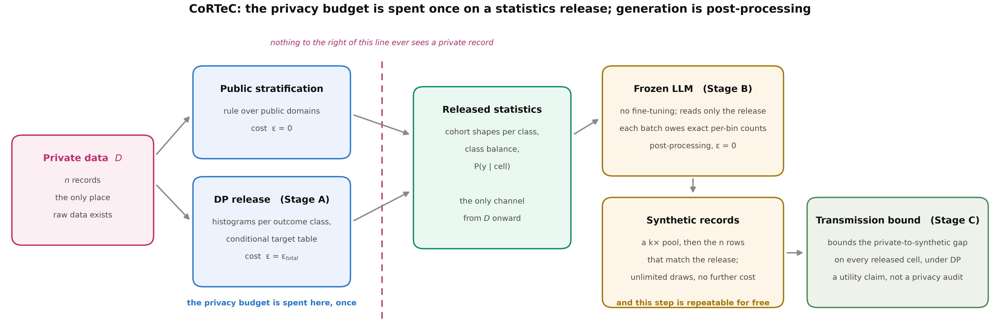{: .wide}

**Figure 1:** CoRTeC. The privacy budget is spent once, in Stage A. Everything to the right of the dashed line, the generator and every post-processing step, sees only released statistics, so it contributes nothing to the privacy cost and may be repeated without limit.

The mechanism has three stages. Stage A (Algorithm 1) is the only code that reads $D$. It partitions the record space into cohorts by a public rule, and inside each cohort of at least $n_{min}$ records it releases a noisy cohort size, a noisy class balance and one noisy histogram per attribute and per outcome class. It then releases, for each level of a nested conditional hierarchy, a noisy positive count and a noisy size for every cell of at least $n_{min}$ records. The output is the release $R$. Stage B reads $R$ and nothing else. It allocates rows to cohorts by released size, apportions exact per-bin counts from the released histograms, asks a frozen language model for batches of rows that carry exactly the counts still owed (Algorithm 3), generates a pool $k$ times larger than the requested size, keeps the $m$ rows whose cell counts best match $R$ (Algorithm 4), and redraws each kept value uniformly inside its released bin wherever the release describes the class shape at that resolution. Stage C (Algorithm 5) is optional and spends a separately declared budget: it releases a Laplace estimate of each cell's private target rate and turns it into a simultaneous bound on how far the synthetic data's rates lie from the private ones, so that a deployment can attach a quantified utility claim to a release package without exposing the private data. An auto-configurator (Algorithm 2) derives the cohort rule and the conditional hierarchy from the schema, the budget and the requested size, and charges the one step that reads private data.

### 4.2 Stage A: the release

```algorithm
Algorithm 1: CoRTeC-Release
Input: private $D$; public schema (domains, bin edges $E$, stratification rule $\Pi$, conditional levels $L_0 \subset L_1 \subset … \subset L_k$); budget $ε_{total}$; conditional share $α$; count share $γ$; suppression floor $n_{min}$
Output: release $R$
(1) $ε_{count} \leftarrow γ \cdot ε_{total}$;  $ε_{rest} \leftarrow ε_{total} − ε_{count}$;  $ε_{marg} \leftarrow (1 − α) \cdot ε_{rest}$;  $ε_{cond} \leftarrow α \cdot ε_{rest}$
(2) $q \leftarrow |A_{num}| + |A_{cat}| + 1$  (queries per cohort; sequential within a cohort)
(3) $ε_q \leftarrow ε_{marg} / q$  (cohorts are disjoint: parallel across $\Pi$)
(4) $ε_L \leftarrow ε_{cond} / |L_{viable}|$  (levels overlap: sequential across levels)
(5) For each cohort $P \in \Pi$ with $|P| \ge n_{min}$:
(6)     Release $\tilde{n}_P \leftarrow \max(n_{min}, |P| + \mathrm{Lap}(1/ε_{count}))$
(7)     Release the two-bin count histogram of $y$ on $P$, each count $+ \mathrm{Lap}(1/ε_q)$
(8)     If $|P \cap \{y = 1\}| \ge n_{min}$ and $|P \cap \{y = 0\}| \ge n_{min}$:  (class-conditional blocks)
(9)         For $c \in \{0, 1\}$ and $a \in A$: release $\tilde{M}_a(P, c) \leftarrow M_a(P \cap \{y = c\}) + \mathrm{Lap}(1/ε_q)$
(10)        $\tilde{M}_a(P) \leftarrow$ mixture of $\tilde{M}_a(P, c)$ under the released class balance
(11)    Else: for $a \in A$, release $\tilde{M}_a(P) \leftarrow M_a(P) + \mathrm{Lap}(1/ε_q)$  (pooled block)
(12) For each level $\ell \in L_{viable}$ and each cell $c \in \ell$ with $|c| \ge n_{min}$:
(13)    Release $\tilde{k}_c \leftarrow k_c(D) + \mathrm{Lap}(2/ε_L)$ and $\tilde{n}_c \leftarrow |c| + \mathrm{Lap}(2/ε_L)$
(14)    $\tilde{ρ}_c \leftarrow \mathrm{clip}(\tilde{k}_c / \max(\tilde{n}_c, n_{min}), 0, 1)$  (post-processing of two counts)
(15) Return $R$: every released quantity, with its ε, sensitivity and composition rule
```

Five decisions in Algorithm 1 carry the method, and each is a statement about sensitivity.

**Public stratification (line 5).** Cohorts come from a rule fixed over public domains, so $\Pi(x)$ is a deterministic function of $x$'s own record and forming cohorts consumes no budget. This replaces private clustering, which spends budget and, in our measurements, produced degenerate cohorts of 3 and 8 records.

**Histograms, not moments (lines 9 and 11).** A histogram has L1 sensitivity 1 regardless of its bin count, since one individual moves exactly one bin, so an entire distributional shape costs what a single count costs, and moments are recovered from the released histogram for free. Under the moment formulation the standard-deviation query has sensitivity $(hi − lo)/(2\sqrt{n})$, which at realistic budgets produced released values larger than the attribute's entire range: at a cohort size of 20, a released standard deviation of 693.80 against a true value near 13.

**Class-conditional histograms (lines 8 to 10).** A pooled cohort histogram says what the cohort looks like and nothing about how any feature relates to the target outside the conditional hierarchy. The generator fills that in from its prior, and on the finance dataset the filled-in columns measurably degraded the downstream model (Section 6.2). Partitioning each cohort by the target and releasing one histogram block per (cohort, class) hands the generator the class-conditional marginals a classifier needs, for every column. The two class blocks are disjoint, so they compose in parallel: each spends the same $ε_q$ per column the pooled block did, and the pooled histogram is their mixture under the released class balance, which is post-processing. Where a class falls below $n_{min}$ the cohort keeps the pooled block.

**A conditional table over a disjoint partition (lines 12 to 14).** Because the cells of one level partition $D$, they satisfy parallel composition: each receives the full $ε_L$ however many cells the level contains. A cell's rate is the ratio of two counts each carrying $\mathrm{Lap}(2/ε_L)$, so its noise is of order $2/(|c| \cdot ε_L)$ and its accuracy is governed by cell support, not by the number of cells. Conditional structure is therefore cheap to release, which is the observation the method is built on. We do not noise the rate directly as a bounded mean. That mechanism's scale, $1/(|c| \cdot ε_L)$, depends on $|c|$, which is itself private under add/remove adjacency, and two Laplace densities with different scales have an unbounded likelihood ratio in one tail, so it is not pure ε-differentially private. Two counts of sensitivity 1 at a public scale are.

**The published cohort size (line 6).** The generator allocates rows to cohorts in proportion to size, so the size must be released, and it is a private count. It is noised at $\mathrm{Lap}(1/ε_{count})$, charged out of the marginal share, and clamped at $n_{min}$: a cohort is released only when it holds at least $n_{min}$ records, so any lower published value is impossible under the release's own rule. Without the clamp, at ε = 0.3 on NHANES the youngest age band's noised size clipped to zero and the band vanished from the output while every per-row check passed.

**The conditional share.** With one histogram block per outcome class the release already carries most of what a classifier needs, and the conditional table's share $α$ can fall from a half to a fifth without measurable loss. The histograms then receive that budget, and the release's own 1-way error against the training data falls from 0.029 to 0.020 on Adult and from 0.017 to 0.013 on finance. $α = 0.2$ is the shipped default, and $γ = 0.02$.

### 4.3 Auto-configuration

Every published result in differentially private synthesis, and every early result in this project, depended on a hand-chosen configuration: which columns the conditional table conditions on, how many levels it carries, how cohorts are formed. Choosing those columns after inspecting the private data is an uncharged, data-dependent decision, and it means the method is not deployable without a statistician. Algorithm 2 derives the whole configuration from the declared schema, the target, the budget and the number of records requested.

```algorithm
Algorithm 2: CoRTeC-Autoconfigure
Input: private $D$ of size $n$; public schema; target $y$; $ε_{total}$; requested size $m$; noise-floor multiple $M$
Output: stratification rule $\Pi$, conditional levels $L$, budgets $ε_{sel}$ and $ε_{release}$
(1) $m_{cand} \leftarrow$ number of candidate columns; $L \leftarrow$ median level count of the candidates; $|Y| \leftarrow$ number of target classes
(2) $f \leftarrow \mathrm{clip}(M \cdot m_{cand} \cdot L \cdot |Y| / n,\; 0.05,\; 0.30)$;  $ε_{sel} \leftarrow f \cdot ε_{total}$;  $ε_{release} \leftarrow ε_{total} − ε_{sel}$
(3) For each candidate column $a$:  (the only step that reads $D$)
(4)     $\tilde{T}_a \leftarrow$ contingency table of bands($a$) × $y$ on $D$, each cell $+ \mathrm{Lap}(m_{cand}/ε_{sel})$
(5)     $score_a \leftarrow$ mutual information of $\tilde{T}_a$  (post-processing)
(6)     Coarsen $a$ into at most four bands by its noisy positive rate, read from $\tilde{T}_a$
(7) Rank the candidates by score; choose the stratification column and the conditioning columns
(8) Add conditioning columns while every cell still expects at least 8 records under $m$, preferring the depth closest to 20 records per cell, divided by the cohort count
(9) Return $\Pi$, $L$, $ε_{sel}$, $ε_{release}$
```

Column ranking is the only private step, and it is charged. Each candidate is scored from one noised contingency table of its bands against the target; a record occupies exactly one cell, so the table's L1 sensitivity is 1 however many cells it has. The tables are not disjoint across candidates, since every record appears in all of them, so they compose sequentially at $ε_{sel}/m_{cand}$ each. Everything after the noised counts, the mutual-information computation, the coarsening and the ranking, is post-processing. Greedy forward selection by conditional mutual information was implemented and reverted: a cardinality bias in that estimator rewards a wide candidate for having more cells, and on Diabetes 130 it lowered the release ceiling from 0.613 to 0.535 at every selection budget. Coarsening wide columns into at most four bands by their noisy positive rate reproduces what hand-tuned band objects did (education, 16 levels to 4) at no further cost. Richness needs no private input at all: a conditional table's usable resolution is set by how many records land in each cell, cell counts are a function of public cardinalities, and the number of records requested is a public choice. The selection budget is adaptive because selection is meaningful only while a column's expected cell count exceeds the Laplace noise on it. Writing $f$ for the share of $ε_{total}$ spent on selection and requiring the expected count per cell to exceed the noise scale by a factor $M$,

$$ \frac{n}{L \cdot |Y|} \ge M \cdot \frac{m_{cand}}{f} \quad ⇔ \quad f \ge \frac{M \cdot m_{cand} \cdot L \cdot |Y|}{n}, $$ (3)

which is line 2 after clipping the share to [0.05, 0.30]; $M = 1$ is the shipped value, and every quantity in (3) except $n$ comes from the declared schema. Small datasets therefore spend more on selection, which is correct: a smaller release needs less budget to describe. Under a fixed 5% share, three of six datasets it had never seen declined to configure at all (Section 6.7).

### 4.4 Stage B: generation with exact counts

```algorithm
Algorithm 3: CoRTeC-Generate
Input: release $R$; requested size $m$; pool factor $k$; batch size $B$; frozen model $G$
Output: pool $\hat{D}$ of about $k \cdot m$ rows
(1) For each cohort $P$ in $R$:  $m_P \leftarrow k \cdot m \cdot \tilde{n}_P / Σ_{P'} \tilde{n}_{P'}$  (rows by released size)
(2)     $T_P \leftarrow \mathrm{Apportion}(m_P;$ released class balance, $\tilde{M}_a(P, c)$ for all $a, c)$  (exact per-bin, per-category and per-class counts)
(3)     While rows are still owed to $P$:
(4)         $b \leftarrow \min(B, \text{rows owed})$
(5)         $\text{owed} \leftarrow \mathrm{Apportion}(b;\; T_P − \text{counts of the rows already accepted for } P)$
(6)         $\text{rows} \leftarrow G(\mathrm{prompt}(R, P, b, \text{owed}))$  (the prompt carries $R$ and the counts, never $D$)
(7)         Accept the rows that parse, lie inside their domains and carry declared categories; append them to $\hat{D}$
(8) Return $\hat{D}$
```

Asked to reproduce a histogram stated as shares, a frozen model reproduces it approximately, and the rows it emits carry that approximation plus the sampling noise of any batch. Asked instead for exact counts, it can satisfy them: a 25-row batch told the number of rows it owes per bin and per category reproduces every count line exactly on the frontier models we measured, where the same batch given shares matches about two thirds of them. The counts are apportioned from the released histograms for the cohort as a whole (line 2), so they carry no more than the release does, and each batch asks for what the cohort still owes after the rows already accepted (line 5), so a batch that returns more or fewer valid rows than asked cannot leave the cohort's totals short. The batch size is 25 and the pool factor is 3 by default.

The prompt (Appendix A) is versioned and hash-locked in the reference implementation, because two of its elements are load-bearing and their removal is invisible: the conditional target table, which is the only channel through which the conditional structure reaches the generator, and the instruction to follow the released statistics even where they contradict the model's expectations, without which a model reconciles the release against its prior and emits the prior. Section 6.3 measures both.

### 4.5 Selection, and values below bin resolution

```algorithm
Algorithm 4: CoRTeC-Select
Input: release $R$; pool $\hat{D}$; requested size $m$
Output: synthetic dataset $\hat{D}^*$ of exactly $m$ rows
(1) Require that every cohort $P$ holds at least $1.1\cdot m \cdot \tilde{n}_P / Σ \tilde{n}$ rows of $\hat{D}$  (coverage guard)
(2) $w \leftarrow$ inclusion weights from iterative proportional fitting of $\hat{D}$ to every released cell: cohort sizes, class balances, one histogram per cohort, class and attribute; a category the release suppressed receives weight 0
(3) $\hat{D}^* \leftarrow$ a systematic sample of $m$ rows of $\hat{D}$ under $w$  (rake)
(4) Repeat: swap a row of $\hat{D}^*$ for a row of $\hat{D} \setminus \hat{D}^*$ whenever the swap lowers the weighted L1 distance between the cell counts of $\hat{D}^*$ and those of $R$, until no swap improves it  (refine)
(5) For each cohort $P$ with class-conditional blocks, each $a \in A_{num}$ and each row of $\hat{D}^*$ in $P$: redraw the value uniformly inside its released bin intersected with its stratification band; integer attributes draw integers  (sub-bin rule)
(6) Return $\hat{D}^*$
```

**Selection from a pool (lines 2 to 4).** The inclusion weights come from iterative proportional fitting, the raking procedure of Deming and Stephan [10], applied to the generated pool against every released cell. Exact-count batches match the release closely but not exactly, and any $m$ rows drawn at random from a faithful pool carry the sampling error every $m$-record sample carries. Generation is free in ε, so the pipeline asks for $k$ times the rows it needs and keeps the $m$ whose cell counts match the release, with the pooled marginals weighted above the per-cell counts. A cohort whose release carries only a pooled block is constrained at cohort level, not per class, because imposing a pooled histogram on each class would erase the feature-to-target structure the release paid for. The cost is $k$ times the generation spend.

**The coverage guard (line 1).** Selection can only choose among rows that exist. A pool that reached its spend cap before every cohort was complete produced a draw whose two lowest-education cohorts held 63% of the rows against a released share of 40%, and every per-row check passed; the draw simply carried the pool's imbalance. Both implementations now require every cohort to be covered by at least 1.1× the rows it owes before selecting, and the tool refuses a pool that is not.

**Values below bin resolution (line 5).** A released histogram fixes how many rows fall in each public bin and nothing finer, so where a value sits inside its bin is never released information. In a cohort that carries class-conditional blocks, the class shape is the release's at bin resolution and whatever the generator does below it is prior. On NHANES that prior separated the outcome classes about twice as far as the data does inside each bin, a BMI gap of 6.2 between diabetic and non-diabetic rows against 3.1 in the training data and a positive diastolic effect the data does not have, which a bin-level selection cannot see; a tree student that splits on thresholds is indifferent to it, and a linear student that fits a slope is not. In those cohorts every numeric value is therefore redrawn uniformly inside its released bin, intersected with the row's stratification band so that no row changes cohort. Every bin count under the release's bins is unchanged by construction. In a cohort with only a pooled block the generator's placement is the only carrier of the class signal and is kept: on the two pooled arms we measured, replacing it cost the tree students up to 0.03 AUC. The rule reads the release and the rows, has no parameter and is post-processing.

### 4.6 Stage C: the utility transmission bound

Sections 6.3 and 6.4 measure, with access to the private data, whether the released conditional structure reaches the output. A deployment needs that measurement as a budgeted artifact a third party can inspect without that access. For each released cell $c$ the private data has a true positive rate $p_c$ and the synthetic data a rate $q_c$. $q_c$ is a function of the synthetic output alone, so it is public and free; $p_c$ is private. Stage C releases a Laplace estimate $\hat{p}_c$ at a declared budget $ε_{cert}$ and turns its noise into a one-sided confidence bound.

```algorithm
Algorithm 5: CoRTeC-Bound
Input: private $D$; synthetic $\hat{D}^*$; the released cells $c_1, …, c_k$ of the finest level; suppression floor $n_{min}$; budget $ε_{cert}$; confidence $(1 − α)$; tolerance $τ$
Output: a simultaneous bound $B_c$ per cell, a verdict, or a refusal
(1) For each cell $c$: $q_c \leftarrow$ positive rate of $\hat{D}^*$ in $c$  (public)
(2) For each cell $c$: $\hat{p}_c \leftarrow p_c(D) + \mathrm{Lap}(1/(n_{min} \cdot ε_{cert}))$  (cells are disjoint: parallel across cells)
(3) For each cell $c$: $B_c \leftarrow |\hat{p}_c − q_c| + \ln(k/α) / (n_{min} \cdot ε_{cert})$
(4) Repeat lines 1 to 3 for a real hold-out sample in place of $\hat{D}^*$ (the ceiling) and for the same sample with its target permuted (the floor)
(5) If the ceiling's largest $B_c$ exceeds $τ$ or the floor's does not: Return "this test did not discriminate", no verdict
(6) Return within bound if $\max_c B_c \le τ$, else outside tolerance; report every $B_c$ and the cells with thin support
```

With probability at least $(1 − α)$, simultaneously over all $k$ released cells,

$$ |p_c − q_c| \le |\hat{p}_c − q_c| + b_c \cdot \ln(k/α), \qquad b_c = \frac{1}{n_{min} \cdot ε_{cell}}, $$ (5)

where $ε_{cell} = ε_{cert}$ because the cells partition the data. The sensitivity of a released cell's rate is bounded by $1/n_{min}$, the public floor, never by the private cell size, so the scale depends on nothing private; the bound is conservative by a factor $n_c / n_{min}$ on each cell, which is the price of that. The union bound over cells makes the guarantee simultaneous rather than per cell. The $k$ rate queries compose in parallel, so a deployment that bounds at $ε_{cert}$ has spent $ε_{release} + ε_{cert}$ in total, and the reference implementation reports both. Lines 4 and 5 are the floor-and-ceiling discipline of Section 5.3 applied to the bound itself: a real sample must clear the tolerance and a permuted one must not, or the procedure issues no verdict. The bound speaks to utility only. It says how much conditional structure survived generation and nothing about re-identification risk, and Section 7 keeps it out of the compliance mapping for that reason.

### 4.7 Privacy analysis

**Theorem 1 (Privacy of CoRTeC).** *Algorithms 1, 3 and 4 together satisfy $ε_{total}$-differential privacy. Algorithm 2 followed by them satisfies $(ε_{sel} + ε_{release})$-differential privacy, which equals $ε_{total}$.*

*Proof.* Consider neighboring $D, D'$ differing in one record $x$.

(i) *Stratification is free.* $\Pi$ is a function of public attribute domains only, so $\Pi(x)$ is computed from $x$'s own attributes without reference to any other record. The partition structure is data-independent and releasing it costs nothing.

(ii) *Within a cohort, sequential composition.* Fix a cohort $P$. Each released histogram is a counting query of L1 sensitivity 1: $x$ contributes to exactly one bin of one attribute, so removing it changes that histogram's L1 norm by 1 and every other histogram not at all. By Proposition 1 the Laplace mechanism at scale $1/ε_q$ gives $ε_q$-differential privacy per query. Under the pooled block (line 11) the $q$ queries on $P$ compose sequentially (Proposition 2) to $q \cdot ε_q = ε_{marg}$. Under the class-conditional blocks (line 9), $P$ is partitioned by $y$, so $x$ lies in exactly one of $P \cap \{y=0\}$ and $P \cap \{y=1\}$; it is touched by the class-balance query of line 7 and by the $q − 1$ histograms of its own block and by nothing in the other block, a chain of $q$ queries and the same $q \cdot ε_q$. The two blocks are disjoint and compose in parallel (Proposition 3). The pooled histogram of line 10 is a function of released quantities only.

(iii) *Across cohorts, parallel composition.* The cohorts are disjoint and defined by a public rule. Record $x$ lies in exactly one, so it can influence only that cohort's queries; the others are identical on $D$ and $D'$. By Proposition 3 the cost across cohorts is $ε_{marg}$, independent of $|\Pi|$.

(iv) *Within a conditional level, parallel composition.* The cells of level $\ell$ partition $D$, so the same argument applies and level $\ell$ costs $ε_L$ however many cells it contains. Within a cell $c$ we release two counting queries, the positive count $k_c$ and the cell size $|c|$, each of L1 sensitivity exactly 1 under add/remove adjacency and each at $\mathrm{Lap}(2/ε_L)$, a scale that depends on nothing private. They touch the same records, so they compose sequentially to $ε_L$ per cell. The published rate $\tilde{ρ}_c = \tilde{k}_c / \max(\tilde{n}_c, n_{min})$ is a function of two released quantities and the public floor, so it is post-processing (Proposition 4), as is clipping to $[0, 1]$.

(v) *Across levels, sequential composition.* Levels of differing granularity describe the same individuals, so they are not disjoint and compose sequentially: $|L_{viable}| \cdot ε_L = ε_{cond}$. Splitting across viable rather than declared levels is sound because a level whose cells all fall below $n_{min}$ releases nothing.

(vi) *The published cohort size.* $|P|$ is a counting query of sensitivity 1, noised at $\mathrm{Lap}(1/ε_{count})$; cohorts are disjoint, so the cost across $\Pi$ is $ε_{count}$ by parallel composition, and it composes sequentially with the $q$ queries on the same cohort. Clamping at $n_{min}$ is post-processing.

(vii) *Stage B is post-processing.* The row allocation (Algorithm 3, line 1) reads released sizes; the per-bin counts a batch is asked for (line 2) are apportioned from released histograms; the counts still owed (line 5) are a difference of released targets and generated rows; the prompt carries $R$ and those counts; the model $G$ is frozen and reads only the prompt; and the acceptance rule of line 7 reads public domains. The inclusion weights, the rake, the refinement and the sub-bin redraw of Algorithm 4 read $R$, the generated rows and independent randomness. By Proposition 4 none of these increases the privacy loss, at any pool factor $k$ and for arbitrarily many draws.

Summing the dependent components, $ε_{count} + ε_{marg} + ε_{cond} = ε_{total}$. Stage C, when run, adds $ε_{cert}$: its $k$ Laplace queries are counting-rate queries of sensitivity at most $1/n_{min}$ on disjoint cells, at a public scale, so by Proposition 3 they cost $ε_{cert}$ together, and everything else in Algorithm 5 reads released or public quantities. Under auto-configuration the $m_{cand}$ contingency tables of Algorithm 2 are counting queries of L1 sensitivity 1 on the same records and compose sequentially to $ε_{sel}$; everything downstream of their noised counts is post-processing, and the release that follows spends $ε_{release}$, so the total is $ε_{sel} + ε_{release} = ε_{total}$. $\square$

**What the theorem does not cover.** The $n_{min}$ suppression decisions, which cohorts and cells appear in the output and hence how many levels share $ε_{cond}$, are data-dependent and uncharged. The tables in this paper treat them as released, following the practice of the marginal-synthesis literature so that our ε = 2 rows are comparable to MST's and AIM's, whose reference implementations make the same choice; a recent audit of those implementations finds their empirical privacy close to the stated guarantee [17]. The releases behind the shipped-configuration tables (Tables 3 to 6, 9, 10, 16 and 23) and behind the class-conditional arms of Section 6.2 noise and charge their cohort counts (line 6) and their cell counts (line 13), and the guarantee stated for those tables is pure ε = 2. The earlier-configuration arms of Section 5.5 were released by an earlier rate mechanism that noised each conditional cell's rate at a scale set from the true cell size, which step (iv) above rejects: per conditional level it is $(ε_L, δ)$-differentially private with δ computed exactly at 1.5 × 10⁻⁷ for the $n_{min}$ = 150 floor every reported release used, rather than pure $ε_L$, and for most of the project that pipeline also published per-cohort counts exact. We measured the effect of the second point on every reported number by rebuilding each affected draw under noised counts, and the largest change on any metric was 0.0005, below draw-to-draw variation; the headline Adult arm regenerated under the corrected two-count mechanism reproduces the earlier result (Section 6.1). The floating-point attack of Mironov [30] on the Laplace mechanism applies to every implementation in the comparison, including ours, and is declared as an open gap in the release's own audit block.

### 4.8 What the allocation buys

Against a natural implementation (private clustering for cohorts, basic composition across cohorts, and separate mean and standard-deviation queries) the same $ε_{total}$ yields ε per released statistic of 0.0667 against 0.0100, a 6.7× improvement. The realized per-query budget on the 15-column Adult schema at $α = 0.5$ is 0.0653, because the cohort-size query of line 6 takes its 2% first; on the same footing the improvement is 6.5×. The budget is verified by instrumentation rather than by re-deriving a model of it: a test patches the Laplace mechanism inside the release path and tallies what is actually spent, asserting exactly $ε_{total}$ on three auto-configured schemas and at three budgets. A tighter accountant would not help. Advanced composition [14] and concentrated differential privacy [6] loosen the bound by 16 to 31% at the chain lengths this method reaches (15 marginal queries per cohort on the Adult schema, 18 once its three conditional levels are counted; no schema we tested has a conditional hierarchy deeper than 3 levels, or deeper than 2 at the shipped $n_{min}$) and only cross over past 27 queries.

### 4.9 Using the mechanism

Figure 2 shows the complete workflow in the reference implementation. Stage A is the only line that touches private data; the release is serialized with its audit trail and contains no record; Stage B may be run as often as wanted, on any endpoint, at no further privacy cost.

```python
from cortec import Schema, Band, release_statistics, Generator

schema = Schema(
    name="encounters",
    numerical={"age": (18, 95), "length_of_stay": (1, 30)},
    categorical={"admission_type": ["Emergency", "Elective", "Urgent"],
                 "a1c_result": ["None", "Norm", ">7", ">8"]},
    target="readmitted_30d", positive="YES", negative="NO",
    bins={"age": [18, 40, 55, 70, 95], "length_of_stay": [1, 3, 6, 10, 30]},
    stratify=[("length_of_stay", [Band("los1-2", 1, 3), Band("los3-5", 3, 6),
                                  Band("los6+", 6, 31)])],
    conditional=[("admission_type",), ("admission_type", "a1c_result")],
)

release = release_statistics(schema, private_df, epsilon_total=2.0, n_min=150)
print(release.audit["epsilon_accounted"])
release.to_json("release.json")

gen = Generator(schema, backend="gemini", surface="vertex",
                model="gemini-3.5-flash", reasoning="on")
synthetic = gen.generate_selected(release, n_rows=5000, pool_factor=3)
print(gen.stats.calls_with_reasoning_block, "of", gen.stats.calls, "calls reasoned")
```

**Figure 2:** The reference implementation end to end. The schema declares only what an institution knows without looking at its data: column names, public bounds and bin edges, the target, and the cohort and conditional structure, which [`cortec.autoconfig.derive()`](https://github.com/Calyie/cortec-framework/blob/main/cortec/cortec/autoconfig.py) can derive instead. The call to `release_statistics` is the only line that touches private data; it prints an accounted budget of 2.0 and writes a release that contains no private record. `generate_selected` runs Stage B with the shipped defaults, exact-count batches, a 3× pool, selection to the release and the sub-bin rule, and the final line reports on how many calls the model's reasoning verifiably fired.

## 5. Experimental Setup

### 5.1 Datasets

**Table 2:** Datasets. The three in bold carry the head-to-head of Section 6.1.

| dataset | domain | records | attributes | positive rate | rows per person | role |
|---|---|---|---|---|---|---|
| **NHANES 2017–2018** [9] | healthcare (examination and laboratory) | 3,749 | 10 | 14.2% | 1 | primary clinical dataset |
| **UCI Adult** [11, 24] | census | 32,561 | 15 | 24.1% | 1 | comparability anchor; AIM's own primary dataset |
| **Default of credit card clients** [50] | finance | 30,000 | 15 | 22.1% | 1 | second regulated domain |
| Diabetes 130-US hospitals [41] | healthcare (administrative) | 101,763 | 19 | 11.2% | mean 1.42, max 40 | ε sweep at scale; transmission; membership inference |
| renal registry (constructed) | synthetic clinical | 20,000 | 10 | 14.9% | 1 | contamination control (Section 6.3) |
| six untouched benchmarks | 3 health, 3 finance | 303–45,211 | 8–20 | 6.0–53.1% | 1 | auto-configuration generalization (Section 6.7) |

NHANES 2017–2018 is the primary clinical dataset: a national health examination survey of physical measurements and laboratory assays, obtainable with no application. We join the demographic, glycohemoglobin, body-measures and blood-pressure files on the respondent identifier, restrict to adults aged 18 to 80, and take the target to be HbA1c ≥ 6.5%, the American Diabetes Association's diagnostic threshold [4], which makes this an undiagnosed-diabetes screening task on laboratory values rather than on billing codes. Bin edges are public clinical knowledge (WHO BMI categories, ACC/AHA blood-pressure stages), not quantiles of the file. Adult is the head-to-head anchor, the only schema on which every mechanism we compare completes. The credit dataset is the second regulated domain. Diabetes 130 is hospital administrative data at scale, 81,410 training records, and carries the ε sweep on a large dataset, the transmission sweep and part of the membership-inference evaluation; it is encounter-level, so every figure from it holds under a row-level guarantee (Section 3). Each dataset is split once into a training set, which every mechanism sees, and a held-out test set, which only the evaluator sees: 26,048 training rows on Adult, 24,000 on finance and 2,999 on NHANES.

### 5.2 Baselines

We compare against the three families an institution would realistically choose between, all through smartnoise-synth [33] at matched ε, with numerical columns pre-binned using the same public bounds CoRTeC assumes, so no method gains an advantage from a different discretization: the marginal methods MST and AIM; the DP-SGD generative model DP-CTGAN; and the PATE generative models PATE-CTGAN and PATE-GAN. All run at library defaults at ε = 2 on the training split and are sampled at the same $n$ as CoRTeC. An unconditioned "header-only" prompt, the same frozen model given nothing but the column names, appears as a control and not as a competitor. It carries no privacy guarantee; its role is to establish that CoRTeC's output depends on the released statistics rather than on the model's prior.

### 5.3 Metrics, and the floor-and-ceiling discipline

We report marginal fidelity (1-way and 2-way total variation, the latter over all column pairs), conditional fidelity (error in $P(\text{target} \mid \text{group})$ over the groups the release describes, "seen", and over strictly held-out group families sharing no column with the conditioning, "held-out"), AIM's own 3-way workload error where stated, and utility (TSTR AUC under logistic regression, random forest and gradient boosting, each trained on the synthetic data and tested on the real held-out split). Fidelity and utility appear in the same table for every condition, because a method can win one and lose the other, and both marginal baselines do.

Two references accompany every table. The *real-sample floor* is a genuine draw of $n$ real training records: no synthetic method can be expected to exceed it at that $n$, and it is the only sensible target. The *permuted-target floor* is real data with the target column permuted: identical marginals, zero predictive content, and therefore what "no usable information" scores. Any metric that fails to separate these two has no power, and we check that before drawing conclusions (Section 6.3). The *train-on-real ceiling* trains the students on the entire training set. Evaluating against explicit reference points rather than a bare threshold is the discipline DPBench argues for [18], and it caught the founding defect of this project: our original primary metric scored the real-data ceiling and the unconditioned baseline identically, so there was nothing for any method to improve, and a verdict had been drawn from it before the floors were checked (Section 9). The real-sample floor is drawn afresh for each table at that table's $n$ and draw count, so its value varies across tables by design, and comparisons are made at matched $n$.

Every metric is computed by one implementation that bins numerical columns with the public bin edges every method is fed. One convention is declared. The evaluator's intervals are right-closed, while the release, the selection step and the baselines' discretization are left-closed, so an integer sitting exactly on an edge counts in different bins under the two. The effect is small and falls on every method: on Adult, 1-way error under the release's convention is 0.020 for CoRTeC, 0.015 for MST, 0.030 for AIM and 0.043 for a real sample, against 0.029, 0.024, 0.037 and 0.043 under the evaluator's. Every number in this paper is the evaluator's, and the ordering of methods is the same under either.

### 5.4 Statistics

Point estimates are means over draws. Differences between conditions are tested with Welch's t-test on the per-draw values and corrected with Holm's procedure [19] over each family of tests, a family being the seven metrics of one baseline on one dataset; adjusted p-values are Holm's step-down values. Where a rank test is reported, its smallest attainable p-value at the draw counts in hand is reported beside it, because at small group sizes it is the design and not the data that limits the statistic. Confidence intervals on the headline equivalence test are bootstrap intervals over draws (10,000 resamples). All CoRTeC draws within a condition come from one release and one generator, so they replicate the generation step; releases are redrawn only for the transmission sweeps. Draws from different generators are never pooled, because the generator is itself a variable under study (Section 6.6).

### 5.5 The configuration reported

Unless a table says otherwise, every CoRTeC row is the shipped configuration: the class-conditional release of Algorithm 1 at ε = 2 with $α = 0.2$ and $n_{min} = 150$, exact-count batches of 25 rows, a 3× pool (2× on NHANES) selected to the release with the sub-bin rule, and Gemini 3.5 Flash with reasoning enabled, reached through Vertex AI inside a Google Cloud project, at $n = 300$ and three draws per dataset. Adult and finance use hand-tuned cohort and conditional hierarchies; NHANES uses the auto-configured release of Algorithm 2, three age cohorts and two conditional levels over age, diastolic blood pressure and race/ethnicity. Several results were produced on the earlier configuration the method was developed on, and each is labeled where it appears: the powered six-draw equivalence test of Section 6.1, the 3-way workload table (Table 7), the saturation and inversion controls of Section 6.3, the transmission sweeps and the over-coupling decomposition of Section 6.4, the Diabetes 130 budget sweep of Section 6.5, the generator ladder of Section 6.6, the cohort-wise and cell-wise comparison of Section 6.8, and the membership-inference evaluation of Section 6.11. That configuration released pooled rather than class-conditional histograms, stated the release to the generator as shares rather than exact counts, kept every returned row rather than selecting from a pool, and, in the six-draw Adult arm, showed the generator only the four most common values of each categorical attribute. Every one of those differences is conservative for CoRTeC in a comparison, and the conclusions those sections draw concern the variable each isolates, not the configuration.

## 6. Results

### 6.1 Head-to-head: fidelity at the release's own level, utility at the floor

**The bound first.** No output decoded from a release can be expected to sit closer to the private data than the release itself. At ε = 2 with a fifth of the budget on the conditional table, the release's 1-way total variation against the training data is 0.020 on Adult and 0.013 on finance under the public bins, and a 300-record real sample records 0.043 and 0.041 on the same measure. The release carries less marginal error than a sample of the size we generate.

**Adult.** Table 3 reports three draws from one release beside the baselines at five draws each. 1-way error, 0.029, is below the real sample's 0.043 and within 0.005 of MST's 0.024; that difference survives correction (adjusted p = 0.007) and is the one comparison in this section a baseline wins. 2-way error, 0.110, sits on the real sample's 0.107 and below AIM's 0.119 and MST's 0.144. Conditional error over seen groups, 0.017, is a quarter of the real sample's, because the class-conditional blocks are estimated from all 26,048 training records and a 300-record sample is not; over held-out groups, 0.039, it is at the sample's 0.036. The three students train at 0.842, 0.876 and 0.849 against the sample's 0.830, 0.870 and 0.840, and the margin over AIM and MST on every student is 0.14 to 0.17 AUC.

**Table 3:** Adult at ε = 2, $n$ = 300.

| condition | draws | 1-way TV ↓ | 2-way TV ↓ | cond. seen ↓ | cond. held-out ↓ | TSTR-LR ↑ | TSTR-RF ↑ | TSTR-GBM ↑ |
|---|---|---|---|---|---|---|---|---|
| *train on all 26,048 real rows (ceiling)* | *1* | *0.011* | *0.028* | *0.020* | *0.008* | *0.860* | *0.907* | *0.914* |
| *real sample, n = 300 (floor)* | *3* | *0.043* | *0.107* | *0.062* | *0.036* | *0.830* | *0.870* | *0.840* |
| **CoRTeC** (Gemini 3.5 Flash) | **3** | **0.029** | **0.110** | **0.017** | **0.039** | **0.842** | **0.876** | **0.849** |
| CoRTeC (Claude Opus 5) | 1 | 0.030 | 0.110 | 0.013 | 0.042 | 0.838 | 0.870 | 0.825 |
| MST | 5 | 0.024 | 0.144 | 0.169 | 0.050 | 0.690 | 0.728 | 0.681 |
| AIM | 5 | 0.037 | 0.119 | 0.054 | 0.101 | 0.675 | 0.700 | 0.691 |
| *permuted target (no-information floor)* | *3* | *0.041* | *0.110* | *0.152* | *0.102* | *0.423* | *0.485* | *0.482* |

**Finance.** Table 4 reports three draws from one release beside MST and PATE-CTGAN on the full 15-column schema, and beside AIM on the reduced 12-column schema that is the only one AIM completes on within three hours; its fit on the full schema exceeded three hours on every attempt, and the cause is localized to the six high-cardinality amount columns. CoRTeC, MST and the floors are re-scored on those 12 columns for that comparison. The finance picture is the Adult picture. 1-way error, 0.029, is within 0.001 of MST's 0.028 (the two do not separate) and below the real sample's; 2-way error, 0.125, is below AIM's 0.136 and MST's 0.230 and above the sample's 0.099; conditional error is below the sample's on seen and held-out groups. The tree students sit on the real-sample floor (0.731 against 0.727, 0.712 against 0.717) and logistic regression is 0.015 short (0.680 against 0.695, p = 0.033 at three draws against three). On the 12-column schema CoRTeC leads AIM on 1-way error by a factor of 2.1 and on every student, and does not separate from MST on 1-way error, the measure MST is built for.

**Table 4:** Finance at ε = 2, $n$ = 300. AIM completes only on the 12-column schema, so that block re-scores every arm on those columns.

| condition | draws | 1-way TV ↓ | 2-way TV ↓ | cond. seen ↓ | cond. held-out ↓ | TSTR-LR ↑ | TSTR-RF ↑ | TSTR-GBM ↑ |
|---|---|---|---|---|---|---|---|---|
| *train on all 24,000 real rows (ceiling)* | *1* | *0.009* | *0.024* | *0.013* | *0.008* | *0.699* | *0.748* | *0.747* |
| *real sample, n = 300 (floor)* | *3* | *0.041* | *0.099* | *0.059* | *0.045* | *0.695* | *0.727* | *0.717* |
| **CoRTeC** (Gemini 3.5 Flash) | **3** | **0.029** | **0.125** | **0.014** | **0.022** | **0.680** | **0.731** | **0.712** |
| MST | 3 | 0.028 | 0.230 | 0.090 | 0.150 | 0.580 | 0.610 | 0.604 |
| PATE-CTGAN | 3 | 0.209 | 0.397 | 0.192 | 0.138 | 0.548 | 0.501 | 0.515 |
| *permuted target (no-information floor)* | *3* | *0.040* | *0.100* | *0.137* | *0.059* | *0.514* | *0.482* | *0.481* |
| **12-column schema:** CoRTeC | 3 | 0.026 | 0.107 | 0.014 | 0.022 | 0.678 | 0.729 | 0.704 |
| 12-column schema: AIM | 5 | 0.054 | 0.136 | 0.083 | 0.036 | 0.578 | 0.652 | 0.623 |
| 12-column schema: MST | 3 | 0.023 | 0.216 | 0.090 | 0.150 | 0.591 | 0.644 | 0.636 |
| *12-column schema: real sample, n = 300* | *3* | *0.038* | *0.090* | *0.059* | *0.045* | *0.682* | *0.722* | *0.709* |

**NHANES, auto-configured.** Table 5 is the turn-key case: a release the auto-configurator derived with no hand-tuned hierarchy, generated cohort-wise from a 2× pool, beside MST, AIM and PATE-CTGAN fitted on NHANES at the same ε and binning. NHANES is also the one clinical dataset on which AIM completes (58 s to fit), so it carries the healthcare panel of Figure 3. The release sits 0.009 from the training data on 1-way error and the selected draws sit 0.002 from the release, so the marginal result carries over to a release nobody tuned: 1-way error 0.015 against the sample's 0.034, conditional error over seen groups 0.006 against 0.015, held-out 0.036 against 0.036. Two things do not carry over, and both are stated. 2-way error is 0.119 against the sample's 0.081 (Welch p = 0.001): with three cohorts and a four-cell table the release names little pairwise structure, and what the selection does not constrain the generator supplies. And logistic regression trains at 0.752 against 0.773 (p = 0.047) while the tree students sit on the floor (0.732 against 0.728, 0.711 against 0.716). What is left of the linear gap is not in the release, which decoded with no model at all trains logistic regression at 0.767; it sits in the youngest cohort, whose diabetic class does not clear $n_{min}$, so that cohort keeps a pooled block and the generator's values below bin resolution (Section 4.5). CoRTeC leads all three baselines on every measure except conditional error over seen groups, where MST's 0.004 and CoRTeC's 0.006 do not separate.

**Table 5:** NHANES at ε = 2, $n$ = 300, under a release nobody tuned.

| condition | draws | 1-way TV ↓ | 2-way TV ↓ | cond. seen ↓ | cond. held-out ↓ | TSTR-LR ↑ | TSTR-RF ↑ | TSTR-GBM ↑ |
|---|---|---|---|---|---|---|---|---|
| *train on all 2,999 real rows (ceiling)* | *1* | | | | | *0.797* | *0.763* | *0.747* |
| *real sample, n = 300 (floor)* | *3* | *0.034* | *0.081* | *0.015* | *0.036* | *0.773* | *0.728* | *0.716* |
| **CoRTeC** (Gemini 3.5 Flash, auto-configured) | **3** | **0.015** | **0.119** | 0.006 | **0.036** | **0.752** | **0.732** | **0.711** |
| MST | 3 | 0.024 | 0.175 | **0.004** | 0.128 | 0.687 | 0.646 | 0.664 |
| AIM | 3 | 0.024 | 0.142 | 0.009 | 0.073 | 0.596 | 0.650 | 0.650 |
| PATE-CTGAN | 3 | 0.095 | 0.187 | 0.149 | 0.150 | 0.598 | 0.552 | 0.539 |
| *permuted target (no-information floor)* | *3* | *0.043* | *0.093* | *0.047* | *0.060* | *0.493* | *0.514* | *0.515* |

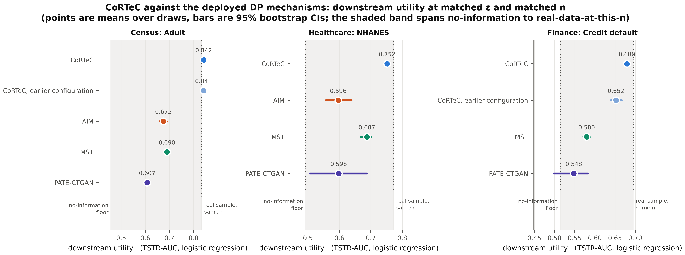

**Figure 3:** The central comparison on three datasets. Points are means over draws, bars are 95% bootstrap confidence intervals, and the shaded band spans the no-information floor to a real sample of the same size.

**The family statistics.** Table 6 gives the Welch tests on the per-draw values, Holm-corrected over each seven-metric family of one baseline on one dataset, in the direction that favors CoRTeC. On Adult and finance, 28 of the 35 comparisons survive correction in CoRTeC's favor and one separates in a baseline's favor: MST's 0.005 lead on 1-way error on Adult. The six that do not separate are the two 1-way comparisons against MST on finance, where the two methods are within 0.003; conditional error over seen groups against MST on finance; TSTR-GBM against MST on the full finance schema; and held-out conditional error against AIM on the 12-column schema. On NHANES, 8 of the 21 comparisons survive at three draws against three, six of them fidelity measures and two the random-forest student against MST and AIM (+0.086 and +0.083). The other utility differences on NHANES are consistent in direction and do not survive at three draws, so the utility ordering there is a corrected result on one student and a signal on the other two.

**Table 6:** Holm-corrected families. Cells are the difference CoRTeC − baseline with the adjusted p in brackets; negative error differences and positive AUC differences favor CoRTeC.

| family | 1-way | 2-way | cond. seen | cond. held-out | TSTR-LR | TSTR-RF | TSTR-GBM |
|---|---|---|---|---|---|---|---|
| Adult, against AIM | −0.007 (0.0029) | −0.009 (0.0029) | −0.037 (0.0003) | −0.061 (0.0016) | +0.167 (<0.0001) | +0.176 (0.0020) | +0.157 (0.0002) |
| Adult, against MST | +0.005 (0.0074) | −0.034 (0.0001) | −0.152 (0.0008) | −0.011 (0.0015) | +0.152 (0.0008) | +0.148 (<0.0001) | +0.167 (0.0004) |
| finance, against MST | +0.001 (0.14) | −0.105 (0.0074) | −0.076 (0.063) | −0.128 (0.0005) | +0.100 (0.0024) | +0.122 (0.0074) | +0.108 (0.051) |
| finance, 12 columns, against AIM | −0.028 (0.0023) | −0.029 (0.022) | −0.068 (0.0023) | −0.014 (0.17) | +0.100 (0.022) | +0.077 (0.010) | +0.082 (0.010) |
| finance, 12 columns, against MST | +0.003 (0.082) | −0.109 (0.010) | −0.076 (0.082) | −0.128 (0.0009) | +0.087 (0.0009) | +0.085 (0.010) | +0.069 (0.026) |
| NHANES, against MST | −0.009 (0.045) | −0.056 (0.0053) | +0.002 (0.41) | −0.092 (0.045) | +0.064 (0.090) | +0.086 (0.033) | +0.046 (0.41) |
| NHANES, against AIM | −0.009 (0.41) | −0.023 (0.078) | −0.003 (0.41) | −0.037 (0.0083) | +0.155 (0.14) | +0.083 (0.027) | +0.060 (0.24) |
| NHANES, against PATE-CTGAN | −0.080 (0.043) | −0.068 (0.0083) | −0.143 (0.078) | −0.114 (0.078) | +0.154 (0.41) | +0.181 (0.17) | +0.171 (0.065) |

**The powered equivalence test.** The claim that a model trained on CoRTeC's output performs as one trained on a real sample of the same size was first tested with adequate power on Adult, with Claude Fable 5 as the generator, six draws against five real samples, on the earlier release design and with the prompt showing only the four most common values of each categorical attribute, the weaker of the two prompts we ran. The differences were +0.007, −0.003 and +0.012 AUC on the three students, with 95% confidence intervals on the difference of [−0.007, +0.021], [−0.015, +0.010] and [−0.000, +0.027], and every p > 0.18. A non-significant difference is not by itself evidence of equivalence; what makes this one is that the intervals exclude any advantage or deficit larger than about 0.027 AUC. The same arm regenerated from a fresh release under the two-count rate mechanism of Algorithm 1 reproduces it (0.848, 0.871 and 0.852 against 0.834, 0.872 and 0.843; the one student that moves, moves in CoRTeC's favor, p = 0.050). Tables 3 to 5 remake the result under the shipped configuration and a second generator family on three datasets, at three draws each.

**A second vendor.** The Adult release was also generated through Claude Opus 5, one complete threefold pool of 900 rows selected exactly as the Gemini pools were. The pool sits 0.007 from the released histograms, closer than the Gemini pools' 0.009 to 0.011, and the selected draw reproduces the result (Table 3): each measure within 0.024 of the Gemini means and on the real-sample floor for the three students. One draw is a check rather than a replication, and we present it as one.

**Reading the numbers below the real-sample floor.** CoRTeC's 1-way and conditional errors are below what a 300-record real sample achieves, as MST's 1-way error is. An output selected to match statistics estimated from the whole training set is smoother than a random sample of the same size, not more faithful to one. The comparison that settles whether that smoothness costs anything is the downstream one, and it does not: the students sit on the real-sample floor. Where the deliverable is a dataset meant to stand in for a random sample of a given size, the sampling variability a real sample carries is part of what is being imitated, and a selected output does not carry it.

**The generative families.** All three fail on Adult at ε = 2, and they fail by not preserving the target's base rate, in opposite directions. DP-CTGAN collapses toward the negative class: two of its three draws contain no positive record at all, so TSTR is undefined rather than poor, and the fit took 2.2 hours. PATE-GAN and PATE-CTGAN fail the other way, emitting 54 to 60% and 45% positives against a real 24.1% (TSTR-LR 0.562 and 0.608), and PATE-GAN's conditional error over seen groups (0.525) is worse than the permuted-target floor (0.155). These are library defaults at this budget on a 15-attribute schema, and we make no claim that they cannot be made to work with tuning. What we can say is that the failure is invisible in a marginal-fidelity summary unless the base rate is inspected.

**AIM's own workloads.** Table 7 reports the metric AIM is built for, at a sample size adequate for 3-way marginals. AIM records the lowest error on all three of its workloads, CoRTeC is second, and MST and PATE-CTGAN follow. At $n$ = 300 the same comparison places CoRTeC ahead of AIM on the target workload; that ordering inverts at adequate $n$ because the small-sample floor masks AIM's advantage, so high-order marginal comparisons at small $n$ are not trustworthy. AIM's lead is structural rather than a shortfall: its adaptive measurement selection optimizes exactly that workload under the budget, so retaining the lead there is what its design predicts, and we did not set out to close it.

**Table 7:** 3-way workload error on Adult at $n$ = 1,950 per method (three draws each; the CoRTeC arm is the earlier configuration).

| method | 1-way TV ↓ | 2-way TV ↓ | target-3way ↓ | all-3way ↓ | skewed-3way ↓ |
|---|---|---|---|---|---|
| *real sample (floor at n)* | *0.017* | *0.042* | *0.120* | *0.179* | *0.166* |
| **AIM** | **0.024** | **0.076** | **0.278** | **0.279** | **0.252** |
| MST | **0.024** | 0.130 | 0.444 | 0.543 | 0.491 |
| CoRTeC (Claude Fable 5) | 0.054 | 0.116 | 0.305 | 0.389 | 0.357 |
| PATE-CTGAN | 0.357 | 0.538 | 1.190 | 1.363 | 1.336 |

### 6.2 What the release carries, and what each step of Stage B buys

**The release alone, decoded with no model.** The cleanest way to see what a release carries is to decode it by independent sampling, with no language model and no prior: a cohort by its released size, the outcome from the released class balance, and every other column from that outcome's histogram block (or, under a pooled release, from the cohort's single block with the outcome from the conditional table). Table 8 does this five times for each release design on finance and on Adult. Decoded this way, the class-conditional release trains better models than the pooled one on every student and both datasets, by 0.02 to 0.04 AUC on finance (Welch p = 0.089, 0.048, 0.013 for LR, RF, GBM) and by 0.05 to 0.06 on Adult (p ≤ 0.005 on all three), landing within 0.011 AUC of the real-sample floor on every finance student and within 0.019 on every Adult student. Held-out conditional error falls by 31 to 39%. The pooled release, decoded the same way, sits where our earliest generated finance arm sat: the information a classifier needs was not in the release the generator was given. The naive decode is not a competitor to the generator, since its 2-way error is 1.6× the real sample's; it is a lower bound on what the release carries.

**Table 8:** Each release design decoded by independent sampling, with no model (five decodes each).

| release, decoded naively | 1-way TV ↓ | 2-way TV ↓ | cond. seen ↓ | cond. held-out ↓ | TSTR-LR ↑ | TSTR-RF ↑ | TSTR-GBM ↑ |
|---|---|---|---|---|---|---|---|
| **finance**, pooled | 0.053 | 0.157 | 0.053 | 0.042 | 0.666 | 0.701 | 0.664 |
| **finance**, class-conditional | 0.054 | 0.161 | 0.061 | **0.029** | **0.687** | **0.733** | **0.706** |
| *finance, real sample n = 300* | *0.041* | *0.099* | *0.059* | *0.045* | *0.695* | *0.727* | *0.717* |
| **Adult**, pooled | 0.052 | 0.144 | 0.069 | 0.094 | 0.752 | 0.814 | 0.792 |
| **Adult**, class-conditional | 0.058 | 0.150 | 0.070 | **0.057** | **0.811** | **0.861** | **0.842** |
| *Adult, real sample n = 300* | *0.043* | *0.107* | *0.062* | *0.036* | *0.830* | *0.870* | *0.840* |

The same generator on both releases confirms it. With one finance release of each kind, Gemini 3.5 Flash, the same prompts and three draws per release, the class-conditional release lifts every student, +0.029, +0.050 and +0.042 AUC (Welch p = 0.007, 0.017, 0.029; Hedges' g of 2.4 to 4.0), while the four fidelity measures stay within draw-to-draw spread (p ≥ 0.20). The pooled arm under Gemini reproduces the pooled arm under Claude Fable 5 to within 0.012 AUC on every student (0.651, 0.662, 0.662 against 0.652, 0.674, 0.664), which is direct confirmation that the ceiling was the release's, not the generator's. Under Claude Fable 5 on the same release design the tree students again reach the floor (0.723 and 0.716 against 0.727 and 0.717), but held-out conditional error rises from 0.048 to 0.057 (p = 0.007), a cost the Gemini arm does not show: the per-outcome blocks give that generator more to honor per cohort, and the price is paid on the conditional families the release does not name. We report it as a cost of the design under one generator rather than as noise.

**Exact counts and selection.** The two Stage B steps were separated on the Adult release by scoring the same generated rows before and after selection (Table 9). Exact counts act on the pool: the three generated pools (879, 900 and 900 rows) match the released histograms to 0.009 to 0.011, below the release's own distance from the truth, where the plain share-based prompt's rows sit at 0.052 from theirs. But any 300 rows drawn at random from a faithful pool carry the sampling error every 300-record sample carries, and 0.050 is where a random 300 of that pool sits, beside the real sample's 0.043. Selection removes that sampling error: 1-way error falls from 0.050 to 0.029, 2-way lands on the real sample, conditional error falls by almost three quarters, and the three students move up by 0.009 to 0.027 AUC. The two steps are a pair. Counts without selection give a pool the selection can trust, and selection without counts chooses from rows that were never asked to match, which bought nothing that survived a significance test on the earlier arms.

**Table 9:** Exact counts and selection, separated on one Adult release with three pools. The selected row is scored before the sub-bin rule, which is why its 1-way error coincides with Table 3's while the students differ slightly.

| condition | 1-way TV ↓ | 2-way TV ↓ | cond. seen ↓ | cond. held-out ↓ | TSTR-LR ↑ | TSTR-RF ↑ | TSTR-GBM ↑ |
|---|---|---|---|---|---|---|---|
| exact-count batches, a random 300 of each pool | 0.050 | 0.131 | 0.057 | 0.052 | 0.826 | 0.851 | 0.821 |
| the same pools, the 300 rows selected to the release | **0.029** | **0.109** | **0.015** | **0.037** | 0.835 | 0.872 | 0.848 |
| *real sample, n = 300* | *0.043* | *0.107* | *0.062* | *0.036* | *0.830* | *0.870* | *0.840* |
| *the release itself against the training data* | *0.020* | | | | | | |

**The sub-bin rule.** Table 10 applies the rule to every stored arm, with the values the generator produced beside the values the rule produces. It does what it was built for on the arm that needed it and nothing on the arms that did not: on the class-conditional arms of Adult and finance the students move by at most 0.010 AUC, in both directions, inside draw-to-draw spread, and the pooled-release arms are untouched by construction. Two alternatives were measured on the same arms and rejected because they did not generalize. A redraw applied to every cohort regardless of blocks lifted the NHANES linear student further, to 0.765, but cost the tree students 0.03 on NHANES at $n$ = 600 and 0.016 on Diabetes 130, where the pooled release leaves the generator's placement as the only class signal. A calibration of each block's mean to the value its released histogram implies moved rows across stratification bands and was abandoned.

**Table 10:** The sub-bin rule on every stored arm: the generator's values, then the release's.

| arm | draws, n | TSTR-LR | TSTR-RF | TSTR-GBM | 1-way TV | real sample LR / RF / GBM |
|---|---|---|---|---|---|---|
| NHANES, shipped configuration | 3, 300 | **0.729 to 0.752** | 0.728 to 0.732 | 0.712 to 0.711 | 0.018 to 0.015 | 0.773 / 0.728 / 0.716 |
| Adult, shipped configuration (Gemini) | 3, 300 | 0.842 to 0.842 | 0.872 to 0.876 | 0.842 to 0.849 | 0.026 to 0.029 | 0.830 / 0.870 / 0.840 |
| Adult, shipped configuration (Opus 5) | 1, 300 | 0.840 to 0.838 | 0.872 to 0.870 | 0.833 to 0.825 | 0.027 to 0.030 | 0.830 / 0.870 / 0.840 |
| finance, shipped configuration (Gemini) | 3, 300 | 0.684 to 0.679 | 0.721 to 0.731 | 0.707 to 0.712 | 0.028 to 0.029 | 0.695 / 0.727 / 0.717 |
| NHANES, pooled release | 1, 600 | 0.763 to 0.763 | 0.744 to 0.744 | 0.733 to 0.733 | 0.025 to 0.025 | 0.778 / 0.735 / 0.725 |
| Diabetes 130, pooled release | 1, 300 | 0.555 to 0.555 | 0.570 to 0.570 | 0.566 to 0.566 | 0.053 to 0.053 | 0.557 / 0.556 / 0.543 |

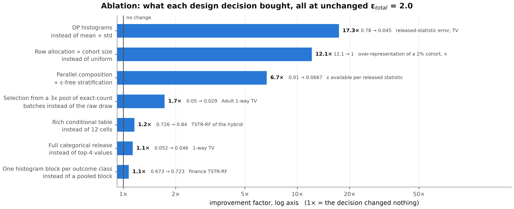

**Figure 4:** What the Stage A design decisions bought, each on the axis it targets: parallel composition with free stratification (ε per statistic 0.0100 to 0.0667), histograms in place of mean and standard deviation (released-statistic error 0.78 to 0.045 total variation), row allocation by released mass (a 2%-of-population cohort from 12.1× to 1.0× over-represented), and showing the generator the full released categorical distributions rather than the four most common values (1-way error 0.052 to 0.045, TSTR-LR 0.841 to 0.851).

### 6.3 Both standard acceptance criteria are saturated

**Marginal fidelity.** A common statement of the fidelity goal is that synthetic data should be "at least 90% statistically similar" to the private data, operationalized as 1 − TV. Table 11 tests whether that criterion can tell good data from useless data, using the permuted-target control on Adult. The permuted control has no usable feature-to-target relationship (TSTR 0.458, near chance) and yet records 95.7% 1-way similarity, passing a 90% bar; permuting one column of fifteen leaves every marginal intact. Tightening the bar far enough to exclude the useless case also excludes a genuine sample: on 2-way similarity the pair is 0.107 and 0.110, so a 90% two-way bar rejects both, including real data drawn from the private distribution itself. A criterion that fails real data is not a usable acceptance test.

**Table 11:** A marginal criterion cannot separate good data from useless data (Adult, $n$ = 300).

| metric | real sample (known good) | permuted target (known bad) | separates? |
|---|---|---|---|
| 1-way TV | 0.042 | 0.043 | no; saturated |
| 2-way TV | 0.106 | 0.112 | no; saturated |
| conditional TV (seen) | 0.063 | 0.155 | yes |
| conditional TV (held-out) | 0.036 | 0.102 | yes |
| TSTR-LR | 0.834 | 0.458 | yes |

We therefore propose that any fidelity criterion for private synthesis carry a conditional term. A concrete instance that real data and CoRTeC pass while AIM, MST, PATE-CTGAN, DP-CTGAN, PATE-GAN and the permuted floor all fail is: 1-way TV ≤ 0.06, 2-way TV ≤ 0.135, and mean conditional TV ≤ 0.07. The separating work is done by the conditional term (AIM fails it at 0.077, MST at 0.110 and the permuted floor at 0.129, while every method that passes sits near 0.05); the marginal thresholds exclude the deep generative baselines, which miss by an order of magnitude, and MST, whose 2-way error of 0.144 sits above the bar. The 2-way threshold depends on how pairs are counted (it was 0.12 under a 20-pair sample and is 0.135 over all 105 pairs, for the same data), whereas the conditional term's scale did not move, which is one more reason to let it carry the criterion.

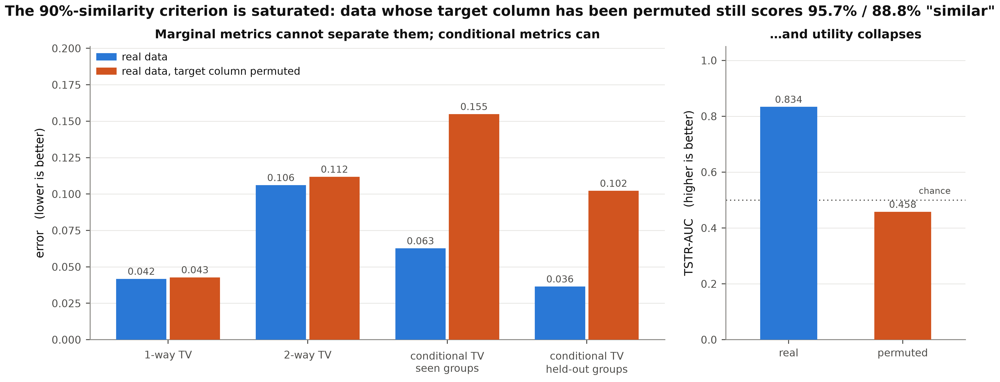

**Figure 5:** Real data against the same data with its target column permuted. Marginal metrics cannot separate them; conditional metrics and utility can.

**Aggregate utility.** It does not follow that aggregate utility is safe. The header-only control gives the same frozen model nothing but the column names. On Adult it reaches TSTR-LR 0.824, against a real 300-record sample's 0.834, while AIM reaches 0.675 and MST 0.690. An ungrounded language model, given no access to the private data at all, matches or exceeds every differentially private mechanism in this paper on the metric the field uses to argue for downstream usefulness. That is a result about the metric and about the datasets. On public benchmarks a pretrained model already encodes most of the aggregate structure, so aggregate utility cannot distinguish a method that reads the private release from one that recites a prior.

**Making the prior wrong.** We can separate the two by inverting a relationship the prior knows. In the inversion condition the released statistics state that advanced-degree holders (`education_num` ≥ 14) earn over 50K at a rate of 0.2%, against a real-world rate of 61.9%. The control is matched: it takes CoRTeC's own prompt and strips exactly the released blocks (class balance, histograms, categorical proportions, conditional table, cohort size), leaving every other line byte-identical, and runs through the same generation routine, so row allocation, batching, parsing and repair are shared by construction. With one release, Claude Fable 5 and $n$ = 300 per condition, CoRTeC emits the high-income label for 0.000 of advanced-degree holders, tracking the release, while the matched control emits it for 0.931, more extreme than the real-world prior (Table 12). Since every other element of the two conditions is identical, the separation is attributable to the released statistics alone. The control is told to match a table and to ignore world knowledge; it has no table, and answers from its prior. We report one draw per arm because the measure spans the full [0, 1] range while draw-to-draw variation on conditional quantities in this paper is 0.004 and release-to-release variation is 0.037, two orders of magnitude below the effect.

**Table 12:** The inversion test. The two conditions are identical but for the released arrays.

| matched condition | emits the high-income label for advanced degrees |
|---|---|
| **CoRTeC** | **0.000**, tracking the release |
| matched header-only control | **0.931**, more extreme than the real-world prior |
| *real data, uninverted* | *0.619* |

Evaluated on a held-out test set carrying the same inverted relationship, the model trained on header-only output is wrong for 72% of the inverted subgroup while its aggregate AUC still exceeds CoRTeC's (0.730 against 0.670), because the subgroup is 7.9% of rows and the aggregate is dominated by the 92% where the prior is correct. On the uninverted release the same matched control separates too, at two independent replications of the whole pipeline: CoRTeC leads it by +0.057 TSTR-LR (0.849 against 0.792) against a pooled draw-to-draw spread of 0.001 and by 3.7× on conditional error (0.043 against 0.160), while the control reaches 0.845 TSTR-GBM where a real 300-row sample reaches 0.840. An ungrounded model exceeds real data of the same size on that student, which is the saturation this section exists to demonstrate, and it survives the prompts being matched.

**A contamination control on data with no public presence.** Every dataset above is a public benchmark the frozen generator has very likely seen in pretraining. So we constructed a dataset with no public presence: a renal-replacement-therapy registry of 20,000 records whose joint distribution is defined by a generative process in our own code, with a plausible clinical schema and one deliberately counterintuitive driver, in that mode of transport to dialysis outranks every clinical variable as a predictor of hospitalization. The auto-configurator, given only the schema, independently selected `patient_age` and `transport_mode`. Generating CoRTeC and the matched header-only control from the same release (Gemini 3.5 Flash, $n$ = 1,000, two draws each), CoRTeC records 1-way TV 0.080 and TSTR-LR 0.685 against the control's 0.541 and 0.630 and a real sample's 0.019 and 0.693. Header-only could not reproduce the schema at all: it invented 33 levels across the four categorical columns, and 99.2% of its categorical values are absent from the real data. The diagnostic this control specifies is whether the CoRTeC-to-header-only gap changes on data with no public presence, and against the matched control it does not: 0.057 on Adult and 0.054 here, a ratio of 0.95. CoRTeC's margin over an ungrounded model does not shrink when the prior is removed; what the prior supplied on Adult is visible in the control's fidelity (1-way error 0.102 on Adult against 0.541 here), not in CoRTeC's margin. This also answers the objection that the architecture leans on the model's prior and would be a liability on idiosyncratic enterprise data. The prior supplies fluency in the schema, plausible values and correct types, which is a floor CoRTeC stands on; the release supplies the structure; and when the prior is weak only the release can supply it. A constructed dataset is not a real private extract, and an institutional extract remains the experiment we have not run.

### 6.4 Transmission: which mechanisms carry a private relationship

A generator built on a language model invites one specific doubt no aggregate metric can settle: perhaps its output is good because the model's prior about census or clinical data happens to be right, not because it read the released statistics. We test it directly.

**Definition 4 (Transmission of a private relationship).** *Fix a group $g$ and a schedule of target rates $r_1, …, r_T$. For each $r_t$, construct $D^{(t)}$ by resampling $y$ within $g$ at rate $r_t$, run the mechanism on $D^{(t)}$, and let $\hat{g}^{(t)}$ be the realized rate of $y = 1$ within $g$ in the synthetic output. Transmission is the pair*

$$ β = \text{slope of } \hat{g}^{(t)} \text{ on } r_t, \qquad \mathrm{MAE} = \frac{1}{T} Σ_t |\hat{g}^{(t)} − r_t|, $$ (4)

*where $r_t$ is the rate the mechanism was given: the released rate for a mechanism that reads a release, and the realized rate in the forced data for one fitted directly.*

$β = 1$ with $\mathrm{MAE} = 0$ is faithful transmission; $β = 0$ means the output is independent of the private data. Both must be reported, since a generator exact at the endpoints and wrong in between records $β ≈ 1$ with a large MAE. Table 13 shows that CoRTeC transmits, across three domains, with Stage A re-released from the modified data at every point. On NHANES the released rates were 0.008 / 0.469 / 0.970 and CoRTeC produced 0.0% / 44.6% / 100.0% over 60 to 65 rows per point. The unconditioned control is the point of the table: it emits the same number at every target, 98.5% on hospital data against a true rate of 21.4%, so CoRTeC's output tracks the released statistics rather than the model's prior. No amount of downstream AUC reveals this, because AUC is rank-based and the direction is right, which is a concrete reason a readmission probability or a default rate must be validated on a conditional measure.

**Table 13:** Transmission of a forced relationship through CoRTeC. The unconditioned control emits the same number at every target.

| domain | relationship forced | slope | MAE | unconditioned control | true rate |
|---|---|---|---|---|---|
| census (Adult) | education to income | 1.063 [0.973, 1.168]; 3 seeds, 14 points | 0.055 | 88.3% | 61.9% |
| healthcare (Diabetes 130) | prior admissions to 30-day readmission | 0.995 | 0.009 | 98.5% | 21.4% |
| finance (credit) | repayment status to default | 0.962 / 1.010; 2 seeds | 0.019 / 0.023 | 100.0% | 69.6% |
| **healthcare (NHANES)**, auto-configured | race/ethnicity to diabetes | **1.041** | **0.020** | 63.9% | 15.4% |

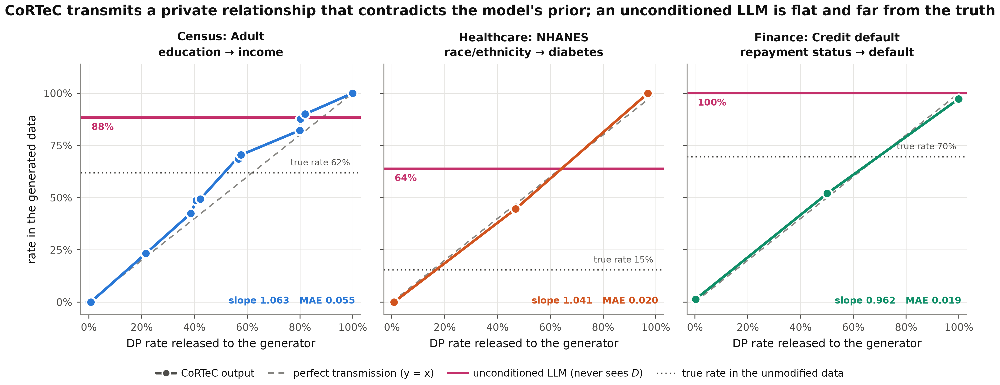

**Figure 6:** The transmission test. The x-axis is the released rate CoRTeC was given, the y-axis the rate it produced; the dashed diagonal is perfect transmission and the horizontal line is the unconditioned control. The healthcare panel is NHANES.

**The same test on the deployed mechanisms.** We ran the identical protocol on the baselines: force the rate in the private data, fit at ε = 2 on the modified data, sample, and measure. The group is defined by public bin membership, so every mechanism can represent it. Table 14 and Figure 7 give the result, and it is not the separation we expected. MST transmits this relationship as accurately as CoRTeC does, and the reason is structural: the manipulated quantity is a two-way marginal, MST selects and privately measures two-way marginals, and forcing the rate to an extreme makes that marginal more salient to its selection step. PATE-CTGAN does not transmit it at all. Its raw output spans only 0.079 across a target range of 1.0, the same qualitative behavior as an unconditioned generator reached by a different route: DP-SGD and PATE inject noise into the training signal, and at ε = 2 on a 19-attribute schema the conditional structure does not survive it.

**Table 14:** Transmission by mechanism family, on identical private data at identical ε = 2.

| method | family | slope | MAE | output at 0% / 50% / 100% |
|---|---|---|---|---|
| MST (Diabetes 130) | marginal / graphical | 0.998 | 0.001 | 0.002 / 0.506 / 1.000 |
| CoRTeC (Diabetes 130, Claude Fable 5) | released statistics + frozen model | 0.995 | 0.009 | 0.000 / 0.520 / 0.986 |
| PATE-CTGAN (Diabetes 130) | PATE-trained generative | 0.054 | 0.376 | 0.348 / 0.324 / 0.402 |
| MST (NHANES) | marginal / graphical | 0.946 | 0.021 | 0.054 / 0.500 / 1.000 |
| CoRTeC (NHANES, Gemini 3.5 Flash) | released statistics + frozen model | 1.041 | 0.020 | 0.000 / 0.446 / 1.000 |
| PATE-CTGAN (NHANES) | PATE-trained generative | 0.095 | 0.388 | 0.241 / 0.232 / 0.336 |

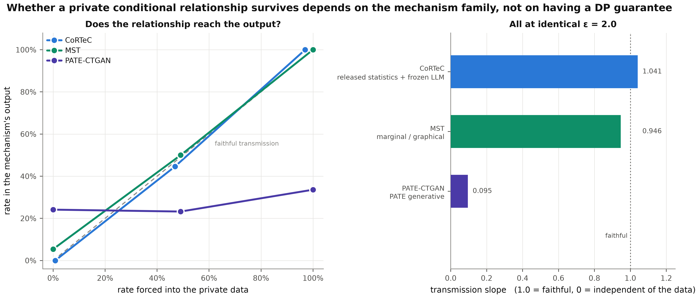

**Figure 7:** One forced relationship on NHANES (race/ethnicity to diabetes), three mechanisms. MST and CoRTeC track the diagonal; PATE-CTGAN's output is very nearly flat.

Three conclusions follow. Whether a private conditional relationship survives depends on the mechanism family, not on whether a method carries a privacy guarantee: two methods here are equally ε = 2 differentially private, and one reproduces the relationship to within 0.001 while the other is effectively blind to it, and a practitioner selecting on published fidelity numbers or on the presence of a guarantee has no way to see the distinction. The test establishes the narrower thing it was designed for, that CoRTeC's output is driven by the released statistics. And the utility gap of Section 6.1 cannot be explained by an inability to carry a conditional relationship: MST carries this one essentially perfectly and still trains models 0.15 AUC lower.

**What the marginal methods lose.** Ruling that out forced the harder question of what they do lose. Table 15 decomposes each synthetic set's departure from real data into retention of the feature-to-target association $I(X;Y)$ and of pairwise feature dependence $I(X;X)$, each relative to the mean over 25 real samples at the same $n$, so that the plug-in estimator's small-sample bias cancels; the real-sample control scores 1.02 and 0.97, as it must. Two distinct failure modes appear. MST and AIM inflate pairwise feature dependence by factors of 2.8 and 2.2 against a real sample of the same size, where CoRTeC inflates it by 1.24. A graphical model fitted to a set of privately measured marginals imposes exactly the dependence structure those marginals imply, and at ε = 2 on a 15-attribute schema that structure is coarser and more strongly coupled than the data's own; a downstream model trained on over-coupled records learns dependencies that do not hold on real test data. AIM is the instructive case: it retains the feature-to-target association almost exactly (0.98) while training models 0.17 AUC lower, so the loss cannot be attributed to the target relationship. PATE-CTGAN fails differently, retaining 37% of the association with a decision rule nearly orthogonal to the real one. CoRTeC's own distortion runs the other way: it over-couples the features to the target (1.74 against 1.02), because the generator reproduces the released conditional dependence at least as sharply as the release states it. That is a calibration error a downstream user can see and correct on real held-out data, whereas over-coupled features are learned as dependencies that do not exist; it is still a real distortion, and a deployment that consumes calibrated probabilities should recalibrate before use. Across all 29 draws of seven conditions, TSTR correlates with conditional fidelity at $r$ = −0.64 to −0.70 and with marginal fidelity at $|r|$ ≤ 0.16.

**Table 15:** Two failure modes (Adult, $n$ = 300, earlier CoRTeC configuration). Retention is relative to a real sample of the same size.

| method | $I(X;Y)$ retention | $I(X;X)$ retention | rule cosine | positive rate |
|---|---|---|---|---|
| *real sample (control)* | *1.02* | *0.97* | *0.46* | *0.241* |
| CoRTeC (Claude Fable 5) | 1.74 | 1.24 | 0.35 | 0.249 |
| AIM | 0.98 | 2.15 | 0.35 | 0.243 |
| MST | 2.12 | 2.83 | 0.31 | 0.237 |
| PATE-CTGAN | 0.37 | 2.01 | 0.04 | 0.447 |

### 6.5 The privacy budget

Table 16 and Figure 8 give the sweep on NHANES under the shipped configuration, one draw at each of ε = 0.3, 1 and 8 beside the three draws of Table 5 at ε = 2, with MST refitted at each budget. On this dataset the budget matters. NHANES has 2,999 training records, and its auto-configured release spends each cohort's budget over ten queries and two outcome classes, so at ε = 0.3 the per-query budget is 0.024 and the Laplace scale on a histogram bin is 42 records inside cohorts of 314 to 1,900. CoRTeC's utility falls from 0.752 at ε = 2 to 0.731 at ε = 1 and 0.570 at ε = 0.3, its 1-way error rises from 0.015 to 0.063, and MST degrades in step (0.687 to 0.587 on TSTR-LR). Between ε = 2 and ε = 8 nothing moves outside single-draw spread.

**Table 16:** The privacy-utility curve on NHANES, $n$ = 300. References at this $n$: real-sample floor 1-way 0.034, conditional-seen 0.015, TSTR-LR 0.773; permuted-target floor 0.043 / 0.047 / 0.493.

| metric | method | ε = 0.3 | ε = 1 | ε = 2 | ε = 8 |
|---|---|---|---|---|---|
| 1-way TV ↓ | CoRTeC | 0.063 | 0.034 | 0.015 | 0.013 |
| | MST | 0.046 | 0.029 | 0.024 | 0.021 |
| cond. TV (seen) ↓ | CoRTeC | 0.034 | 0.024 | 0.006 | 0.005 |
| | MST | 0.056 | 0.023 | 0.004 | 0.004 |
| cond. TV (held-out) ↓ | CoRTeC | 0.045 | 0.027 | 0.036 | 0.035 |
| | MST | 0.116 | 0.143 | 0.128 | 0.137 |
| TSTR-LR ↑ | CoRTeC | 0.570 | 0.731 | 0.752 | 0.770 |
| | MST | 0.587 | 0.632 | 0.687 | 0.692 |
| TSTR-RF ↑ | CoRTeC | 0.606 | 0.729 | 0.732 | 0.699 |
| | MST | 0.575 | 0.628 | 0.646 | 0.668 |
| TSTR-GBM ↑ | CoRTeC | 0.600 | 0.712 | 0.711 | 0.677 |
| | MST | 0.503 | 0.633 | 0.664 | 0.679 |

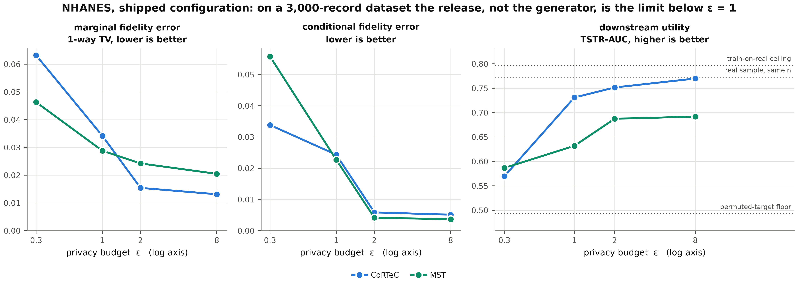

**Figure 8:** Privacy-utility curve on NHANES under the shipped configuration. Error panels are anchored at zero and the utility panel spans the permuted-target floor to the train-on-real ceiling, so the axes cannot exaggerate variation.

On a large dataset the curve is flat. On Diabetes 130, with 81,410 training records and the earlier configuration, CoRTeC at ε = 0.3 is as good as at ε = 8 on every metric except conditional error over seen groups, which degrades from 0.009 to 0.019, still better than a real 300-record sample's 0.031; MST records lower 1-way error at every budget by roughly 2.7×, CoRTeC leads on 2-way error at every budget and on conditional error by 2.2 to 7.6×, and aggregate TSTR does not separate the two at any ε, both sitting in 0.54 to 0.57 against a floor of 0.557, because 30-day readmission is weakly separable. The release itself degrades gracefully there, which is structural (Table 17): a histogram has sensitivity 1 regardless of ε and bin count, whereas the mean-and-standard-deviation formulation can place a released standard deviation outside its feature's range, and there are zero such values at any budget. The reading is one that can be made before any generator is run: on a small dataset the release, not the generator, is the binding constraint at tight budgets, and its noise-to-signal ratio is computable from the release alone. A regulator's ε = 0.3 costs almost nothing on a dataset of 80,000 records and costs a fifth of the utility on one of 3,000.

**Table 17:** The Diabetes 130 release across budgets (earlier configuration, 19 columns).

| $ε_{total}$ | ε per query | histogram TV vs. truth | conditional cells | max conditional error | impossible std values |
|---|---|---|---|---|---|
| 0.3 | 0.0079 | 0.0492 | 18 | 0.0152 | 0 / 72 |
| 1.0 | 0.0263 | 0.0185 | 18 | 0.0062 | 0 / 72 |
| 2.0 | 0.0526 | 0.0086 | 18 | 0.0078 | 0 / 72 |

### 6.6 The generator

The architecture is defined by what it releases, but its output quality depends on the frozen model placed in Stage B, and that dependence is large. Table 18 measures it on Adult with full-dataset generation from one release under the earlier configuration, so the only variable is the generator. Gemini 3.1 Pro, GPT-5, Claude Opus 5 and Claude Fable 5 fall in a band of 0.041 to 0.046 on conditional error, every one below what a real 300-record sample achieves (0.062), across three independent pretraining corpora. That is also the strongest available cross-corpus evidence on contamination: three separately trained models cannot have memorized Adult identically, and all track an inversion that contradicts it. Welch tests between the two Anthropic frontier models find no significant difference on any of the seven metrics (smallest p = 0.076). The lower block spans two vendors and three size tiers, and its common feature is that reasoning was suppressed or absent.

**Table 18:** Nine generator configurations on one Adult release.

| generator | vendor | reasoning | draws | 1-way TV ↓ | 2-way TV ↓ | cond. seen ↓ | TSTR-LR ↑ |
|---|---|---|---|---|---|---|---|
| *train on all 26,048 real rows (ceiling)* | | | *1* | *0.011* | *0.028* | *0.020* | *0.860* |
| CoRTeC (Gemini 3.1 Pro) | Google | on | 3 | 0.046 | 0.120 | 0.041 | 0.833 |
| CoRTeC (GPT-5) | OpenAI | on | 3 | 0.040 | 0.124 | 0.045 | 0.802 |
| CoRTeC (Claude Opus 5) | Anthropic | verified off | 3 | 0.045 | 0.121 | 0.046 | 0.844 |
| CoRTeC (Claude Fable 5) | Anthropic | on | 6 | 0.052 | 0.131 | 0.045 | 0.841 |
| *real sample, n = 300* | | | *3* | *0.043* | *0.107* | *0.062* | *0.830* |
| CoRTeC (Claude Sonnet 5) | Anthropic | on | 2 | 0.058 | 0.142 | 0.128 | 0.803 |
| CoRTeC (Claude Sonnet 5) | Anthropic | suppressed | 3 | 0.083 | 0.183 | 0.154 | 0.813 |
| CoRTeC (Claude Haiku 4.5) | Anthropic | none | 2 | 0.115 | 0.213 | 0.170 | 0.771 |
| CoRTeC (GPT-5) | OpenAI | minimal | 3 | 0.109 | 0.219 | 0.173 | 0.786 |
| *permuted target (no-information floor)* | | | *3* | *0.041* | *0.110* | *0.152* | *0.423* |

The controlled demonstration is GPT-5 against itself, same release, same prompts, one flag changed (Table 19). Enabling reasoning improves conditional fidelity 3.8×, and the two arms are 0.128 apart on conditional error against standard deviations of 0.032 and 0.007. Downstream utility does not resolve the difference at any feasible draw count: the direction is consistent across all three students, but resolving even the most favorable of the gaps at 80% power would take 18 draws per arm, and the least favorable 112. That this measure cannot see the difference is the finding. A practitioner choosing between these configurations on downstream utility would see two indistinguishable options and deploy the one that is 14.5× cheaper, having chosen output whose conditional structure is worse than a no-information control while it still records 95% of a real sample's downstream AUC. Output headroom is the obvious confound and contributes nothing: tripling Sonnet 5's output budget at fixed effort changes output per call not at all, and raising effort at fixed budget is the only step that moves the fidelity measures.

**Table 19:** One flag. Both arms use one byte-identical release and identical token limits.

| GPT-5 configuration | draws | 1-way TV ↓ | cond. seen ↓ | TSTR-LR ↑ | thinking tokens | cost per draw |
|---|---|---|---|---|---|---|
| `reasoning_effort = minimal` | 3 | 0.109 ± 0.003 | 0.173 ± 0.032 | 0.786 ± 0.050 | 0 | $0.19 |
| default | 3 | 0.040 ± 0.001 | 0.045 ± 0.007 | 0.802 ± 0.025 | 261k (94% of output) | $2.81 |

Reasoning does not substitute for capability in either direction. Claude Sonnet 5 with reasoning verifiably firing on 34 of 34 calls reaches 0.128, a real improvement on its suppressed 0.154 but nearly three times the frontier band and only modestly clear of the no-information floor, and Claude Opus 5 reaches 0.046 with reasoning verifiably off. What the band has in common is frontier-class capability; what reasoning buys is a large within-model gain that a weaker model cannot convert into frontier output. The practical guidance is to select a frontier-class model, enable reasoning, verify that it fired from evidence that survives the transport rather than from a setting (Section 9), verify the output on a conditional criterion rather than on aggregate utility, and re-verify after any change to the generator or its configuration. Open-weight models measured as controls transmit a forced relationship at every family we tested above 20B parameters, but on full-dataset generation a self-hosted 70B model's output is close to indistinguishable from an unconditioned prompt on the metrics this method exists to improve, which is why the deployment proposal names enterprise platforms.

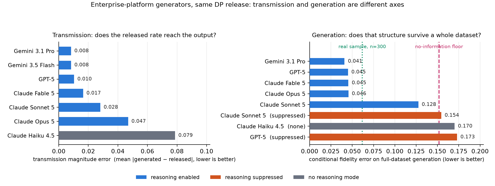

**Figure 9:** Enterprise-platform generators on one release. Left: transmission magnitude error on the Adult forced-relationship sweep; every platform model is within 0.079 and the best four within 0.017, so on this axis they are nearly interchangeable. Right: conditional fidelity on full-dataset generation against the real-sample reference (0.062) and the no-information floor (0.152); the ordering changes completely, and the three suppressed or absent-reasoning arms are the ones at or past the floor.

### 6.7 Auto-configuration

Table 20 compares the auto-configured release against expert hand-tuning where a comparator exists, as a release-ceiling comparison at $n$ = 2,000: real features with the target redrawn from each cell's released rate, so the comparison isolates the configuration and not the generator. Auto-configuration is within ±0.013 of hand-tuning everywhere and better on one dataset, and on credit it selects `PAY_0`, `PAY_3` and `PAY_2`, the payment-history columns hand-tuning had missed and which we had independently diagnosed as a cause of that dataset's early utility gap.

**Table 20:** Auto-configuration against expert hand-tuning, as a release-ceiling AUC at $n$ = 2,000.

| dataset | no conditioning | hand-tuned | auto-configured | real target | delta |
|---|---|---|---|---|---|
| Adult | 0.655 | 0.825 | 0.812 | 0.858 | −0.013 |
| Diabetes 130 | 0.488 | 0.595 | 0.607 | 0.624 | +0.012 |
| credit | 0.502 | 0.682 | 0.677 | 0.702 | −0.005 |

It generalizes to datasets it has never seen. On six additional regulated benchmarks, three health and three finance, each declaring only what a deploying institution would know without looking at its own data, the adaptive selection budget configures every one and captures 19 to 89% of the achievable range: heart disease 68%, cervical cancer 35%, retinopathy 50%, German credit 19%, Australian credit 86% and bank marketing 89%. A fixed 5% budget declines to configure three of the six and on one produces a configuration worse than not conditioning at all, silently. On NHANES the rule captures 87%, within two points of the best share on any dataset we tested, and the columns it selected there, age, diastolic blood pressure and race/ethnicity, are genuine diabetes risk factors chosen without being told the domain; Table 5 is generated from that release. The result holds through to generation on a second clinical dataset: on Diabetes 130 an auto-configured release generated through Gemini 3.5 Flash trains the three students at 0.609, 0.597 and 0.591 against 0.578, 0.583 and 0.563 for the hand-tuned release and 0.607, 0.587 and 0.567 for a real sample of the same size, so the clinical equivalence there holds under a configuration no human chose.

### 6.8 Cohort-wise or cell-wise: a representativeness failure no metric reports

Stage B can generate per cohort, as Algorithm 3 does, or per released conditional cell with an exact positive count, which expresses each cell's rate to within one row. On a constructed registry the cell-wise path reduced conditional rate error 77×, and we shipped it as the default on that basis. On real data it failed in a way that matters more than the metric it was chosen to improve. Table 21 compares the two paths on the same release for each dataset, byte-identical by checksum. On Adult the cell-wise path is mildly better and never worse. On NHANES it is catastrophic, and the catastrophe is invisible to every aggregate number a practitioner checks: aggregate utility reads within 0.02 of the cohort-wise path (0.752 against 0.768), while 1-way error quadruples.

**Table 21:** Two generation paths on one release per dataset.

| dataset | metric | cohort-wise | cell-wise | Δ |
|---|---|---|---|---|
| Adult (2 draws) | 1-way TV ↓ | 0.037 | 0.037 | −0.000 |
| Adult | cond. seen ↓ | 0.009 | **0.003** | −0.006 |
| Adult | TSTR-GBM ↑ | 0.847 | **0.877** | +0.030 |
| **NHANES** (1 draw) | 1-way TV ↓ | **0.029** | 0.123 | +0.094 |
| **NHANES** | 2-way TV ↓ | **0.131** | 0.260 | +0.128 |
| **NHANES** | cond. seen ↓ | **0.004** | 0.040 | +0.036 |

The cause is that cell-wise generation emits rows only for released cells, so population the release does not cover is generated at rate zero. NHANES released four conditional cells, all inside a single diastolic-blood-pressure band and a single race/ethnicity group, covering 25.4% of the population; Adult's release covered 99.9%. Table 22 shows the consequence: four of six race/ethnicity groups, 40% of the population, are absent from the output entirely, along with every record in the 50 to 60 age band, while the cohort-wise path reproduces all six groups to within 0.016 on the same release, five of the six within 0.01,. A deployment that shipped this would hold a synthetic cohort with no Asian, Mexican-American, other-Hispanic or multiracial records at all while its fidelity and utility dashboards stayed green. The conditional criterion does not catch it either, because conditional error is computed over released cells, and those are precisely the cells that are present. The model is not distorting shape within bands; it is simply never asked for the missing cells. Nothing in our own evaluation suite flagged it, and it was found by inspecting per-column output against the release.

**Table 22:** Race/ethnicity shares on NHANES under the two paths, from one release.

| race / ethnicity | real | cohort-wise | cell-wise |
|---|---|---|---|
| White (non-Hispanic) | 0.370 | 0.370 | 0.580 |
| Black (non-Hispanic) | 0.224 | 0.220 | 0.420 |
| Asian (non-Hispanic) | 0.142 | 0.142 | **0.000** |
| Mexican-American | 0.127 | 0.125 | **0.000** |
| Other Hispanic | 0.084 | 0.075 | **0.000** |
| Other or multiracial | 0.052 | 0.068 | **0.000** |

The fix is a per-column coverage guard, and it is free. A conditioning column is damaged precisely when the released cells fail to span it, and is otherwise untouched; coverage is computable from marginals already in the release, so checking it is post-processing. The floor is 90% of each conditioning column's own released mass, placed between the highest failing measurement (0.858) and the lowest passing one (0.911) across eleven per-column measurements on two datasets. An aggregate release-level rule was tried first and fails in both directions. Below the floor the research pipeline falls back to cohort-wise generation and says so; the shipped tool refuses outright, names the safe alternative and the knobs that change coverage, and names the columns the released cells fail to span. The cohort-wise path is the default of Algorithm 3 for this reason, and it resolves the underlying trade-off by declining it: on the NHANES release above, a coarser cell-wise release with full coverage matched the cohort-wise path's marginal fidelity but was worse than the permuted-target floor on held-out conditional structure (0.055 against 0.053), while the cohort-wise path on the richer release reached the real-sample floor on the two tree students at $n$ = 600 and came within 0.026 on the linear one (0.752, 0.738, 0.735 against 0.778, 0.735, 0.725), with every group and age band present. A second mechanism, which the guard cannot see, appeared when the rule was tested on Diabetes 130. A conditioning column the auto-configurator had coarsened into opaque groups was pinned by group membership with the within-group distribution withheld, and the model spread each group's members uniformly: the dominant discharge code, 59.2% of real records, came out at 14.3%, one seventh of a seven-code group to three decimals, while the column's released-band coverage scored 100% and was right to. Supplying the within-group shares, a renormalization of proportions already in the release and therefore free, reduced the column's error 10.7× (0.641 to 0.060), and the fix replicates on a second vendor's model against the identical release; both implementations ship it. We present the guard as a heuristic mitigation rather than a solved component: it answers which bands of a conditioning column the released cells span, and not what the distribution is inside a band the cells did span, and establishing when a private conditional table can be conveyed to a language model without silent loss is, in our view, an open problem for this line of work. Ganev et al. [16] showed that differential privacy itself has a disparate impact on the minority subgroups of synthetic data; what we observe here is a different mechanism with the same victims, in which a generation path rather than the noise deletes them, and it is invisible to the same dashboards. The lesson we take is that a representativeness check over the declared schema's categories, against the release rather than against the output alone, belongs in the standard battery.

### 6.9 Stage C on the primary clinical dataset

Table 23 reports Stage C on the auto-configured NHANES release at $ε_{cert}$ = 1.0 and α = 0.05 over its four released cells, for the two ways the same release can be generated: per cohort, which is the shipped default, and per released cell. The ceiling clears and the floor fails in both runs, so the test discriminates and a verdict is issued each time, and the two verdicts differ.

**Table 23:** Stage C on NHANES, one unseeded draw per condition at tolerance 0.15.

| condition | worst-case simultaneous bound on the conditional gap | within tolerance 0.15? |
|---|---|---|
| CoRTeC synthetic, cell-wise (refused by the coverage guard) | **0.0920** | yes |
| **CoRTeC synthetic, cohort-wise (the shipped default)** | 0.3318 | **no** |
| *real-sample ceiling (held-out draw)* | *0.0671 (cell-wise run), 0.0745 (cohort-wise run)* | *yes* |
| *permuted-target floor* | *0.2076 (cell-wise run), 0.2194 (cohort-wise run)* | *no* |

We state the result plainly because it cuts against the configuration we ship. The deployable cohort-wise output, whose mean conditional error over seen groups is 0.006 in Table 5, does not clear its own transmission bound, and the only output that does is the cell-wise one the coverage guard of Section 6.8 refuses because it contains two of six race/ethnicity groups. The two numbers are compatible: the bound is a worst-cell, simultaneous quantity and the table's 0.006 is a mean. In the 50 to 60-year cell, 24 of the 48 synthetic rows are positive against a private rate of 0.197, a gap of 0.30 on that one cell, and the noise term of (5) adds 0.029 at $n_{min}$ = 150 and $ε_{cert}$ = 1.0. Cohort-wise generation pins each cohort's marginals and shows the model the conditional table, but nothing forces the rate inside a fine cell to match it; cell-wise generation does exactly that, which is why it clears the bound and why it is the path that drops subpopulations. A deployment that needs the bound needs a cell-wise release the guard passes, or the coverage the guard demands, and a bound and a representativeness check answer different questions.

The budget must be large enough for the bound's own control to pass, and that is measurable. At $ε_{cert}$ = 0.5 and tolerance 0.15 the NHANES ceiling cleared in only 21 of 40 repetitions, so a verdict there would have been one draw of a coin flip; at $ε_{cert}$ = 1.0 it clears in 25 of 25 runs and the floor never does, whereas loosening the tolerance lets the floor through too. On Diabetes 130 the procedure prints "this test did not discriminate" and issues no verdict, because its worst-case bound is driven by cells holding two synthetic rows, which are reported as thin rather than silently trusted. The claim Stage C produces where it does clear is auditable and quantified: with probability at least 95%, simultaneously over all released cells, the private and synthetic conditional rates differ by at most 0.092, at a Stage C cost of ε = 1.0 on top of ε = 2.0 for the release, for ε = 3.0 per row and, on this one-row-per-person dataset, per person.

### 6.10 Classification profile

Membership inference is a binary classifier, and so is a model trained on synthetic data. Reporting only AUC for either hides how it behaves at an operating point, so this section reports both at an operating point, with the confusion matrices, on the shipped Adult draws of Table 3 (the three Gemini 3.5 Flash draws pooled, 900 records; the real-sample reference is drawn at the same size). For the attack the desirable outcome is a classifier at chance; for the downstream model the reference is not chance but a model trained on real records of the same size.

**Table 24:** The downstream classifier at its operating point: one tuned classifier on a classification split, so the AUC column is a single-model, single-split number and not a second test of Table 3's equivalence claim.

| trained on | precision | recall | F1 | AUC | average precision |
|---|---|---|---|---|---|
| *real, full training set (26,048)* | *0.572* | *0.861* | *0.688* | *0.909* | *0.775* |
| *real sample, same n* | *0.549* | *0.866* | *0.672* | *0.893* | *0.722* |
| **CoRTeC, shipped configuration** | **0.561** | 0.814 | **0.664** | **0.885** | **0.719** |
| MST | 0.514 | 0.720 | 0.600 | 0.784 | 0.512 |
| AIM | 0.392 | 0.612 | 0.478 | 0.710 | 0.399 |
| *chance at base rate 0.246* | *0.246* | *0.500* | *0.330* | *0.500* | *0.246* |

CoRTeC records F1 0.664 against a same-size real sample's 0.672, within 0.008, and average precision 0.719 against 0.722; MST and AIM are 0.07 and 0.19 lower on F1. The confusion matrices say where the difference sits: a model trained on CoRTeC's records recovers 652 of 801 positives against the real-sample model's 694, at 511 false positives against 569.

Accuracy is excluded from the table for a reason worth stating, because it is the metric practitioners reach for first. Adult's base rate is 0.246, so a classifier that predicts the majority class for every record scores 0.754, and every arm above sits between 0.67 and 0.81. In the technical report, DP-CTGAN, whose output has collapsed to a near-constant target, records an accuracy of 0.758, below the 0.759 a constant predictor gets and above AIM's, while its recall of 0.033 and F1 of 0.061 are what actually describe it. An accuracy-only comparison would rank a degenerate predictor above two genuinely useful ones. This is Section 6.3 in a different guise: a metric that cannot distinguish a degenerate predictor from a working one should not be reported alone.

The shadow-model attack, the strongest of the three cheaper attacks of Section 6.11, run on the same 900 records at its operating point, records accuracy 0.507, precision 0.507, recall 0.509, F1 0.508, AUC 0.511, Youden's J 0.014 and a true-positive rate of 0.000 at a false-positive rate of 0.1%, with a confusion matrix of 505 / 495 / 491 / 509 over 1,000 members and 1,000 non-members: an even split. The same attack on the leaking control reaches AUC 0.605, accuracy 0.581, Youden's J 0.161 and a true-positive rate of 0.037 at 0.1% false positives. Each attack metric is reported beside its chance value, because a balanced membership game has a 50% base rate, so the attack's accuracy of 0.507 sounds meaningful and is not.

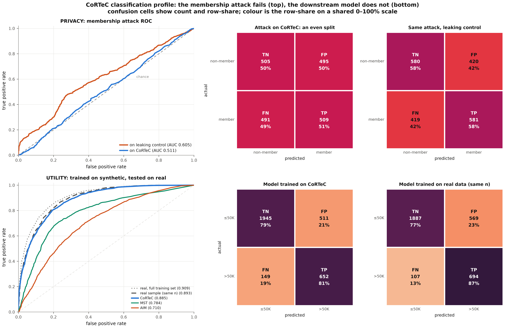

**Figure 10:** The classification profile on the shipped Adult draws. Top row, the privacy question: the attack's ROC, and its confusion matrix against CoRTeC beside the same attack against a leaking control; CoRTeC's four cells are near-identical while the control separates visibly. Bottom row, the utility question: ROC curves for models trained on each synthetic dataset, and the CoRTeC-trained model's confusion matrix beside one trained on real data of the same size. Cells show count and row-share on a shared scale.

### 6.11 Membership inference

Theorem 1 already bounds any membership adversary at ε = 2 to an advantage of 0.762 by (2). An empirical attack cannot improve on that and cannot validate it. We run one for three reasons the proof does not cover. It tests the implementation rather than the mechanism: a suppression threshold not applied, a cohort of one, a released histogram that is a delta on a single individual, each would leave the theorem true and the released data leaky. A measured number is what security reviewers ask for. And for a method built on a proprietary pretrained model it is the one available answer to the objection that a private record might be memorized and reproduced: we cannot audit weights we did not train, but we can attack the artifact the method publishes, which is where such a record would have to surface to cause harm.

**Setup.** The standard membership game [39], in the form Stadler et al. [40] apply to synthetic data. The adversary sees the synthetic dataset and decides whether a candidate record was in the private training set, over 1,000 members from the training split and 1,000 non-members from the held-out split, disjoint and identically distributed, so the attack cannot succeed merely by recognizing the data distribution. We run four attacks of increasing strength: nearest-neighbor distance; exact and near-duplicate matching; a discriminative shadow model trained to recognize the synthetic distribution; and a per-record likelihood-ratio test in the style of Carlini et al. [8], sixteen bootstrap density models over a projection, each candidate scored by its mean log-density across shadows divided by its standard deviation, so a record the synthetic data encodes unusually consistently scores high. Every attack is validated on a positive control, real training records passed off as synthetic, because a null from a blind attack is worthless.

**Table 25:** Four attacks on four datasets, with a positive control on each.

| dataset | strongest advantage | exact matches | attack AUC | Youden's J | TPR at FPR 0.1% |
|---|---|---|---|---|---|
| census (Adult) | 0.034 | **0** | 0.501 | +0.000 | 0.001 |
| healthcare (Diabetes 130) | 0.017 | **0** | 0.493 | −0.007 | 0.001 |
| **healthcare (NHANES)** | 0.048 | **0** | 0.524 | +0.040 | 0.000 |
| finance (credit) | 0.046 | **0** | 0.504 | +0.016 | 0.002 |
| *chance* | *0* | | *0.500* | *0.000* | *0.001* |
| *bound permitted at ε = 2* | *0.762* | | | | |
| *positive control (leaking)* | *0.191–0.250* | | *0.595–0.761* | *+0.134–0.390* | *0.037–0.249* |

On Adult the three cheaper attacks reach AUC 0.483 [0.459, 0.508], 0.498 [0.473, 0.524] and 0.500 against CoRTeC's 1,800 records, and 0.613, 0.616 and 0.625 against the leaking control, with 249 member matches and no non-member match. The per-record attack reaches AUC 0.497 against CoRTeC on the clinical data (advantage 0.006) and 0.595 against the control (advantage 0.191). The largest advantage anywhere is 0.048, against a bound of 0.762, and no synthetic record in any dataset exactly matches any private record. The positive control separates on every dataset, so the nulls are properties of the output rather than of blind attacks. Across budgets the measured advantage stays flat where the bound grows: 0.031, 0.047, 0.028 and 0.051 at ε = 0.3, 1, 2 and 8 against permitted advantages of 0.149, 0.462, 0.762 and 0.999, with every attack AUC's interval containing chance (Figure 11). We report the low false-positive regime as well, following Carlini et al. [8], because an average-case summary can hide an attack that is confidently right about a few individuals: the true-positive rate at 0.1% false positives is at or below 0.002 on every dataset, against 0.037 to 0.249 on the controls.

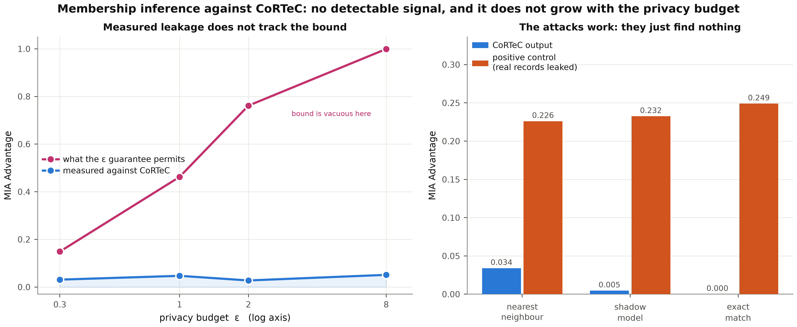

**Figure 11:** Left: the advantage the ε guarantee permits against the advantage measured, across budgets. Right: the attacks against CoRTeC beside the same attacks against a positive control.

### 6.12 Cost

**Table 26:** Computational and monetary cost. Generation costs are measured from the token counts each vendor reported over our own runs, priced at list rates; they are indicative rather than a benchmark, and they exclude the reasoning-suppressed configurations of Table 18, whose apparent cheapness is not a saving.

| method | fit cost | per-record generation cost | scaling |
|---|---|---|---|
| MST | 23–135 s | free after fit | stable across our datasets |
| AIM | 23–44 min (Adult); 58 s (NHANES); 16–29 min (finance, 12 columns); over 3 h without completing (Diabetes 130; finance on 15 columns) | free after fit | governed jointly by attributes and rows |
| PATE-CTGAN | 42–65 min | free after fit | stable |
| DP-CTGAN | 2.2 h (Adult) | free after fit | |
| CoRTeC, shipped configuration (Gemini 3.5 Flash) | seconds (the release) | $1.4–2.3 per 1,000 generated rows; ×2–3 for the pool, $4.3–7.0 per 1,000 kept records | linear in records requested |
| CoRTeC without the pool (Gemini 3.5 Flash / Claude Fable 5 / Gemini 3.1 Pro / GPT-5) | seconds | $1.03 / $4.84 / $5.21 / $9.36 per 1,000 records | linear |

The asymmetry runs both ways. AIM's and MST's cost is one-off and then sampling is free, which is decisive at the scale of millions of records. CoRTeC's release takes seconds, its generation is trivially parallel and resumable, it does not constrain where the compute runs, and AIM's fit did not complete within three hours on the hospital dataset or on the full finance schema. The exact-count prompt roughly doubles the reasoning tokens a call spends, and the pool multiplies the rows generated per row kept; the nine shipped-configuration draws of Section 6.1 cost $8.2 in all. The cheapest generator we measured is not the weakest: on the hospital data Gemini 3.5 Flash matches Claude Fable 5's conditional error (0.010 against 0.009) with the lowest 1-way error of any CoRTeC configuration (0.035), at one fifth of the cost, and it spends more reasoning per call than the Pro tier, which is consistent with Section 6.6. What the method needs is a reasoning-capable generator, not an expensive one.

## 7. Deployment Architecture

This section is written for the team that has to build, review and operate the system. It states where the trust boundary sits, what crosses it, and what the alternatives require. Figure 12 is the reference architecture.

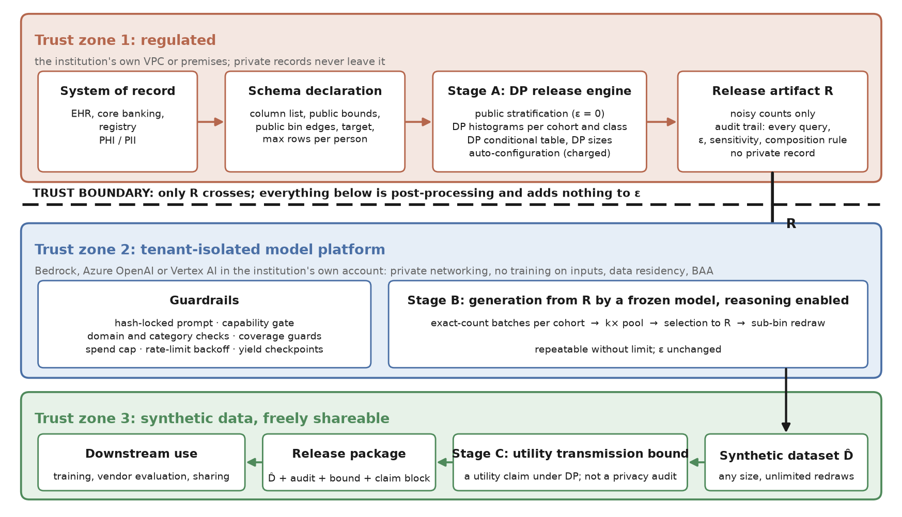{: .wide}

**Figure 12:** The reference architecture. Only one arrow crosses the trust boundary, and it carries $R$.

$R$ is a differentially private release, and publishing it is the thing differential privacy was invented to make safe. Everything below the boundary is post-processing, so it can be repeated without limit, run by a different team, or re-run a year later, at no additional privacy cost. Trust zone 2 is the enterprise surface, not a public API endpoint. The weights are the same either way, and CoRTeC's privacy argument survives a hostile endpoint by construction, since the request carries only $R$. What does not survive is the compliance argument, which rests on tenant isolation, private networking, data residency and a business associate agreement. Our capability results are properties of the model weights and the prompt, and the same weights are served on both surfaces. We tested that on NHANES with one release, one model and $n$ = 600, three draws through the public developer API and three through Vertex AI: no metric separates the two surfaces, the largest gap being 0.006 on 2-way total variation (p = 0.12), with every downstream gap at most 0.009 AUC (p ≥ 0.44). The contractual properties were never exercised by our runs and are the deploying institution's to verify.

**Table 27:** What the architecture buys, against the alternatives. The asymmetry runs both ways: the marginal methods pay once and then sample freely, which is decisive at the scale of millions of records.

| | CoRTeC | DP-SGD (DP-CTGAN) | PATE (PATE-GAN, PATE-CTGAN) | MST / AIM |
|---|---|---|---|---|
| what crosses to the compute | **private release only** | raw private data | raw private data | raw private data |
| where compute may run | anywhere; the boundary is already crossed | training hardware inside the regulated zone | inside the regulated zone | inside the regulated zone |
| cost of a second dataset | zero ε, API cost only | zero ε, re-sample | zero ε, re-sample | zero ε, re-sample |
| cost of a changed configuration | re-release (ε) or reuse (free) | full refit | full refit | full refit |
| fit or setup time | seconds | 2.2 h (Adult) | 42–65 min | 23–135 s (MST); 23–44 min (AIM), over 3 h without convergence on the hospital data and on the full finance schema |
| marginal cost per 1,000 records | $1.03–$9.36 | free after fit | free after fit | free after fit |

**Controls.** The release artifact carries the parameters a reviewer needs, following NIST SP 800-226 [32] and SP 800-188 [31]: the variant (pure ε, central, δ = 0), the add/remove neighboring relation, the privacy unit, and the composition rule and ε of every query. A privacy ledger is the sole source of noise scales and seals after release, and a property test releases at five seeds and requires every numeric leaf of the release to move unless it is an allowlisted public quantity; that is the check that catches an undeclared query, which a ledger summing declared queries cannot (Section 9). The measured re-identification evidence of Section 6.11, zero exact matches on four datasets and four attacks validated on a positive control, is the evidence that speaks to the de-identification frameworks ISO/IEC 27559 [22] and ISO/IEC 20889 [21], to Article 25 of the GDPR [15], and to the HIPAA Expert Determination route [46], which requires a statistical assessment of re-identification risk. The utility transmission bound of Stage C (Section 4.6) is deliberately excluded from that row: it bounds how much conditional structure survived generation, a utility quantity, and mapping it to a re-identification standard would be a category error with compliance consequences. The reference implementation's bound report names the standards it does not claim, with the reason for each.

**Operational failure modes.** Every one of the following was observed in this project before it was guarded, and each is now enforced in code rather than documented as advice. A tool that re-released whenever its output directory was new quietly spent the whole budget again while producing output indistinguishable from correct; the release is now verified by hash before every generation run. A release that published exact cohort sizes beside correctly noised rates passed a ledger audit; the five-seed property test above catches it. Cell-wise generation dropped 40% of a population while every dashboard stayed green (Section 6.8); the coverage guard refuses it. A pool that reached its spend cap before every cohort was complete produced an unbalanced draw; the coverage guard of Algorithm 4 refuses it. A generator that re-typed categorical values, a transient rate limit classified as fatal, an auto-configured top band that excluded the domain maximum, and a noised cohort size clipped to zero at ε = 0.3 were each found by a regression test that now carries the defect's name. Appendix C tabulates the guardrails; the tools repository carries the full operational manual.

## 8. Discussion

### 8.1 Choosing among the mechanisms

The evidence supports a selection rule stated by deliverable rather than by method.

*If the deliverable is a model trained on the synthetic data,* CoRTeC has the largest measured advantage on this deliverable among the mechanisms we ran. Its tree students reach the real-sample floor on every dataset, its linear student reaches it on Adult and is within 0.02 on finance and NHANES, and it leads AIM and MST by 0.05 to 0.18 AUC, by 0.14 to 0.17 on Adult after correction. The margin is large enough that it is unlikely to be reversed by tuning, and Section 8.2 shows that most of it is attributable to what is released.

*If the deliverable is a marginal report, a contingency table or a published set of cross-tabulations,* the answer depends on scale. At $n$ = 300 CoRTeC sits within 0.005 of MST on 1-way error and leads AIM on every dataset; at adequate $n$ AIM records the lowest error on its own 3-way workloads, and both marginal methods sample any number of records at no cost once fitted. For a marginal report at scale, use them.

*If the deliverable is a calibrated conditional rate,* a readmission probability for a patient group or a default rate for a credit segment, note that it is the conditional measures rather than the marginal ones that track downstream utility ($r$ = −0.64 to −0.70 against $|r|$ ≤ 0.16), and that this is the axis on which the marginal methods look worst while their headline fidelity numbers look best. A procurement decision made on 1-way total variation alone will systematically pick the wrong tool for this deliverable.

*If the constraint is scale,* the marginal methods pay their cost once and then sample freely, where CoRTeC pays per record, three times over under the shipped configuration. At millions of records that favors them regardless of the utility gap.

*If the constraint is that no private data may leave the institution,* CoRTeC transmits a release and never a record, so the constraint is satisfied by construction even when the generator is a frontier model reached through the institution's own tenant-isolated endpoint. DP-SGD and PATE methods place the private data on the training hardware and so constrain where they run.

*If the data is small,* check the release before generating. Its noise-to-signal ratio and its cell count are computable from the release at no cost, and Section 6.5 shows they say whether conditioning can contribute at all.

### 8.2 A hybrid for institutions that will not run a language model

Relabeling a marginal method's output using a private conditional table is pure post-processing of two already-private artifacts, so it costs nothing beyond the table. Table 28 measures it on Adult, five base draws per method crossed with three table draws for AIM and two for MST, under the same evaluator. Relabeling moves AIM from TSTR-LR 0.675 to 0.777 and MST from 0.690 to 0.773 at no extra ε, and at level 4 the private table matches a non-private oracle to within 0.009, so the residual is draw-to-draw noise rather than a cost paid for privacy. Richness is necessary: a level-2 table fixes calibration and buys little utility, and the large gain arrives only with the richer table; richer is not monotonic, since level 6 is worse than level 4 on every student for both base methods. This is also the strongest available answer to the objection that the marginal methods are merely under-tuned: the gap is largely attributable to what each mechanism releases, and a practitioner who wants the conditional structure can obtain much of it by augmenting the marginal method. Assignment is by an exact per-cell count with stochastic rounding over a random permutation of the cell. A rank-preserving assignment, our original default, was measured to be worse on three datasets at three seeds each (independent assignment within a cell led it in 9 of 9 runs), because the guard meant to enable ranking scored the synthesizer's self-consistency rather than its validity and so selected for the failure it was built to prevent. The hybrid ships as the second reference implementation ([`cortec-hybrid`](https://github.com/Calyie/cortec-framework/tree/main/cortec-hybrid)); it reports whether the correction helped and tells the user to keep their budget when it did not, since across eleven datasets the correction improves conditional calibration almost everywhere while moving downstream AUC in both directions.

**Table 28:** The hybrid on Adult. Giving AIM and MST the quantity neither releases recovers most of the distance to CoRTeC without altering either synthesizer's configuration.

| condition | 1-way TV ↓ | cond. seen ↓ | TSTR-LR ↑ | TSTR-RF ↑ | TSTR-GBM ↑ |
|---|---|---|---|---|---|
| AIM alone | 0.037 | 0.054 | 0.675 | 0.700 | 0.691 |
| AIM + private conditional table, level 2 | 0.037 | **0.014** | 0.700 | 0.726 | 0.680 |
| **AIM + private conditional table, level 4** | 0.038 | 0.054 | **0.777** | **0.840** | **0.810** |
| AIM + level 4, non-private oracle table | 0.039 | 0.053 | 0.786 | 0.841 | 0.810 |
| AIM + level 6 | 0.038 | 0.071 | 0.742 | 0.778 | 0.735 |
| MST alone | 0.024 | 0.169 | 0.690 | 0.728 | 0.681 |
| MST + level 2 | 0.025 | **0.053** | 0.727 | 0.737 | 0.695 |
| **MST + level 4** | 0.025 | 0.094 | **0.773** | **0.838** | **0.807** |
| MST + level 4, non-private oracle table | 0.025 | 0.096 | 0.780 | 0.843 | 0.815 |
| MST + level 6 | 0.025 | 0.118 | 0.717 | 0.757 | 0.716 |

## 9. Threats to Validity: Measurement Artifacts

Defects arose throughout this work, and every one of them produced a plausible but wrong scientific conclusion before it was caught. We report them because we believe the field under-reports them, and because each is a trap for any group building a comparable pipeline. The technical report tabulates twenty-seven that bear on measurement and privacy accounting; the ones a reader should weigh are these.

**The instruments, not the results.** A released quantity that carries no noise is invisible to a budget audit built by instrumenting the noise mechanism. Our research pipeline published per-cohort record counts exact for most of the project while the audit reported a clean ε throughout, because the audit summed the queries it could see. The shipped tool had earlier been caught publishing exact cohort sizes and per-cell supports beside correctly noised rates, a real violation, again with a clean ledger. The corrected check is behavioral rather than structural: re-release the same data at several seeds and require that every published quantity moves unless it is explicitly public. It found the exact counts immediately, together with a rule that had been deleting rare categories from releases and, with them, real subpopulations (`race = Amer-Indian-Eskimo` from a census cohort, `race_ethnicity = other_multi` from a health-survey cohort). Neither changed a reported fidelity or utility number, because the counts were accurate and the categories were rare; both changed what the release was entitled to claim about itself, which is the more serious kind of error. A verifier that sums declared queries cannot detect an undeclared one.

**A saturated metric.** The original primary metric of this project scored the real-data ceiling and the unconditioned baseline identically, and a verdict had been drawn from it before anyone compared the two. Checking every metric's floor against its ceiling before trusting it caught that defect, and later a released standard deviation of 693.80 on an attribute whose range is a few decades; it produced Section 6.3.

**The defect with a named victim.** Every other entry corrupts a number. Cell-wise generation removed people (Section 6.8): the synthetic dataset was internally consistent, passed its fidelity checks, trained models to within one point of the alternative, and contained no Asian, Mexican-American, other-Hispanic or multiracial records at all. Nothing in our own evaluation suite flagged it, including the conditional criterion this paper advances, because conditional error is computed over released cells and those were the cells that were present.

**The privacy claim, not a measurement.** A tool that re-released whenever its output directory was new quietly performed a second release, spending a full $ε_{total}$ again on the same data, while producing output indistinguishable from correct. The mechanism's headline property, that any number of datasets may be drawn from one release at no further cost, was violated by an implementation detail. We now verify the release artifact by hash before every generation run.

**Telemetry needs a floor-and-ceiling check too.** A count that was never reported is not a count of zero, and an instrument that conflates the two converts missing data into evidence for whichever conclusion that zero supports. Two published claims rested on such zeros: that one model's reasoning was "off" in an arm that was in fact running at high effort, and that another model's reasoning was intermittent, when the two batches compared differed in transport and only one of them was measured. Both were withdrawn once the presence of a reasoning block, which is visible on every transport, replaced the token count as the primary evidence. Before trusting a measurement, establish that it can distinguish the two states you are asking it about, and apply that to the telemetry as well as to the results.

**A repaired defect can return through a dependency upgrade.** A library changed how a missing value renders, months later, in code we do not control; a repair that worked and was tested silently stopped firing, no test failed, and the corruption was invisible at the call site. It surfaced only because a published table was re-run in a second environment and one baseline moved from 0.019 to 0.110. A separate loader defect had labeled a missing HbA1c measurement as a negative case, because `NaN ≥ 6.5` evaluates to false and the resulting string is not null, and 135 of the NHANES respondents were mislabeled until an assertion on the target's provenance caught it. We pin the analysis environment, state the pin, and treat a missing-value convention as a load-bearing assumption that deserves an assertion.

**A binning convention.** The evaluator bins with right-closed intervals while the release, the selection and the baselines' discretization are left-closed, so an integer on a bin edge counts differently under the two (Section 5.3). It was found while adopting the sub-bin rule, whose bin invariance holds under the release's convention and not the evaluator's; every published number is the evaluator's and the ordering of methods is the same under either.

Four practices caught these and we recommend all four. Check every metric's floor against its ceiling before trusting it. Report several student models; this caught a hybrid result that reversed sign between linear and tree students. Inspect raw responses before concluding a backend is incapable, because a truncated prompt, an output budget consumed by hidden reasoning and a mis-set effort parameter are indistinguishable from a negative result at the level of summary statistics. And check that a check can fail: three separate verifications in this project gave false assurance, a ledger that summed only declared queries, an acceptance check whose name promised more than its assertion delivered, and a test module that had never run because of an import error.

## 10. Limitations

1. **The head-to-head is at $n$ = 300 under one generator family.** The shipped configuration is measured with Gemini 3.5 Flash at three draws per dataset; the cross-vendor check through Claude Opus 5 is one complete pool on Adult, and the powered six-draw equivalence test was run with Claude Fable 5 on the earlier release design. Three draws under a second vendor, and a second vendor on finance and NHANES, are the replications the result still needs. At $n$ = 1,000 on Adult the point estimates favor the real sample, and we state the equivalence claim at the size where it was demonstrated with adequate power.

2. **AIM enters the finance comparison only on a reduced schema and is absent from the hospital data.** Its fit exceeded three hours on the full 15-column finance schema and on Diabetes 130, against its own paper's 24-hour allowance; the cause is localized to the six high-cardinality amount columns. On NHANES it completes in under a minute and Table 5 reports it there.

3. **On NHANES the linear student and 2-way error do not reach the floor.** Logistic regression trains 0.021 short (p = 0.047) and 2-way error is 0.119 against the sample's 0.081. What remains of the linear gap sits in the one cohort whose diabetic class does not clear $n_{min}$, where the output follows the generator's placement below bin resolution rather than the release's; finer public bins where cohort sizes support them would leave the generator less room, and sizing them is an auto-configuration rule we have not built.

4. **The suppression decisions are uncharged.** Which cohorts and cells appear, and hence how many levels share $ε_{cond}$, depend on the data. We follow the marginal-synthesis literature in treating them as released, so that our ε = 2 rows are comparable to MST's and AIM's, and the reference implementation is more conservative than this paper's tables in that respect. The earlier-configuration arms additionally carry the $(ε_L, δ)$ guarantee of Section 4.7 rather than pure ε.

5. **ε protects a row.** On encounter-level data with repeated individuals the per-person guarantee is weaker by the maximum contribution count, 40 on Diabetes 130, and the auto-configurator has no concept of a person: on that dataset it selected `number_inpatient`, a proxy for how many rows a patient contributes. MST, compared against us at row-level ε on the same data, inherits the same per-person figure. The mitigation is the contribution cap of Section 3, taken before the release.

6. **Every real dataset is a public benchmark the generator has very likely seen.** The constructed registry of Section 6.3 rules out gross recitation and shows CoRTeC's margin over an ungrounded model unchanged when the prior is removed; it does not rule out recall of the marginal distributions, and an institutional extract, or a model of known training provenance, remains the experiment we have not run.

7. **The membership-inference result is bounded by the attacks we ran.** An absence of detectable leakage under four attacks validated on a positive control is not an absence of leakage; adversaries stronger than these are excluded by the ε guarantee, not by our measurement.

8. **The transmission sweeps are single-seed on the clinical datasets**, and each perturbs one relationship at three interior points, so the curve shape between endpoints rests on one measurement per model.

9. **Quality is bounded by the generator and by its configuration.** A single flag moved conditional error 3.8×, and the flag must be verified from the vendor's reported reasoning evidence rather than from a setting. Open-weight models we measured as controls did not reach the frontier band, which is why the deployment proposal names enterprise platforms.

10. **The coverage guard is a heuristic.** Its 90% floor sits in a five-point gap between the highest failing and lowest passing measurements, it answers which bands were released and not what is inside one, and when a private conditional table can be conveyed to a language model without silent loss is open.

11. **Per-record cost** is decisive against CoRTeC at the scale of millions of records, and the shipped configuration generates three rows for every one it keeps.

## 11. Conclusion

The question a practitioner asks of synthetic data is simple: if I train on this instead of on the real thing, what do I lose? For CoRTeC at ε = 2 and $n$ = 300 on three datasets from three regulated domains, the answer is nothing that two tree students can detect on any dataset, and at most 0.02 AUC for a linear student on two of the three, while the two marginal mechanisms in deployment today lose 0.05 to 0.18 AUC over the same data, and CoRTeC's own marginal error sits within 0.005 of the most accurate of them, below a real sample of the same size, at the release's own distance from the private data. The mechanism trains nothing. It spends the budget once, on cohort-conditioned histograms per outcome class and a conditional table over a disjoint partition, where parallel composition makes conditional structure cheap, and it lets a frozen language model decode the release under exact counts, selection and a sub-bin rule that together reach the release's own fidelity at no privacy cost. Because only the release crosses the trust boundary, the generator can be a tenant-isolated enterprise endpoint, and the choice of model becomes a quality decision rather than a compliance one.

Two of the findings reach beyond the mechanism. Both criteria the field selects synthesizers on are saturated: real data with its target permuted passes a 90% marginal-similarity bar, and an ungrounded language model with no access to the private data matches every mechanism here on aggregate downstream utility while being wrong about 72% of the subgroup where the institution's data departs from public knowledge, and while reporting a 98.5% readmission rate for a group whose true rate is 21.4%. Only conditional and subgroup measures, reported against a real-sample floor and a no-information floor, separate a mechanism that transmits an institution's conditional structure from one that reproduces what was already public. And whether a private relationship survives synthesis is a property of the mechanism family, not of the guarantee: MST carries a forced two-way relationship as faithfully as CoRTeC does and still trains models 0.15 AUC lower, because what it loses is measurable as a 2.8× inflation of pairwise feature dependence.

Where CoRTeC belongs is narrow and, we think, useful. It is the mechanism to reach for when a downstream model or a calibrated conditional rate is the product, and not the mechanism to reach for when a marginal report at scale is.

## Ethics Statement

This work uses public benchmark datasets and a national health survey that is released for research; no private institutional data was used. The membership-inference attacks were run against synthetic data we generated from those benchmarks, with the positive controls constructed from the same public records. The mechanism is intended to reduce the privacy risk of sharing tabular data, and we have tried to state its guarantee and its limits precisely: the row-level privacy unit, the uncharged suppression decisions, the pretraining corpus outside the guarantee, and the difference between a utility bound and a privacy audit are each stated where they arise, because a reader who takes any of them for more than it is would be worse protected than they believe.

## Reproducibility Statement

Two repositories accompany this paper. The research repository ([Calyie/cortec](https://github.com/Calyie/cortec)) holds the pipeline that produced every table, the figure and build scripts, and the companion [technical report](https://github.com/Calyie/cortec/blob/main/paper/CoRTeC.pdf). The per-draw result records every published number is re-derived from, and the audit suite that re-derives them (one script recomputes every headline number from the stored records, one asserts that the paper and the shipped tools agree on every parameter and rule, one scans the code for the defect patterns of Section 9, and one checks that every number in this paper appears in the technical report), are retained in the project's internal tree and are available from the authors on request. The tools repository ([Calyie/cortec-framework](https://github.com/Calyie/cortec-framework)) holds the two Apache-2.0 reference implementations with a test suite in which every regression test is named after the defect it prevents. Appendix D gives the environment, the commands and the spend. Released statistics cannot be regenerated bit for bit, because the noise source is cryptographically secure and ignores any seed; every stored release is therefore kept and every draw reuses it by file.

## References

[1] Martín Abadi, Andy Chu, Ian Goodfellow, H. Brendan McMahan, Ilya Mironov, Kunal Talwar, and Li Zhang. Deep learning with differential privacy. In *ACM SIGSAC Conference on Computer and Communications Security (CCS)*, pp. 308–318, 2016.

[2] Michael Aerni, Javier Rando, Edoardo Debenedetti, Nicholas Carlini, Daphne Ippolito, and Florian Tramèr. Measuring non-adversarial reproduction of training data in large language models. In *International Conference on Learning Representations (ICLR)*, 2025.

[3] Tejumade Afonja, Hui-Po Wang, Raouf Kerkouche, and Mario Fritz. DP-2Stage: Adapting language models as differentially private tabular data generators. *Transactions on Machine Learning Research*, 2025.

[4] American Diabetes Association. Classification and diagnosis of diabetes: Standards of medical care in diabetes, 2017. *Diabetes Care*, 40(Supplement 1):S11–S24, 2017.

[5] Vadim Borisov, Kathrin Seßler, Tobias Leemann, Martin Pawelczyk, and Gjergji Kasneci. Language models are realistic tabular data generators. In *International Conference on Learning Representations (ICLR)*, 2023.

[6] Mark Bun and Thomas Steinke. Concentrated differential privacy: Simplifications, extensions, and lower bounds. In *Theory of Cryptography Conference (TCC)*, pp. 635–658, 2016.

[7] Kuntai Cai, Xiaoyu Lei, Jianxin Wei, and Xiaokui Xiao. Data synthesis via differentially private Markov random fields. *Proceedings of the VLDB Endowment*, 14(11):2190–2202, 2021.

[8] Nicholas Carlini, Steve Chien, Milad Nasr, Shuang Song, Andreas Terzis, and Florian Tramèr. Membership inference attacks from first principles. In *IEEE Symposium on Security and Privacy*, pp. 1897–1914, 2022.

[9] CDC/NCHS. National Health and Nutrition Examination Survey (NHANES) 2017–2018 data files. Centers for Disease Control and Prevention, National Center for Health Statistics, 2020.

[10] W. Edwards Deming and Frederick F. Stephan. On a least squares adjustment of a sampled frequency table when the expected marginal totals are known. *Annals of Mathematical Statistics*, 11(4):427–444, 1940.

[11] Dheeru Dua and Casey Graff. UCI machine learning repository. University of California, Irvine, School of Information and Computer Sciences, 2019.

[12] Cynthia Dwork, Frank McSherry, Kobbi Nissim, and Adam Smith. Calibrating noise to sensitivity in private data analysis. In *Theory of Cryptography Conference (TCC)*, pp. 265–284, 2006.

[13] Cynthia Dwork and Aaron Roth. The algorithmic foundations of differential privacy. *Foundations and Trends in Theoretical Computer Science*, 9(3–4):211–407, 2014.

[14] Cynthia Dwork, Guy N. Rothblum, and Salil Vadhan. Boosting and differential privacy. In *IEEE Symposium on Foundations of Computer Science (FOCS)*, pp. 51–60, 2010.

[15] European Union. Regulation (EU) 2016/679 of the European Parliament and of the Council (General Data Protection Regulation), Article 25 and Recital 26. *Official Journal of the European Union*, 2016.

[16] Georgi Ganev, Bristena Oprisanu, and Emiliano De Cristofaro. Robin Hood and Matthew effects: Differential privacy has disparate impact on synthetic data. In *International Conference on Machine Learning (ICML)*, pp. 6944–6959, 2022.

[17] Georgi Ganev, Meenatchi Sundaram Muthu Selva Annamalai, and Bogdan Kulynych. Tight auditing of differential privacy in MST and AIM. In *Theory and Practice of Differential Privacy (TPDP)*, 2026. arXiv:2604.18352.

[18] Michael Hay, Ashwin Machanavajjhala, Gerome Miklau, Yan Chen, and Dan Zhang. Principled evaluation of differentially private algorithms using DPBench. In *ACM SIGMOD International Conference on Management of Data*, pp. 139–154, 2016.

[19] Sture Holm. A simple sequentially rejective multiple test procedure. *Scandinavian Journal of Statistics*, 6(2):65–70, 1979.

[20] Naoise Holohan, Stefano Braghin, Pól Mac Aonghusa, and Killian Levacher. Diffprivlib: The IBM differential privacy library. *arXiv preprint arXiv:1907.02444*, 2019.

[21] ISO. ISO/IEC 20889:2018, Privacy enhancing data de-identification terminology and classification of techniques. International Organization for Standardization, 2018.

[22] ISO. ISO/IEC 27559:2022, Information security, cybersecurity and privacy protection: Privacy enhancing data de-identification framework. International Organization for Standardization, 2022.

[23] James Jordon, Jinsung Yoon, and Mihaela van der Schaar. PATE-GAN: Generating synthetic data with differential privacy guarantees. In *International Conference on Learning Representations (ICLR)*, 2019.

[24] Ron Kohavi. Scaling up the accuracy of naive-Bayes classifiers: A decision-tree hybrid. In *International Conference on Knowledge Discovery and Data Mining (KDD)*, pp. 202–207, 1996.

[25] Zinan Lin, Sivakanth Gopi, Janardhan Kulkarni, Harsha Nori, and Sergey Yekhanin. Differentially private synthetic data via foundation model APIs 1: Images. In *International Conference on Learning Representations (ICLR)*, 2024.

[26] Ryan McKenna, Daniel Sheldon, and Gerome Miklau. Graphical-model based estimation and inference for differential privacy. In *International Conference on Machine Learning (ICML)*, pp. 4435–4444, 2019.

[27] Ryan McKenna, Gerome Miklau, and Daniel Sheldon. Winning the NIST contest: A scalable and general approach to differentially private synthetic data. *Journal of Privacy and Confidentiality*, 11(3), 2021.

[28] Ryan McKenna, Brett Mullins, Daniel Sheldon, and Gerome Miklau. AIM: An adaptive and iterative mechanism for differentially private synthetic data. *Proceedings of the VLDB Endowment*, 15(11):2599–2612, 2022.

[29] Frank McSherry. Privacy integrated queries: An extensible platform for privacy-preserving data analysis. In *ACM SIGMOD International Conference on Management of Data*, pp. 19–30, 2009.

[30] Ilya Mironov. On significance of the least significant bits for differential privacy. In *ACM Conference on Computer and Communications Security (CCS)*, pp. 650–661, 2012.

[31] NIST. De-identifying government datasets: Techniques and governance. *NIST Special Publication 800-188*, Simson L. Garfinkel, Joseph Near, Aref N. Dajani, Phyllis Singer, and Barbara Guttman, National Institute of Standards and Technology, 2023.

[32] NIST. Guidelines for evaluating differential privacy guarantees. *NIST Special Publication 800-226*, Joseph P. Near, David Darais, Naomi Lefkovitz, and Gary S. Howarth, National Institute of Standards and Technology, 2025.

[33] OpenDP. SmartNoise Synth, version 1.0.8. https://github.com/opendp/smartnoise-sdk, 2024.

[34] Nicolas Papernot, Martín Abadi, Úlfar Erlingsson, Ian Goodfellow, and Kunal Talwar. Semi-supervised knowledge transfer for deep learning from private training data. In *International Conference on Learning Representations (ICLR)*, 2017.

[35] Nicolas Papernot, Shuang Song, Ilya Mironov, Ananth Raghunathan, Kunal Talwar, and Úlfar Erlingsson. Scalable private learning with PATE. In *International Conference on Learning Representations (ICLR)*, 2018.

[36] Diane Ridgeway, Mary F. Theofanos, Terese W. Manley, and Christine Task. Challenge design and lessons learned from the 2018 differential privacy challenges. *NIST Technical Note 2151*, 2021.

[37] Lucas Rosenblatt, Xiaoyan Liu, Samira Pouyanfar, Eduardo de Leon, Anuj Desai, and Joshua Allen. Differentially private synthetic data: Applied evaluations and enhancements. *arXiv preprint arXiv:2011.05537*, 2020.

[38] Nabeel Seedat, Nicolas Huynh, Boris van Breugel, and Mihaela van der Schaar. Curated LLM: Synergy of LLMs and data curation for tabular augmentation in low-data regimes. In *International Conference on Machine Learning (ICML)*, 2024.

[39] Reza Shokri, Marco Stronati, Congzheng Song, and Vitaly Shmatikov. Membership inference attacks against machine learning models. In *IEEE Symposium on Security and Privacy*, pp. 3–18, 2017.

[40] Theresa Stadler, Bristena Oprisanu, and Carmela Troncoso. Synthetic data: Anonymisation groundhog day. In *USENIX Security Symposium*, pp. 1451–1468, 2022.

[41] Beata Strack, Jonathan P. DeShazo, Chris Gennings, Juan L. Olmo, Sebastian Ventura, Krzysztof J. Cios, and John N. Clore. Impact of HbA1c measurement on hospital readmission rates: Analysis of 70,000 clinical database patient records. *BioMed Research International*, 2014:781670, 2014.

[42] Marika Swanberg, Ryan McKenna, Edo Roth, Albert Cheu, and Peter Kairouz. Is API access to LLMs useful for generating private synthetic tabular data? *arXiv preprint arXiv:2502.06555*, 2025.

[43] Yuchao Tao, Ryan McKenna, Michael Hay, Ashwin Machanavajjhala, and Gerome Miklau. Benchmarking differentially private synthetic data generation algorithms. *arXiv preprint arXiv:2112.09238*, 2021.

[44] Toan V. Tran and Li Xiong. Differentially private tabular data synthesis using large language models. *arXiv preprint arXiv:2406.01457*, 2024.

[45] Toan Tran, Arturs Backurs, Zinan Lin, Victor Reis, Li Xiong, and Sergey Yekhanin. Differentially private synthetic data via APIs 4: Tabular data. In *International Conference on Machine Learning (ICML)*, 2026. arXiv:2606.08259.

[46] U.S. Department of Health and Human Services. Guidance regarding methods for de-identification of protected health information in accordance with the HIPAA Privacy Rule. Office for Civil Rights, 2012.

[47] Chulin Xie, Zinan Lin, Arturs Backurs, Sivakanth Gopi, Da Yu, Huseyin A. Inan, Harsha Nori, Haotian Jiang, Huishuai Zhang, Yin Tat Lee, Bo Li, and Sergey Yekhanin. Differentially private synthetic data via foundation model APIs 2: Text. In *International Conference on Machine Learning (ICML)*, pp. 54531–54560, 2024.

[48] Liyang Xie, Kaixiang Lin, Shu Wang, Fei Wang, and Jiayu Zhou. Differentially private generative adversarial network. *arXiv preprint arXiv:1802.06739*, 2018.

[49] Lei Xu, Maria Skoularidou, Alfredo Cuesta-Infante, and Kalyan Veeramachaneni. Modeling tabular data using conditional GAN. In *Advances in Neural Information Processing Systems (NeurIPS)*, 2019.

[50] I-Cheng Yeh and Che-hui Lien. The comparisons of data mining techniques for the predictive accuracy of probability of default of credit card clients. *Expert Systems with Applications*, 36(2):2473–2480, 2009.

[51] Jun Zhang, Graham Cormode, Cecilia M. Procopiuc, Divesh Srivastava, and Xiaokui Xiao. PrivBayes: Private data release via Bayesian networks. *ACM Transactions on Database Systems*, 42(4):25:1–25:41, 2017.

## Appendix A. The Prompt

The reference implementation freezes and fingerprints its templates, verifies the fingerprint before every render, and requires a user who needs a different template to register it under a new version, because two elements are load-bearing and their removal is invisible: the pipeline still runs and still produces plausible rows, and is simply no longer conditioned on the data. The system message and the cohort template follow, with the exact-count block that Algorithm 3 fills.

```
SYSTEM
You generate synthetic tabular records for privacy research. You will be
given summary statistics that were computed under differential privacy.
Reproduce the distributions and relationships they describe as closely as
you can, EVEN IF THIS CONTRADICTS YOUR EXPECTATIONS about how these
variables usually relate. The statistics describe this specific
population; your general knowledge does not. Output only CSV rows. No
commentary, no explanation, no markdown fences.

USER
Generate exactly {n_rows} synthetic records for the following subgroup.

SUBGROUP: {cohort_name}

These statistics were measured on the real data for THIS subgroup, under
differential privacy. Match them. Where a statistic below conflicts with
what you would otherwise expect, follow the statistic: it is a
measurement of the actual population and your expectation is not.

NUMERIC DISTRIBUTIONS (released histograms; reproduce the shape, not just
the mean)
{numeric_block}

CATEGORICAL DISTRIBUTIONS (all released categories and their proportions)
{categorical_block}

OUTCOME RATE IN THIS SUBGROUP
{class_balance_block}

CONDITIONAL OUTCOME TABLE (P({target} = {positive} | cell), measured under
differential privacy)
This table is the most important part of this prompt. Each row states the
outcome rate for a specific cell of the population. Your generated records
must reproduce these rates, even where a rate is the opposite of what you
would expect for that group.
{conditional_block}

EXACT COUNTS FOR THIS BATCH (the number of rows, out of {n_rows}, that
must fall in each bin, each category and each outcome; these are the
counts this subgroup still owes)
{counts_block}

OUTPUT FORMAT
Exactly {n_rows} CSV data rows, plus one header row, with these columns in
this order:
{columns}

Rules:
  - every numeric value must lie within its stated range
  - {target} must be exactly "{positive}" or "{negative}"
  - do not repeat identical rows; vary records the way real data varies
  - output nothing except the header and the {n_rows} data rows
```

In a cohort with class-conditional blocks the numeric and categorical blocks are given once per outcome class. The header-only control of Section 6.3 is this prompt with the five released blocks removed and nothing else changed. Every value in every block is a released quantity; the prompt never carries a private record.

## Appendix B. The Stage C Report

Stage C (Section 4.6) writes its result as a report a third party can read without the private data. The report is headed `UTILITY TRANSMISSION BOUND`; its JSON opens with a `_what_this_is` block stating that it is not a privacy audit, records a clearing result in a field named `within_bound` and never `certified`, lists every released cell with its bound and its synthetic support so that thin cells are visible, states $ε_{cert}$, α, the tolerance, the privacy unit and the total ε spent by release and bound together, claims alignment with NIST SP 800-226 and SP 800-188 only, and carries a `_standards_not_claimed` block naming HIPAA Expert Determination, ISO/IEC 27559, ISO/IEC 20889 and GDPR Article 25 with the reason for each. The bound is unseeded, because it spends budget on a query over the private data and a seeded mechanism is deterministic; a published bound is therefore one draw, and the operating point ($ε_{cert}$ = 1.0, tolerance 0.15) was chosen by repetition rather than from a single run (Section 6.9). A Monte Carlo over 200 independent noise draws checks that the empirical violation rate of (5) stays below α.

## Appendix C. Implementation Notes for Deployment

This appendix carries what an implementer needs from the paper. The operational manual, with the full failure-mode catalogue, the deployment checklist with its rationale, the two deployment patterns, the surface adapters and the cost model, ships as [documentation in the tools repository](https://github.com/Calyie/cortec-framework/blob/main/cortec/docs/deployment.md).

**C.1 Parameters.** Table 29 lists the shipped defaults and what each was set from.

**Table 29:** Shipped parameters.

| parameter | default | set from |
|---|---|---|
| $ε_{total}$ | 2.0 | the budget every head-to-head in this paper runs at; on a large dataset the output is flat over [0.3, 8], on a small one it is not (Section 6.5) |
| conditional share $α$ | 0.2 | a sweep of the release decoded with no model: a fifth costs no measurable conditional accuracy once the release carries class blocks, and the histograms' error falls by a third |
| count share $γ$ | 0.02 (research pipeline), 0.05 (tool) | the published cohort size is a private count and is paid for out of the marginal share |
| suppression floor $n_{min}$ | 150 | a conditional rate over fewer than about 50 records is dominated by its own Laplace noise; 150 leaves the class blocks estimable on cohorts of a few hundred; the tool refuses $n_{min}$ < 50 |
| batch size $B$ | 25 rows | the largest batch on which the frontier models reproduce every count line exactly |
| pool factor $k$ | 3 (2 on NHANES) | the selection's gain saturates between 2× and 3×; each further unit costs one generation spend |
| pool coverage floor | 1.1× the rows each cohort owes | the failed pool of Section 4.5 |
| cell-wise coverage floor | 90% of each conditioning column's released mass | placed between the highest failing measurement (0.858) and the lowest passing one (0.911) over eleven per-column measurements on two datasets |
| sub-bin rule | `release` (opt-out `generator`) | Table 10 |
| reasoning | `on` | Table 19; suppressing it warns with the measured 3.8× cost |

**C.2 The release artifact.** The release is a JSON document containing no private record. Per cohort it carries the published size, the class balance, and one histogram per attribute and per outcome class, or one pooled histogram where a class fell below $n_{min}$; per conditional level it carries each surviving cell's published positive count, size and rate. Its audit block records every query with its ε, sensitivity, composition rule and partition key, and the totals: `epsilon_accounted` (per row), the privacy unit with `max_rows_per_person` and `epsilon_per_person`, the variant (pure ε, central, δ = 0), the neighboring relation (add/remove), and a documented-gaps block naming the floating-point Laplace mechanism, the pretraining provenance of the generator and the uncharged suppression decisions. The ledger seals after release; any later attempt to spend raises. The artifact cannot be regenerated, because the noise source is cryptographically secure and ignores any seed, so the stored artifact is the only copy of that release and every draw must reuse it by file. The generator verifies the artifact by hash before every run.

**C.3 Guardrails enforced in code.** Each row of Table 30 corresponds to a failure observed in this project, and each is a regression test named after it.

**Table 30:** Guardrails.

| failure | guardrail |
|---|---|
| a second release fired silently, re-spending the budget | release verified by hash before generation; a fresh release prints a banner and requires confirmation |
| a released quantity published exact beside noised ones | property test: release at five seeds, every numeric leaf must move unless allowlisted as public |
| generator below the capability floor | capability gate: measured-insufficient models refused, unmeasured ones require an explicit override |
| reasoning suppressed or not verifiably fired | `reasoning="on"` default; the presence of a reasoning block is recorded per call and an unreported count is surfaced as unverified, not as zero |
| context truncation cutting off the conditional table | context-fit check before the call |
| out-of-domain values, undeclared categories, re-typed categoricals | domain-bounds rejection; the parser normalizes to the declared strings and drops undeclared categories, counting them |
| whole subpopulations absent under cell-wise generation | per-column coverage guard at 90%; the tool refuses and names the column, the safe alternative and the knob |
| a pool that stopped early | pool-coverage guard at 1.1×; selection refuses |
| a noised cohort size clipped to zero | published size clamped at $n_{min}$ |
| stratification bands with a gap at the domain maximum | bands must tile the domain; the top band is closed |
| a transient rate limit counted as a failure | exponential backoff (15 s, doubling, six waits) before a rate-limited call counts against the yield rule; billing and credential faults stay fatal |
| spend runaway | per-run cap, parse and yield checkpoints every two calls, partial output preserved |
| a vacuous privacy unit on encounter-level data | the schema must declare `max_rows_per_person`; a vacuous $ε_{person}$ is refused unless acknowledged into the audit trail |

**C.4 Deployment checklist, condensed.** (1) Declare the schema from public knowledge only: column list, domain bounds, bin edges from clinical or regulatory convention, the target. (2) Establish the privacy unit; on encounter-level data cap each person's contribution to their first $C$ rows before Stage A, choosing the smallest $C$ whose $ε_{person} = C \cdot ε_{row}$ the regulator will accept, and re-check cell coverage afterwards. (3) Choose ε and $n$; on a small dataset inspect the release's noise-to-signal ratio before generating. (4) Run Stage A once; store and hash the artifact. (5) Check the release: whether the finest conditional table is non-empty, how many cells cleared $n_{min}$, and what share of each conditioning column's mass the surviving cells span. (6) Select a reasoning-capable frontier model on a tenant-isolated enterprise platform in the institution's own account, enable reasoning, and verify that it fired. (7) Generate, reusing the artifact; draws are free in ε. (8) Evaluate against a real sample at matched $n$ and the same data with its target permuted, fidelity and utility in one table, and compare each declared categorical's full support against the release. (9) Compute the transmission bound and attach it, the audit trail and the claim block to the release package. (10) Re-verify after any change to the generator or its configuration.

## Appendix D. Reproducibility Details

**Artifacts.** The research repository holds the pipeline that produced every table: Stage A and the prompts in [`src/generic_pipeline.py`](https://github.com/Calyie/cortec/blob/main/src/generic_pipeline.py), the backends in [`src/llm_generator.py`](https://github.com/Calyie/cortec/blob/main/src/llm_generator.py), the auto-configurator in [`src/autoconfig.py`](https://github.com/Calyie/cortec/blob/main/src/autoconfig.py), the driver [`run_dataset.py`](https://github.com/Calyie/cortec/blob/main/run_dataset.py), the baselines runner, the evaluator, the transmission and membership-inference scripts and the statistics; and the figure and build scripts. The per-draw result records and the audit suite named in the reproducibility statement are internal and available on request. The tools repository holds the two Apache-2.0 reference implementations, [`cortec`](https://github.com/Calyie/cortec-framework/tree/main/cortec) (Figure 2) and [`cortec-hybrid`](https://github.com/Calyie/cortec-framework/tree/main/cortec-hybrid) (Section 8.2). Test counts at the time of writing: 127 in `cortec` and 26 in `cortec-hybrid`, with a further 200 in the internal research harness; every regression test was verified to fail against the pre-fix code.

**Regenerating an arm.** Every CoRTeC arm is one invocation of the driver. The shipped Adult arm of Table 3 is

```
python3 run_dataset.py --dataset adult --stage generate --backend gemini --surface vertex \
    --model gemini-3.5-flash --n-synthetic 300 --n-out 300 --draws 3 --rows-per-call 25 \
    --epsilon-total 2.0 --cond-frac 0.2 --n-min 150 --pool-factor 3 --seed 42 \
    --skip-header-only --no-by-cell --outdir results/adult_v2_gemini
```

A release already present in the output directory is reused rather than redrawn. Every table is scored by [`evaluate_generic.py`](https://github.com/Calyie/cortec/blob/main/evaluate_generic.py) at seed 42, and the technical report records the exact arm specification behind each table.

**Environment.** Every table is produced under pandas 2.3.3 with scikit-learn 1.6.1; pandas 3.0.3 with scikit-learn 1.9.0 agrees to within 0.002 on every cell, the residual being a tree-seeding difference. scikit-learn is pinned below 1.9 for compatibility with diffprivlib [20], whose Laplace mechanism we use with a verified from-scratch reimplementation as a fallback. Baselines use smartnoise-synth 1.0.8 [33].

**Privacy accounting** is verified by instrumentation: a test patches the Laplace mechanism inside the release path and tallies what is spent, asserting exactly $ε_{total}$ on three auto-configured schemas and at three budgets, with per-cohort query counts adapting to 15-, 10- and 19-column schemas.

**Spend.** Total commercial spend for every experiment in this paper and the technical report was approximately $220 as metered, which we report as an estimate: one vendor bills reasoning tokens separately from output tokens, and a price-table prefix match once charged a cheap model at a frontier model's rate. Report tokens, and treat any dollar figure as an estimate.
